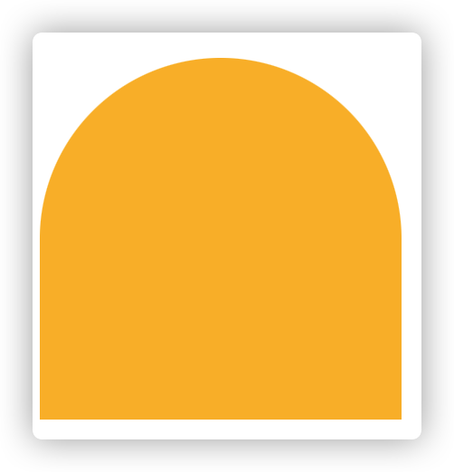
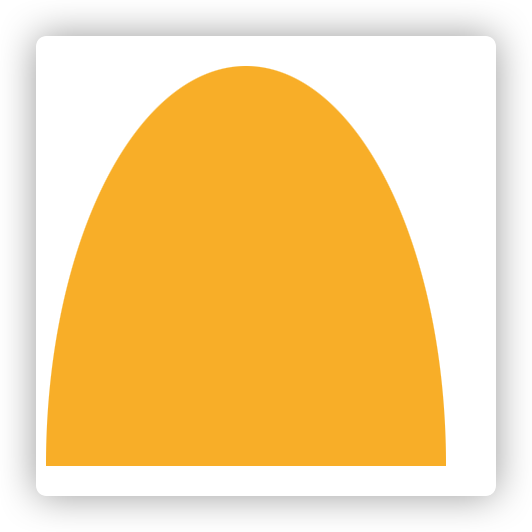
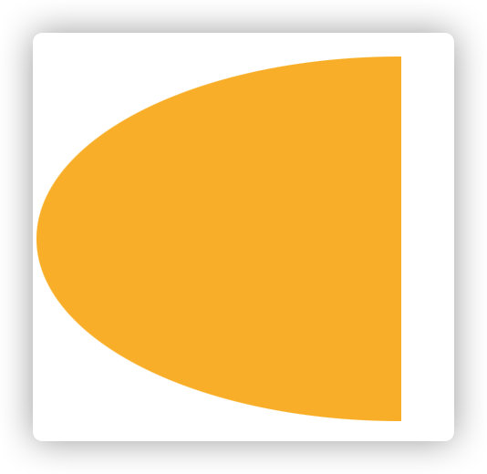
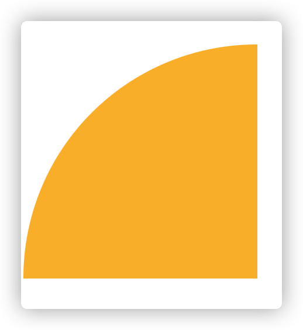
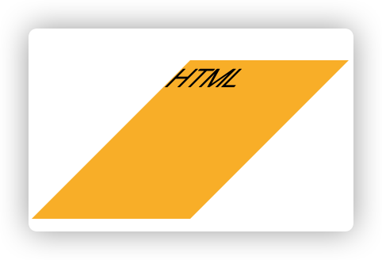
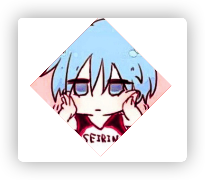
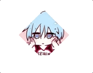

# 形状

## 自适应椭圆-border-radius

border-radius 的基本使用方法是设置成正方形的宽度或者高度的一半或者大于一半，就可以得到一个圆形

```css
      div {
        width: 200px;
        height: 200px;
        border-radius: 100px;
				/* border-radius: 200px; */ 也可以得到一个圆形
        background: #fb3;
      }
```

border-radius 还可以指定水平和垂直的半径

```css
border-radius: 100px/75px;
```

如果要得到自适应椭圆，则可以设置百分比

```css
border-radius: 50%/50%;
border-radius: 50%;/*缩写*/
```

## 半椭圆

border-radius 接收按照顺时针的顺序设置左上，右上，右下，左下的切边圆角,所以设置半圆只需要将下面的两个角设置成一样的属性，上面的两个角设置成一样的属性即可实现半圆

```css
      div {
        width: 200px;
        height: 200px;
        border-radius: 50% 50% 0 0;
        background: #fb3;
      }
```



结合设置每个角的水平、垂直方向的半径的特点，这么写还可以创造出一个半椭圆

```css
      div {
        width: 200px;
        height: 200px;
        border-radius: 50%/100% 100% 0 0;
        background: #fb3;
      }
```



左半椭圆

```css
      div {
        width: 200px;
        height: 200px;
        border-radius: 100% 0 0 100%/50%;
        background: #fb3;
      }
```



## 四分之一椭圆

```css
      div {
        width: 200px;
        height: 200px;
        border-radius: 100% 0 0 0;
        background: #fb3;
      }
```



## 平行四边形

```html
    <div>
      <section>HTML</section>
    </div>
```

```css
      div {
        margin: 0 auto;
        width: 100px;
        height: 100px;
        transform: skewX(-45deg);/*斜向拉伸*/
        background: #fb3;
      }
```



如果平行四边形中有内容（如文字），可以采用嵌套元素抵消内容的倾斜

```css
      section {
        transform: skewX(45deg);
      }
```

## 菱形图片

**hack 方式实现（需要在外层嵌套一个div）**

```html
    <div>
      
    </div>
```

```css
      div {
        width: 100px;
        height: 100px;
        transform: rotate(-45deg);
        background: red;
        overflow: hidden;
      }
      img {
        max-width: 100%;
        transform: rotate(45deg) scale(1.42);
      }
```



**非 hack 方式**

```html

```

```css
      img {
        width: 100px;
        height: 100px;
        max-width: 100%;
        clip-path: polygon(50% 0, 100% 50%, 50% 100%, 0 50%);
      }
```

clip-path属性允许我们将元素按照路径进行裁剪，如果使用百分比，则会解析为元素自身的尺寸

这个属性还支持动画效果

```css
      img {
        width: 100px;
        height: 100px;
        max-width: 100%;
        transition: all 1s;
        clip-path: polygon(50% 0, 100% 50%, 50% 100%, 0 50%);
      }
      img:hover {
        clip-path: polygon(0 0, 100% 0, 100% 100%, 0 100%);
      }
```



