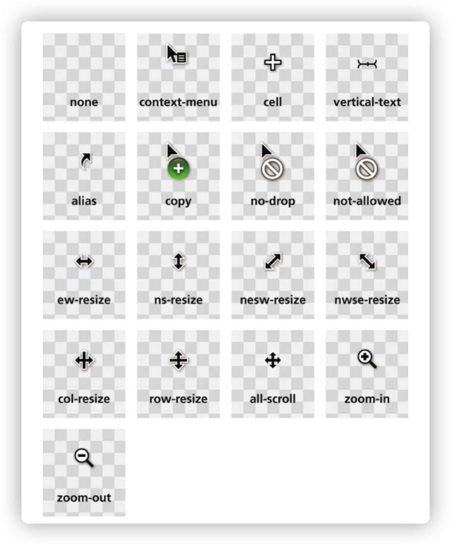
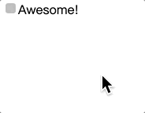

# 用户体验

## 鼠标光标cursor



## 自定义复选框



```html
    <input type="checkbox" id="awesome" autofocus />
    <label for="awesome">Awesome!</label>
```

```css
      input[type="checkbox"] {
        position: absolute;
        clip: rect(0, 0, 0, 0);
      }

      input[type="checkbox"] + label::before {
        content: "\a0";
        display: inline-block;
        vertical-align: 0.2em;
        width: 0.8em;
        height: 0.8em;
        margin-right: 0.2em;
        border-radius: 0.2em;
        background: silver;
        text-indent: 0.15em;
        line-height: 0.65;
      }

      input[type="checkbox"]:checked + label::before {
        content: "\2713";
        background: yellowgreen;
      }

      input[type="checkbox"]:focus + label::before {
        box-shadow: 0 0 0.1em 0.1em #58a;
      }

      input[type="checkbox"]:disabled + label::before {
        background: gray;
        box-shadow: none;
        color: #555;
        cursor: not-allowed;
      }
```


## 原生遮罩效果


```html
    <button>点击此处出遮罩</button>
    <dialog>
      <div class="child">这里面是内容</div>
    </dialog>
```

```css
      dialog {
        width: 100px;
        height: 100px;
        border: 1px solid transparent;
      }
      dialog .child {
        width: 100%;
        height: 100%;
        border: 1px solid red;
      }
      dialog::backdrop {
        background: rgba(0, 0, 0, 0.6);
      }
```

```javascript
    <script>
      const modalDom = document.querySelector("dialog");
      const buttonDom = document.querySelector("button");
      buttonDom.addEventListener("click", () => {
        modalDom.showModal();
      });
      window.addEventListener("click", (e) => {
        if (e.target.tagName.toLowerCase() === "dialog") {
          modalDom.close();
        }
      });
    </script>
```

