# 背景和边框
- [背景和边框](#背景和边框)
  - [半透明边框 border-clip](#半透明边框-border-clip)
  - [多重边框](#多重边框)
    - [box-shadow](#box-shadow)
    - [outline](#outline)
  - [背景定位](#背景定位)
    - [background-position 方案](#background-position-方案)
    - [background-origin方案](#background-origin方案)
    - [calc 方案](#calc-方案)
  - [边框内圆角](#边框内圆角)
  - [条纹图案](#条纹图案)
    - [横向条纹](#横向条纹)
    - [竖向条纹](#竖向条纹)
    - [斜向条纹](#斜向条纹)
## 半透明边框 border-clip

在 css 中，如果想实现半透明边框，很久之前使用的方案是采用背景来实现。

虽然我们很早就已经拥有 rgba 或者hsla 的属性来实现半透明颜色，但是以下代码在以前依然不能实现半透明边框

```html
    <div>
      This is a div box
    </div>
```

```css
      * {
        box-sizing: border-box;
      }
      body {
        color: white;
        background-color: gray;
        height: 100vh;
      }
      div {
        height: 200px;
        width: 200px;
        border: 10px solid hsla(0, 0%, 100%, 0.8);
        background-color: white;
        color: black;
      }
```


可以看到实际效果中，并没有 border 的颜色。

这是因为盒子的背景颜色默认被扩展到边框，所以我们没办法看到设置好的 border

遇到这种问题，我们可以通过设置[background-clip](https://developer.mozilla.org/zh-CN/docs/Web/CSS/background-clip)属性来达到我们想要的效果。

> `background-clip` 设置元素的背景（背景图片或颜色）是否延伸到边框、内边距盒子、内容盒子下面。

> 如果没有设置背景图片（[`background-image`](https://developer.mozilla.org/zh-CN/docs/Web/CSS/background-image)）或背景颜色（[`background-color`](https://developer.mozilla.org/zh-CN/docs/Web/CSS/background-color)），那么这个属性只有在边框（ [`border`](https://developer.mozilla.org/zh-CN/docs/Web/CSS/border)）被设置为非固实（soild）、透明或半透明时才能看到视觉效果（与 [`border-style`](https://developer.mozilla.org/zh-CN/docs/Web/CSS/border-style) 或 [`border-image`](https://developer.mozilla.org/zh-CN/docs/Web/CSS/border-image) 有关），否则，本属性产生的样式变化会被边框覆盖。

background-clip默认为`border-box;`我们将其设置为`padding-box`就可以让背景颜色不延伸到边框部分，这样就可以显示出我们设置好的半透明边框。

```css
background-clip: padding-box;
```


所有属性：

* border-box 背景延伸至边框外沿（但是在边框下层）。

* padding-box 背景延伸至内边距（[`padding`](https://developer.mozilla.org/zh-CN/docs/Web/CSS/padding)）外沿。不会绘制到边框处。

* content-box 背景被裁剪至内容区（content box）外沿。

* text 背景被裁剪成文字的前景色。

最后一个属性挺好玩的,它可以只让背景只延伸到文字，类似于这样


```css
background-clip: text;
-webkit-background-clip: text;
color: transparent;
```

## 多重边框

在以前，我们很有可能通过各种丑陋的 hack（不理想方式）来实现多重边框，现在我们有两种方法帮助我们实现

* box-shadow 阴影
* outline 外边框

### box-shadow

Box-shadow 的第四个参数为扩张半径，一个正值的扩张半径加上两个为零的偏移量以及为零的模糊值，可以让投影变成像一道实线边框


```css
background-color: yellowgreen;
box-shadow: 0 0 0 10px red;
```

box-shadow 还支持分割语法，我们可以创建任意数量的投影。

```css
box-shadow: 0 0 0 10px red, 0 0 0 15px blue;
```


阴影是层层叠加的，上面的代码，我们让最外层多了 5px 的阴影，从而变得就像双边框一样。

**注意事项**

* 阴影并不会受 box-sizing属性的影响，也就是它**不占用空间**，我们可以**使用 margin 或者 padding 来模拟**出它需要占用的空间。

* 阴影不会影响到鼠标事件，因为它在元素的**外圈**。我们可以使用 insert 属性来绘制内阴影，此时还需要增加 padding 来让盒子撑开，因为阴影不占用空间，如果不使用内边距，视觉上盒子就小了一圈。

  ```css
  background-color: yellowgreen;
  padding: 15px;
  box-shadow: inset 0 0 0 5px blue, inset 0 0 0 15px red;
  ```

  

  

### outline

需要双层边框的情况下，我们可以使用 border+outline来产生外层的边框

```css
border: 10px solid blue;
outline: 5px solid red;
```


使用 outline 的方式非常灵活，还可以配合 outline-offset 来设置 outline与一个元素边缘或边框之间的间隙，从而模拟出一些缝边效果。

```css
border: 1px solid transparent;
border-radius: 20px;
outline: 1px solid black;
outline-offset: -1px;
```


如果减小 outline-offset，还可以让outline 变得像内边框，border 像外边框

```css
outline-offset: -11px;
```


**注意事项**

即使 border 设置成圆角，outline可能还是直角的。

## 背景定位

现在我有这样的盒子

```css
      div {
        margin: 100px auto;
        background: no-repeat url(./九尾.jpg) white bottom right;
        height: 200px;
        width: 200px;
      }
```

它的效果是这样的


我希望那张背景图片往左边移动20px，往上移动20px，类似于以下情况。


要怎么做？

### background-position 方案

最新的background-position已经支持平移量了，我们可以直接写

```css
background: no-repeat url(./九尾.jpg) white bottom 20px right 20px;
```

如果想要兼容部分浏览器，那我们需要提供一个回退方案

```css
background: no-repeat url(./九尾.jpg) white;
background-position:bottom 20px right 20px;
```

### background-origin方案

在设置平移量的时候，有一种非常普遍的现象，就是我希望背景图片的平移量跟 padding 值保持一致，如果用background-position的方案，那我们的代码就是这样的。

```css
padding: 20px;
background: no-repeat url(./九尾.jpg) white bottom 20px right 20px;
```

想要达到的效果是这样的

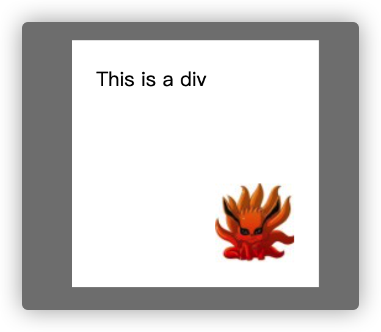

这样维护性就不够了，要修改就要改三个地方，我们有更加方便的办法，设置background-origin。

> `background-origin` 规定了指定背景图片[`background-image`](https://developer.mozilla.org/zh-CN/docs/Web/CSS/background-image) 属性的原点位置的背景相对区域.

我们经常会设置background-position，那么bottom、right 的位置是从哪里开始计算的呢？这跟background-origin有关。

background-origin 的属性是这样的

1. **border-box**  背景图片的摆放以border区域为参考
2. **padding-box** 背景图片的摆放以padding区域为参考（默认）
3. **content-box** 背景图片的摆放以content区域为参考

举个例子：盒模型是这样的


默认情况下，背景图片的位置是以 padding box 为基准的，也就是说，bottom、right 是 padding box 的下方、右方。

所以我们直接改变background-origin 的属性，就可以达到我们想要的效果

```css
padding: 20px;
background: no-repeat url(./九尾.jpg) white bottom right;
background-origin: content-box;/* 以 content-box 为平移标准 */
```

### calc 方案

Background-position 支持使用百分比的方式来写

```css
background-position: 10% 50%;/* 从左到右10%，从上到下50% */
```

基于这个特点，我们可以使用 calc 来帮助我们计算平移量，所以代码就是这样写

```css
background: no-repeat url(./九尾.jpg) white;
background-position: calc(100% - 20px) calc(100% - 20px);
```

## 边框内圆角

下面我们需要实现这样一个需求，边框内圆角效果

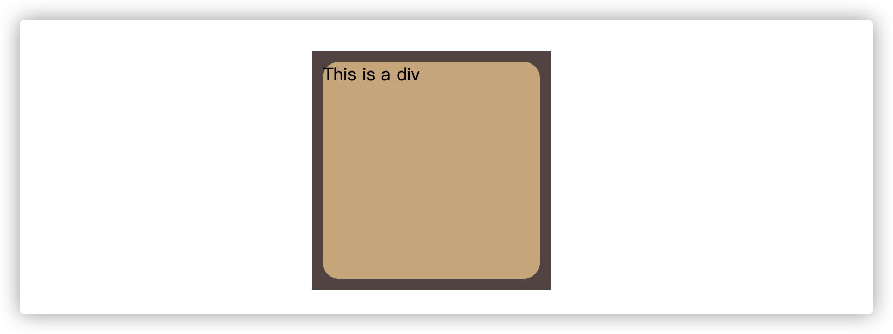

我们当然可以使用两个盒子来做，但有没有一个盒子就模拟出来的呢？首先我们想到之前学过的 outline 或 box-shadow来配合 border，比如我们现在用 outline 写

```css
div {
margin: 100px auto;
background: tan;
border-radius: 15px;
outline: 10px solid #655;
height: 200px;
width: 200px;
}
```

出来的效果是这样的

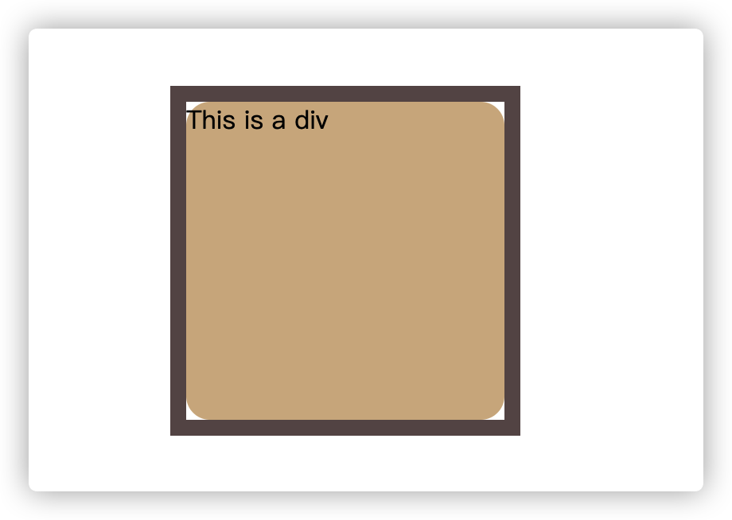

可以看到，虽然 border-radius 定义了圆角边框，但是 outline 却是直角的，而且还留了缝边空隙。

那我们用 box-shadow 试试

```css
      div {
        margin: 100px auto;
        background: tan;
        border-radius: 15px;
        /* outline: 10px solid #655; */
        box-shadow: 0 0 0 10px #655;
        height: 200px;
        width: 200px;
      }
```

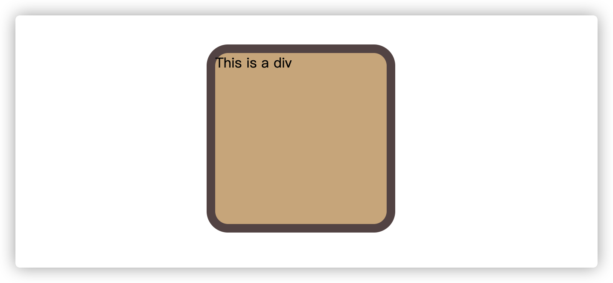

box-shadow 居然会继承 border-radius，所以这种方案肯定也是不行的。（据说未来会让 outline 继承 border-radius）

那我现在把两者结合一下，让 box-shadow 来补上空缺出来的缝边不就好了？

所以最终的代码是这样的

```css
      div {
        margin: 100px auto;
        background: tan;
        border-radius: 15px;
        outline: 10px solid #655;
        box-shadow: 0 0 0 7px #655;
        height: 200px;
        width: 200px;
      }
```

## 条纹图案

### 横向条纹

我们可以使用纯 CSS来模拟条纹图案，下面我们来看一下其演变，首先这里是一个渐变色背景的div

```css
      div {
        margin: 100px auto;
        border: 1px solid black;
        background: linear-gradient(#fb3, #58a);
        height: 200px;
        width: 200px;
      }
```

它长这样

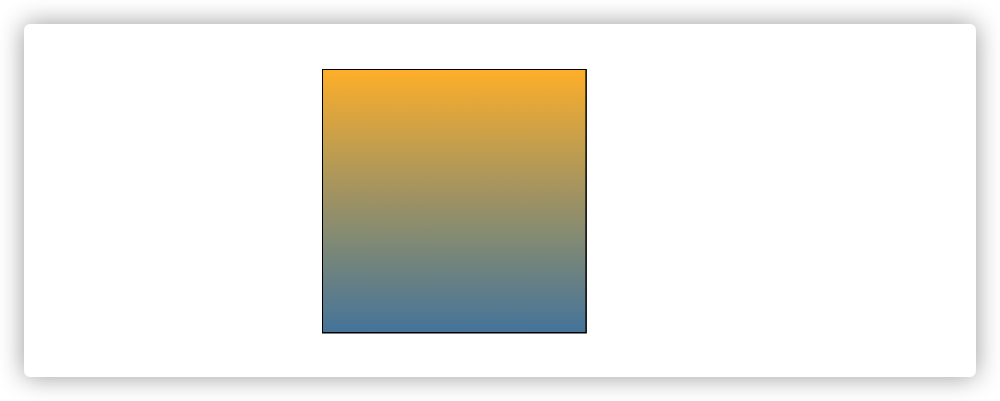

如果我们把色标拉近一些，可以看到，实色的区域变多了，而渐变的区域变少了

```css
background: linear-gradient(#fb3 20%, #58a 80%);
```

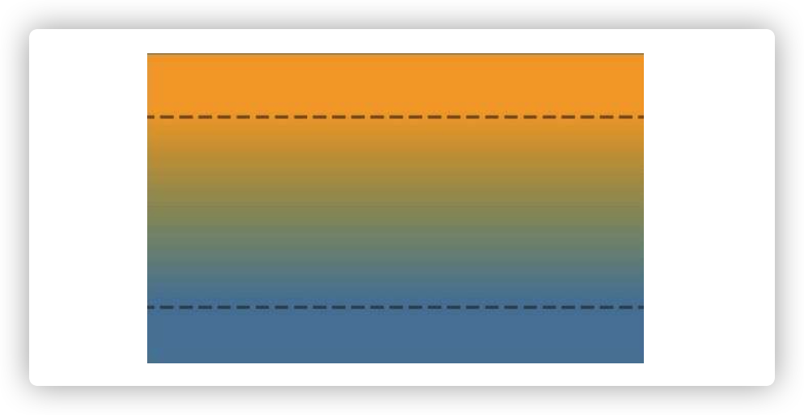

上图中实色区域大概占40%，渐变色区域占60%。

> 百分比是设置实色的色标位置，意思是从这个高度百分比的位置开始渐变，这个位置之前的就是实色

如果我们将其渐变色的色标高度都设置成50%，就会变成一个盒子内有两个各占50%高度的实色

```css
background: linear-gradient(#fb3 50%, #58a 50%);
```

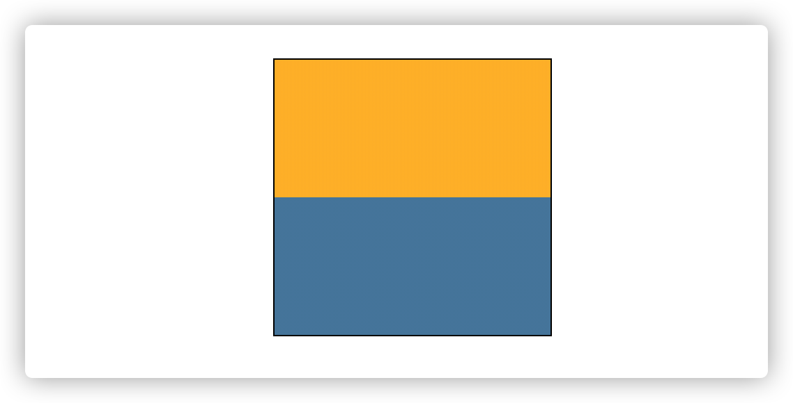

此时如果手动将 background-size 的高度设置短一些，它就会变成这样的效果。

```css
background-size: 100% 30px;
```


因为默认下的背景是重复且平铺的，所以整个容器都充满了水平条纹。

如果修改色标，还可以产生不等宽的条纹

```css
background: linear-gradient(#fb3 20%, #58a 20%);
```

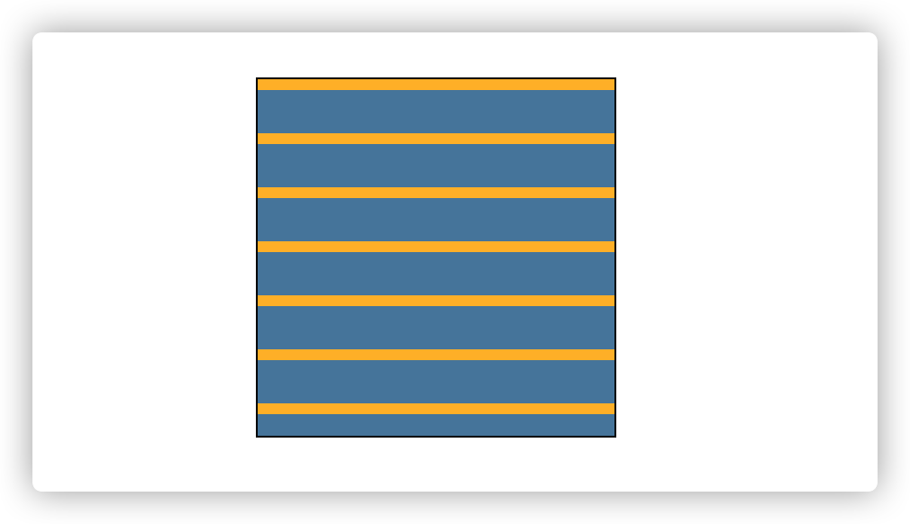

> “如果某个色标的位置值比整个列表中在它之前的色标的位置值都要小，则该色标的位置值会被设置为它前面所有色标位置值的最大值。” ——CSS规范

借用上面的规范，我们可以直接将属性设置成这样，也能达到上面的效果,这样维护性更高

```css
background: linear-gradient(#fb3 20%, #58a 0);
```

以下代码还可以产生三种颜色

```css
background: linear-gradient(
          #fb3 33.3%,
          #58a 0,
          #58a 66.6%,
          yellowgreen 0
        );
background-size: 100% 30px;
```

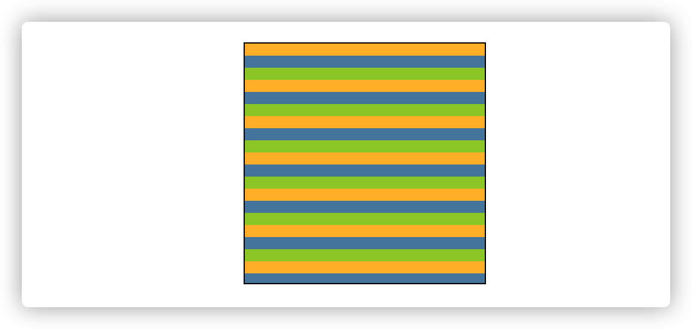

### 竖向条纹

竖向条纹的情况也很多，我们需要手动告诉渐变色，应该从左到右渐变，那么在横向条纹的基础上做一点修改就行了

```css
background: linear-gradient(
          to right,/*这里设置从左到右渐变*/
          #fb3 33.3%,
          #58a 0,
          #58a 66.6%,
          yellowgreen 0
        );
background-size: 30px 100%;/*这里设置宽度*/
```

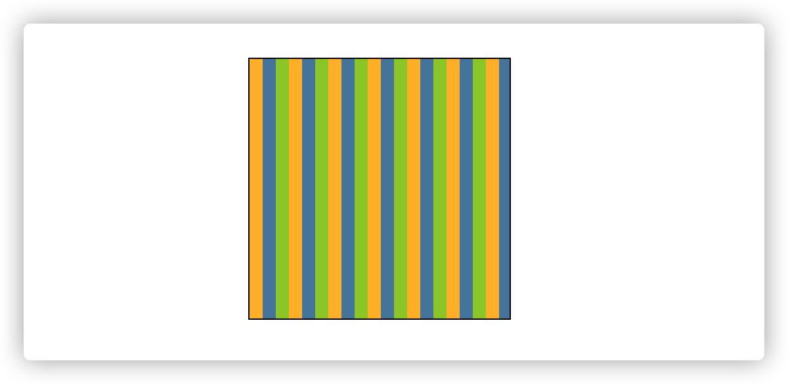

### 斜向条纹

```css
background: linear-gradient(
          45deg,
          #fb3 25%,
          #58a 0,
          #58a 50%,
          #fb3 0,
          #fb3 75%,
          #58a 0
        );
background-size: 32px 32px;
```


使用`repeating-linear-gradient`的简写

```css
background: repeating-linear-gradient(
          45deg,
          #fb3,
          #fb3 15px,
          #58a 0,
          #58a 30px
        );
```

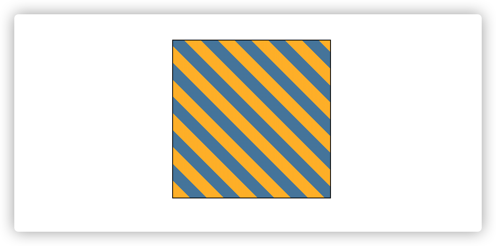

