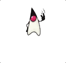
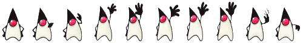
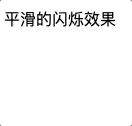
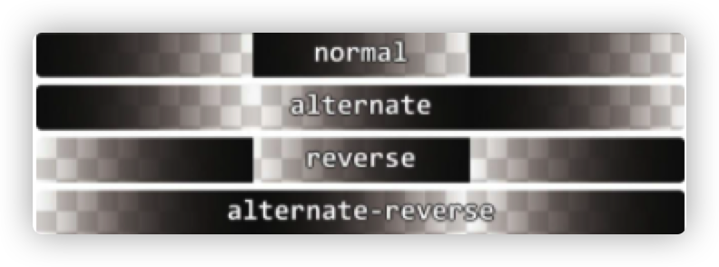
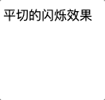
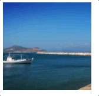
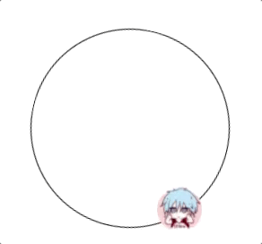

# 动画效果

## 逐帧动画

使用 steps 函数和背景图片的 position 移动效果完成动画效果

效果


```html
<div class="loader"></div>
```

```css
@keyframes loader {
  to {
    background-position: -800px 0;
  }
}

.loader {
  width: 100px;
  height: 100px;
  text-indent: 999px;
  overflow: hidden; /* Hide text */
  background: url(http://dabblet.com/img/loader.png) 0 0 no-repeat;
  animation: loader 1s infinite steps(8);
}
```

原图在这 尺寸为 800\*100


改一下尺寸还可以做其他效果



```html
<div class="loader"></div>
```

```css
@keyframes loader {
  to {
    background-position: -500px 0;
  }
}

.loader {
  width: 50px;
  height: 70px;
  text-indent: 999px;
  overflow: hidden; /* Hide text */
  background: url(https://s.cdpn.io/79/sprite-steps.png) 0 0 no-repeat;
  animation: loader 1s infinite steps(10);
}
```

图在这里 尺寸为 500\*70



## 闪烁效果

### 平滑闪烁效果



```html
<div class="highlight">平滑的闪烁效果</div>
```

```css
@keyframes blink-smooth {
  50% {
    color: transparent;
  }
}
.highlight {
  animation: 0.5s blink-smooth 4 alternate;
}
```

alternate 是 animation-direction 的属性，表示动画交替反向运行。区别如下



### 缓慢的闪烁效果

去除反向交替动画效果，增加动画 duration 就可以达到缓慢闪烁效果


```html
<div class="highlight">缓慢的闪烁效果</div>
```

```css
@keyframes blink_slowly {
  50% {
    color: transparent;
  }
}
.highlight {
  animation: 1s blink_slowly 3;
}
```

### 平切的闪烁效果



```html
<div class="highlight">平切的闪烁效果</div>
```

```css
@keyframes blink_step {
  50% {
    color: transparent;
  }
}
.highlight {
  animation: 1s blink_step 3 steps(1);
}
```

## 动画平滑暂停效果



```html
<div class="panoramic"></div>
```

```css
@keyframes panoramic {
  to {
    background-position: 100% 0;
  }
}
.panoramic {
  width: 150px;
  height: 150px;
  background: url('./3904743709_74bc76d5ac_b.jpg') no-repeat;
  background-size: cover;
  /* 以下是重点 */
  animation: panoramic 10s linear infinite alternate;
  /* 暂停 */
  animation-play-state: paused;
}
.panoramic:hover {
  /* 动画继续 */
  animation-play-state: running;
}
```

原图在此


## 沿着环形平移的动画

效果



主要思路是让内圈变形 rotate 与外圈相抵消

```html
<div class="path">
  
</div>
```

```css
      .path {
        width: 200px;
        height: 200px;
        padding: 10px;
        border-radius: 50%;
        border: 1px solid black;
        margin: 100px auto;
        animation: spin 6s infinite linear;
      }
      .avatar {
        display: block;
        width: 50px;
        border-radius: 50%;
      }
      .avatar {
        /*反向抵消*/
        animation: spin 6s infinite linear reverse;
      }
      @keyframes spin {
        to {
          transform: rotate(1turn)
      }
```
