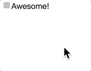

# 用户体验

## 鼠标光标 cursor


## 自定义复选框



```html
<input type="checkbox" id="awesome" autofocus />
<label for="awesome">Awesome!</label>
```

```css
input[type='checkbox'] {
  position: absolute;
  clip: rect(0, 0, 0, 0);
}

input[type='checkbox'] + label::before {
  content: '\a0';
  display: inline-block;
  vertical-align: 0.2em;
  width: 0.8em;
  height: 0.8em;
  margin-right: 0.2em;
  border-radius: 0.2em;
  background: silver;
  text-indent: 0.15em;
  line-height: 0.65;
}

input[type='checkbox']:checked + label::before {
  content: '\2713';
  background: yellowgreen;
}

input[type='checkbox']:focus + label::before {
  box-shadow: 0 0 0.1em 0.1em #58a;
}

input[type='checkbox']:disabled + label::before {
  background: gray;
  box-shadow: none;
  color: #555;
  cursor: not-allowed;
}
```

## 原生遮罩效果


```html
<button>点击此处出遮罩</button>
<dialog>
  <div class="child">这里面是内容</div>
</dialog>
```

```css
dialog {
  width: 100px;
  height: 100px;
  border: 1px solid transparent;
}
dialog .child {
  width: 100%;
  height: 100%;
  border: 1px solid red;
}
dialog::backdrop {
  background: rgba(0, 0, 0, 0.6);
}
```

```javascript
    <script>
      const modalDom = document.querySelector("dialog");
      const buttonDom = document.querySelector("button");
      buttonDom.addEventListener("click", () => {
        modalDom.showModal();
      });
      window.addEventListener("click", (e) => {
        if (e.target.tagName.toLowerCase() === "dialog") {
          modalDom.close();
        }
      });
    </script>
```

## 模糊背景的遮罩效果


模糊背景的遮罩效果需要用到额外的 html，下面采用 main 标签这个额外的元素，在点击标签后，使 main 标签添加上 filter 属性来达到模糊的效果。

```html
<main>
  此处忽略很多文字...
  <button>点击此处出遮罩</button>
</main>
<dialog>
  <div class="child">这里面是遮罩内容</div>
</dialog>
```

```css
dialog {
  width: 100px;
  height: 100px;
  border: 1px solid transparent;
  box-shadow: 0 0.2em 0.5em rgba(0, 0, 0, 0.5), 0 0 0 100vmax rgba(0, 0, 0, 0.2);
}
dialog .child {
  width: 100%;
  height: 100%;
  border: 1px solid red;
}
/* 遮罩样式 */
dialog::backdrop {
  background: rgba(0, 0, 0, 0.6);
}
/* transiton 让模糊有缓动效果 */
main {
  transition: 0.6s filter;
}
/* 遮罩效果后的 main 标签添加filter 属性 */
main.de-emphasized {
  filter: blur(2px);
}
```

```js
const modalDom = document.querySelector('dialog');
const buttonDom = document.querySelector('button');
const mainDom = document.querySelector('main');
buttonDom.addEventListener('click', () => {
  modalDom.showModal();
  //给 main 加上类名
  mainDom.className = 'de-emphasized';
});
window.addEventListener('click', e => {
  if (e.target.tagName.toLowerCase() === 'dialog') {
    // 删除类的名字
    mainDom.removeAttribute('class', 'de-emphasized');
    modalDom.close();
  }
});
```

## 滚动条控制图片放大效果


```html
<div class="img-slider">
  <div>
    
  </div>
</div>
<input type="range" />
```

```css
img {
  max-width: 100%;
}
.img-slider {
  position: relative;
  height: 200px;
  width: 200px;
  border: 1px solid red;
  overflow: hidden;
}
.img-slider > div {
  width: 100%;
  position: absolute;
  left: 50%;
  top: 50%;
  transform: translate(-50%, -50%);
}
```

```javascript
const sliderDom = document.querySelector('.img-slider');
const div = sliderDom.querySelector('div');
const range = document.querySelector('input');
range.value = 0;
range.oninput = function () {
  div.style.width = Number(this.value) + 100 + '%';
};
```
