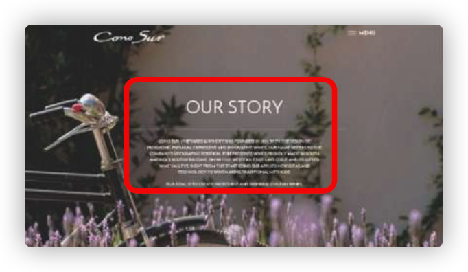

# 结构与布局

## 背景宽度满幅，内容宽度固定

很多时候，我们有这样一种场景，就是有一个背景图片占满全屏，内容宽度是固定居中的，常见于页脚或者首页



面对这种结构，我们的 html 往往会这样写

```html
<footer>
  <main></main>
</footer>
```

然后给外层的元素实现满幅的背景，内层的元素用 `margin:auto`来实现水平居中。

现在我们有更加方便的实现方式，只需要一个元素即可

```html
<footer></footer>
```

```css
footer {
  padding: 20px calc(50% - 450px); /* 假设内容需要900px 宽度*/
  color: white;
  background: #333;
}
```

当计算时，会根据满屏的 1920 计算，将 padding 设置为左右 1920/2-450=510px，这样就给中间留了 450\*2=900 的内容宽度了。

## 垂直居中

### position+transform 解决

```css
div {
  border: 1px solid red;
  width: 100px;
  position: absolute;
  left: 50%;
  top: 50%;
  transform: translate(-50% -50%);
}
```

### position+margin 值（元素自身宽高）解决

```css
div {
  border: 1px solid red;
  width: 100px;
  height: 100px;
  position: absolute;
  left: 50%;
  top: 50%;
  margin-left: -50px;
  margin-top: -50px;
}
```

### 父盒子设置 flexbox 解决

```css
.parent {
  width: 100%;
  height: 100%;
  display: flex;
  justify-content: center;
  align-items: center;
}
```

### 父盒子设置 grid 解决

```css
.parent {
  width: 100%;
  height: 100%;
  display: grid;
  justify-content: center;
  align-items: center;
}
```

### 这 tm 也可以

```css
div {
  width: 100px;
  height: 100px;
  position: absolute;
  margin: auto;
  top: 0;
  bottom: 0;
  left: 0;
  right: 0;
}
```

## Sticky Footer 粘滞页脚

Sticky Footer 布局 所谓 “Sticky Footer”，并不是什么新的前端概念和技术，它指的就是一种网页效果： 如果页面内容不足够长时，页脚固定在浏览器窗口的底部；如果内容足够长时，页脚跟随内容后面。采用以下方法可快速完成：

### calc

通过计算函数 calc 计算（视窗高度 - 页脚高度）赋予内容区最小高度，不需要任何额外样式处理，代码量最少、最简单。

```html
<div class="content">.....</div>
<footer class="footer">我知道了</footer>
```

```css
.content {
  min-height: calc(100% - 50px);
}
.footer {
  height: 50px;
}
```

### flex 弹性布局

```css
<div class="wrapper">
  <div class="content">
          ....
  </div>
  <footer class="footer">
  </footer>
</div>
```

```css
.wrapper {
  min-height: 100vh;
  display: flex;
  flex-direction: column;
}

.content {
  flex: 1;
}
```
