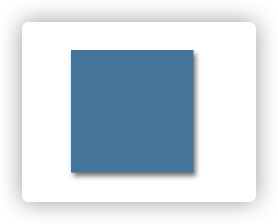
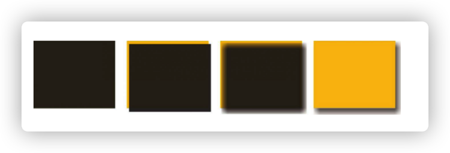
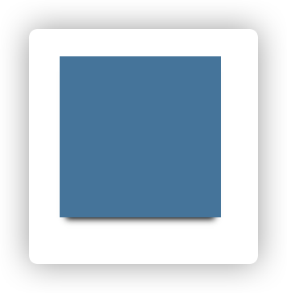
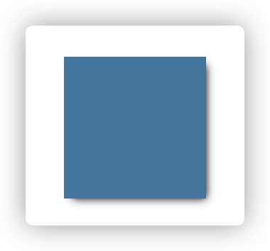
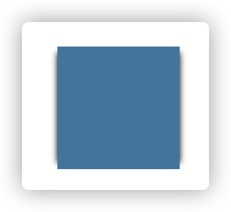
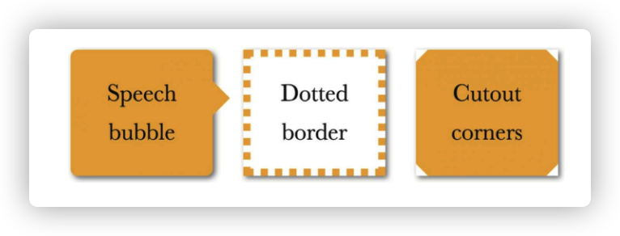
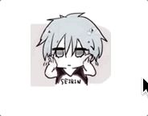
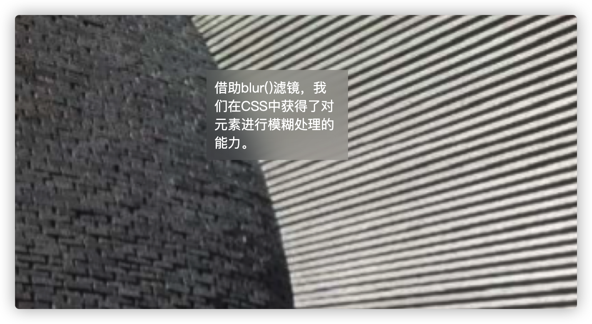

# 视觉效果

- [视觉效果](#视觉效果)
  - [阴影](#阴影)
    - [单侧阴影](#单侧阴影)
    - [邻边投影](#邻边投影)
    - [双侧投影](#双侧投影)
  - [不规则投影](#不规则投影)
  - [染色效果](#染色效果)
  - [毛玻璃效果](#毛玻璃效果)

## 阴影

```css
div {
  width: 100px;
  height: 100px;
  background-color: #58a;
  box-shadow: 2px 3px 4px rgba(0, 0, 0, 0.5);
}
```



上面的 box-shadow 做了什么？

1. 以该元素相同的尺寸和位置，画一个 rgba(0,0,0, .5)的矩形。

2. 把它向右移 2px，向下移 3px。

3. 使用高斯模糊算法（或类似算法）将它进行 4px 的模糊处理。

4. 接下来，模糊后的矩形与原始元素的交集部分会被切除掉，因此它看起来像是在该元素的“后面”。



### 单侧阴影

利用 box-shadow 的第四个长度参数——扩张半径来根据指定的值扩大或缩小阴影的尺寸。一个-5px 的扩张半径会将投影的宽度跟高度各减少 10px（两边各 5px）

如果负的扩张半径跟模糊半径的值刚好相等，如果不用 box-shadow 的两个长度参数移动它，那么我们就看不到任何投影了。

所以我们可以通过移动 box-shadow 的前两个参数来达到单侧投影的效果

```css
div {
  width: 100px;
  height: 100px;
  background-color: #58a;
  box-shadow: 0px 5px 4px -4px black;
}
```



### 邻边投影

```css
box-shadow: 3px 3px 6px -3px black;
```



### 双侧投影

```css
box-shadow: 5px 0px 5px -5px black, -5px 0px 5px -5px black;
```



## 不规则投影

box-shadow 会忽视伪元素或者半透明装饰，比如：

1. 半透明图像，背景图
2. 元素设置了半透明、点状、虚线等，但没有背景（或者当 background-clip 不是 border-box 时）

3. 伪元素
4. 通过 clip-path 生成的形状
5. 折角效果等



上面的图片都没有办法拥有阴影效果。这时候需要用 filter（滤镜）来完成

```css
filter: drop-shadow(2px 2px 10px rgba(0, 0, 0, 0.5));
```

## 染色效果

为一副灰色的图片添加染色效果，是非常常见的方案，我们通常会在静止状态下应用这个效果，当发生 hover 时去除。

```html
<div>
  
</div>
```

```css
div {
  width: 100px;
  height: 100px;
  background: rgba(192, 192, 192, 0.8);
}
img {
  mix-blend-mode: luminosity;
  max-width: 100%;
}
div:hover {
  background: none;
}
```



## 毛玻璃效果

```html
<body>
  <div>借助blur()滤镜，我们在CSS中获得了对元素进行模糊处理的能力。</div>
</body>
```

```css
body,
div::before {
  background: url('./bg.png') 0 / cover fixed;
}
div {
  margin: 10% auto;
  position: relative;
  max-width: 150px;
  background: hsla(0, 0, 100%, 0.6);
  overflow: hidden;
  color: white;
  padding: 10px;
}
div::before {
  content: '';
  position: absolute;
  top: 0;
  right: 0;
  bottom: 0;
  left: 0;
  z-index: -1;
  filter: blur(20px);
  margin: -30px;
}
```


