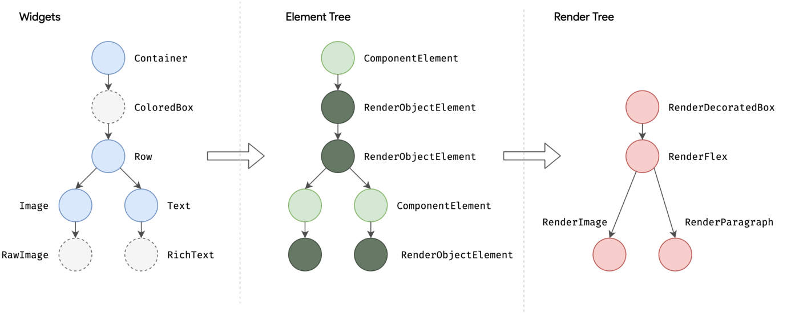
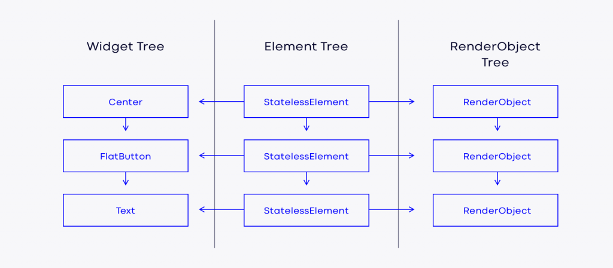
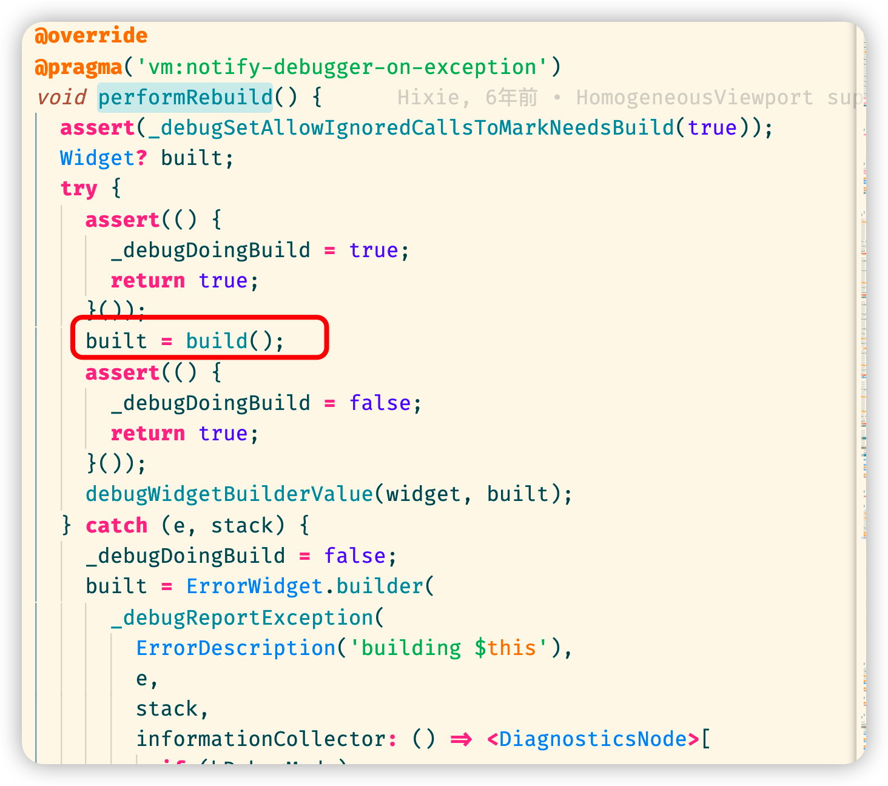
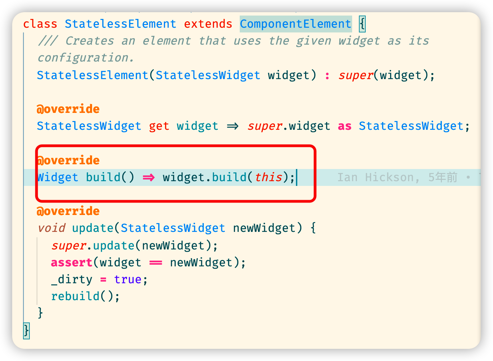
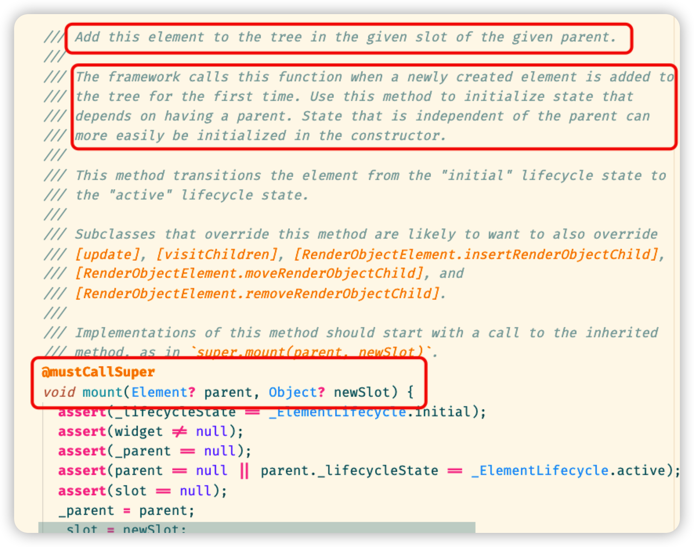
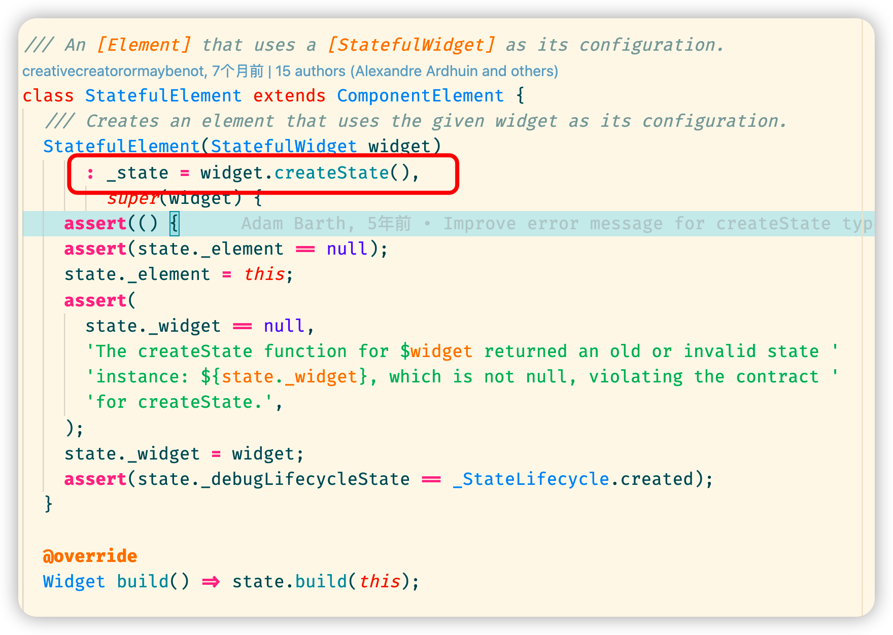

## Flutter 三棵树

Flutter 在内部构建了三棵树，分别为 Widgets Tree、Element Tree、Render Tree。它们长这样：



### Widgets Tree

widget 是声明式 UI 的写法，它描述程序运行后界面应该呈现什么内容。

我们在代码中写的各种 Widget 运行后就构成了 Widgets Tree ，它们是一层层的嵌套关系，几乎所有我们用到的widget都具有这种层级关系。

官方文档对 Widgets 是这样描述的： Widget 是用户界面的一部分的不可变描述。

不可变的这一特点非常重要，这意味着用户界面上的任何修改都需要重新构建新的 widget。

三棵树的概念由此概念发挥作用，在渲染引擎下，flutter 利用三种树的实例，它们中的每一个都有略微不同的用途，但它们结合在一起可以实现快速的用户界面渲染和出色的性能。


### Elements Tree

与 Widgets 相比，Elements 是可变的。这意味着可以更改元素内的属性，而无需创建新元素。官方文档对 Element 的定义是："在树中特定位置的widget的实例化"。

Element负责更新用户界面，它是 介于 Widget 和 Render Object 之间的一种链接。


### Render Object Tree

Render Object（渲染对象）是构建用户界面部分的信息来源，Flutter 并不是查看 Widgets Tree，而是 Render Object。一个 RenderObject 的实例包含 Widget 内的所有关于 Size、painting 和 layout 的信息。这使得创建成本非常高，因此 Flutter 仅在必要时尝试创建新的Render Object。


### 小结

Flutter 运行时，内部会维护着三棵树，分别是 Widgets Tree、Elements Tree和 RenderObject Tree。它们的关系可以用一幅图表示：




## 三棵树基本运作原理

我们写的代码构成 Widgets Tree，最终 Widgets Tree 会被解析成 RenderObject Tree。

RenderObject tree 是渲染树，里面有一个个的 RenderObject，整个 RenderObject 层是渲染库的核心。flutter 引擎读取上面的信息，根据上面的信息来布局、绘制。

那么 Element Tree 存在的意义是什么呢？

Widgets 树有一个特点，它会随着 state 的改变而被重新 build，当用户在界面中触发某个行为改变了状态后，会重新触发 build 方法并重构 widget。

这个特点使得  Widgets 树非常不稳定，因为很小的改动都可能导致整棵树重新build，不难想象，一点小改动使得页面中不必更新的部分也跟着重新渲染会造成极大的性能浪费。

为了解决这个问题，flutter 借鉴了 React 虚拟 dom 的思想，在中间加了一层 Element tree。Elements tree 是用来描述 widget 树结构的对象。

Element tree 的好处是它是一个比较稳定的数据结构，当状态发生更新后，flutter 将旧的 widgets tree 跟新的 widgets tree 做对比，这个对比方法是 diff 算法，diff 取自 different 。

当新的跟旧的 widget tree 对比后，会有一个结果，这个结果叫 patch（补丁），最后用 patch修改 Element tree中需要变更的内容，最终 Element tree 被修改的部分映射到Render tree上也将是极小的性能开销。

这就是flutter 中三棵树基本的运作原理。


## 源码中隐含着更多细节

### 某些 widget 能够直接生成 RenderObject

以 Padding 为例，我们可以通过查看 Padding 的源码查看到 Padding 的继承关系

```dart
Padding => SingleChildRenderObjectWidget => RenderObjectWidget => Widget
```

在`RenderObjectWidget`  中，有一个`createRenderObject`方法，它是这样的：

```dart
 RenderObject createRenderObject(BuildContext context);
```

由于`RenderObjectWidget`是抽象类，所以这个方法必须被子类所实现。

`RenderObjectWidget`的子类是`SingleChildRenderObjectWidget`,但是它也是抽象类，它的方法会被 `Padding` 实现，以下是`Padding`对于`createRenderObject`方法的具体实现：

```dart
  @override
  RenderPadding createRenderObject(BuildContext context) {
    return RenderPadding(
      padding: padding,
      textDirection: Directionality.maybeOf(context),
    );
  }
```

`RenderObject`是一个类，我们顺着它往上找，可以得出这样的关系链

```dart
RenderPadding => RenderShiftedBox => RenderBox => RenderObject
```

最终我们可以得出 `Padding` 这个类，是可以直接构建`RenderObject`的。


### 所有widget 都会创建 Element

每个 `widget`（或者其父类）都有`createElement`的方法，以我们经常写的`StatelessWidget`为例，它的内部就有这个方法

```dart
 StatelessElement createElement() => StatelessElement(this);
```

如果顺着`StatelessWidget`的父类往上找，可以得出 `createElement`方法是抽象类`Widget`的抽象方法：

```dart
	@protected
  @factory
  Element createElement();
```

所有 `widget` 都继承自 `Widget`，所以所有 `Widget` 都必然有这个方法，那么也表明所有 `widget` 都能创建 `Element`。


### 创建 Element 后，会调用 mount 方法

从`StatelessWidget`这个抽象类中，我们可以看到有个普通方法：

```dart
  @override
  StatelessElement createElement() => StatelessElement(this);
```

顺着`StatelessElement`这个类往上找，可以得出以下顺序：

```dart
StatelessElement => ComponentElement => Element
```

在 ComponentElement 这个类中，可以看到 mount 方法

```dart
  @override
  void mount(Element? parent, Object? newSlot) {
    super.mount(parent, newSlot);
    assert(_child == null);
    assert(_lifecycleState == _ElementLifecycle.active);
    _firstBuild();
    assert(_child != null);
  }

  void _firstBuild() {
    // StatefulElement overrides this to also call state.didChangeDependencies.
    rebuild(); // This eventually calls performRebuild.
  }
```

这个 mount 方法调用了`super.mount`方法，并执行了`_firstBuild`,而`_firstBuild`方法则调用了 `rebuild`,进入`rebuild`后能看到它调用了`performRebuild()`方法，`performRebuild`是抽象方法，通过查看他的实现可以看到源码：



在源码中可以看到它调用了 build 方法，接着查找 build 方法的实现，最终能够看到如下代码：



这时候就可以知道原来 statelessElement 会调用 widget 中的 build 方法。

整个过程就是这样的：

1. `StatelessWidget` 调用` createElement` 方法，返回 实例 `StatelessElement(this)`
2. `StatelessElement`的父类调用 `mount` 方法，接着调用 `firstBuild`
3. 最终`firstBuild`会调用 `widget` 上的 `build` 方法

那么这个 mount 有什么用？它主要是用来挂载Element 到 tree 树上的。

在 Element 里，我们也能看到mount 方法，并且还有一段注释



注释的意思是会将Element 挂载到树的给定父级的给定插槽中。当新创建的元素首次添加到树中时，框架将调用此函数。

结论：框架会调用 `mount` 方法，最终会调用到 `widget.build` 方法将结果挂载到 Element tree 上


### 为什么能访问 widget.xxx 

当我们使用`statefulWidget`时，经常会写`createState`方法并返回一个实例

```dart
class HomeContent extends StatefulWidget {
  final name = 'my name';
  const HomeContent({Key? key}) : super(key: key);

  @override
  State<HomeContent> createState() => _HomeContentState();
}

class _HomeContentState extends State<HomeContent> {
  final List<Hotkey> hotKeyList = [];
 
  @override
  Widget build(BuildContext context) {
     // widget.xxx 这里能够访问到上面的 name
    final name = widget.name;
		// ...return something
  }
}
```

为什么能够在访问到上面的 `name` 呢？这需要我们查看`createState`方法做了什么。

这里的 `createState`方法实际上是由`StatefulWidget`抽象类中的`createElement`给调用了。

```dart
abstract class StatefulWidget extends Widget {
  /// Initializes [key] for subclasses.
  const StatefulWidget({ Key? key }) : super(key: key);

  /// Creates a [StatefulElement] to manage this widget's location in the tree.
  ///
  /// It is uncommon for subclasses to override this method.
  @override
  StatefulElement createElement() => StatefulElement(this);
  // 省略后面全部代码...
}
```

它调用 `createElement` 后返回`StatefulElement`实例，并把**自己**传进去了。

让我们看看`StatefulElement`这个类做了什么



上面的代码括红的部分说明在实例化`StatefulElement`时用初始化列表的方式调用了传入的 widget（也就是我们写的widget）的 `createState` 方法,并把 `state` 存到 Element 的`_state`属性中了，接着用一个 `get state` 返回这个`_state`属性，并且将传入的 widget 赋值给这个 `get state`。

```dart
State<StatefulWidget> get state => _state!;
state._widget = widget;
```

通过这一系列操作，最后的结果就是我们能够在我们的 `state` 中通过访问 `widget.xxx`属性得到`HomeContent`中的属性。


### BuildContext是什么

在 build 方法中，天然一个参数，他是 BuildContext 类型的。

```dart
class HomePage extends StatelessWidget {
  final String title;
  const HomePage({Key? key, required this.title}) : super(key: key);

  @override
  Widget build(BuildContext context) {
    return Scaffold(appBar: AppBar(title: Text(title)), body: HomeContent());
  }
}
```

还是需要通过`StatelessWidget`中的源代码找

```dart
  @override
  StatelessElement createElement() => StatelessElement(this);
```

在`StatelessElement`中，我们可以看到它里面有一个 `build` 方法

```dart
  @override
  Widget build() => widget.build(this);
```

它调用了 `widget` 的 `build` 方法，这个 `widget` 就是我们写的 `widget`，而 `this` 就是`Element`自身，说明context 就是 `Element`

