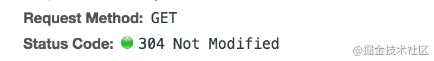
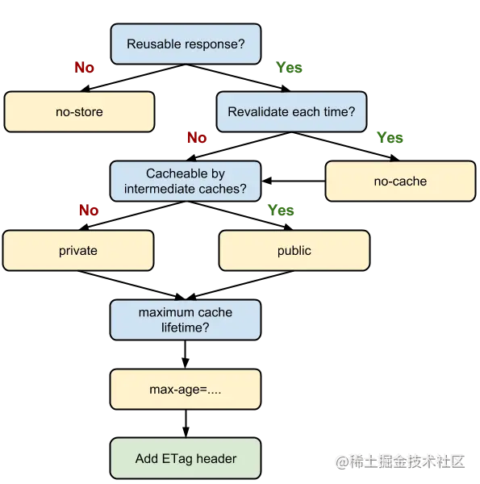

# HTTP 的缓存控制
## 什么是 HTTP 缓存

HTTP缓存指的是: 当客户端向服务器请求资源时，会先抵达浏览器缓存，如果浏览器有“要请求资源”的副本，就可以直接从浏览器缓存中提取而不是从原始服务器中提取这个资源。

常见的http缓存只能缓存get请求响应的资源,http缓存都是从第二次请求开始的。

1. 第一次请求资源时，服务器返回资源，并在respone header头中回传资源的缓存参数；

2. 第二次请求时，浏览器判断这些请求参数，命中强缓存就直接200，否则就把请求参数加到request header头中传给服务器，看是否命中对比缓存，命中则返回304，否则服务器会返回新的资源。

缓存（cache）是优化系统性能的利器，由于链路长，网络延迟不可控，通过 HTTP 获取网络资源的成本比较高，所以，浏览器采用了缓存机制，将拿到的数据缓存起来，下次再请求的时候尽可能复用，这样的好处也很明显：响应速度快、节省网络带宽。

## HTTP 缓存分类

根据是否需要重新向服务器发起请求来分类，可分为强制缓存，对比缓存（又称协商缓存）.

强缓存如果生效,那么不再和服务器发生交互.

对比缓存不管生不生效,都需要跟服务器发生交互.

也就是说强缓存可以不发请求,而对比缓存都得发请求.

跟强缓存相关的 API 有 Expires 和 Cache-Control 等,跟对比缓存相关的有 Etag 等,两种缓存可以同时存在,但是优先级是强缓存更高，只有在强缓存命中失败时，才会走协商缓存。

## 缓存流程
整个浏览器的缓存是这样的：
* 首先浏览器发现发送请求，获取服务器资源
* 服务器响应请求，返回资源，同时标记资源有效期
* 浏览器缓存资源，等待下次重用


## 强制缓存
强缓存跟缓存数据的时间有效性有关,当浏览器没有缓存数据的时候,会发送第一次请求给服务器,服务器会在响应头中附带相关的缓存规则,响应头中有关的字段就是 Expires/Cache-Control。


上图中，cache-control 和 expires 的特写如下：

```http
cache-control: max-age=3600, s-maxage=31536000
```

```http
expires: Wed, 11 Sep 2019 16:12:18 GMT
```

### Expires

expires 是一个时间戳，它表示资源的到期时间节点。

如果我们试图再次向服务器请求资源，浏览器就会先对比本地时间和 expires 的时间戳，如果本地时间小于 expires 设定的过期时间，那么就直接去缓存中取这个资源。

由于时间戳是服务器来定义的，而本地时间的取值却来自客户端，因此 expires 的工作机制对客户端时间与服务器时间之间的一致性提出了极高的要求，若服务器与客户端存在时差，将带来意料之外的结果。

### Cache-Control

服务器标记资源的有效时间的头字段是`Cache-Control`,常用的属性是`max-age=xx`，意思是最大持续时间多少秒。这个属性在 Cookie 那一节也有类似，只是头字段不一样。

max-age 机制下，资源的过期判定不再受服务器时间戳的限制。客户端会记录请求到资源的时间点，以此作为相对时间的起点，从而确保参与计算的两个时间节点（起始时间和当前时间）都来源于客户端，由此便能够实现更加精准的判断。

还有其他的属性：
* no_store：不允许任何缓存，只允许你直接向服务端发送请求、并下载完整的响应。
* no_cache：不走强制缓存，使用前必须去服务器验证是否过期，是否有最新的版本，即走协商缓存。
* must-revalidate：意思是缓存不过期就可以继续使用，但是过期了还想用就要去服务器验证。
* s-maxage：**仅在代理服务器中生效**，s-maxage 就是用于表示 cache 服务器上（比如 cache CDN）的缓存的有效时间的，并只对 public 缓存有效。

> publice 与 private 是针对能否被代理服务器所缓存的一种概念，如果我们为资源设置了 public，那么它可以被代理服务器缓存；如果我们设置了 private，则该资源只能被浏览器缓存。private 为**默认值**。只要设置了 s-maxage，即代表 public 生效，代理服务器可以缓存该资源。

### 小结

expires 是绝对时间戳。

maxage 是相对时间，是限制的时间长度，它用来补足expires 服务器时间和浏览器本地时间不一致的问题。

**Cache-Control 的 max-age 配置项相对于 expires 的优先级更高。当 Cache-Control 与 expires 同时出现时，我们以 Cache-Control 为准。**


## 协商缓存/对比缓存
协商缓存做的就是与服务器通信对比一下资源信息,看看服务器上的资源与缓存的资源是否是一致的。

这里的资源对比需要标识,第一次通信时，服务器可以给浏览器发送标识，它被放在两个 Response Headers 字段中：

```http
Last-Modified: Fri, 27 Oct 2017 06:35:57 GMT
```

```http
ETag: W/"2a3b-1602480f459"
```

当第二次通信时，浏览器利用两个连续的请求来组成验证动作，它是这样运作的：

第一步：先发一个 HEAD 请求，获取资源的修改时间或者其他元信息，然后与缓存数据比较，如果没有改就使用缓存数据，如果改了就走第二步。

第二步：发送 GET 请求，获取最新的版本。

如果资源没有变，服务器就回应一个304 Not Modified 的状态码，表示缓存依然有效，浏览器就可以更新一下有效期，然后使用缓存。由于服务器只返回响应头,不需要返回响应主体,所以数据量大大降低.




### Last-modified

Last-modified 的意思是文件的最后修改时间。

它需要用到两个字段 `Last-Modified / If-Modified-Since`

`Last-Modified` 是第一次请求时服务器发送给浏览器的响应头字段,上面记录服务器资源的最后修改时间。

```http
Last-Modified: Fri, 27 Oct 2017 06:35:57 GMT
```

`If-Modified-Since` 是浏览器第二次请求时发送的头字段，它的值正是上一次 response 返回给它的 last-modified 值：

```http
If-Modified-Since: Fri, 27 Oct 2017 06:35:57 GMT
```

当服务器第一次发送 Last-modified 给浏览器时，浏览器就把资源缓存下来，然后下次请求时在HEAD请求的头部带上` if-Modified-Since:第一次的 Last-modified 的值`给服务器，

服务器接收到这个时间戳后，会比对该时间戳和资源在服务器上的最后修改时间是否一致，从而判断资源是否发生了变化。

* 如果没有发生变化,则响应 304 状态码,告诉浏览器用缓存数据。

* 如果发生了变化，就会返回一个完整的响应内容，并在 Response Headers 中添加新的 Last-Modified 值。

使用`Last-Modified`有明显的弊端——通过文件最后的修改时间来判定文件有无变化

当一个文件被编辑后，即使文件内容没有变，Last-Modified 依然使用最后编辑时间进行判断，此时它会认为已经变化了，于是该文件就被当成一个新的资源，进而引发一次完整的响应——不该请求的资源会重新请求。

为了解决这个问题，还有一种 ETag的方式。

### ETag

ETag主要用来解决修改时间无法准确区分文件变化的问题，使用 ETag可以精确识别资源的变动情况，让浏览器可以有效利用缓存。

ETag 是资源唯一标识，是由服务器决定规则的标识,当第一次访问时,服务器就会在响应头中带着这个标识,这个标识长这样:


ETag 对应的**常用条件请求字段**是 If-None-Match。当再次访问服务器时,浏览器会在请求头中发送 If-None-Match 这个字段并附上之前的 Etag 标识,如果服务器发现有这个标识就会跟自己的唯一标识做对比.

* 如果一样,说明资源没改过,响应 304 状态码,告诉浏览器用缓存数据。

* 如果不一样,说明资源改动过,响应 200 并且发最新的资源主体过去。

Etag 并不能替代 Last-Modified，它只能作为 Last-Modified 的补充和强化存在。

 **Etag 在感知文件变化上比 Last-Modified 更加准确，优先级也更高。当 Etag 和 Last-Modified 同时存在时，以 Etag 为准。**


## HTTP 缓存决策

谷歌官方给了一张关于我们如何使用 HTTP 缓存的应用流程图



以下是流程图的解读：

1. 判断资源是否可复用，如果不是，则设置响应头的 cache-control 字段为 no-store，拒绝一切缓存。
2. 如果需要复用，则考虑使用资源时是否每次都向服务器验证资源有无修改。
3. 如果需要每次都向服务器验证，设置 cache-control 字段为 no-cache，绕开强制缓存，每次都走协商缓存。
4. 如果不需要绕开强制缓存，则判断该资源是否能够被代理服务器缓存，这里也可以设置 private 或 public 属性。
5. 如果希望被代理服务器缓存，则继续设置 s-maxage值和 max-age值，否则只需要设置 max-age。
6. 最后再配置一下 ETag 、Last-Modified等参数


## 客户端缓存控制

服务器发送了缓存指令，浏览器就会把缓存数据给保存到本地，等到需要用的时候，就会读取本地缓存中的服务器资源，提高网络效率。

不止浏览器可以发 Cache-Control 头，浏览器也可以发，这说明请求-应答双方都可以用Cache-Control 字段进行缓存控制。

当我们点击刷新按钮的时候，浏览器会在请求头里面加`Cache-Control:max-age=0`，表示的意思是我要最新的资源。这时候不会读取浏览器的缓存，而是向服务器发送请求。

下图是我在chrome浏览器中点击刷新时发送出去的请求头，自动带上了 Cache-Control:no-cache,跟 max-age效果是一样的。


浏览器的缓存什么时候生效呢？当我们点击前进、后退按钮的时候，会看到 `from disk cache `的字样，这就触发了浏览器的缓存。


因为前进、后退等操作，浏览器只会添加最基本的请求头，不会增加`Cache-Control`之类的字段，所以会触发本地缓存。


## 总结
缓存是优化系统性能的重要手段，HTTP 传输时每个环节都可以使用到缓存。

HTTP 缓存就类似于浏览器跟服务器中间的一个缓存数据库,至于用不用这个缓存库就需要服务器来指定。

浏览器收到数据就会存入缓存，如果没过期就可以直接使用，过期就要去服务器验证是否依然可用

服务器可以指定两种方式:强制缓存和对比缓存.强制缓存比对比缓存优先级高

强制缓存不会发请求给服务器,它就是设定一个时间,这个时间可以分为 Expires 和 Cache-Control。
Expires 就是定一个具体的时间节点,但是有 bug,会因为服务器时间跟本地时间不同而有误差.

而 Cache-Control 常用的是 max-age，表示资源有效期，就是指定多少秒内用强制缓存.当强制缓存成功后返回 200.

对比缓存就是发送一段请求给服务器,请求信息可以有两种:修改时间和唯一标识.

两种都是需要跟服务器的信息进行对比,对比成功就返回 304,告诉浏览器用缓存数据,对比失败就返回 200,然后把用户需要请求的数据作为资源主体发回去.

验证资源的时间是否失效需要使用条件请求，常用`if-Modified-Since`和` If-None-Match`,如果返回304就可以使用缓存里面的资源

验证资源是否被修改涉及到两个条件，`ETag`和`Last-Modified`，需要服务器预先在响应报文中设置，搭配条件请求使用

浏览器也可以发送 Cache-Control，比如刷新操作，就会发送 `max-age=0`来刷新数据

浏览器缓存的一个中心思想就是：没有请求的请求，才是最快的请求