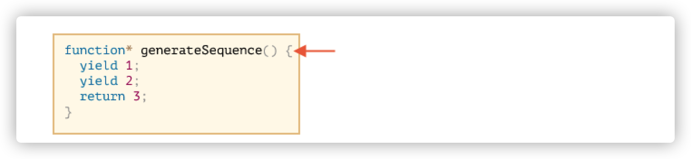
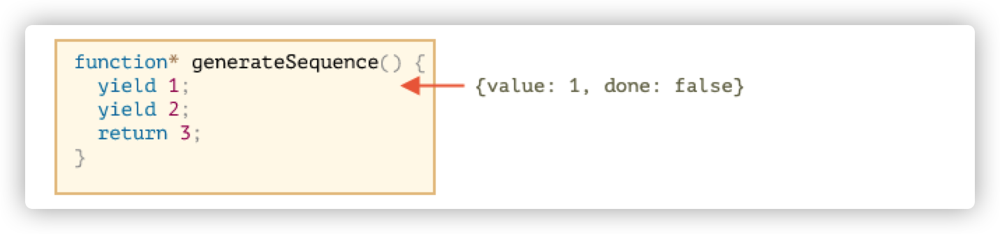
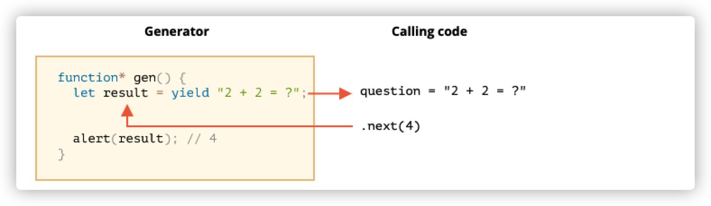
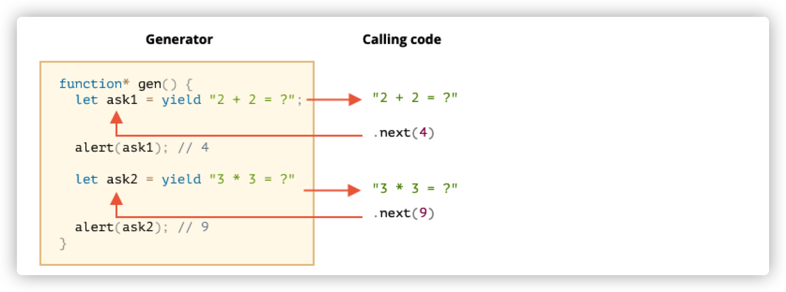

# Generator 函数

普通函数只可以返回一个值,或者不返回任何值(实际返回 undefined)

Generator 函数可以返回('yield')多个值, 它们可以与 iterator 配合使用

要创建 Generator 函数,需要用一个特殊的语法`function *`

```javascript
function* generateSequence() {
  yield 1;
  yield 2;
  return 3;
}
```

当调用`generator`函数时,并不会运行其代码,而是返回一个`[object Generator]`的特殊对象,我们称其为 “generator object”

```javascript
function* generateSequence() {
  yield 1;
  yield 2;
  return 3;
}
const a = generateSequence();
console.log(a); //[object Generator]
```

到目前为止,**上面的代码还没有运行**,我们拿到的是`generator`对象。



`generator` 对象的主要方法是 `next()`,当调用该方法时,它就会开始运行,执行到最近的 `yield`语句,然后函数暂停,将`yield`的值返回出去。

`next()`的结果会返回一个对象,该对象有两个属性

- value:yield 后的值
- done:如果 generator 执行完成,则返回 `true`,如果没有则返回`false`

```javascript
function* generateSequence() {
  yield 1;
  yield 2;
  return 3;
}
const a = generateSequence();
console.log(a);
console.log(a.next()); // {value:1,done:false}
```

截止目前,我们获取到了第一个值,现在代码处于这里



当我们再次调用 `next`方法,代码就会从当前的位置继续往下 `yield`,直到 `done`为 `true `为止

```javascript
console.log(a.next()); // {value:2,done:false}
console.log(a.next()); // {value:3,done:true}
```

现在代码已经执行完成了,`done`的状态为`true`,如果继续往下执行,会返回 `value`为`undefined`的对象

```javascript
console.log(a.next()); // {value:undefined,done:true}
```

## Generator 可迭代

每个`generator` 对象都有 `next`方法,这意味着它是可迭代的(`iterable`),他内置了`iterable`接口。

```javascript
function* generateSequence() {
  yield 1;
  yield 2;
  return 3;
}
const a = generateSequence();

for (let item of a) {
  console.log(item);
}
// 1
// 2
```

使用 `for` 循环时,会默认调用 `next()`方法,然后打印出`value`

....上面的例子中,并没有返回 3,这是因为当`done`为 `true`时,`for..of`循环会忽略 `value`

如果我们希望能够获得`3` ,则必须使用 `yield`返回

```javascript
function* generateSequence() {
  yield 1; //{value:1,done:false}
  yield 2; //{value:2,done:false}
  yield 3; //{value:3,done:false}
}
const a = generateSequence();

for (let item of a) {
  console.log(item);
}
// 1
// 2
// 3
```

由于 `generator`对象部署了`iterable `接口,所以我们可以使用展开符去展开它

```javascript
function* generateSequence() {
  yield 1; //{value:1,done:false}
  yield 2; //{value:2,done:false}
  yield 3; //{value:3,done:false}
}
const a = generateSequence();
const arr = [...a];
console.log(arr); // [1, 2, 3]
```

## 使用 Generator 迭代

下面我们为对象手写一个 `iterable` 接口

```javascript
let range = {
  from: 1,
  to: 5,
  // for..of range 在一开始就调用一次这个方法
  [Symbol.iterator]() {
    // ...它返回 iterator object：
    // 后续的操作中，for..of 将只针对这个对象，并使用 next() 向它请求下一个值
    return {
      current: this.from,
      last: this.to,
      // for..of 循环在每次迭代时都会调用 next()
      next() {
        // 它应该以对象 {done:.., value :...} 的形式返回值
        if (this.current <= this.L) {
          return {
            value: this.current++,
            done: false,
          };
        }
        return {
          done: true,
        };
      },
    };
  },
};

for (let item of range) {
  console.log(item); // 1 2 3 4 5
}
```

上面代码主要做了如下工作

- 给对象设置`[Symbol.iterator]`属性,这个属性是一个函数
- 该函数返回一个`iterator object`,拥有 `next `方法
- `next `方法返回包含 `value` 和 `done`两个属性的对象

由于 `Generator`函数的语法糖可以帮助返回包含 `value` 和 `done`两个属性的对象,所以我们可以对其进行改写

```javascript
let range = {
  from: 1,
  to: 5,
  *[Symbol.iterator]() {
    for (let i = this.from; i <= this.to; i++) {
      yield i;
    }
  },
};

const generator = range[Symbol.iterator]();
console.log(generator.next()); // 1
console.log(generator.next()); // 2
console.log(generator.next()); // 3
console.log(generator.next()); // 4
console.log(generator.next()); // 5
```

> 当`for..of`循环时,会默认调用`[Symbol.iterator]`的 `next`方法,然后取其返回对象的 `value`值,直到 `done`为`true`为止

`Generator` 函数能够帮助生成 `iterator`接口所需要的内容:

- 一个拥有 `next`方法的对象(此时为`generator` 对象)
- 该对象`next`方法可以返回`{done:boolean,value:any}`结构的对象

所以`Generator`可以看作 `iterator`接口的语法糖

## Generator 组合

使用 `yield *`指令可以将执行委托给另一个 `generator`,比如下面我们使用这个语法来将一个 `generator`组合到另一个 `generator`中

```javascript
function* generateSequence(start, end) {
  for (let i = start; i <= end; i++) yield i;
}

function* generateAll() {
  yield* generateSequence(1, 6); // *
  for (let i = start; i <= end; i++) yield i; // *行与这行代码效果是一样的
}
const g = generateAll();
for (let item of g) {
  console.log(item); // 1 2 3 4 5 6 7 8 9 10
}
```

## Generator 传递参数

`yield`不仅可以向外返回结果,还可以将外部的值传递到 `generator`内部。

调用 `generator.next(arg)`,我们就可以将参数`arg`传递到 generator 内部,这个 `arg` 参数会变成`yield`的结果。

```javascript
function* gen() {
  // 向外部代码传递一个问题并等待答案
  let result = yield '2 + 2 = ?'; // (*)

  alert(result);
}

let generator = gen();

console.log(generator.next()); // 结果为 {done: false,value: "2 + 2 = ?"}
console.log(generator.next(4)); // 会弹出 4 但结果为 {done: true,value: undefined}
```

yield 会将外部传递的参数 4 传递给 result,然后通过弹框打印出来。此时 `yield` 已执行结束,所以返回给外部的 `yield` 值为`{done: true,value: undefined}`



- 第一次调用`generator.next()`时,会经过 `yield`,此时往外部返回 `yield `值。(如果此时传递 arg 参数,那么会被忽略)它往外部返回第一个`yield`结果 `{done: false,value: "2 + 2 = ?"}`
- 此时,在第`*`行,`generator` 执行暂停
- 当调用`generator.next(4)`时,`generator` 恢复,并获取外部传入的 4 作为`result`:`let result = 4`

我们可以发现,`generator` 是通过`yield`来向外部传递值,外部则通过调用 `next`方法向 `generator`函数内部传递参数来交换结果。

根据上面的结论,我们再来看一个例子

```javascript
function* gen() {
  let ask1 = yield '2 + 2 = ?';

  alert(ask1); // 4

  let ask2 = yield '3 * 3 = ?';

  alert(ask2); // 9
}

let generator = gen();

console.log('yield', generator.next()); //yield {done: false,value: "2 + 2 = ?"}
console.log('yield', generator.next(4)); //alert 4 yield {done: false,value: "3 * 3 = ?"}
console.log('yield', generator.next(9)); //alert 9 yield {done: true,value: undefined}
```

我们可以发现:

- 一共有两个 `yield` 关键字,那么如果希望传递给外部的 `yield`有 `value`,则需要调用两次 `next`方法
- 当调用第二次 `next`并传递`arg`时,会把`arg`当成结果传递给 `ask1`。然后发现后面还有 `yield`,就又往外传递。此时就相当于内外部互相传递了信息
- 当调用第三次 `next`时,由于没有`yield`关键字了,所以就只是向内部传递一下`arg`,往外透出的是`{done: true,value: undefined}`

执行图：



1. 第一个 `.next()` 启动了 generator 的执行……执行到达第一个 `yield`。
2. 结果被返回到外部代码中。
3. 第二个 `.next(4)` 将 `4` 作为第一个 `yield` 的结果传递回 generator 并恢复 generator 的执行。
4. ……执行到达第二个 `yield`，它变成了 `generator.next(4)` 调用的结果。
5. 第三个 `next(9)` 将 `9` 作为第二个 `yield` 的结果传入 generator 并恢复 generator 的执行，执行现在到达了函数的最底部，所以返回 `done: true`。

这个过程就像“乒乓球”游戏。每个 `next(value)`（除了第一个）传递一个值到 generator 中，该值变成了当前 `yield` 的结果，然后获取下一个 `yield` 的结果。

## generator.throw

外部代码可以通过`generator.next`方法将值传递给 `generator`,作为`yield`的结果,也可以在`yield`的代码行抛出一个 error,

如果想这样做,我们需要调用`generator.throw`来将 `error`抛到对应的`yield`所在行

```javascript
function* gen() {
  try {
    let result = yield '2 + 2 = ?'; // (1)

    alert('执行没有到这里，因为上面抛出了异常');
  } catch (e) {
    alert(e); // 显示这个 error
  }
}

let generator = gen();

generator.next();

generator.throw(new Error('这是一个错误')); // (2)
```

- 当第一次调用`generator.next()`时,会在第(1)行`yield`一个结果出来,然后暂停
- 外部调用`generator.throw`将错误抛给内部时,此时`generator`继续执行,执行到 `let result`,并被`try..catch`捕获到,抛给外部一个错误,后面的代码不会被继续执行

如果我们没有在`generator`内部捕获它,那么这个错误就会从 `generator`掉出到外部代码中。

```javascript
function* gen() {
  let result = yield '2 + 2 = ?'; // (1)
  alert('执行没有到这里，因为上面抛出了异常');
}

let generator = gen();
try {
  generator.next();
  generator.throw(new Error('这是一个错误')); // (2)
} catch (error) {
  alert(error);
}
```

下面的代码效果是一样的。

## 小结

- Generator 函数通过 `function*`关键字创建
- 在 generator 内部,使用 `yield`关键字
- 外部和`generator`内部可以通过`next/yield`调换结果

# 异步迭代

迭代器是采用 `iterator`接口的,如果希望给一个未内置迭代接口的对象设置`iterator` 接口,我们需要完成以下步骤:

1. 给对象设置`[Symbol.iterator]`属性,这个属性指向一个 function
2. 该 `function`需要返回一个具有 `next`方法的对象,我们称之为`iterator object`
3. 该对象的 `next`方法返回具有 `done:boolean`和`value:any`属性的对象

以下是例子

```javascript
let range = {
  from: 1,
  to: 5,
  //for..of 循环开始时,会调用这个方法,获取 iterator object
  [Symbol.iterator]() {
    return {
      current: this.from,
      last: this.to,
      // for..of 每次循环,都会调用 next 方法,直到 done 为 true 为止
      next() {
        return this.current <= this.last
          ? // next 方法返回的对象必须为{done:boolean,value:any}的格式
            { done: false, value: this.current++ }
          : { done: true };
      },
    };
  },
};
for (let item of range) console.log(item); // 1 2 3 4 5
```

如果我们希望能够采用异步迭代,比如说 setTimeout 的延迟之后迭代,就需要用到异步迭代。

要让上面的对象拥有异步迭代的能力,我们需要做以下调整

- `[Symbol.iterator]`修改为`[Symbol.asyncIterator]`
- `next`方法返回一个 Promise,并且状态为 `fulfilled`
- 使用 for await ..进行循环

下面是修改后的代码

```javascript
let range = {
  from: 1,
  to: 5,
  [Symbol.asyncIterator]() {
    return {
      current: this.from,
      last: this.to,
      // 这里的 async 是让return 的值变成 promise
      async next() {
        // 这里使用 await 阻塞,模拟延迟效果
        await new Promise(resolve => setTimeout(resolve, 1000));
        return this.current <= this.last
          ? { done: false, value: this.current++ }
          : { done: true };
      },
    };
  },
};
// 配合 for await 必须用 async
(async () => {
  for await (let item of range) {
    console.log(item);
  }
})();
```

- next 方法可以不是`async`,这里只是为了让 `next`必须返回`promise`而写的语法糖
- 为了让异步迭代生效,其内部必须具有`Symbol.asyncIterator`方法
- 使用 `for await` 迭代,需要用上 `async` 关键字

以下是两者对比差异的表格:

|                          | Iterator          | 异步 iterator          |
| :----------------------- | :---------------- | :--------------------- |
| 提供 iterator 的对象方法 | `Symbol.iterator` | `Symbol.asyncIterator` |
| `next()` 返回的值是      | 任意值            | `Promise`              |
| 要进行循环，使用         | `for..of`         | `for await..of`        |

## 异步 generator

`generator` 可以很方便地帮助我们生成 iterator 所需要的东西：

——通过`*`关键字生成`generator`对象,内部包含 `next`方法

——通过 `yield`抛出 具有`done`和`value`属性的对象

上面的代码可以修改成这样

```javascript
let range = {
  from: 1,
  to: 5,
  async *[Symbol.asyncIterator]() {
    for (let i = this.from; i <= this.to; i++) {
      await new Promise(resolve => setTimeout(resolve, 1000));
      yield i;
    }
  },
};
// 配合 for await 必须用 async
(async () => {
  for await (let item of range) {
    console.log(item); // 1 2 3 4 5
  }
})();
```

此时,`generator.next()`返回一个 `promise`,且它是一个异步的函数

```javascript
(async () => {
  const asyncGenerator = range[Symbol.asyncIterator]();
  const result = await asyncGenerator.next(); // 返回Promise Object {done:false,value:1}
  console.log(result); // {done:false,value:1}
})();
```
