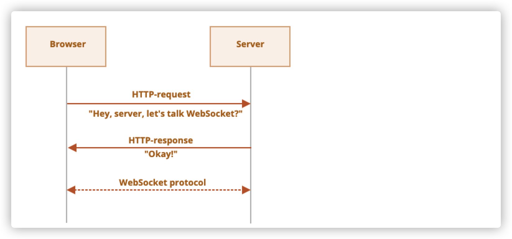

# WebSocket简介

`WebSocket`协议提供了一种浏览器和服务器之间建立持久连接来交换数据的方法。数据可以作为数据包在两个方向上传递，而不会断开连接和其他HTTP请求。

对于需要连续数据交换的服务，比如网络游戏、实时通讯等，会用到`WebSocket`。

我们需要在url中使用特殊的协议`ws`创建WebSocket。

```javascript
let socket = new WebSocket("ws://javascript.info");
```

同时也有一个加密的`wss://`协议，类似于WebSocket中的HTTPS。

`wss://`协议基于TLS协议，就类似于HTTPS是基于TLS协议的HTTP。在传输时对发送方的数据进行加密，在接收方进行解密。

由于`wss://`是加密的，更加可靠，所以推荐始终使用`wss://`协议。

当socket被创建后，我们就可以监听事件：

1. `open`——连接建立时触发
2. `message`——接收到数据时触发
3. `error`——WebSocket出现错误时触发
4. `close`——连接关闭后触发

如果我们想要发送数据，那么需要使用`socket.send(data)`

下面是一个例子：

```javascript
let socket = new WebSocket("wss://javascript.info/article/websocket/demo/hello");

socket.onopen = function(e) {
  alert("[open] Connection established");
  alert("Sending to server");
  //连接打开后发送数据
  socket.send("My name is John");
};

socket.onmessage = function(event) {
  // 当接收到数据时触发回调
  alert(`[message] Data received from server: ${event.data}`);
};

socket.onclose = function(event) {
  // 当连接关闭时触发回调
  if (event.wasClean) {
    alert(`[close] Connection closed cleanly, code=${event.code} reason=${event.reason}`);
  } else {
    // 例如服务器进程被杀死或网络中断
    // 在这种情况下，event.code 通常为 1006
    alert('[close] Connection died');
  }
};

socket.onerror = function(error) {
  alert(`[error] ${error.message}`);
};
```

# 建立WebSocket

当`new WebSocket(url)`被创建后，会马上建立连接。

在连接期间，浏览器会发送请求头询问服务器是否支持`WebSocket`，如果服务器支持，则通信会以WebSocket协议继续进行。



浏览器发送的请求头长这样：

```http
GET /chat
Host: javascript.info
Origin: https://javascript.info
Connection: Upgrade
Upgrade: websocket
Sec-WebSocket-Key: Iv8io/9s+lYFgZWcXczP8Q==
Sec-WebSocket-Version: 13
```

* `Origin`——客户端页面的源。

* `Connection: Upgrade`——客户端想要更改协议

* `Upgrade: websocket`——客户端想要更改的协议是`websocket`

* `Sec-WebSocket-Key`——浏览器随机生成的安全密钥

* `Sec-WebSocket-Version`——WebSocket的协议版本

如果服务器同意的话，那么会返回响应码101

```http
101 Switching Protocols
Upgrade: websocket
Connection: Upgrade
Sec-WebSocket-Accept: hsBlbuDTkk24srzEOTBUlZAlC2g=
```

浏览器发送的`Sec-WebSocket-Key`和服务器响应的`Sec-WebSocket-Accept`是用来确保浏览器的请求与响应是相对应的。

此时开始使用`WebSocket`协议传输数据。

## 扩展和子协议

WebSocket还有其他header字段

* `Sec-WebSocket-Extensions` —— 扩展，扩展与传输数据有关，扩展能够扩展WebSocket协议的功能。`Sec-WebSocket-Extensions: deflate-frame`表示浏览器支持数据压缩。扩展的header由浏览器自动发送。

* `Sec-WebSocket-Protocol` —— 子协议，`Sec-WebSocket-Protocol: soap, wamp` 表示我们不仅要传输任何数据，还要传输 [SOAP](http://en.wikipedia.org/wiki/SOAP) 或 WAMP（“The WebSocket Application Messaging Protocol”）协议中的数据。

  这个header是可选的，如果我们希望发送这个header，则使用`new WebSocket`来设置，它是子协议数组。

  如果想要支持上面两种子协议的数据，则这样写：

  ```javascript
  let socket = new WebSocket("wss://javascript.info/chat", ["soap", "wamp"]);
  ```

请求时带上扩展和子协议的请求头长这样：

```diff
GET /chat
Host: javascript.info
Upgrade: websocket
Connection: Upgrade
Origin: https://javascript.info
Sec-WebSocket-Key: Iv8io/9s+lYFgZWcXczP8Q==
Sec-WebSocket-Version: 13
+ Sec-WebSocket-Extensions: deflate-frame
+ Sec-WebSocket-Protocol: soap, wamp
```

服务器响应时会这样响应，表示支持扩展`deflate-frame`和子协议`soap`：

```diff
101 Switching Protocols
Upgrade: websocket
Connection: Upgrade
Sec-WebSocket-Accept: hsBlbuDTkk24srzEOTBUlZAlC2g=
+ Sec-WebSocket-Extensions: deflate-frame
+ Sec-WebSocket-Protocol: soap
```

# 数据传输

WebSocket通信由“frames”（数据片段）组成，可以从任何一方发送，并且支持以下类型：

- “text frames” —— 包含各方发送给彼此的文本数据。
- “binary data frames” —— 包含各方发送给彼此的二进制数据。
- “ping/pong frames” 被用于检查从服务器发送的连接，浏览器会自动响应它们。
- 还有 “connection close frame” 以及其他服务 frames。

浏览器中我们仅使用文本或者二进制frames。

通过`socket.send(body)`方法可以发送文本或者二进制数据。

body可以是字符串或者二进制格式,其中二进制格式包括`Blob`、`ArrayBuffer`等。

当收到数据时，文本则是字符串。如果收到的是二进制格式的数据，我们可以在Blob和ArrayBuffer格式之间进行选择。默认为`blob`，如果我们想要换成ArrayBuffer，则可以通过`socket.binaryType`属性设置：

```javascript
socket.binaryType = "arraybuffer";// 接受arraybuffer
socket.onmessage = (event) => {
  // event.data 可以是文本（如果是文本），也可以是 arraybuffer（如果是二进制数据）
};
```

## 限速

我们有可能有很多数据要发送出去，但是网络却很慢。

我们可以反复使用`socket.send(data)`来发送数据。但是没发出去的数据会储存在内存当中，并且在网速允许的情况下尽快将数据发出去。

`socket.bufferedAmount`属性可以访问到目前等待通过网络发送，已缓存的字节数。

我们可以用它来检查socket是否真的可用于传输

```javascript
// 每 100ms 检查一次 socket
// 仅当所有现有的数据都已被发送出去时，再发送更多数据
setInterval(() => {
  if (socket.bufferedAmount == 0) {
    socket.send(moreData());
  }
}, 100);
```

# 连接关闭

浏览器和服务器都可以关闭连接，关闭连接时允许发送一个数字码和文本形式的原因。

```javascript
socket.close([code], [reason]);
```

然后另一方就可以通过监听`close`事件来获取关闭码和关闭原因

```javascript
// 关闭方：
socket.close(1000, "Work complete");

// 另一方
socket.onclose = event => {
  // event.code === 1000
  // event.reason === "Work complete"
  // event.wasClean === true (clean close)
};
```

常见的数字码如下：

* 1000 ——默认值，表示正常关闭
* 1006 —— 表示连接丢失，**不能手动设置这个数字码**
* 1001 —— 一方正在离开，比如服务器正在关闭，浏览器离开了页面
* 1009 —— 消息太大，无法处理
* 1011 —— 服务器发生错误
* ……

# 连接状态

要获取连接状态，可以通过带有值的 `socket.readyState` 属性：

- **`0`** —— “CONNECTING”：连接还未建立，
- **`1`** —— “OPEN”：通信中，
- **`2`** —— “CLOSING”：连接关闭中，
- **`3`** —— “CLOSED”：连接已关闭。


# 例子

[这里有个例子](https://github.com/18888628835/WebSocket-demo-1)


# 总结

WebSocket是一种在浏览器和服务器之间建立长久连接的协议

* WebSocket没有跨域限制
* 可以发送/接受字符串和二进制数据

WebSocket的API很简单：

* `socket.send(body)`
* `socket.close([cide],[reason])`

事件：

* `open`
* `message`
* `error`
* `Close`

WebSocket 自身并不包含重新连接（reconnection），身份验证（authentication）和很多其他高级机制。因此，有针对于此的客户端/服务端的库，并且也可以手动实现这些功能。

有时为了将 WebSocket 集成到现有项目中，人们将主 HTTP 服务器与 WebSocket 服务器并行运行，并且它们之间共享同一个数据库。对于 WebSocket 请求使用一个通向 WebSocket 服务器的子域 `wss://ws.site.com`，而 `https://site.com` 则通向主 HTTP 服务器。