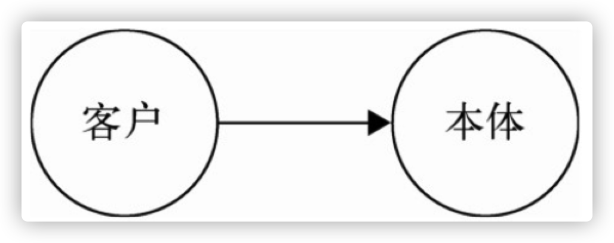
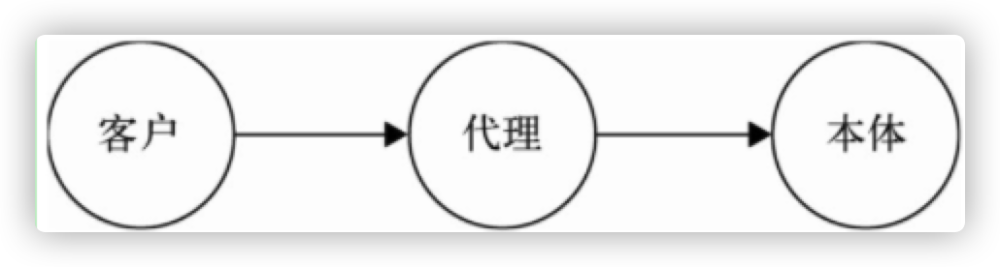
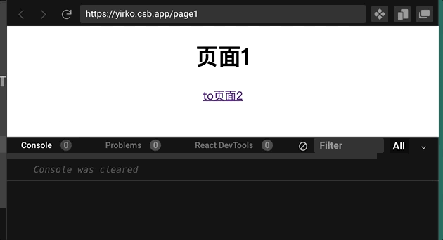

# 第四章 单例模式

单例模式的定义是：保证一个类仅有一个实例，并提供一个访问它的全局访问点。

单例模式是一种常用的模式，有一些对象我们往往只需要一个，比如线程池、全局缓存、浏览器中的window对象等。

## 4.1 实现单例模式

要实现一个单例模式，只需要用一个变量来标识当前是否已为某个类创建过对象，如果是，则在下一次获取该类的实例时，直接返回之前创建的对象。

```javascript
        var Singleton = function( name ){
            this.name = name;
            this.instance = null;
        };

        Singleton.prototype.getName = function(){
            alert ( this.name );
        };

        Singleton.getInstance = function( name ){
            if ( ! this.instance ){
              this.instance = new Singleton( name );
            }
            return this.instance;
        };

        var a = Singleton.getInstance( 'sven1' );
        var b = Singleton.getInstance( 'sven2' );

        alert ( a === b );    // true
```

也可以使用闭包来完成这个功能

```javascript
var Singleton = function(name) {
  this.name = name;
};

Singleton.prototype.getName = function() {
  alert(this.name);
};


Singleton.getInstance = (function() {
  var instance = null
  return function(name) {
    if (!instance) {
      instance = new Singleton(name);
    }
    return instance;
  }

})();
```

这个方法非常简单，但是却增加了单例类的“不透明性”。跟以往通过new xxx来获取对象的方式不同，开发者必须知道这是一个单例类，并且通过`Singleton.getInstance`来获取Singleton类的对象。

## 4.2 透明的单例模式

下面代码是对上面的单例模式的一种改进，以创建唯一的div节点为例。

```JavaScript
var CreateDiv = (function() {

  var instance;

  CreateDiv = function(html) {
    if (instance) {
      return instance;
    }
    this.html = html;
    this.init();
    return instance = this;
  };

  CreateDiv.prototype.init = function() {
    var div = document.createElement('div');
    div.innerHTML = this.html;
    document.body.appendChild(div);
  };

  return CreateDiv;

})();

var a = new CreateDiv('sven1');
var b = new CreateDiv('sven2');

alert(a === b); // true
```

这个单例模式比较透明，为了将instance封装起来，使用了闭包和立即执行函数，并且返回了真正的构造函数。

这种方式增加了一些程序的复杂度，阅读起来也不是很舒服。

观察这段代码

```javascript
  CreateDiv = function(html) {
    if (instance) {
      return instance;
    }
    this.html = html;
    this.init();
    return instance = this;
  };
```

在这个构造函数中，一共负责了两件事情。第一是保证只有一个实例，第二是调用该函数的init函数，这违反了单一职责原则，让这个函数看起来很奇怪。

## 4.3 用代理实现单例模式

我们来对上面的CreateDiv构造函数进行改造，将返回单一实例的代码提炼出来，使它变成一个纯正的构造函数

```javascript
var CreateDiv = function(html) {
  this.html = html;
  this.init();
};

CreateDiv.prototype.init = function() {
  var div = document.createElement('div');
  div.innerHTML = this.html;
  document.body.appendChild(div);
};
```

然后引入一个代理类

```javascript
const proxySingletonCreateDiv = (function() {
  let instance
  return function(html) {
    if (!instance) {
      return instance = new CreateDiv(html)
    }
    return instance
  }
})()
```

现在我们把负责管理单例的逻辑移到了代理类proxySingletonCreateDiv中，它使职责划分更清晰，跟createDiv组合也可以产生单例模式的效果。

接下来测试一下

```javascript
var a = new proxySingletonCreateDiv('sven1');
var b = new proxySingletonCreateDiv('sven2');

alert(a === b); // true
```

## 4.4 JavaScript中的单例模式

前面的几种单例模式的实现，在传统的面向对象语言当中， 是非常自然的。以Java为例，如果需要某个对象，就必须先定义一个类，对象总是从类中创建而来。单例对象自然也是从类创建而来。

但在JavaScript中，创建对象非常简单，我们并不需要创建一个类。

这就意味着传统的单例模式并不适用于JavaScript。

**单例模式的核心是确保只有一个唯一的实例并提供给全局访问。**

全局变量不是单例模式，但在JavaScript中，我们可以将其当作单例来使用。

例如：

```JavaScript
var a ={}
```

全局对象提供给全局访问时理所当然的，这样就满足了单例模式的两个条件。

但全局变量也有问题。它会造成命名空间受污染。

以下有几种方式可以降低全局变量带来的命名污染。

1. 使用namespace

   最简单的方式是采取对象字面量的方式：

   ```javascript
   var namespace={  a:function(){},  b:function(){}}
   ```

   把需要的变量都定义为namespace的属性，这样可以减少变量和全局作用域打交道的机会。

   还可以动态创建全局命名空间

   ```javascript
   const myApp = {
     namespace(name) {
       var current = this
       var parts = name.split('.')
       for (let p of parts) {
         if (!current[p]) {
           current[p] = {}
         }
         current = current[p]
       }
     }
   }
   myApp.namespace('dom.style.classname')
   
   //上面的代码相当于
   var myApp={
     dom:{
       style:{
         classname:{}
       }
     }
   }
   ```

2. 使用闭包封装私有变量

   这种方法是将变量封装在闭包的内部，只暴露一些接口跟外部通信

   ```JavaScript
           var user = (function(){
               var __name = 'sven',
                 __age = 29;
   
               return {
                 getUserInfo: function(){
                     return __name + '-' + __age;
                 }
               }
   
           })();
   ```

   我们用下划线来约定私有变量`__name`和`__age`，它们被封装在闭包产生的作用域中，外部是访问不到这两个变量的，这就避免了对全局的命令污染

## 4.5 惰性单例

惰性单例指的是在需要的时候才创建对象实例。惰性单例是单例模式的终点，这种技术在实际开发中非常有用。

下面假设我们的网站上有一个登录按钮，当用户点击这个按钮后，会出现一个登录弹窗。很显然这个弹窗在页面中总是唯一的，不可能同时存在两个登录窗口的情况。

下面我们来写第一种解决方案：页面加载完成时创建好登录框，登录框是隐藏的，当用户点击登录按钮时，它才显示出来

```javascript
var loginLayer = (function() {  var div = document.createElement('div');  div.innerHTML = ’我是登录浮窗’;  div.style.display = 'none';  document.body.appendChild(div);  return div;})();document.getElementById('loginBtn').onclick = function() {  loginLayer.style.display = 'block';};
```

这种方式的缺点在于该节点一开始就创建好了，如果用户没有点击登录按钮，那么创建该节点的操作就白白浪费了。

下面这种方式倒是可以在点击按钮时创建，但是每次都会创建多个div，也就违背了单例模式。

```javascript
var createLoginLayer = function() {  var div = document.createElement('div');  div.innerHTML = '我是登录浮窗';  div.style.display = 'none';  document.body.appendChild(div);  return div;};document.getElementById('loginBtn').onclick = function() {  const LoginLayer = createLoginLayer()  LoginLayer.style.display = 'block';};
```

我们只需要在上面代码的基础上用一个div进行判断是否创建过浮窗就可以实现单例模式了。

```javascript
var createLoginLayer = (function() {  let div  return function() {    if (!div) {      div = document.createElement('div');      div.innerHTML = '我是登录浮窗';      div.style.display = 'none';      document.body.appendChild(div);    }    return div;  }})();document.getElementById('loginBtn').onclick = function() {  const LoginLayer = createLoginLayer()  LoginLayer.style.display = 'block';};
```

## 4.6 通用的单例模式

上面的单例模式虽然已经完成了功能，但是缺陷也很明显：

* 代码违背了单一原则，所有逻辑都放在createLoginLayer中
* 立即执行函数使得代码阅读起来不是很舒服
* 无法给其他需要单例模式的场景复用

我们先把不变的逻辑抽离出来，返回单例的逻辑始终是不变的，可以封装成一个通用的单例函数：用一个变量来标识是否创建过对象，如果是，则在下次直接返回这个已经创建好的对象，然后把需要执行什么函数通过参数传递给这个单例函数：

```javascript
var singleton = function(handler) {  let result  return function() {    return result || (result = handler.apply(this, arguments))  }}
```

> 由于result始终在闭包里，所以它始终不会被销毁

然后修改创建登录浮窗的方法

```javascript
var createLoginLayer = function() {  div = document.createElement('div');  div.innerHTML = '我是登录浮窗';  div.style.display = 'none';  document.body.appendChild(div);  return div;}
```

使用：

```javascript
const createSingletonLoginLayer =singleton(createLoginLayer);document.getElementById('loginBtn').onclick = function() {  const LoginLayer = createSingletonLoginLayer()  LoginLayer.style.display = 'block';};
```

我们将两个创建实例对象的职责和管理单例的职责分别放置在两个方法里，这两个方法可以独立变化而互不影响，当它们连接在一起时，就完成了创建唯一实例对象的功能。

单例模式的应用不止创建一个唯一的对象，也可以用在只处理一遍的业务场景上。

jquey有一个one方法，它可以为元素添加处理函数。处理函数在每个元素上每种事件类型都只处理一次。

```javascript
$("#foo").one("click", function() {  alert("This will be displayed only once.");});
```

使用getSingleton也可以达到一样的效果

```javascript
      var singleton = function (handler) {        var result;        return function () {          return result || (result = handler.apply(this, arguments));        };      };      var bindEvent = singleton(function () {        alert(123);        return true;      });      document.getElementById("loginBtn").onclick = bindEvent;
```

## 4.7 小结

由于语言之间的差异性，传统的单例模式跟JavaScript中创建单例的方法并不相同。

在JavaScript的单例模式中，更多的是运用闭包和高阶函数来实现单例模式。

单例模式非常简单且实用，特别是惰性单例技术，在合适的时候才创建对象，并且只创建唯一的一个对象。

当我们在写单例模式时，最好将创建对象和管理单例的职责进行分离，等到它们组合在一起，就形成一个可复用，可读性更高的单例模式。

# 第五章 策略模式

策略模式的定义是：定义一系列的算法，把它们一个个封装起来，并且使它们可以互相替换。

## 5.1 使用策略模式计算奖金

以年终奖计算为例：

假设绩效S的年终奖有4倍工资，绩效A的年终奖有3倍工资，绩效B的则为2倍工资。

我们可以写这样一段代码

```javascript
var calculateBonus = function(performanceLevel, salary) {  switch (performanceLevel) {    case 'S':      return salary * 4;    case 'A':      return salary * 3;    case 'B':      return salary * 2;  }};calculateBonus('B', 20000); // 输出：40000calculateBonus('S', 6000); // 输出：24000
```

calculateBonus函数接受两个参数，分别是绩效等级和工资水平。

这段代码非常简单，但是存在缺点：

* 存在太多条件判断分支
* 缺乏弹性，如果增加一种新的绩效等级，那么我们就需要来改代码，这违反了开放-封闭原则
* 复用性差

下面是使用组合函数来重构代码。组合函数就是将业务逻辑拆分成很多小函数，将其进行组合。这里是将计算的业务逻辑与判断等级的业务逻辑分开

```javascript
        var performanceS = function( salary ){            return salary * 4;        };        var performanceA = function( salary ){            return salary * 3;        };        var performanceB = function( salary ){            return salary * 2;        };        var calculateBonus = function( performanceLevel, salary ){            if ( performanceLevel === 'S' ){              return performanceS( salary );            }            if ( performanceLevel === 'A' ){              return performanceA( salary );            }            if ( performanceLevel === 'B' ){              return performanceB( salary );            }        };        calculateBonus(  'A' , 10000 );    // 输出：30000
```

虽然目前来看逻辑是分开了，但是依然很臃肿，系统变化时也缺乏弹性。

**使用策略模式来修改代码。**

策略模式指的是定义一系列的算法，把它们一个个封装起来。将不变的部分和变化的部分隔开时每个设计模式的主题，**策略模式的目的就是将算法的使用和算法的实现隔离开来。**

这个例子中，算法的使用方式是不变的，都是根据某个算法来得出金额。算法的实现是多种多样和可变化的，每种绩效对应不同的规则。

一个基于策略模式的程序由两部分组成。第一部分是一组策略类，策略类封装了具体的算法，并负责具体的计算过程。第二个部分是环境类Context，Context接受客户的算法，随后把请求委托给某一个策略类。要做到这一点，说明Context中需要保存对某个策略对象的引用。

我们先定义一组策略类，将每种绩效的计算规则都封装在对应的策略类中

```javascript
var performanceS = function() {};performanceS.prototype.calculate = function(salary) {  return salary * 4;};var performanceA = function() {};performanceA.prototype.calculate = function(salary) {  return salary * 3;};var performanceB = function() {};performanceB.prototype.calculate = function(salary) {  return salary * 2;}
```

然后创建一个Context环境类，它需要保存策略对象的引用。

```javascript
// Bontus就是环境类，它用来保存策略对象的引用var Bontus = function() {  this.salary = null //保存金额 这里是额外属性  this.strategy = null //这个属性用来保存策略对象的引用}Bontus.prototype.setSalary = function(salary) {  this.salary = salary}Bontus.prototype.setStrategy = function(strategy) {  //设置策略对象  this.strategy = strategy}Bontus.prototype.getBonus = function() {  return this.strategy.calculate(this.strategy)}
```

使用时，先设置金额，再设置策略对象，最后获取结果

```javascript
var bon = new Bontus()bon.setSalary(2000) // 设置金额bon.setStrategy(new performanceS()) // 设置策略对象bon.getBonus() // 8000bon.setSalary(10000)bon.setStrategy(new performanceB())bon.getBonus() // 20000
```

上面的代码中，我们先创建一个bon对象，并且给他设置一些原始的数据，这里是设置了工资。接下来给他设置一个策略对象，让他内部保存着这个策略对象。当需要计算时，bon对象本身没有计算的能力，而是将计算委托给保存好的策略对象。

策略模式的思想：定义一系列的算法，并将它们挨个封装起来，并且使它们之间可以互相替换。

详细一点就是：定义一系列的算法，把它们各自封装成策略类，算法被封装在策略类内部的方法里。在客户对Context发起请求时，Context总是把请求委托给这些策略对象中间的某一个进行计算。

## 5.2 JavaScript版本的策略模式

上面的代码是模拟传统面向对象语言的实现，我们先创建了一组策略类，然后使用Context类来保存策略对象（strategy）的引用，策略对象是通过策略类创建的。最后把请求委托给策略对象来计算结果。

JavaScript中，策略对象并不需要从各个策略类里面创建，我们直接将其定义成一个对象

```javascript
const strategy = {  S: function(salary) {    return salary * 4;  },  A: function(salary) {    return salary * 3;  },  B: function(salary) {    return salary * 2;  }}
```

Context类也并不需要通过new Bontus来创建，直接用函数就可以了

```javascript
var calculateBontus = function(performanceLevel, salary) {  return strategy[performanceLevel](salary)}calculateBontus('S',2000) // 8000
```

这种方式比传统类型语言更好理解，也更加简洁。

## 5.3 多态在策略模式中的体现

通过使用策略模式重构代码，我们消除了原来大片的条件分支语句。所有跟奖金有关的计算我们都封装到各个策略对象中，Context没有直接计算奖金的能力，而是把职责交给某个策略对象。每个策略对象负责的算法都被封装在对象内部。

当我们对这些策略对象发出计算奖金的请求时，它们会返回各自不同的计算结果，这是对象多态性的体现。

替换Context中当前保存的策略对象，便能执行不同的算法来得到我们想要的结果。

## 5.5 更广义的算法

策略模式指的是定义一系列的算法，并且把它们封装起来。

从定义上看，策略模式就是用来封装算法的。但如果仅仅把策略模式用来封装算法，未免有点大材小用。实际开发中，我们通常会把算法的含义扩展开来，使策略模式也可以封装一系列的业务规则。只要这些业务规则指向的目标一致，并且可以被替换使用，我们就可以用策略模式来封装它们。

下面是一个用策略模式完成表单校验用户是否输入合法数据的例子。

## 5.6 表单验证

以下是表单验证的校验逻辑：

* 用户名不能为空
* 密码长度不能少于6位
* 手机号码必须符合格式

### 5.6.1 表单校验的第一个版本

```html
    <form action="" id="registerForm" method="post">      请输入用户名：<input type="text" name="userName"/ > 请输入密码：<input      type="text" name="password"/ > 请输入手机号码：<input type="text"      name="phoneNumber"/ >      <button>提交</button>
```

```javascript
      var registerForm = document.getElementById("registerForm");      registerForm.onsubmit = function () {        if (registerForm.userName.value === "") {          alert("用户名不能为空");          return false;        }        if (registerForm.password.value.length < 6) {          alert("密码长度不能少于6位");          return false;        }        if (!/(^1[3|5|8][0-9]{9}$)/.test(registerForm.phoneNumber.value)) {          alert("手机号码格式不正确");          return false;        }      };
```

* registerForm.onsubmit函数包含了很多if-else的语句，这些语句需要覆盖所有校验规则
* 这个函数缺乏弹性，如果想增加一种新的校验规则，或者想要将密码长度的校验从6位修改为8位。我们都需要进入到函数内部去修改内部，这违反了开发-封闭原则
* 这个函数复用性差，无法给其他表单复用

### 5.6.2 用策略模式重构表单校验

- 第一步：将所有策略规则都封装进入策略对象

  ```javascript
  var strategies = {  isNonEmpty: function(value, errorMsg) { // 不为空    if (value === '') {      return errorMsg;    }  },  minLength: function(value, length, errorMsg) { // 限制最小长度    if (value.length < length) {      return errorMsg;    }  },  isMobile: function(value, errorMsg) { // 手机号码格式    if (!/(^1[3|5|8][0-9]{9}$)/.test(value)) {      return errorMsg;    }  }};
  ```

- 第二步：新建一个Context类，这里名叫Validator类。它负责接受用户的请求并委托给strategy对象。

  要写Context类实现代码，最好先设定好用户如何向它发起请求，也就是这个类如何使用，这有助于我们编写Validator类，假定它是这样使用的：

  ```javascript
  var validataFunc = function() {  var validator = new Validator(); // 创建一个validator对象  /***************添加一些校验规则****************/  validator.add(registerForm.userName, 'isNonEmpty', '用户名不能为空');  validator.add(registerForm.password, 'minLength:6', '密码长度不能少于6位');  validator.add(registerForm.phoneNumber, 'isMobile', '手机号码格式不正确');  var errorMsg = validator.start(); // 获得校验结果  return errorMsg; // 返回校验结果}var registerForm = document.getElementById('registerForm');registerForm.onsubmit = function() {  var errorMsg = validataFunc(); // 如果errorMsg有确切的返回值，说明未通过校验  if (errorMsg) {    alert(errorMsg);    return false; // 阻止表单提交  }};
  ```

  我们通过Validator类来创建一个validator对象，用validator.add来添加校验规则

  validator.add接受三个参数：

  `validator.add(registerForm.password, 'minLength:6', '密码长度不能少于6位');`

  1. 第一个参数为需要校验的内容
  2. 第二个参数表示校验规则，`minLength:6`是一个以冒号隔开的字符串。冒号前面的minLength代表客户挑选的strategy对象，冒号后面的数字6表示在校验过程中所必需的一些参数。'minLength:6’的意思就是校验registerForm.password这个文本输入框的value最小长度为6。如果这个字符串中不包含冒号，说明校验过程中不需要额外的参数信息，比如’isNonEmpty'。
  3. 第三个参数是当校验失败后返回的错误信息

  当添加完校验规则后，我们通过validator.start方法启动校验，如果不成功则返回不成功的信息。

  下面是Validator类的实现

  ```javascript
  class Validator {  #cache = []; //保存校验规则  add(dom, rule, errorMessage) {    // 把校验的步骤用空函数包装起来，并且放入cache    this.#cache.push(function () {      const [strategyProperty, ...args] = rule.split(":"); //分割出需要传递给验证函数的参数      //将验证逻辑委托给策略对象中的验证函数      return strategies[strategyProperty].apply(dom, [        dom.value,        ...args,        errorMessage      ]);    });  }  start() {    for (let validatorFunc of this.#cache) {      let message = validatorFunc();//调用保存在cache属性中的校验规则函数      if (message) {        return message;// 如果有message，则表示验证错误，直接返回      }    }  }}
  ```

  在使用策略模式重构代码之后，我们可以通过配置的方式完成一个表单的验证，这些校验规则可以复用在程序的任何地方。

  在修改某个校验规则时，只需要编写或者改写少量的代码。比如我希望将用户名的输入框校验规则改成用户名不少于4个字符，修改起来是毫不费力的。

  ```javascript
   validator.add(registerForm.userName, 'isNonEmpty', '用户名不能为空'); // 改成： validator.add(registerForm.userName, 'minLength:4', '用户名最少4个字');
  ```

### 5.6.3 给某个文本输入框添加多个校验规则

目前上面的代码中一个输入框一次只能验证一种规则，如果我们希望一个输入框能够验证多个规则呢？比如像这样

```javascript
  validator.add(registerForm.userName, [    ["isNonEmpty", "用户名不能为空"],    ["minLength:10", "用户名长度不能小于10位"]  ]);
```

只需要稍微改写一下add并添加一个新的addRules方法就可以了

```javascript
  add(dom, rule, errorMessage) {    if (rule instanceof Array) {      return this.addRules(dom, rule);    }...  }  addRules(dom, rules) {    for (let [rule, errorMessage] of rules) {      this.add(dom, rule, errorMessage);    }  }
```

> 这段代码并非Javascript设计模式与开发实践中的原代码，由于原代码的实现略麻烦，所以这里做一些修改。

## 5.7 策略模式的优缺点

优点：

* 策略模式利用组合、委托和多态等思想，可以有效避免多重选择语句
* 策略模式提供开放-封闭原则的完美支持，将算法独立在strategy中，使它们易于切换，易于扩展
* 策略模式的算法也可以复用在系统的其他地方
* 策略模式利用组合和委托来让Context拥有执行算法的能力，这也是继承的一种更轻便的替代方案

缺点：

* 需要增加策略类或者策略对象
* 使用策略模式，必须了解各个strategy之间的不同点，才能选择一个合适的strategy

## 5.8 一等函数对象和策略模式

在以类为中心的传统面向对象语言中，不同的算法和行为被封装在各个策略类中，Context将请求委托给这些策略对象，这些策略对象会根据请求返回不同的执行结果，体现了对象的多态性。

在函数作为一等对象的语言中，策略模式是隐形的。strategy就是值为函数的变量。

在JavaScript中，除了使用类来封装算法和行为，使用函数也是一种选择。

这些“算法”可以被封装到函数中并且四处传递，也就是我们常说的“高阶函数”。实际上在JavaScript这种将函数作为一等对象的语言里，策略模式已经融入到了语言本身当中，我们经常用高阶函数来封装不同的行为，并且把它传递到另一个函数中。当我们对这些函数发出“调用”的消息时，不同的函数会返回不同的执行结果。在JavaScript中，“函数对象的多态性”来得更加简单。

## 5.9 小结

JavaScript版本的策略模式往往被函数所取代，这时策略模式就成为一种隐形的模式。

* 传统策略模式

  需要一个Context环境类和一组Strategy类，其中Strategy策略类封装了具体的算法，并负责具体的计算过程。在Context类中可以保存某一个Strategy类的引用，通过这个引用来使用算法。

* JavaScript策略模式

  JavaScript下Strategy类也可以是一些函数。Context环境类也可以是一个函数，通过这个函数来将计算过程委托给Strategy。

策略模式的目的就是将算法的使用和算法的实现隔离开来。这里的算法是一种广义的算法，可以替代其他业务逻辑，比如表单验证等。

# 第六章 代理模式

代理模式是为对象提供一个代用品或占用符，以便控制对它的访问。

代理模式的关键是，当客户不方便直接访问一个对象或者不满足需要的时候，提供一个替身对象来控制对这个对象的访问，客户实际上访问的是替身对象。替身对象对请求做出一些处理后，再把请求转交给本体对象。					



​																					**不用代理模式**



​																				   **使用代理模式**

## 6.2 保护代理和虚拟代理

保护代理：代理B可以帮助A过滤掉一些请求。保护代理用于控制不同权限的对象对目标对象的访问。但在JavaScript中不容易实现保护代理，因为我们无法判断谁访问了对象。

虚拟代理：JavaScript中虚拟代理是常用的代理模式。虚拟代理可以把一些开销很大的操作，延迟到真正需要它的时候采取创建。

## 6.3 虚拟代理实现图片预加载

图片预加载是一种常用的技术：如果直接给某个img标签节点设置src属性，由于图片过大或者网络不佳，图片的位置往往有段时间是空白。常见的做法是先用一张loading图片站位，然后用异步的方式加载图片，等图片加载好了再填充到img节点内。这种场景很适合用虚拟代理。

第一步是创建一个本体对象，这个对象可以往页面中创建img标签，并且提供一个对外的setSrc接口，外界调用这个接口，就可以给img标签设置src属性

```javascript
var myImage = (function() {  var imgNode = document.createElement('img');  document.body.appendChild(imgNode);  return {    setSrc: function(src) {      imgNode.src = src;    }  }})();myImage.setSrc('http://xxxx.jpg');
```

第二步是创建代理对象，通过这个代理对象，在图片被真正加载好之前，页面会出现一张loading的占位图，来提示用户正在加载中。

```javascript
var proxyImage = (function() {  const img = new Image()  img.onload = function() { // 3. 代理的src加载完成，会触发onload事件    myImage.setSrc(this.src) // 4. 此时再重新给被代理的节点设置src属性  }  return {    setSrc(src) {      myImage.setSrc('loading.png')//1.先让node节点预先加载loading图      img.src = src //2.设置代理的src属性    }  }})()proxyImage.setSrc('http://xxxx') // proxyImage代理了myImage的访问，并且加入额外的预加载操作
```

## 6.4 代理的意义

上面的代码实际上不需要代理也可以完成，那么代理的意义在哪呢？

单一职责原则

单一职责原则指的是一个类（包括对象和函数），应该只有一个引起它变化的原因。如果一个对象承担了多项职责，这意味着它会变得巨大，引起它变化的原因有很多个。面向对象设计鼓励将行为分布到细粒度的对象之中，如果一个对象承担的职责过多，等于把这些职责耦合到一起，这种耦合会导致脆弱和低内聚的设计。当变化发生时，设计可能会遭到破坏。

职责定义为引起变化的原因。上述代码中，myImage对象除了负责给展示的img节点设置src外，还需要预加载图片。我们在处理其中一个职责时，有可能因为其强耦合性而影响另外一个职责的实现。

在面向对象的设计中，大部分情况下，如果违反其他任何原则，同时将违反开放-封闭原则。如果我们知识从网上获取一些体积很小的图片，或者5年后网速快到不需要预加载，我们可能希望把预加载的代码从myImage对象中删掉。这样就不得不改动myImage对象了。

实际上，我们只是需要给img节点设置src，预加载图片只是一个锦上添花的功能。如果可以把这个操作放在另一个对象里，自然是非常好的方法。这样代理的作用就体现出来了，负责预加载图片，预加载的操作完成之后，把请求重新交给本体MyImage。

纵观整个程序，我们并没有修改或者增加MyImage的接口，但是通过代理对象，实际上给系统添加了新的行为。这是符合开放-封闭原则的。给img节点设置src和图片预加载这两个功能，被隔离在两个对象里，它们可以各自变化而不影响对象。何况就算有一天我们不再需要预加载，只需要改成请求本体而不是请求代理对象即可。

## 6.5 代理和本体接口的一致性

如果有一天我们不再需要预加载，那么就不再需要代理对象，可以选择直接请求本体。其中关键是代理对象和本体都对外提供了setSrc方法，在客户看来，代理对象和本体是一致的，代理接手请求的过程对于用户来说是透明的，用户并不清楚代理和本体的区别，这样做有两个好处。

1. 用户可以放心地请求代理，他只关心是否能得到想要的结果。

2. 在任何使用本体的地方都可以替换成使用代理。

## 6.6 虚拟代理合并HTTP请求

假设现在有一排checkbox节点，每点击一个就会往服务器同步文件。

这里是html

```javascript
    <input type="checkbox" id="1"></input>1    <input type="checkbox" id="2"></input>2    <input type="checkbox" id="3"></input>3    <input type="checkbox" id="4"></input>4    <input type="checkbox" id="5"></input>5    <input type="checkbox" id="6"></input>6    <input type="checkbox" id="7"></input>7    <input type="checkbox" id="8"></input>8    <input type="checkbox" id="9"></input>9
```

下面给他们绑定事件,每次选中后都会往服务器发送同步哪个文件的请求。

```javascript
const checkBoxNodes = document.querySelectorAll('input')var syncFile = function(id) {  console.log('开始同步文件，id为' + id)}for (let checkBoxNode of checkBoxNodes) {  checkBoxNode.onclick = function() {    if (this.checked === true) {      syncFile(this.id)    }  }}
```

每次我们选中checkbox，就会依次像服务器发送请求。如果用户在短时间内频繁点击(如一秒钟点四个checkbox),那么网络请求的开销就会非常大。

解决方案是我们可以使用一个代理函数每次都收集要发送给服务器的请求，最后一次性发送给服务器。

```javascript
const checkBoxNodes = document.querySelectorAll('input')var syncFile = function(id) {  console.log('开始同步文件，id为' + id)}var proxySyncFile = (function() {  var cache = []  var timer  return function(id) {    cache.push(id)    clearTimeout(timer) //防抖    timer = setTimeout(function() {      syncFile(cache.join(',')) // 发送请求给服务器      cache.length = 0 //记得清空保存起来的cache      clearTimeout(timer)    }, 2000)  }})()for (let checkBoxNode of checkBoxNodes) {  checkBoxNode.onclick = function() {    if (this.checked === true) {      proxySyncFile(this.id)    }  }}
```

## 6.8 缓存代理

缓存代理可以为一些开销大的运算结果提供暂时的存储，在下次运算时，如果传递进来的参数跟之前一致，则可以直接返回前面存储的运算结果。

### 6.8.1 缓存代理的例子——计算乘积

下面是一个用来计算乘积的懒加载函数

```javascript
var mult = function(...rest) {  let a = 1  mult = function(...rest) {    for (let i of rest) {      a *= i    }    return a  }  return mult(...rest)}console.log(mult(1, 2, 3))
```

如果给它加上缓存，那么就可以减少计算

```javascript
var mult = function(...rest) {  let a = 1  let cache = {}  mult = function(...rest) {    const property = rest.join(',')    if (!(property in cache)) { // 判断有没有传递过同样的参数      for (let i of rest) {        console.log('这里是复杂的计算')        a *= i      }      cache[property] = a // 计算后把计算参数和计算结果保存在缓存里    }    // 如果有就直接返回缓存的结果，不需要重复计算了    return cache[property]  }  return mult(...rest)}console.log(mult(1, 2, 3))// "这里是复杂的计算" * 3// 6console.log(mult(1, 2, 3)) // 6
```

上面的懒加载函数mult需要完成两个职责：计算乘积，缓存

按照单一职责原则，我们应当用虚拟缓存代理模式来分离它的职责。

```javascript
var mult = function(...rest) {  let a = 1  mult = function(...rest) {    for (let i of rest) {      console.log("这里是复杂的计算")      a *= i    }    return a  }  return mult(...rest)}var proxyMult = (function() {  let cache = {}  return function(...rest) {    let property = rest.join(',')    if (property in cache) {      return cache[property]    }    return cache[property] = mult(...rest)  }})()console.log(proxyMult(1, 2, 3))console.log(proxyMult(1, 2, 3))
```

通过增加缓存代理的方式，mult函数可以继续专注于自身的职责，缓存的功能则是由代理对象实现的。

## 6.9 用高阶函数动态创建代理

> 这一章作者并没写什么内容，只是贴了大段代码，实际上这章就是在代理模式的基础上使用通用单例模式的思想，你会觉得这里的代码跟通用代理模式的代码很像

```javascript
var mult = function(...rest) {  let a = 1  mult = function(...rest) {    for (let i of rest) {      console.log("这里是复杂的计算")      a *= i    }    return a  }  return mult(...rest)}/* 创建缓存代理的工厂 */var createProxyFactory = function(fn) {  let cache = {}  return function(...rest) {    let property = rest.join(',')    // 这里跟通用单例模式的代码非常类似，单例模式返回cache的引用，这里是返回cache里的属性    if (property in cache) {      return cache[property]    }    return cache[property] = fn(...rest)  }}const proxyMult = createProxyFactory(mult)console.log(proxyMult(1, 2, 3))console.log(proxyMult(1, 2, 3))
```

createProxyFactory是高阶函数，现在我们把用来计算的函数当作参数传递给它，就可以给各种计算方法创建不同的缓存代理，这样一来整个程序会更加灵活。

## 6.11 小结

代理模式包含很多，在JavaScript中使用最多的是虚拟代理和缓存代理。

我们在编写业务代码的时候，往往不需要去预先猜测是否需要使用代理模式。当真正发现不方便直接访问某个对象的时候，再编写代理也不迟。

# 第八章 发布订阅模式

发布-订阅模式又叫观察者模式，它定义对象之间的一种一对多的依赖关系，当一个对象的状态发生改变时，所有依赖于它的对象都将得到通知。在JavaScript中，我们一般用事件模型来替代传统的发布-订阅模式

## 8.1 现实中的发布-订阅模式

小明想买房，但是售楼处的房子早已售磬。于是小明将号码留在售楼处，让售楼MM有了房子之后给他打电话——订阅。

售楼MM的手里有想买房客户的花名册，新楼盘推出后，售楼MM会翻开花名册，依次给客户发信息通知他们——发布。

## 8.2 发布-订阅模式的作用

订阅模式可以广泛应用于异步编程中，这是一种替代传递回调函数的方案。比如，我们可以订阅ajax请求的error、succ事件。

订阅模式可以取代对象之间硬编码的通知机制，一个对象不用再显式地调用另外一个对象的某个接口。发布-订阅模式可以让两个对象松耦合地联系在一起，虽然不太清楚彼此的细节，但这不影响他们之间互相通信。

## 8.3 DOM事件

我们在DOM节点上面绑定过事件函数，这就是一种发布-订阅模式。

```javascript
document.body.addEventListener('click', function() {
  alert(2);
}, false);

document.body.addEventListener('click', function() {
  alert(3);
}, false);

document.body.addEventListener('click', function() {
  alert(4);
}, false);

document.body.click(); // 模拟用户点击
```

在上面的代码中，我们需要监控用户点击document.body的动作，但是我们没有办法预知用户在什么时候点击。所以我们订阅document.body的click事件，当body节点被点击时，body节点就会向订阅者发布这个消息。

## 8.4 自定义事件

实现发布订阅模式的步骤

* 指定谁充当发布者（售楼处）
* 给发布者添加一个缓存列表，用来存放回调函数以便通知订阅者（花名册）
* 当时机成熟，遍历缓存列表，触发里面存放的订阅者回调函数（通过花名册发短信通知买房）

下面实现一个简单的发布订阅模式

```javascript
const salesOffieces = {} // 订阅对象
salesOffieces.cache = [] //缓存列表用来放回调函数
salesOffieces.listen = function(fn) { //订阅消息
  this.cache.push(fn) //存入缓存列表
}
salesOffieces.trigger = function(...rest) {
  // 需要的时候触发
  for (let fn of this.cache) {
    fn.call(this, ...rest)
  }
}

// 测试
salesOffieces.listen(function(e) {
  console.log(e)
})
// 触发了
salesOffieces.trigger()
```

上面的发布订阅比较简单，可惜功能不够，比如不能指定订阅者来发布消息。

我们有必要增加一个标识key，根据key可以给指定的订阅对象发布消息。

```javascript
const salesOffieces = {} // 订阅对象

salesOffieces.cache = {} //缓存列表用来放回调函数
//订阅时指定key
salesOffieces.listen = function(key, fn) { //订阅消息
  if (key in this.cache === false) {
    this.cache[key] = []
  }
  this.cache[key].push(fn) //存入对应key的缓存列表
}

// 需要的时候触发
salesOffieces.trigger = function(key, ...rest) {
  let fns = this.cache[key] //取出对应key的缓存列表
  if (!fns || fns.length === 0) {
    return false
  }
  for (let fn of fns) {
    fn.call(this,key, ...rest)
  }
}

salesOffieces.listen('小明', function(key,args) {
  console.log('price' + key + args)
})

salesOffieces.trigger('小明', 20000)
// "price小明20000"
```

现在订阅者可以只订阅自己感兴趣的事件了。

## 8.5 发布-订阅模式的通用实现

下面是通过类来创建发布者的事件中心，使用类可以创建不同的发布者，让发布者可以拥有发布-订阅功能

```javascript
class eventHub {
  #cache = {};
  //订阅事件
  listen(key, fn) {
    if (key in this.#cache === false) {
      this.#cache[key] = [];
    }
    this.#cache[key].push(fn);
  }
  // 发布事件
  trigger(key, ...rest) {
    if (!this.#cache[key] || this.#cache[key].length === 0) {
      return false;
    }
    for (let fn of this.#cache[key]) {
      fn.call(this, ...rest);
    }
  }
}
```

测试一下

```javascript
const a = new eventhub()
a.listen('a', function(...rest) {
  console.log(rest)
})

a.trigger('a',1,2,3) // [1,2,3]
```

> 上述代码是我的改写。《JavaScript设计模式与开发实践》中并不是采用这种方式，而是直接用一个event对象，通过遍历event对象，给发布者添加event对象身上的listen、trigger等属性。
>
> ```JavaScript
>      var installEvent = function( obj ){
>          for ( var i in event ){
>            obj[ i ] = event[ i ];
>          }
>      };
> ```

## 8.6 取消订阅事件

下面来实现取消订阅事件

```javascript
class eventHub {
  #cache = {};
  //订阅事件
  listen(key, fn) {
    if (key in this.#cache === false) {
      this.#cache[key] = [];
    }
    this.#cache[key].push(fn);
  }
  // 发布事件
  trigger(key, ...rest) {
    if (!this.#cache[key] || this.#cache[key].length === 0) {
      return false;
    }
    for (let fn of this.#cache[key]) {
      fn.call(this, ...rest);
    }
  }
  //删除订阅事件
  remove(key, fn) {
    if (!key) {
      return false;
    }
    //如果没传递指定的函数，则删除全部订阅
    if (!fn) {
      this.#cache[key] = [];
    }
    const len = this.#cache[key].length;
    // 遍历cache，删除指定的函数
    for (let i = 0; i < len; i++) {
      let _fn = this.#cache[key][i];
      if (fn === _fn) {
        this.#cache[key].splice(i, 1);
        break;
      }
    }
  }
}
```

测试一下

```javascript
const a = new eventHub()

const fn1 = function() {
  console.log('fn1')
}
const fn2 = function() {
  console.log('fn2')
}
a.listen('a', fn1)
a.listen('a', fn2)
a.listen('b', fn1)
a.listen('b', fn2)

a.trigger('a')// fn1 fn2
a.trigger('b') // fn1 fn2
a.remove('a') //把a的所有订阅都取消
a.trigger('a') //取消了 无打印
a.remove('b',fn2)//给b取消掉fn2函数的订阅
a.trigger('b') // fn1
```

## 8.7 在React应用内使用发布-订阅模式传递一个id

> 由于书中的例子不是很好理解，我在React中试写了一个这个模式，并成功传递了数据，下面是我的代码，都很简单。

我们经常遇到这样一个场景：进入列表页面，可以得到一个ID，然后通过这个ID进行详情页面。

列表页面跟详情页面是兄弟页面，这里我们有几种方式传递ID

* 我们自然可以用状态提升的方式将ID传递给两者的父组件，然后props或者Context传递（太麻烦）
* Redux全局管理（太重了）
* 通过url的queryString传递（常用方法）
* 通过浏览器storage
* 通过发布-订阅模式传递(不常用但很高级)

下面是发布订阅的代码，采用TS编写，方法基本一样，但也略有不同

```typescript
// EventHub.ts
type Cache = {
  [key: string]: Array<(args?: unknown) => any>;
};
class _EventHub {
  private cache: Cache = {};
  //订阅事件
  listen(key, fn) {
    if (key in this.cache === false) {
      this.cache[key] = [];
    }
    this.cache[key].push(fn);
  }
  // 发布事件
  trigger(key, ...rest) {
    if (!this.cache[key] || this.cache[key].length === 0) {
      return false;
    }
    const result: any[] = [];
    for (let fn of this.cache[key]) {
      result.push(fn.call(this, ...rest));
    }
    //触发后马上清空以免有缓存
    this.remove(key);
    return result;
  }
  //删除订阅事件
  remove(key, fn?) {
    if (!key) {
      return false;
    }
    //如果没传递指定的函数，则删除全部订阅
    if (!fn) {
      this.cache[key] = [];
    }
    const len = this.cache[key].length;
    // 遍历cache，删除指定的函数
    for (let i = 0; i < len; i++) {
      let _fn = this.cache[key][i];
      if (fn === _fn) {
        this.cache[key].splice(i, 1);
        break;
      }
    }
  }
}
//一个代理类，使用单例模式，可以返回同一个EventHub的实例
const EventHub = (function () {
  var cache;
  return function () {
    if (cache) {
      return cache;
    }
    return (cache = new _EventHub());
  };
})();

export default EventHub;
```

```tsx
// App.tsx
import "./styles.css";
import Page1 from "./page1";
import Page2 from "./page2";
import { Routes, Route } from "react-router-dom";
export default function App() {
  return (
    <div className="App">
      <Routes>
        <Route path="/page1" element={<Page1 />} />
        <Route path="/page2" element={<Page2 />} />
      </Routes>
    </div>
  );
}
```

```tsx
// Page1.tsx
import { useEffect } from "react";
import { Link } from "react-router-dom";
import Eventhub from "./eventHub";
export default function Page1() {
  const id = 2;
  useEffect(() => {
    Eventhub().listen("k", function () {
      return id;
    });
  }, []);
  return (
    <div className="page1">
      <h1>页面1</h1>
      <Link to="/page2">to页面2</Link>
    </div>
  );
}
```

```tsx
// Page2.tsx
import "./styles.css";
import Eventhub from "./eventHub";
import { Link } from "react-router-dom";
import { useEffect } from "react";

export default function Page2() {
  useEffect(() => {
    const id = Eventhub().trigger("k");
    console.log("id=" + id);
  }, []);
  return (
    <div className="page2">
      <h2>页面2</h2>
      <Link to="/page1">to页面1</Link>
    </div>
  );
}
```

* 当触发后，需要及时清空cache以免有缓存
* 这里使用单例模式，让每次使用Eventhub时都返回同一个对象,做到全局使用同一个发布者对象的效果



## 8.8 全局的发布-订阅对象

在实际开发中，我们不可能使用一次发布-订阅模式就新创建一个发布者对象，比较好的做法是只采用一个全局的Event对象来实现。

订阅者不需要知道发布者是谁，而是直接订阅即可。发布者也不需要知道订阅者是谁，只需要按照key发布就行。

所以上一节代码中，我使用了一个单例模式，每次执行`EventHub()`时，都会返回`_EventHub`的实例。`EventHub`是一个代理类，它有只返回一个`_EventHub`实例的职责。

`_EventHub`是真正的全局的Event对象，它充当中介的作用，所有订阅都会通过它，所有发布也都必须经过它。我们不再关心用哪个发布者对象来订阅-发布了，`_EventHub`可以把订阅者和发布者都联系起来。

## 8.9 模块间通信

我们要留意另一个问题，模块之间如果用了太多的全局发布—订阅模式来通信，那么模块与模块之间的联系就被隐藏到了背后。我们最终会搞不清楚消息来自哪个模块，或者消息会流向哪些模块，这又会给我们的维护带来一些麻烦，也许某个模块的作用就是暴露一些接口给其他模块调用。

## 8.10 必须先订阅再发布吗

我们所了解到的发布—订阅模式，都是订阅者必须先订阅一个消息，随后才能接收到发布者发布的消息。如果把顺序反过来，发布者先发布一条消息，而在此之前并没有对象来订阅它，这条消息无疑将消失在宇宙中。

在某些情况下，我们需要先将这条消息保存下来，等到有对象来订阅它的时候，再重新把消息发布给订阅者。就如同QQ中的离线消息一样，离线消息被保存在服务器中，接收人下次登录上线之后，可以重新收到这条消息。

为了满足这个需求，我们要建立一个存放离线事件的堆栈，当事件发布的时候，如果此时还没有订阅者来订阅这个事件，我们暂时把发布事件的动作包裹在一个函数里，这些包装函数将被存入堆栈中，等到终于有对象来订阅此事件的时候，我们将遍历堆栈并且依次执行这些包装函数，也就是重新发布里面的事件。当然离线事件的生命周期只有一次，就像QQ的未读消息只会被重新阅读一次，所以刚才的操作我们只能进行一次。

## 8.13 小结

发布-订阅模式，也就是我们常说的观察者模式。

优点：

* 在时间上解耦
* 为对象之间解耦

缺点：

* 创建订阅内容需要消耗一定时间和内存，且如果最后都未发生，消息会一直存在。
* 发布-订阅模式可以弱化对象之间的关系，但如果过度使用，对象和对象之间的联系也被深埋在背后，导致程序难以跟踪维护和理解。

# 第九章 命令模式

命令对象：快餐店的所有外卖信息都会形成一个清单。有了这个清单，厨房可以按照订单顺序炒菜，客户也可以很方便地打电话撤销订单。这些记录订餐信息的清单，就是命令模式中的命令对象。

## 9.1命令模式的用途

命令模式是最简单和优雅的模式之一，命令模式中的命令（command）指的是一个执行某些特定事情的指令。

命令模式最常见的应用场景是：**有时候需要向某些对象发送请求，但是并不知道请求的接收者是谁，也不知道被请求的操作是什么。此时希望用一种松耦合的方式来设计程序，使得请求发送者和请求接收者能够消除彼此之间的耦合关系。**

## 9.2 命令模式的一个例子——菜单程序

假设我们正在编写一个用户界面程序，该用户界面上至少有数十个Button按钮。因为项目比较复杂，所以我们决定让某个程序员负责绘制这些按钮，而另外一些程序员则负责编写点击按钮后的具体行为，这些行为都将被封装在对象里。

设计模式的主题总是把不变的事物和变化的事物分离开来，命令模式也不例外。按下按钮之后会发生一些事情是不变的，而具体会发生什么事情是可变的。通过command对象的帮助，将来我们可以轻易地改变这种关联，因此也可以在将来再次改变按钮的行为。

```html
  <button id='button1'>点击按钮1</button>
  <button id='button2'>点击按钮2</button>
  <button id='button3'>点击按钮3</button>
```

命令模式的第一步，是定义一个setCommand函数，负责安装命令。

```javascript
var button1 = document.getElementById('button1')
var button2 = document.getElementById('button2')
var button3 = document.getElementById('button3')

var setCommand = function(button, command) {
  button.onclick = function() {
    command.execute();// 这里执行命令的动作被约定为调用command对象的execute方法
  }
};
```

第二步，是将要做的行为都收集起来，这些用来收集行为的对象被称为命令接收者

```javascript
//所有要做的行为 receiver
var MenuBar = {
  refresh: function() {
    console.log(’刷新菜单目录’);
  }
};

var SubMenu = {
  add: function() {
    console.log(’增加子菜单’);
  },
  del: function() {
    console.log(’删除子菜单’);
  }
};
```

第三步，把这些定位都封装到命令类中

```javascript

// 刷新类
class RefreshMenuBarCommand {
  constructor(receiver) {
    this.receiver = receiver;
  }
  execute() {
    this.receiver.refresh();
  }
}
// 增加菜单类
class AddSubMenuCommand {
  constructor(receiver) {
    this.receiver = receiver;
  }
  execute() {
    this.receiver.add();
  }
}
// 删除菜单类
class DelSubMenuCommand {
  constructor(receiver) {
    this.receiver = receiver;
  }
  execute() {
    this.receiver.del();
  }
}
```

最后是将命令接收者传递给setCommand方法来将命令安装到button上

```javascript
var refreshMenuBarCommand = new RefreshMenuBarCommand(MenuBar);
var addSubMenuCommand = new AddSubMenuCommand(SubMenu);
var delSubMenuCommand = new DelSubMenuCommand(SubMenu);

setCommand(button1, refreshMenuBarCommand);
setCommand(button2, addSubMenuCommand);
setCommand(button3, delSubMenuCommand);
```

## 9.3 JavaScript中的命令模式

上面的命令模式，是模拟传统面向对象语言的命令模式实现。命令模式将过程式的请求调用封装在command对象的execute方法里，通过封装方法调用，我们可以把运算块包装成形。command对象可以被四处传递，所以在调用命令的时候，客户（Client）不需要关心事情是如何进行的。

看起来整个过程就是给一个对象起一个execute方法。引入command对象和receiver这两个角色对于JavaScript这种函数为一等对象的语言来说，实在是将简单的事情复杂化了，我们给他做一个改写：

```javascript
var setCommand = function(button, commandFunc) {
  button.onclick = commandFunc
};
//所有要做的行为
var MenuBar = {
  refresh: function() {
    console.log("刷新菜单目录");
  }
};

var SubMenu = {
  add: function() {
    console.log("增加子菜单");
  },
  del: function() {
    console.log("删除子菜单");
  }
};

setCommand(button1,MenuBar.refresh)
setCommand(button1,SubMenu.add)
setCommand(button1,SubMenu.del)
```

跟策略模式一样，命令模式早已融入JavaScript语言当中。我们不需要再封装一个execute方法，而是封装在普通函数中，就可以传递起来。

如果想要显式表示是命令模式，或者未来可能会添加撤销命令的那么可以继续使用execute方法。

```javascript
var setCommand = function(button, command) {
  button.onclick = function() {
    command.execute()
  }
};
//所有要做的行为
var MenuBar = {
  refresh: function() {
    console.log("刷新菜单目录");
  }
};

var SubMenu = {
  add: function() {
    console.log("增加子菜单");
  },
  del: function() {
    console.log("删除子菜单");
  }
};


const refreshCommand = {
  execute() {
    MenuBar.refresh()
  }
}
const addCommand = {
  execute() {
    SubMenu.add()
  }
}
const delCommand = {
  execute() {
    SubMenu.del()
  }
}

setCommand(button1, refreshCommand)
setCommand(button1, addCommand)
setCommand(button1, delCommand)
```

本质上就是将类换成对象，由于函数可以自由传递，所以receiver可以不用传递。

## 9.4 撤销命令

撤销操作的实现一般是给命令对象增加一个名为unexecude或者undo的方法，在该方法里执行execute的反向操作。

比如下面定义设置命令的方法

```javascript
function setCommand(target, command) {
  target.onclick = command.execute.bind(command)
}

function delCommand(target, command) {
  target.onclick = command.undo.bind(command)
}
```

定义一个命令类：接收一个receiver

```javascript
class Command {
  constructor(receiver) {
    this.receiver = receiver
  }
  execute() {
    this.receiver.add()
  }
  undo() {
    this.receiver.del()
  }
}
```

收集receiver的行为

```javascript
var SubMenu = {
  add: function() {
    console.log("增加子菜单");
  },
  del: function() {
    console.log("删除子菜单");
  }
};
```

使用命令

```javascript
setCommand(button1, new Command(SubMenu))
delCommand(button2, new Command(SubMenu))
```

## 9.7 宏命令

宏命令是一组命令的集合，通过执行宏命令的方式，可以一次执行一批命令。想象一下，家里有一个万能遥控器，每天回家的时候，只要按一个特别的按钮，它就会帮我们关上房间门，顺便打开电脑并登录QQ。

创建宏命令的第一步，就是制定好执行的指令：

```javascript
class closeDoorCommand {
  execute() {
    console.log('开门')
  }
}

class OpenCompute {
  execute() {
    console.log('打开电脑')
  }
}

class LoginQQ {
  execute() {
    console.log('登录QQ')
  }
}
```

第二步，是创建一个宏命令，宏命令有add方法，接收命令为参数，调用后会将命令添加到宏命令列表中。

```javascript
class MacroCommand {
  macroList = []
  add(commander) {
    this.macroList.push(commander)
  }
  execute() {
    for (let commander of this.macroList) {
      commander.execute()
    }
  }
}
```

第三步：添加设置命令的方法

```javascript
function setCommand(target, command) {
  command.execute.call(command)
}
```

最后一步，添加命令并使用

```javascript
const macroCommand = new MacroCommand()
macroCommand.add(new closeDoorCommand())
macroCommand.add(new OpenCompute())
macroCommand.add(new LoginQQ())

setCommand(button1, macroCommand)
```

当设置命令后，`macroCommand`会执行内部的`execute`方法，`execute`方法将遍历宏命令列表，并执行收集好的`commander.execute`方法。

当然我们也可以为宏命令添加撤销功能，跟`macroCommand.execute类似，当调用macroCommand.undo`时, 宏命令里包含所有的字命令对象要依次执行各自的undo操作。

## 9.8 智能命令和傻瓜命令

```JavaScript
        var closeDoorCommand = {
            execute: function(){
              console.log( ’关门’ );
            }
        };
```

closeDoorCommand中没有包含任何receiver的信息，它本身就包揽了执行请求的行为，这跟我们之前看到的命令对象都包含了一个receiver是矛盾的。

一般来说，命令模式都会在command对象中保存一个接收者来负责真正执行客户的请求，这种情况下命令对象是“傻瓜式”的，它只负责把客户的请求转交给接收者来执行，这种模式的好处是请求发起者和请求接收者之间尽可能地得到了解耦。

但是我们也可以定义一些更“聪明”的命令对象，“聪明”的命令对象可以直接实现请求，这样一来就不再需要接收者的存在，这种“聪明”的命令对象也叫作智能命令。

没有接收者的智能命令，退化到和策略模式非常相近，从代码结构上已经无法分辨它们，能分辨的只有它们意图的不同。

* 策略模式指向的问题域更小，所有策略对象的目标总是一致的，它们只是达到这个目标的不同手段，它们的内部实现是针对“算法”而言的。
* 智能命令模式指向的问题域更广，command对象解决的目标更具发散性。命令模式还可以完成撤销、排队等功能。


## 9.9 小结

Javascript可以用高阶函数非常方便地实现命令模式。命令模式在JavaScript中是一种隐形的模式。

