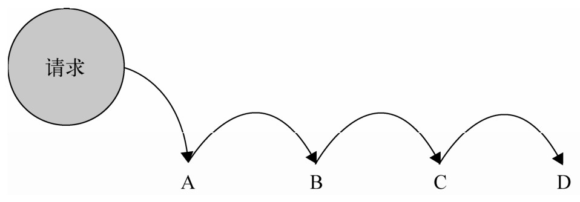

# 第十一章 模版方法模式

在JavaScript中，我们可以通过原型prototype来变相地实现继承。

模版方法模式则是一种基于继承的设计模式。

## 11.1 模版方法模式的定义和组成

模版方法是一种只需使用继承就可以实现的模式。

分两个部分组成：第一部分是抽象父类，第二部分是具体的实现子类。

通常在抽象的父类中封装了子类的算法框架，包括实现一些公共方法以及封装子类中的所有方法的执行顺序。

子类通过继承这个抽象类，也继承了整个算法结构，并且可以选择重写父类的方法。

例如我们有一些平行的子类，各个子类之间有一些相同的行为，也有一些不同的行为。如果相同的和不同的行为都混合在各个子类的实现中，说明这些相同的行为会在各个子类中重复出现。但是实际上，相同的行为可以被搬移到另外一个单一的地方，模版方法模式就是为解决这个问题而生的。在模版方法模式中，子类实现中的相同部分被上移到父类中，而将不同的部分留待子类来实现。这也体现了泛化的思想。

## 11.2 第一个例子——Coffee or Tea

泡咖啡的例子可以用来讲解模版方法

### 11.2.1 先泡一杯咖啡

泡咖啡的步骤如下：

1. 把水煮沸
2. 用沸水冲泡咖啡
3. 把咖啡倒进杯子
4. 加糖和牛奶

下面我们用代码实现：

```javascript
function Coffee() {}

Coffee.prototype.boilWater = function() {
  console.log('把水煮沸')
}

Coffee.prototype.brewCoffeeGriends = function() {
  console.log('用沸水冲泡咖啡')
}

Coffee.prototype.pourInCup = function() {
  console.log('把咖啡倒进杯子里')
}

Coffee.prototype.addSugarAndMilk = function() {
  console.log('加糖和牛奶')
}

Coffee.prototype.init = function() {
  this.boilWater()
  this.brewCoffeeGriends()
  this.pourInCup()
  this.addSugarAndMilk()
}

var coffee = new Coffee()
coffee.init()
```

### 11.2.2 泡一壶茶

接下来，开始准备我们的茶，泡茶的步骤跟泡咖啡的差不多

1. 把水煮沸
2. 用沸水浸泡茶叶
3. 把茶水倒进杯子
4. 加柠檬

```javascript
function Tea() {}

Tea.prototype.boilWater = function() {
  console.log('把水煮沸')
}

Tea.prototype.steepTeaBag = function() {
  console.log('用沸水浸泡茶叶')
}

Tea.prototype.pourInCup = function() {
  console.log('把茶水倒进杯子里')
}

Tea.prototype.addLemon = function() {
  console.log('加柠檬')
}

Tea.prototype.init = function() {
  this.boilWater()
  this.steepTeaBag()
  this.pourInCup()
  this.addLemon()
}

var tea = new Tea()
tea.init()
```

### 11.2.3 分离出共同点

经过比较，我们发现冲咖啡与茶的过程是大同小异的：

| 泡咖啡           | 泡茶             |
| ---------------- | ---------------- |
| 把水煮沸         | 把水煮沸         |
| 用沸水冲泡咖啡   | 用沸水浸泡茶叶   |
| 把咖啡倒进杯子里 | 把茶水倒进杯子里 |
| 加糖和牛奶       | 加柠檬           |

泡咖啡跟泡茶的不同点如下：

* 原料不同。一个是咖啡，一个是茶，我们将其抽象成饮料
* 泡的方式不同，咖啡用冲泡，茶叶是浸泡。我们将其抽象成泡
* 调料不同，咖啡用糖和牛奶，茶用柠檬。我们将其抽象成调料

最后我们总结成如下过程：

* 把水煮沸
* 用沸水泡饮料
* 把饮料倒进杯子
* 加调料

那么，我们将冲泡的方法定义为brew，将加调料的方法定义为addCondiments，将饮料抽象成Beverage类

```JavaScript
        var Beverage = function(){};
        Beverage.prototype.boilWater = function(){
            console.log( ’把水煮沸’ );
        };

        Beverage.prototype.brew = function(){};      // 空方法，应该由子类重写

        Beverage.prototype.pourInCup = function(){};    // 空方法，应该由子类重写

        Beverage.prototype.addCondiments = function(){};    // 空方法，应该由子类重写

        Beverage.prototype.init = function(){
            this.boilWater();
            this.brew();
            this.pourInCup();
            this.addCondiments();
        };
```

### 11.2.4 创建Coffee子类和Tea子类

创建Coffee类，并继承Beverage类

```javascript
        var Coffee = function() {};

        Coffee.prototype = Object.create(Beverage.prototype)
```

接下来重写Coffee类的方法

```javascript
        Coffee.prototype.brew = function() {
          console.log('沸水冲泡咖啡')
        };

        Coffee.prototype.pourInCup = function() {
          console.log('咖啡倒进杯子')
        };
        Coffee.prototype.addCondiments = function() {
          console.log('糖和牛奶');
        };

        var coffee = new Coffee();
        coffee.init();
```

当我们创建coffee对象后，调用coffee的init方法，此时coffee本身没有init方法，于是会顺着原型链，被委托给Coffee类的父类Beverage类的原型上的init方法。

由于Beverage.prototype.init方法中已经规定好了泡饮料的顺序，于是这时成功泡出了咖啡

```javascript
        Beverage.prototype.init = function() {
          this.boilWater();
          this.brew();
          this.pourInCup();
          this.addCondiments();
        };
```

同样的方法我们还可以应用给Tea类，这里就不展开讨论了。

这里的Beverage.prototype.init就是模版方法。

Beverage.prototype.init被称为模版方法的原因是，该方法封装了子类的算法框架，它作为一个算法的框架，指导子类以何种顺序去执行这些方法。在Beverage.prototype.init方法中，算法内的每一步都呈现在我们面前。

## 11.3 抽象类

模版方法是一种严重依赖抽象类的设计模式。

### 11.3.1 抽象类的作用

在java中，类分两种，一种是具体类，另一种是抽象类。具体类可以被实例化，抽象类不能被实例化。

抽象类不能被实例化的原因可以参考“饮料”这个抽象类。饮料只是一个抽象名词，只有当我们真正明确饮料的类型后，才能得到一杯咖啡、茶或者可乐。

由于抽象类不能被实例化，如果有人编写了一个抽象类，那么这个抽象类一定是用来被某些具体类继承的。

抽象类和接口一样可以用于向上转型。在静态类型语言中，编译器对类型的检查总是一个绕不过的话题与困扰。虽然类型检查可以提高程序的安全性，但繁琐而严格的类型检查也时常会让程序员觉得麻烦。把对象的真正类型隐藏在抽象类或者接口之后，这些对象才可以被互相替换使用。这可以让我们的Java程序尽量遵守依赖倒置原则。

除了用于向上转型，抽象类也可以表示一种契约。继承了这个抽象类的所有子类都将拥有跟抽象类一致的接口方法，抽象类的主要作用是为了它的子类定义这些公共接口。如果我们在子类中删掉了这些方法的某一个，那么将不能通过编译器的检查，这在某些场景下是非常有用的。

比如，Beverage类的init方法里规定了冲泡一杯饮料的顺序：

```JavaScript
        this.boilWater();    // 把水煮沸
        this.brew();     // 用水泡原料
        this.pourInCup();    // 把原料倒进杯子
        this.addCondiments();    // 添加调料
```

如果在Coffee子类中没有实现brew方法，那么我们百分百不能获取到一杯咖啡。既然父类规定了子类的方法和执行这些方法的顺序，子类就应该拥有这些方法，并且提供正确实现。

### 11.3.2 抽象方法和具体方法

抽象方法被声明在抽象类中，抽象方法并没有具体的实现过程，是一些“哑”方法。比如Beverage类中的brew方法、pourInCup方法和addCondiments方法，都被声明为抽象方法。当子类继承了这个抽象类时，必须重写父类的抽象方法。

除了抽象方法之外，如果每个子类中都有一些同样的具体实现方法，那这些方法也可以选择放在抽象类中，这可以节省代码以达到复用的效果，这些方法叫作具体方法。当代码需要改变时，我们只需要改动抽象类里的具体方法就可以了。比如饮料中的boilWater方法，假设冲泡所有的饮料之前，都要先把水煮沸，那我们自然可以把boilWater方法放在抽象类Beverage中。

### 11.3.3 用ES6实现Coffee or Tea的例子

```javascript
class Beverage {
  constructor() {
    this.init()
  }
  boilWater() {
    console.log('把水煮沸')
  }
  brew() {}
  pourInCup() {}
  addCondiments() {}
  init() {
    this.boilWater()
    this.brew()
    this.pourInCup()
    this.addCondiments()
  }
}

class Coffee extends Beverage {
  constructor() {
    super()
  }
  brew() {
    console.log('沸水冲泡咖啡')
  }
  pourInCup() {
    console.log('咖啡倒进杯子')
  }
  addCondiments() {
    console.log('加糖和牛奶')
  }
}
const coffee = new Coffee()
class Beverage {
  constructor() {
    this.init()
  }
  boilWater() {
    console.log('把水煮沸')
  }
  brew() {}
  pourInCup() {}
  addCondiments() {}
  init() {
    this.boilWater()
    this.brew()
    this.pourInCup()
    this.addCondiments()
  }
}

class Coffee extends Beverage {
  constructor() {
    super()
  }
  brew() {
    console.log('沸水冲泡咖啡')
  }
  pourInCup() {
    console.log('咖啡倒进杯子')
  }
  addCondiments() {
    console.log('加糖和牛奶')
  }
}
const coffee = new Coffee()

/* 
"把水煮沸"
"沸水冲泡咖啡"
"咖啡倒进杯子"
"加糖和牛奶" 
*/
```

## 11.4 模版方法模式的使用场景

模版方法模式常被架构师用于搭建项目的框架，架构师定好了框架的骨架，程序员继承框架的结构之后，负责往里面填空。

在web开发中也能找到很多模版方法模式的适用场景，比如我们在构建一系列的UI组件，这些组件的构建过程一般如下所示：

* 初始化一个div容器
* 通过ajax请求拉取相应的数据
* 把数据渲染到div容器中，完成组件构造
* 通知用户组件渲染完毕

我们可以看到，任何组件的构建都遵循上面的4步，其中第1步和第4步是相同的。第2步不同的地方只是请求ajax的远程地址，第3步不同的地方是渲染数据的方式。

于是我们可以把4个步骤都抽象到父类的模版方法中，父类中还可以顺便提供第1步和第4步的具体实现，当子类继承这个父类后，就会重写模版方法里面的第2步和第3步。

## 11.5 Hook方法

通过模版方法模式，我们在父类中封装了子类的算法框架。这些算法在正常状态下是适用于大部分子类的，但如果有一些特别个性的子类呢？

比如我们在饮料类中封装了init方法，里面表示子类的冲泡顺序：

1. 把水煮沸
2. 用沸水冲泡咖啡
3. 把饮料倒进杯子
4. 加调料

如果有一些个性的客户不想要加调料呢？有什么方法可以不受这个约束？

钩子（hook）方法可以用来解决这个问题，放置钩子是隔离变化的一种常用手段。我们在父类中容易变化的地方放置钩子，钩子可以有默认的实现，但究竟要不要挂钩，这是由子类决定的。钩子方法的返回结果决定了模版方法后面部分的执行步骤，这也是程序接下来的走向，这样一来程序就有了变化的可能。

下面的例子中，我们把挂钩的名字定为customrWantsCondiments，然后把挂钩放入Beverage类中。

```javascript
class Beverage {
  constructor() {
    this.init()
  }
  boilWater() {
    console.log('把水煮沸')
  }
  brew() {}
  pourInCup() {}
  addCondiments() {}
  customrWantsCondiments() { //父类的钩子方法
    return true
  }
  init() {
    this.boilWater()
    this.brew()
    this.pourInCup()
    if (this.customrWantsCondiments()) { //根据子类的钩子方法来决定顺序
      this.addCondiments()
    }
  }
}
```

下面定义子类的方法

```javascript
class Coffee extends Beverage {
  constructor() {
    super()
  }
  brew() {
    console.log('沸水冲泡咖啡')
  }
  pourInCup() {
    console.log('咖啡倒进杯子')
  }
  customrWantsCondiments() {
    return window.confirm('是否要加调料?') //子类定义钩子(hook)方法
  }
  addCondiments() {
    console.log('加糖和牛奶')
  }
}
const coffee = new Coffee()
```

## 11.6 好莱坞原则

好莱坞原则来源于好莱坞的新演员经常给演艺公司打电话询问面试情况，演艺公司往往这样回答：不要来找我，我会给你打电话。

这种规则被称为好莱坞原则。在这一规则的指导下，我们允许底层组件将自己挂钩到高层组件中，而高层组件会决定什么时候，以何种方式去使用这些底层组件，高层组件对待底层组件的方式，跟演艺公司对待新人演员一样，都是：

别调用我们，我们会调用你。

模版方法模式就是好莱坞原则的典型使用场景，它与好莱坞原则的联系非常明显，当我们用模版方法模式编写一个程序时，就意味着子类放弃了对自己的控制权，而是改为父类通知子类，哪些方法应该在什么时候被调用。作为子类，只负责提供一些设计上的细节。

除此之外，好莱坞原则还应该应用于其他模式和场景，例如发布-订阅模式和回调函数。

* 发布-订阅模式

  发布者将消息推送给订阅者，这取代了原先不断去fetch消息的形式。例如我们乘坐出租车去一个地方，除了每隔一段时间询问司机是否到目的地之外，还可以先跟司机说好（订阅），等到了目的地再喊你（发布），这样你在中间就可以睡一觉了。这就相当于好莱坞原则中的不要调用我，我会调用你。

* 回调函数

  在ajax异步请求中，由于不知道请求返回的具体时间，而通过轮询去判断是否返回数据，这显然是不理智的行为。所以我们通常会把接下来的操作放在回调函数中，传入发起ajax异步请求的函数。当数据返回之后，这个回调函数才被执行，这也是好莱坞原则的一种体现。把需要执行的操作封装在回调函数里，然后把主动权交给另外一个函数。至于回调函数什么时候被执行，则是另外一个函数控制的。

## 11.7 真的需要继承吗？

模版方法是基于继承的一种设计模式，父类封装了子类的算法框架和方法的执行顺序，子类继承父类后，父类通知子类执行这些方法，好莱坞原则很好地诠释了这种设计模式，即高层组件调用底层组件。

模版方法是为数不多的基于继承的类式继承，但JavaScript语言没有真正实现类式继承，而是通过对象和对象之间的委托来实现的。

对于JavaScript来说，不一定需要继承才能完成模版方法模式。

还可以这样：

```javascript
function Beverage(params) {
  function boilWater() {
    console.log('把水煮沸')
  }
  var brew = params.brew || function() {}
  var pourInCup = params.pourInCup || function() {}
  var addCondiments = params.addCondiments || function() {}
  var f = function() {}
  f.prototype.init = function() {
    boilWater()
    brew()
    pourInCup()
    addCondiments()
  }
  return f
}

var Coffee = Beverage({
  brew: function() {
    console.log('沸水冲泡咖啡')
  },
  pourInCup: function() {
    console.log('咖啡倒进杯子')
  },
  addCondiments: function() {
    console.log('加糖和牛奶')
  }
})

const coffee = new Coffee()
coffee.init()
```

在上面的代码中，我们分别将brew、pourIncup、addCondiments传入Beverage中，当Beverage函数调用后返回f函数，这是一个构造器，它能够帮我们继续构造一个原型上具有init函数的对象，也可能实现继承的效果。

## 11.8 小结

模版方法模式是一种典型的通过封装变化提高系统扩展性的设计模式。传统的面向语言中，一个运用了模版方法模式的程序中，子类的方法种类和执行顺序是不变的，所以我们把这部分的逻辑抽象到父类的模版方法里。而子类的方法具体怎么实现是可变的，于是我们把可变的逻辑封装到子类中。通过增加新的子类，我们就可以给系统增加新的功能，并不需要改动抽象父类以及其他子类，这也是符合开放-封闭原则的。

在javascript中，我们很多时候并不需要用传统语言的方式来运用模版方法模式，高阶函数更合适。


# 第十二章 享元模式

享元模式(f yweight)是一种用于性能优化的模式，fy在这里是苍蝇的意思，意为蝇量级。享元模式的核心是运用共享技术来有效支持大量细粒度的对象。

如果系统中因为创建了大量类似的对象而导致内存占用过高，享元模式就非常有用了。在Javascrip中，浏览器特别是移动端的内存并不算多，如何节省内存就成了一件有意义的事情。

## 12.1 初识享元模式

假设有个内衣工厂，目前的产品有50种男式内衣和50种女士内衣，为了推销产品，工厂决定生产一些塑料模特来穿上他们的内衣拍成广告照片。正常情况下需要50个男模特和50个女模特，然后让他们每人分别穿上一件内衣来拍照。

代码如下：

```javascript
class Model {
  constructor(sex, underwear) {
    this.sex = sex
    this.underwear = underwear
  }
  takePhoto() {
    console.log(`sex:${this.sex}-underwear:${this.underwear}`)
  }
}

for (let i = 0; i < 50; i++) {
  const man = new Model('man', i)
  man.takePhoto()
}

for (let i = 0; i < 50; i++) {
  const woman = new Model('woman', i)
  woman.takePhoto()
}
```

可以看到，我们一共会创造100个模特。如果将来要生产10000种内衣，那就需要10000个模特，这显然不合理。

实际上我们只需要1个男模特和1个女模特就可以。现在我们改写一下代码：

我们没必要一开始就让模特穿上工厂的衣服，只需要区分性别就可以了。所以首先改写构造Model的类

```javascript
class Model {
  constructor(sex) {
    this.sex = sex
    this.underwear = null
  }
  takePhoto() {
    console.log(`sex:${this.sex}-underwear:${this.underwear}`)
  }
}
```

现在我们只需要两个模特

```javascript
const man = new Model('man')
const woman = new Model('woman')
```

然后让这两个模特不断的换衣服-拍照…

```javascript
for (let i = 0; i < 50; i++) {
  man.underwear = i
  man.takePhoto()
}

for (let i = 0; i < 50; i++) {
  woman.underwear = i
  woman.takePhoto()
}
```

改进代码后，只需要两个对象就可以完成同样的功能。

## 12.2 内部状态与外部状态

享元模式要求将对象的属性划分为内部属性和外部属性。

享元模式的目标是尽量减少共享对象的数量。

关于如何划分内部和外部属性，下面有几条经验

* 内部状态存储与对象内部
* 内部状态可以被一些对象共享
* 内部状态独立于具体的场景，通常不会改变
* 外部状态取决于场景，随着场景而变化，外部状态不能被共享

所有内部状态相同的对象都可以被指定为同一个共享的对象。而外部状态就从对象身上剥离出来，储存在外部。

只拥有内部状态的对象成为了共享的对象，外部状态在必要时可以被传入共享对象而组装成一个完整的对象。虽然组装对象会占用一点点时间，但是却大大减少了对象的数量。

因此，享元模式也是一种以时间换空间的优化模式。

在工厂试内衣的例子中，性别是内部状态，它可以被共享。

内衣是外部状态，它随着场景的改变而改变，它不能被共享。

通过区分这两种状态大大减少了模特的要求数量。

通常来讲，内部状态有多少种组合，就有多少个对象。因为性别只有男女，所以上面例子中会创建只会两个对象。

使用享元模式的关键在于如何区别内部状态和外部状态。

| 内部状态       | 外部状态           |
| -------------- | ------------------ |
| 可以被对象共享 | 不能被其他对象共享 |
| 一般不会变化   | 会随着场景变化     |

# 第十三章 职责链模式

职责链模式的定义是：使多个对象都有机会处理请求，从而避免请求的发送者和接收者之间的耦合关系，将这些对象连成一条链，并沿着这条链传递该请求，直到有一个对象处理它为止。

我们把这些对象称为链中的节点。



## 13.1 现实中的职责链模式

中学考试时，你遇到不会答的题，就把题目编号写在小纸条上往后传递，坐在后面的同学如果也不会答，他就会把这张纸条传递给他后面的人。这就是职责链。

职责链模式最大的优点是请求发送者只需要知道链中的第一个节点，从而弱化发送者和接收者之间的强联系。

## 13.2 实际开发中的职责链模式

假设我们负责一个售卖手机的电商网站，用户有三种：缴纳500元定金、缴纳200元定金、未缴纳定金。

如果缴纳了500元定金，那么用户必定能得到一个手机以及100元优惠券

如果缴纳了200元定金，那么用户必定得到一个手机以及50元优惠券

如果未缴纳定金，那么用户购买时不一定能买到，且没有优惠券

我们分别用以下字段来表示：

* orderType：定金类型（1为500元定金购买者 2为200元定金购买者 3为普通购买者）
* pay：用户是否已支付定金，值为true或者false。虽然用户下过500元定金，但是一直没付款，那么只能降级为普通购买模式
* stock：表示当前库存数量，已经支付过定金的用户可以不受限制

我们的代码如下：

```javascript
var order = function(orderType, pay, stock) {
  if (orderType === 1) { //500元定金购买模式
    if (pay) {
      console.log('500元定金预购，得到100元优惠券')
    } else {
      if (stock > 0) {
        console.log('普通购买，无优惠券')
      } else {
        console.log('手机库存不足')
      }
    }
  } else if (orderType === 2) { //200元定金购买模式
    if (pay) {
      console.log('200元定金预购，得到50元优惠券')
    } else {
      if (stock > 0) {
        console.log('普通购买，无优惠券')
      } else {
        console.log('手机库存不足')
      }
    }
  } else {
    if (stock > 0) { //普通购买模式
      console.log('普通购买，无优惠券')
    } else {
      console.log('手机库存不足')
    }
  }
}
order(1, true, 500) //"500元定金预购，得到100元优惠券"
```

可以看到由于逻辑混乱，上面的代码非常难读。

## 13.3 用职责链模式重构代码

下面我们重构上面的原始代码，我们首先按照不同的orderType分成不同的函数。

```javascript
var order500 = function(orderType, pay, stock) {
  if (orderType === 1 && pay) {
    console.log('500元定金预购，得到100元优惠券')
  } else {
    order200(orderType, pay, stock) //请求往下传递 order500和order200耦合了
  }
}

var order200 = function(orderType, pay, stock) {
  if (orderType === 2 && pay) { //200元定金购买模式
    console.log('200元定金预购，得到50元优惠券')
  } else {
    order0(orderType, pay, stock) //请求往下传递 order200和order0耦合了
  }
}

var order0 = function(orderType, pay, stock) {
  if (stock > 0) {
    console.log('普通购买，无优惠券')
  } else {
    console.log('手机库存不足')
  }
}

order500(1, true, 500) //"500元定金预购，得到100元优惠券"
order500(2, true, 500) //"200元定金预购，得到50元优惠券"
order500(2, false, 500) //"普通购买，无优惠券"
order500(3, true, 500) //"普通购买，无优惠券"
```

上面的代码中，order500会将请求往下传给order200，order200会传递给order0。

现在我们的代码清晰许多了，但是请求在链条传递中的顺序非常僵硬，传递请求也被耦合在业务函数中。

这是违反开放-封闭原则的，如果有一天我们要增加业务逻辑，那么必须改动这些业务函数的内部。

软件工程中，首先应该解决的是重复，其次是维护性。

我们应当让上面的代码在业务发生巨大变动后尽量少地改动。

## 13.4 灵活可拆分的职责链节点

我们可以看到，当order500和order200都进入else判断时，就会往下传递。那我们只需要改写这段代码。

我们在写逻辑时，内部约定只要不成立，就返回next表示进入下一个函数。

```javascript
var order500 = function(orderType, pay, stock) {
  if (orderType === 1 && pay) {
    console.log('500元定金预购，得到100元优惠券')
  } else {
    return 'next' //不管后面的逻辑，这里就是返回next
  }
}

var order200 = function(orderType, pay, stock) {
  if (orderType === 2 && pay) { //200元定金购买模式
    console.log('200元定金预购，得到50元优惠券')
  } else {
    return 'next'
  }
}

var order0 = function(orderType, pay, stock) {
  if (stock > 0) {
    console.log('普通购买，无优惠券')
  } else {
    console.log('手机库存不足')
  }
}
```

接下来我们需要将函数包装进一些对象中，这些对象中包含当前要处理的函数、下一步要处理什么函数以及处理这些函数的属性。我们的职责链就是通过这些对象来连接的。

```javascript
{
  currentStep:fn,//保存当前步骤的函数
  nextStep:xxx, // 保存下一步步骤的函数 表示下一个xxx节点
  start:fn // 开始处理当前步骤和下一步步骤的函数
}
```

我们采用class构造函数的形式来构造这些对象

```javascript
class Step {
  constructor(fn) {
    this.currentStep = fn
    this.nextStep = null
  }
  setNextStep(step) {
    this.nextStep = step
  }
  start(...rest) {
    const result = this.currentStep.call(this, ...rest)
    if (result === 'next') {
      return this.nextStep && this.nextStep.start.call(this.nextStep, ...rest)
    }
    return result
  }
}
```

然后使用这个构造函数来构造步骤,并且给每个对象都设置下一步需要做什么的函数

```javascript
const step1 = new Step(order500)
const step2 = new Step(order200)
const step3 = new Step(order0)
//设置下一步需要做什么
step1.setNextStep(step2) 
step2.setNextStep(step3)
```

最后通过start来启动步骤

```javascript
step1.start(3, false, 0) //"手机库存不足"
step1.start(3, false, 30) //"普通购买，无优惠券"
```

上面的代码逻辑已经非常清晰了，我们分别使用Step构造函数来构造step对象，然后调用step对象内部的setNextStep来让他们互相连接起来，最后只需要通过第一步的start函数就可以运行整个步骤。

通过改进，我们就可以非常灵活地增加、移除、修改链中的顺序。

## 13.5 异步的职责链

我们让每个节点函数同步返回一个特定的next，来表示将请求传递给下一个节点。在实际开发中，我们可能会遇到异步的问题，可能需要在节点函数中发起一个ajax异步请求，异步请求返回的结果来决定是否要继续在职责链中，这样的话return一个特定的字符串就没有意义了。

有没有可能让整个过程更加优雅呢？

比如类似于koa，通过调用next来实现“跳转”的效果。

我们可以封装一个step.prototype.next函数，然后交由currentStep中保存的逻辑函数来自行调用。

```javascript
class Step {
  constructor(fn) {
    this.currentStep = fn
    this.nextStep = null
  }
  setNextStep(step) {
    this.nextStep = step
  }
  //这里是封装的next
  next(...rest) {
    return this.nextStep && this.nextStep.start.call(this.nextStep, ...rest)
  }
  start(...rest) {
    const result = this.currentStep.call(this, ...rest)
    return result
  }
}
```

逻辑函数则可以通过`this.next`来自行调用

```javascript
var order500 = function(orderType, pay, stock) {
  if (orderType === 1 && pay) {
    console.log('500元定金预购，得到100元优惠券')
  } else {
    this.next(orderType, pay, stock) //通过this来调用
  }
}

var order200 = function(orderType, pay, stock) {
  const self = this
  if (orderType === 2 && pay) { //200元定金购买模式
    console.log('200元定金预购，得到50元优惠券')
  } else {
    setTimeout(function() {
      self.next(orderType, pay, stock) //setTimeout中的this变成了window，所以需要改写
    })
  }
}

var order0 = function(orderType, pay, stock) {
  if (stock > 0) {
    console.log('普通购买，无优惠券')
  } else {
    console.log('手机库存不足')
  }
}
```

现在我们得到了一个特殊的链条，请求在链中的节点里传递，节点有权利决定什么时候把请求给下一个节点。

上面的代码还可以再优化，我们发现this的指向需要交由写逻辑函数的人特意指定，

```javascript
self.next(orderType, pay, stock) //setTimeout中的this变成了window，所以需要改写
```

如果写逻辑函数的人不知道你对于Step类做的细节，那么很有可能就出错了，实际上我们可以将next函数通过参数的形式传递给逻辑函数。

```javascript
class Step {
  constructor(fn) {
    this.currentStep = fn
    this.nextStep = null
  }
  setNextStep(step) {
    this.nextStep = step
  }
  next(...rest) {
    const next = this.nextStep.next.bind(this.nextStep)
    return this.nextStep && this.nextStep.start.apply(this.nextStep, [...rest, next])//这里直接传递给下一个节点的函数
  }
  start(...rest) {
    const next = this.next.bind(this)
    const result = this.currentStep.apply(this, [...rest, next])//这里传递给当前要调用的函数
    return result
  }
}
```

现在就可以通过参数取出next了。

```javascript
var order500 = function(orderType, pay, stock, next) {
  if (orderType === 1 && pay) {
    console.log('500元定金预购，得到100元优惠券')
  } else {
    next(orderType, pay, stock)
  }
}

var order200 = function(orderType, pay, stock, next) {
  const self = this
  if (orderType === 2 && pay) { //200元定金购买模式
    console.log('200元定金预购，得到50元优惠券')
  } else {
    next(orderType, pay, stock)
  }
}

var order0 = function(orderType, pay, stock, next) {
  if (stock > 0) {
    console.log('普通购买，无优惠券')
  } else {
    console.log('手机库存不足')
  }
}
```


## 13.7 用AOP实现职责链

使用AOP的方式比class方式更加方便直观，假设我们依然约定每个函数的等式不成立时，返回一个next

```javascript
var order500 = function(orderType, pay, stock) {
  if (orderType === 1 && pay) {
    console.log('500元定金预购，得到100元优惠券')
  } else {
    return 'next'
  }
}

var order200 = function(orderType, pay, stock) {
  if (orderType === 2 && pay) { //200元定金购买模式
    console.log('200元定金预购，得到50元优惠券')
  } else {
    return 'next'
  }
}

var order0 = function(orderType, pay, stock) {
  if (stock > 0) {
    console.log('普通购买，无优惠券')
  } else {
    console.log('手机库存不足')
  }
}
```

然后我们用一个after函数来实现切面，当函数返回next时，就会进入下一个函数

```javascript
Function.prototype.after = function(fn) {
  const self = this
  return function(...rest) {
    const result = self.apply(this, rest)
    if (result === 'next') {
      return fn.apply(this, rest)
    }
    return result
  }
}

const order = order500.after(order200).after(order0)
order(3, false, 500)//"普通购买，无优惠券"
order(2, true, 500)//"200元定金预购，得到50元优惠券"

```

用AOP来实现职责链既简单又巧妙。

## 13.9 小结

职责链模式可以很好地帮助我们管理代码，降低发起请求的对象和处理请求的对象之间的耦合性。职责链中的节点数量和顺序是可以自由变化的，我们可以在运行时决定链中包含哪些节点。

无论是作用域链、原型链、还是DOM节点的事件冒泡，我们都能从中找到职责链模式的影子。职责链模式还可以和组合模式结合在一起，用来连接部件和父部件，或是提高组合对象的效率。
