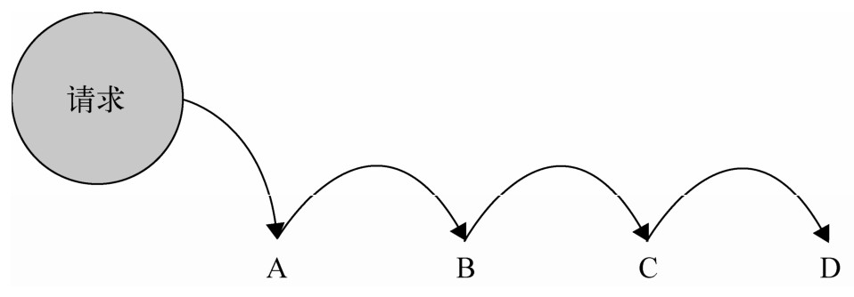
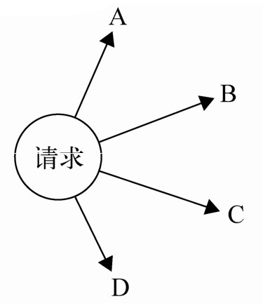
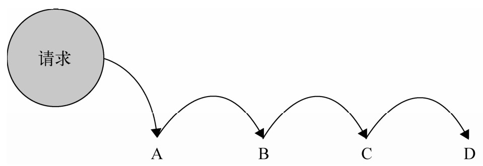
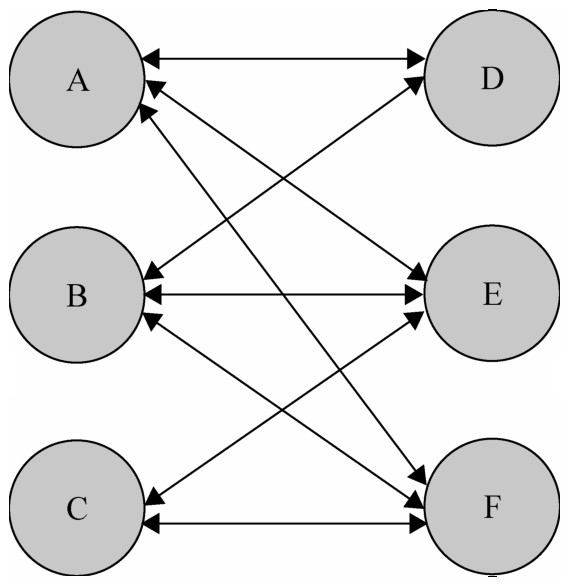
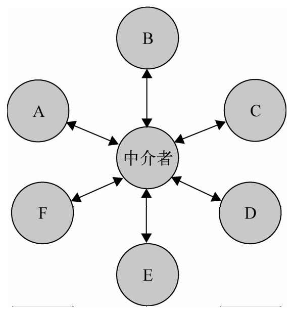
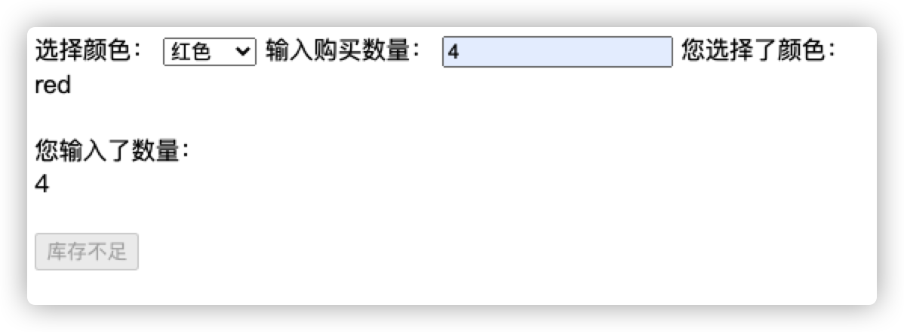
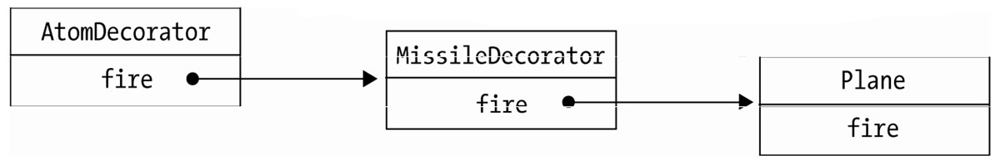
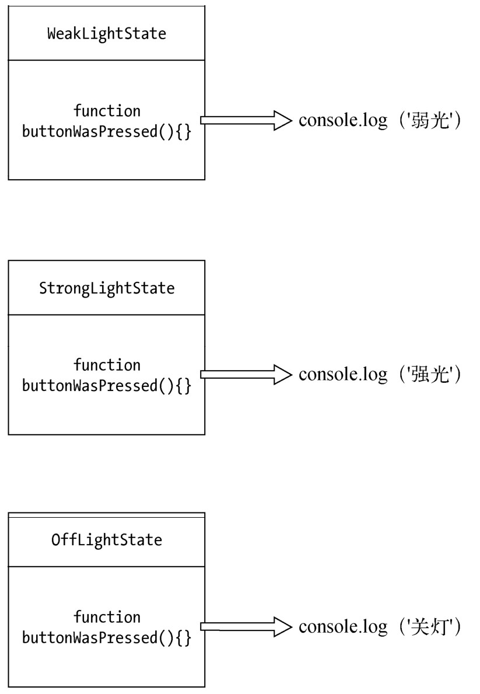
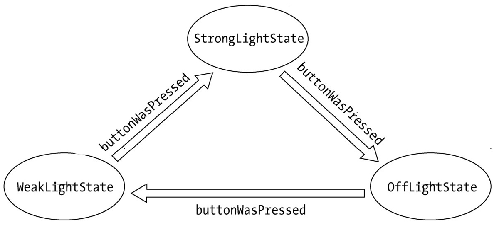
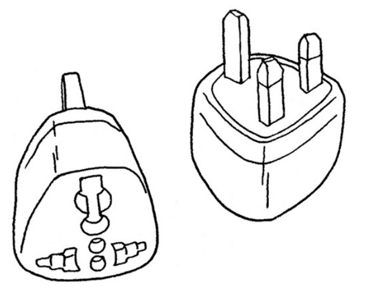

# 第十一章 模版方法模式

在JavaScript中，我们可以通过原型prototype来变相地实现继承。

模版方法模式则是一种基于继承的设计模式。

## 11.1 模版方法模式的定义和组成

模版方法是一种只需使用继承就可以实现的模式。

分两个部分组成：第一部分是抽象父类，第二部分是具体的实现子类。

通常在抽象的父类中封装了子类的算法框架，包括实现一些公共方法以及封装子类中的所有方法的执行顺序。

子类通过继承这个抽象类，也继承了整个算法结构，并且可以选择重写父类的方法。

例如我们有一些平行的子类，各个子类之间有一些相同的行为，也有一些不同的行为。如果相同的和不同的行为都混合在各个子类的实现中，说明这些相同的行为会在各个子类中重复出现。但是实际上，相同的行为可以被搬移到另外一个单一的地方，模版方法模式就是为解决这个问题而生的。在模版方法模式中，子类实现中的相同部分被上移到父类中，而将不同的部分留待子类来实现。这也体现了泛化的思想。

## 11.2 第一个例子——Coffee or Tea

泡咖啡的例子可以用来讲解模版方法

### 11.2.1 先泡一杯咖啡

泡咖啡的步骤如下：

1. 把水煮沸
2. 用沸水冲泡咖啡
3. 把咖啡倒进杯子
4. 加糖和牛奶

下面我们用代码实现：

```javascript
function Coffee() {}

Coffee.prototype.boilWater = function() {
  console.log('把水煮沸')
}

Coffee.prototype.brewCoffeeGriends = function() {
  console.log('用沸水冲泡咖啡')
}

Coffee.prototype.pourInCup = function() {
  console.log('把咖啡倒进杯子里')
}

Coffee.prototype.addSugarAndMilk = function() {
  console.log('加糖和牛奶')
}

Coffee.prototype.init = function() {
  this.boilWater()
  this.brewCoffeeGriends()
  this.pourInCup()
  this.addSugarAndMilk()
}

var coffee = new Coffee()
coffee.init()
```

### 11.2.2 泡一壶茶

接下来，开始准备我们的茶，泡茶的步骤跟泡咖啡的差不多

1. 把水煮沸
2. 用沸水浸泡茶叶
3. 把茶水倒进杯子
4. 加柠檬

```javascript
function Tea() {}

Tea.prototype.boilWater = function() {
  console.log('把水煮沸')
}

Tea.prototype.steepTeaBag = function() {
  console.log('用沸水浸泡茶叶')
}

Tea.prototype.pourInCup = function() {
  console.log('把茶水倒进杯子里')
}

Tea.prototype.addLemon = function() {
  console.log('加柠檬')
}

Tea.prototype.init = function() {
  this.boilWater()
  this.steepTeaBag()
  this.pourInCup()
  this.addLemon()
}

var tea = new Tea()
tea.init()
```

### 11.2.3 分离出共同点

经过比较，我们发现冲咖啡与茶的过程是大同小异的：

| 泡咖啡           | 泡茶             |
| ---------------- | ---------------- |
| 把水煮沸         | 把水煮沸         |
| 用沸水冲泡咖啡   | 用沸水浸泡茶叶   |
| 把咖啡倒进杯子里 | 把茶水倒进杯子里 |
| 加糖和牛奶       | 加柠檬           |

泡咖啡跟泡茶的不同点如下：

* 原料不同。一个是咖啡，一个是茶，我们将其抽象成饮料
* 泡的方式不同，咖啡用冲泡，茶叶是浸泡。我们将其抽象成泡
* 调料不同，咖啡用糖和牛奶，茶用柠檬。我们将其抽象成调料

最后我们总结成如下过程：

* 把水煮沸
* 用沸水泡饮料
* 把饮料倒进杯子
* 加调料

那么，我们将冲泡的方法定义为brew，将加调料的方法定义为addCondiments，将饮料抽象成Beverage类

```JavaScript
        var Beverage = function(){};
        Beverage.prototype.boilWater = function(){
            console.log( ’把水煮沸’ );
        };

        Beverage.prototype.brew = function(){};      // 空方法，应该由子类重写

        Beverage.prototype.pourInCup = function(){};    // 空方法，应该由子类重写

        Beverage.prototype.addCondiments = function(){};    // 空方法，应该由子类重写

        Beverage.prototype.init = function(){
            this.boilWater();
            this.brew();
            this.pourInCup();
            this.addCondiments();
        };
```

### 11.2.4 创建Coffee子类和Tea子类

创建Coffee类，并继承Beverage类

```javascript
        var Coffee = function() {};

        Coffee.prototype = Object.create(Beverage.prototype)
```

接下来重写Coffee类的方法

```javascript
        Coffee.prototype.brew = function() {
          console.log('沸水冲泡咖啡')
        };

        Coffee.prototype.pourInCup = function() {
          console.log('咖啡倒进杯子')
        };
        Coffee.prototype.addCondiments = function() {
          console.log('糖和牛奶');
        };

        var coffee = new Coffee();
        coffee.init();
```

当我们创建coffee对象后，调用coffee的init方法，此时coffee本身没有init方法，于是会顺着原型链，被委托给Coffee类的父类Beverage类的原型上的init方法。

由于Beverage.prototype.init方法中已经规定好了泡饮料的顺序，于是这时成功泡出了咖啡

```javascript
        Beverage.prototype.init = function() {
          this.boilWater();
          this.brew();
          this.pourInCup();
          this.addCondiments();
        };
```

同样的方法我们还可以应用给Tea类，这里就不展开讨论了。

这里的Beverage.prototype.init就是模版方法。

Beverage.prototype.init被称为模版方法的原因是，该方法封装了子类的算法框架，它作为一个算法的框架，指导子类以何种顺序去执行这些方法。在Beverage.prototype.init方法中，算法内的每一步都呈现在我们面前。

## 11.3 抽象类

模版方法是一种严重依赖抽象类的设计模式。

### 11.3.1 抽象类的作用

在java中，类分两种，一种是具体类，另一种是抽象类。具体类可以被实例化，抽象类不能被实例化。

抽象类不能被实例化的原因可以参考“饮料”这个抽象类。饮料只是一个抽象名词，只有当我们真正明确饮料的类型后，才能得到一杯咖啡、茶或者可乐。

由于抽象类不能被实例化，如果有人编写了一个抽象类，那么这个抽象类一定是用来被某些具体类继承的。

抽象类和接口一样可以用于向上转型。在静态类型语言中，编译器对类型的检查总是一个绕不过的话题与困扰。虽然类型检查可以提高程序的安全性，但繁琐而严格的类型检查也时常会让程序员觉得麻烦。把对象的真正类型隐藏在抽象类或者接口之后，这些对象才可以被互相替换使用。这可以让我们的Java程序尽量遵守依赖倒置原则。

除了用于向上转型，抽象类也可以表示一种契约。继承了这个抽象类的所有子类都将拥有跟抽象类一致的接口方法，抽象类的主要作用是为了它的子类定义这些公共接口。如果我们在子类中删掉了这些方法的某一个，那么将不能通过编译器的检查，这在某些场景下是非常有用的。

比如，Beverage类的init方法里规定了冲泡一杯饮料的顺序：

```JavaScript
        this.boilWater();    // 把水煮沸
        this.brew();     // 用水泡原料
        this.pourInCup();    // 把原料倒进杯子
        this.addCondiments();    // 添加调料
```

如果在Coffee子类中没有实现brew方法，那么我们百分百不能获取到一杯咖啡。既然父类规定了子类的方法和执行这些方法的顺序，子类就应该拥有这些方法，并且提供正确实现。

### 11.3.2 抽象方法和具体方法

抽象方法被声明在抽象类中，抽象方法并没有具体的实现过程，是一些“哑”方法。比如Beverage类中的brew方法、pourInCup方法和addCondiments方法，都被声明为抽象方法。当子类继承了这个抽象类时，必须重写父类的抽象方法。

除了抽象方法之外，如果每个子类中都有一些同样的具体实现方法，那这些方法也可以选择放在抽象类中，这可以节省代码以达到复用的效果，这些方法叫作具体方法。当代码需要改变时，我们只需要改动抽象类里的具体方法就可以了。比如饮料中的boilWater方法，假设冲泡所有的饮料之前，都要先把水煮沸，那我们自然可以把boilWater方法放在抽象类Beverage中。

### 11.3.3 用ES6实现Coffee or Tea的例子

```javascript
class Beverage {
  constructor() {
    this.init()
  }
  boilWater() {
    console.log('把水煮沸')
  }
  brew() {}
  pourInCup() {}
  addCondiments() {}
  init() {
    this.boilWater()
    this.brew()
    this.pourInCup()
    this.addCondiments()
  }
}

class Coffee extends Beverage {
  constructor() {
    super()
  }
  brew() {
    console.log('沸水冲泡咖啡')
  }
  pourInCup() {
    console.log('咖啡倒进杯子')
  }
  addCondiments() {
    console.log('加糖和牛奶')
  }
}
const coffee = new Coffee()
class Beverage {
  constructor() {
    this.init()
  }
  boilWater() {
    console.log('把水煮沸')
  }
  brew() {}
  pourInCup() {}
  addCondiments() {}
  init() {
    this.boilWater()
    this.brew()
    this.pourInCup()
    this.addCondiments()
  }
}

class Coffee extends Beverage {
  constructor() {
    super()
  }
  brew() {
    console.log('沸水冲泡咖啡')
  }
  pourInCup() {
    console.log('咖啡倒进杯子')
  }
  addCondiments() {
    console.log('加糖和牛奶')
  }
}
const coffee = new Coffee()

/* 
"把水煮沸"
"沸水冲泡咖啡"
"咖啡倒进杯子"
"加糖和牛奶" 
*/
```

## 11.4 模版方法模式的使用场景

模版方法模式常被架构师用于搭建项目的框架，架构师定好了框架的骨架，程序员继承框架的结构之后，负责往里面填空。

在web开发中也能找到很多模版方法模式的适用场景，比如我们在构建一系列的UI组件，这些组件的构建过程一般如下所示：

* 初始化一个div容器
* 通过ajax请求拉取相应的数据
* 把数据渲染到div容器中，完成组件构造
* 通知用户组件渲染完毕

我们可以看到，任何组件的构建都遵循上面的4步，其中第1步和第4步是相同的。第2步不同的地方只是请求ajax的远程地址，第3步不同的地方是渲染数据的方式。

于是我们可以把4个步骤都抽象到父类的模版方法中，父类中还可以顺便提供第1步和第4步的具体实现，当子类继承这个父类后，就会重写模版方法里面的第2步和第3步。

## 11.5 Hook方法

通过模版方法模式，我们在父类中封装了子类的算法框架。这些算法在正常状态下是适用于大部分子类的，但如果有一些特别个性的子类呢？

比如我们在饮料类中封装了init方法，里面表示子类的冲泡顺序：

1. 把水煮沸
2. 用沸水冲泡咖啡
3. 把饮料倒进杯子
4. 加调料

如果有一些个性的客户不想要加调料呢？有什么方法可以不受这个约束？

钩子（hook）方法可以用来解决这个问题，放置钩子是隔离变化的一种常用手段。我们在父类中容易变化的地方放置钩子，钩子可以有默认的实现，但究竟要不要挂钩，这是由子类决定的。钩子方法的返回结果决定了模版方法后面部分的执行步骤，这也是程序接下来的走向，这样一来程序就有了变化的可能。

下面的例子中，我们把挂钩的名字定为customrWantsCondiments，然后把挂钩放入Beverage类中。

```javascript
class Beverage {
  constructor() {
    this.init()
  }
  boilWater() {
    console.log('把水煮沸')
  }
  brew() {}
  pourInCup() {}
  addCondiments() {}
  customrWantsCondiments() { //父类的钩子方法
    return true
  }
  init() {
    this.boilWater()
    this.brew()
    this.pourInCup()
    if (this.customrWantsCondiments()) { //根据子类的钩子方法来决定顺序
      this.addCondiments()
    }
  }
}
```

下面定义子类的方法

```javascript
class Coffee extends Beverage {
  constructor() {
    super()
  }
  brew() {
    console.log('沸水冲泡咖啡')
  }
  pourInCup() {
    console.log('咖啡倒进杯子')
  }
  customrWantsCondiments() {
    return window.confirm('是否要加调料?') //子类定义钩子(hook)方法
  }
  addCondiments() {
    console.log('加糖和牛奶')
  }
}
const coffee = new Coffee()
```

## 11.6 好莱坞原则

好莱坞原则来源于好莱坞的新演员经常给演艺公司打电话询问面试情况，演艺公司往往这样回答：不要来找我，我会给你打电话。

这种规则被称为好莱坞原则。在这一规则的指导下，我们允许底层组件将自己挂钩到高层组件中，而高层组件会决定什么时候，以何种方式去使用这些底层组件，高层组件对待底层组件的方式，跟演艺公司对待新人演员一样，都是：

别调用我们，我们会调用你。

模版方法模式就是好莱坞原则的典型使用场景，它与好莱坞原则的联系非常明显，当我们用模版方法模式编写一个程序时，就意味着子类放弃了对自己的控制权，而是改为父类通知子类，哪些方法应该在什么时候被调用。作为子类，只负责提供一些设计上的细节。

除此之外，好莱坞原则还应该应用于其他模式和场景，例如发布-订阅模式和回调函数。

* 发布-订阅模式

  发布者将消息推送给订阅者，这取代了原先不断去fetch消息的形式。例如我们乘坐出租车去一个地方，除了每隔一段时间询问司机是否到目的地之外，还可以先跟司机说好（订阅），等到了目的地再喊你（发布），这样你在中间就可以睡一觉了。这就相当于好莱坞原则中的不要调用我，我会调用你。

* 回调函数

  在ajax异步请求中，由于不知道请求返回的具体时间，而通过轮询去判断是否返回数据，这显然是不理智的行为。所以我们通常会把接下来的操作放在回调函数中，传入发起ajax异步请求的函数。当数据返回之后，这个回调函数才被执行，这也是好莱坞原则的一种体现。把需要执行的操作封装在回调函数里，然后把主动权交给另外一个函数。至于回调函数什么时候被执行，则是另外一个函数控制的。

## 11.7 真的需要继承吗？

模版方法是基于继承的一种设计模式，父类封装了子类的算法框架和方法的执行顺序，子类继承父类后，父类通知子类执行这些方法，好莱坞原则很好地诠释了这种设计模式，即高层组件调用底层组件。

模版方法是为数不多的基于继承的类式继承，但JavaScript语言没有真正实现类式继承，而是通过对象和对象之间的委托来实现的。

对于JavaScript来说，不一定需要继承才能完成模版方法模式。

还可以这样：

```javascript
function Beverage(params) {
  function boilWater() {
    console.log('把水煮沸')
  }
  var brew = params.brew || function() {}
  var pourInCup = params.pourInCup || function() {}
  var addCondiments = params.addCondiments || function() {}
  var f = function() {}
  f.prototype.init = function() {
    boilWater()
    brew()
    pourInCup()
    addCondiments()
  }
  return f
}

var Coffee = Beverage({
  brew: function() {
    console.log('沸水冲泡咖啡')
  },
  pourInCup: function() {
    console.log('咖啡倒进杯子')
  },
  addCondiments: function() {
    console.log('加糖和牛奶')
  }
})

const coffee = new Coffee()
coffee.init()
```

在上面的代码中，我们分别将brew、pourIncup、addCondiments传入Beverage中，当Beverage函数调用后返回f函数，这是一个构造器，它能够帮我们继续构造一个原型上具有init函数的对象，也可能实现继承的效果。

## 11.8 小结

模版方法模式是一种典型的通过封装变化提高系统扩展性的设计模式。传统的面向语言中，一个运用了模版方法模式的程序中，子类的方法种类和执行顺序是不变的，所以我们把这部分的逻辑抽象到父类的模版方法里。而子类的方法具体怎么实现是可变的，于是我们把可变的逻辑封装到子类中。通过增加新的子类，我们就可以给系统增加新的功能，并不需要改动抽象父类以及其他子类，这也是符合开放-封闭原则的。

在javascript中，我们很多时候并不需要用传统语言的方式来运用模版方法模式，高阶函数更合适。


# 第十二章 享元模式

享元模式(f yweight)是一种用于性能优化的模式，fy在这里是苍蝇的意思，意为蝇量级。享元模式的核心是运用共享技术来有效支持大量细粒度的对象。

如果系统中因为创建了大量类似的对象而导致内存占用过高，享元模式就非常有用了。在Javascrip中，浏览器特别是移动端的内存并不算多，如何节省内存就成了一件有意义的事情。

## 12.1 初识享元模式

假设有个内衣工厂，目前的产品有50种男式内衣和50种女士内衣，为了推销产品，工厂决定生产一些塑料模特来穿上他们的内衣拍成广告照片。正常情况下需要50个男模特和50个女模特，然后让他们每人分别穿上一件内衣来拍照。

代码如下：

```javascript
class Model {
  constructor(sex, underwear) {
    this.sex = sex
    this.underwear = underwear
  }
  takePhoto() {
    console.log(`sex:${this.sex}-underwear:${this.underwear}`)
  }
}

for (let i = 0; i < 50; i++) {
  const man = new Model('man', i)
  man.takePhoto()
}

for (let i = 0; i < 50; i++) {
  const woman = new Model('woman', i)
  woman.takePhoto()
}
```

可以看到，我们一共会创造100个模特。如果将来要生产10000种内衣，那就需要10000个模特，这显然不合理。

实际上我们只需要1个男模特和1个女模特就可以。现在我们改写一下代码：

我们没必要一开始就让模特穿上工厂的衣服，只需要区分性别就可以了。所以首先改写构造Model的类

```javascript
class Model {
  constructor(sex) {
    this.sex = sex
    this.underwear = null
  }
  takePhoto() {
    console.log(`sex:${this.sex}-underwear:${this.underwear}`)
  }
}
```

现在我们只需要两个模特

```javascript
const man = new Model('man')
const woman = new Model('woman')
```

然后让这两个模特不断的换衣服-拍照…

```javascript
for (let i = 0; i < 50; i++) {
  man.underwear = i
  man.takePhoto()
}

for (let i = 0; i < 50; i++) {
  woman.underwear = i
  woman.takePhoto()
}
```

改进代码后，只需要两个对象就可以完成同样的功能。

## 12.2 内部状态与外部状态

享元模式要求将对象的属性划分为内部属性和外部属性。

享元模式的目标是尽量减少共享对象的数量。

关于如何划分内部和外部属性，下面有几条经验

* 内部状态存储与对象内部
* 内部状态可以被一些对象共享
* 内部状态独立于具体的场景，通常不会改变
* 外部状态取决于场景，随着场景而变化，外部状态不能被共享

所有内部状态相同的对象都可以被指定为同一个共享的对象。而外部状态就从对象身上剥离出来，储存在外部。

只拥有内部状态的对象成为了共享的对象，外部状态在必要时可以被传入共享对象而组装成一个完整的对象。虽然组装对象会占用一点点时间，但是却大大减少了对象的数量。

因此，享元模式也是一种以时间换空间的优化模式。

在工厂试内衣的例子中，性别是内部状态，它可以被共享。

内衣是外部状态，它随着场景的改变而改变，它不能被共享。

通过区分这两种状态大大减少了模特的要求数量。

通常来讲，内部状态有多少种组合，就有多少个对象。因为性别只有男女，所以上面例子中会创建只会两个对象。

使用享元模式的关键在于如何区别内部状态和外部状态。

| 内部状态       | 外部状态           |
| -------------- | ------------------ |
| 可以被对象共享 | 不能被其他对象共享 |
| 一般不会变化   | 会随着场景变化     |

# 第十三章 职责链模式

职责链模式的定义是：使多个对象都有机会处理请求，从而避免请求的发送者和接收者之间的耦合关系，将这些对象连成一条链，并沿着这条链传递该请求，直到有一个对象处理它为止。

我们把这些对象称为链中的节点。



## 13.1 现实中的职责链模式

中学考试时，你遇到不会答的题，就把题目编号写在小纸条上往后传递，坐在后面的同学如果也不会答，他就会把这张纸条传递给他后面的人。这就是职责链。

职责链模式最大的优点是请求发送者只需要知道链中的第一个节点，从而弱化发送者和接收者之间的强联系。

## 13.2 实际开发中的职责链模式

假设我们负责一个售卖手机的电商网站，用户有三种：缴纳500元定金、缴纳200元定金、未缴纳定金。

如果缴纳了500元定金，那么用户必定能得到一个手机以及100元优惠券

如果缴纳了200元定金，那么用户必定得到一个手机以及50元优惠券

如果未缴纳定金，那么用户购买时不一定能买到，且没有优惠券

我们分别用以下字段来表示：

* orderType：定金类型（1为500元定金购买者 2为200元定金购买者 3为普通购买者）
* pay：用户是否已支付定金，值为true或者false。虽然用户下过500元定金，但是一直没付款，那么只能降级为普通购买模式
* stock：表示当前库存数量，已经支付过定金的用户可以不受限制

我们的代码如下：

```javascript
var order = function(orderType, pay, stock) {
  if (orderType === 1) { //500元定金购买模式
    if (pay) {
      console.log('500元定金预购，得到100元优惠券')
    } else {
      if (stock > 0) {
        console.log('普通购买，无优惠券')
      } else {
        console.log('手机库存不足')
      }
    }
  } else if (orderType === 2) { //200元定金购买模式
    if (pay) {
      console.log('200元定金预购，得到50元优惠券')
    } else {
      if (stock > 0) {
        console.log('普通购买，无优惠券')
      } else {
        console.log('手机库存不足')
      }
    }
  } else {
    if (stock > 0) { //普通购买模式
      console.log('普通购买，无优惠券')
    } else {
      console.log('手机库存不足')
    }
  }
}
order(1, true, 500) //"500元定金预购，得到100元优惠券"
```

可以看到由于逻辑混乱，上面的代码非常难读。

## 13.3 用职责链模式重构代码

下面我们重构上面的原始代码，我们首先按照不同的orderType分成不同的函数。

```javascript
var order500 = function(orderType, pay, stock) {
  if (orderType === 1 && pay) {
    console.log('500元定金预购，得到100元优惠券')
  } else {
    order200(orderType, pay, stock) //请求往下传递 order500和order200耦合了
  }
}

var order200 = function(orderType, pay, stock) {
  if (orderType === 2 && pay) { //200元定金购买模式
    console.log('200元定金预购，得到50元优惠券')
  } else {
    order0(orderType, pay, stock) //请求往下传递 order200和order0耦合了
  }
}

var order0 = function(orderType, pay, stock) {
  if (stock > 0) {
    console.log('普通购买，无优惠券')
  } else {
    console.log('手机库存不足')
  }
}

order500(1, true, 500) //"500元定金预购，得到100元优惠券"
order500(2, true, 500) //"200元定金预购，得到50元优惠券"
order500(2, false, 500) //"普通购买，无优惠券"
order500(3, true, 500) //"普通购买，无优惠券"
```

上面的代码中，order500会将请求往下传给order200，order200会传递给order0。

现在我们的代码清晰许多了，但是请求在链条传递中的顺序非常僵硬，传递请求也被耦合在业务函数中。

这是违反开放-封闭原则的，如果有一天我们要增加业务逻辑，那么必须改动这些业务函数的内部。

软件工程中，首先应该解决的是重复，其次是维护性。

我们应当让上面的代码在业务发生巨大变动后尽量少地改动。

## 13.4 灵活可拆分的职责链节点

我们可以看到，当order500和order200都进入else判断时，就会往下传递。那我们只需要改写这段代码。

我们在写逻辑时，内部约定只要不成立，就返回next表示进入下一个函数。

```javascript
var order500 = function(orderType, pay, stock) {
  if (orderType === 1 && pay) {
    console.log('500元定金预购，得到100元优惠券')
  } else {
    return 'next' //不管后面的逻辑，这里就是返回next
  }
}

var order200 = function(orderType, pay, stock) {
  if (orderType === 2 && pay) { //200元定金购买模式
    console.log('200元定金预购，得到50元优惠券')
  } else {
    return 'next'
  }
}

var order0 = function(orderType, pay, stock) {
  if (stock > 0) {
    console.log('普通购买，无优惠券')
  } else {
    console.log('手机库存不足')
  }
}
```

接下来我们需要将函数包装进一些对象中，这些对象中包含当前要处理的函数、下一步要处理什么函数以及处理这些函数的属性。我们的职责链就是通过这些对象来连接的。

```javascript
{
  currentExecute:fn,//保存当前步骤的函数
  nextStep:xxx, // 保存下一步步骤的函数 表示下一个xxx节点
  start:fn // 开始处理当前步骤和下一步步骤的函数
}
```

我们采用class构造函数的形式来构造这些对象

```javascript
class Step {
  constructor(fn) {
    this.currentExecute = fn
    this.nextStep = null
  }
  setNextStep(step) {
    return this.nextStep = step
  }
  start(...rest) {
    const result = this.currentExecute.call(this, ...rest)
    if (result === 'next') {
      return this.nextStep && this.nextStep.start.call(this.nextStep, ...rest)
    }
    return result
  }
}
```

然后使用这个构造函数来构造步骤,并且给每个对象都设置下一步需要做什么的函数

```javascript
const step1 = new Step(order500)
const step2 = new Step(order200)
const step3 = new Step(order0)
//设置下一步需要做什么
step1.setNextStep(step2).setNextStep(step3) 
```

最后通过start来启动步骤

```javascript
step1.start(3, false, 0) //"手机库存不足"
step1.start(3, false, 30) //"普通购买，无优惠券"
```

上面的代码逻辑已经非常清晰了，我们分别使用Step构造函数来构造step对象，然后调用step对象内部的setNextStep来让他们互相连接起来，最后只需要通过第一步的start函数就可以运行整个步骤。

通过改进，我们就可以非常灵活地增加、移除、修改链中的顺序。

## 13.5 异步的职责链

我们让每个节点函数同步返回一个特定的next，来表示将请求传递给下一个节点。在实际开发中，我们可能会遇到异步的问题，可能需要在节点函数中发起一个ajax异步请求，异步请求返回的结果来决定是否要继续在职责链中，这样的话return一个特定的字符串就没有意义了。

有没有可能让整个过程更加优雅呢？

比如类似于koa，通过调用next来实现“跳转”的效果。

我们可以封装一个step.prototype.next函数，然后交由currentExecute中保存的逻辑函数来自行调用。

```javascript
class Step {
  constructor(fn) {
    this.currentExecute = fn
    this.nextStep = null
  }
  setNextStep(step) {
    return this.nextStep = step
  }
  //这里是封装的next
  next(...rest) {
    return this.nextStep && this.nextStep.start.call(this.nextStep, ...rest)
  }
  start(...rest) {
    const result = this.currentExecute.call(this, ...rest)
    return result
  }
}
```

逻辑函数则可以通过`this.next`来自行调用

```javascript
var order500 = function(orderType, pay, stock) {
  if (orderType === 1 && pay) {
    console.log('500元定金预购，得到100元优惠券')
  } else {
    this.next(orderType, pay, stock) //通过this来调用
  }
}

var order200 = function(orderType, pay, stock) {
  const self = this
  if (orderType === 2 && pay) { //200元定金购买模式
    console.log('200元定金预购，得到50元优惠券')
  } else {
    setTimeout(function() {
      self.next(orderType, pay, stock) //setTimeout中的this变成了window，所以需要改写
    })
  }
}

var order0 = function(orderType, pay, stock) {
  if (stock > 0) {
    console.log('普通购买，无优惠券')
  } else {
    console.log('手机库存不足')
  }
}
```

现在我们得到了一个特殊的链条，请求在链中的节点里传递，节点有权利决定什么时候把请求给下一个节点。

上面的代码还可以再优化，我们发现this的指向需要交由写逻辑函数的人特意指定，

```javascript
self.next(orderType, pay, stock) //setTimeout中的this变成了window，所以需要改写
```

如果写逻辑函数的人不知道你对于Step类做的细节，那么很有可能就出错了，实际上我们可以将next函数通过参数的形式传递给逻辑函数。

```javascript
class Step {
  constructor(fn) {
    this.currentExecute = fn
    this.nextStep = null
  }
  setNextStep(step) {
    return this.nextStep = step
  }
  next(...rest) {
    const next = this.nextStep.next.bind(this.nextStep)
    return this.nextStep && this.nextStep.start.apply(this.nextStep, [...rest, next])//这里直接传递给下一个节点的函数
  }
  start(...rest) {
    const next = this.next.bind(this)
    const result = this.currentExecute.apply(this, [...rest, next])//这里传递给当前要调用的函数
    return result
  }
}
```

现在就可以通过参数取出next了。

```javascript
var order500 = function(orderType, pay, stock, next) {
  if (orderType === 1 && pay) {
    console.log('500元定金预购，得到100元优惠券')
  } else {
    next(orderType, pay, stock)
  }
}

var order200 = function(orderType, pay, stock, next) {
  const self = this
  if (orderType === 2 && pay) { //200元定金购买模式
    console.log('200元定金预购，得到50元优惠券')
  } else {
    next(orderType, pay, stock)
  }
}

var order0 = function(orderType, pay, stock, next) {
  if (stock > 0) {
    console.log('普通购买，无优惠券')
  } else {
    console.log('手机库存不足')
  }
}
```

类似koa的洋葱模型已经完成了。

## 13.6 职责链模式的优缺点

职责链模式最大的优点就是解耦了请求发送者和N个接收者之间的复杂关系，只需要把请求传递给第一个节点即可。

在职责链前我们的逻辑是这样的



使用职责链改进后后我们的业务代码逻辑就是这样的



使用职责链后，让每种订单都有各自处理的函数而不互相影响。

其次，使用了职责链模式后，链中的节点对象可以灵活拆分重组。增加或者删除一个节点，或者改变节点在链中的位置都可是轻而易举的事情。

职责链模式还有一个优点，我们可以手动指定开始的节点，请求并不是非得从链中的第一个节点开始的。

如果运用得当，职责链模式可以很好地帮助我们组织代码。

职责链模式的缺点在于使得程序中多了一些节点对象，可能在某一次请求传递的过程中，大部分的节点都没有实际的作用，它们的作用仅仅是让请求传递下去，从性能方面考虑，我们要避免过长的职责链带来的性能耗损。

## 13.7 用AOP实现职责链

使用AOP的方式比class方式更加方便直观，假设我们依然约定每个函数的等式不成立时，返回一个next

```javascript
var order500 = function(orderType, pay, stock) {
  if (orderType === 1 && pay) {
    console.log('500元定金预购，得到100元优惠券')
  } else {
    return 'next'
  }
}

var order200 = function(orderType, pay, stock) {
  if (orderType === 2 && pay) { //200元定金购买模式
    console.log('200元定金预购，得到50元优惠券')
  } else {
    return 'next'
  }
}

var order0 = function(orderType, pay, stock) {
  if (stock > 0) {
    console.log('普通购买，无优惠券')
  } else {
    console.log('手机库存不足')
  }
}
```

然后我们用一个after函数来实现切面，当函数返回next时，就会进入下一个函数

```javascript
Function.prototype.after = function(fn) {
  const self = this
  return function(...rest) {
    const result = self.apply(this, rest)
    if (result === 'next') {
      return fn.apply(this, rest)
    }
    return result
  }
}

const order = order500.after(order200).after(order0)
order(3, false, 500)//"普通购买，无优惠券"
order(2, true, 500)//"200元定金预购，得到50元优惠券"

```

用AOP来实现职责链既简单又巧妙。

## 13.9 小结

职责链模式可以很好地帮助我们管理代码，降低发起请求的对象和处理请求的对象之间的耦合性。职责链中的节点数量和顺序是可以自由变化的，我们可以在运行时决定链中包含哪些节点。

无论是作用域链、原型链、还是DOM节点的事件冒泡，我们都能从中找到职责链模式的影子。职责链模式还可以和组合模式结合在一起，用来连接部件和父部件，或是提高组合对象的效率。

# 第十四章 中介者模式

在我们生活的世界中，每个人每个物体之间都会产生一些错综复杂的联系。在应用程序中也是一样，程序由大大小小的单一对象组成，所有这些对象都按照某些关系和规则来通信。

在程序里，也许一个对象会和其他10个对象打交道，所以它会保持10个对象的引用。当程序的规模越大，对象会越来越多，它们之间的关系也越来越复杂，难免会形成网状的交叉引用。当我们改变或删除其中一个对象时，很可能需要通知所有引用到它的对象，这样一来，即使很小一点的修改都必须小心翼翼。



如上图所示，当对象A发生了改变，则需要同时通知B、D、E、F这四个对象。

**面向对象设计鼓励将行为分布到各个对象中，把对象划分成更小的粒度，有助于增强对象的可复用性，但由于这些细粒度对象之间的联系激增，又可能反过来降低它们的可复用性。**

中介者模式的作用就是解除对象与对象之间的耦合关系。增加一个中介者对象后，所有相关的对象都通过中介者对象来通信，而不是互相引用，所以当一个对象发生改变时，只需要通知中介者对象即可。中介者使各对象之间的耦合松散，而且可以独立改变它们之间的交互。**中介者模式使网状的多对多关系变成了相对简单的一对多关系。**



使用中介者模式后，A发生改变则只需要通知中介者对象就可以了。

## 14.3 中介者模式的例子——购买商品

假设，我们目前要做一个手机商品页面，通过页面，我们可以选择手机的颜色，可以填写购买数量。当填写了对应内容后，就可以根据库存来提醒用户：

* 当用户选择的颜色的库存小于数量时，提示库存不足
* 当大于数量时，提示加入购物车

下面是HTML代码

```javascript
    选择颜色：
    <select id="colorSelect">
      <option value="">请选择</option>
      <option value="red">红色</option>
      <option value="blue">蓝色</option>
    </select>

    输入购买数量：
    <input type="text" id="numberInput" /> 您选择了颜色：
    <div id="colorInfo"></div>
    <br />
    您输入了数量：
    <div id="numberInfo"></div>
    <br />
    <button id="nextBtn" disabled="true">请选择手机颜色和购买数量</button>
```

首先我们通过DOM获取所有对象

```javascript
var colorSelect = document.getElementById("colorSelect"),//颜色选择框
  numberInput = document.getElementById("numberInput"),//数量输入框
  colorInfo = document.getElementById("colorInfo"),//颜色信息
  numberInfo = document.getElementById("numberInfo"),//
  nextBtn = document.getElementById("nextBtn");
```

其次要给`colorSelect`和`numberInput`绑定事件

```javascript
var goods = {
  // 手机库存
  red: 3,
  blue: 6
};

colorSelect.onchange = function () {
  var color = this.value, // 颜色
    number = numberInput.value, // 数量
    stock = goods[color]; // 该颜色手机对应的当前库存

  colorInfo.innerHTML = color;
  if (!color) {
    nextBtn.disabled = true;
    nextBtn.innerHTML = "请选择手机颜色";
    return;
  }

  if (Number.isInteger(number - 0) && number > 0) {
    // 用户输入的购买数量是否为正整数
    nextBtn.disabled = true;
    nextBtn.innerHTML = "请输入正确的购买数量";
    return;
  }

  if (number > stock) {
    // 当前选择数量超过库存量
    nextBtn.disabled = true;
    nextBtn.innerHTML = "库存不足";
    return;
  }

  nextBtn.disabled = false;
  nextBtn.innerHTML = "放入购物车";
};

numberInput.oninput = function () {
  var color = colorSelect.value, // 颜色
    number = this.value, // 数量
    stock = goods[color]; // 该颜色手机对应的当前库存

  numberInfo.innerHTML = number;

  if (!color) {
    nextBtn.disabled = true;
    nextBtn.innerHTML = "请选择手机颜色";
    return;
  }

  if (((number - 0) | 0) !== number - 0) {
    // 输入购买数量是否为正整数
    nextBtn.disabled = true;
    nextBtn.innerHTML = "请输入正确的购买数量";
    return;
  }
  if (number > stock) {
    // 当前选择数量没有超过库存量
    nextBtn.disabled = true;
    nextBtn.innerHTML = "库存不足";
    return;
  }
```

现在交互变成这样



## 14.3.2 对象之间的联系

现在当我们选择颜色后，输入对应的数量，此时会对购买数量做一些合法判断。此外还需要根据库存来判断nextBtn的现实状态。

我们的逻辑此时是耦合的：颜色、数量与下一步按钮的状态形成了耦合。

## 14.3.3 可能遇到的困难

如果此时需求有所改变，比如我们需要去掉colorInfo和numberInfo两个区域，我们就需要同步改动`numberInput.oninput`和`colorSelect.onchange`内部的代码。

假设此时需求增加了，我们需要新增一个可以选择内存的选择框和显示内存的信息节点

```html
   选择内存：
    <select id="memorySelect">
      <option value="">请选择</option>
      <option value="32G">32G</option>
      <option value="16G">16G</option>
    </select>
```

```javascript
    您选择了内存：
    <div id="memoryInfo"></div>
```

我们也要给他绑定事件

```javascript
var memoryInfo = document.getElementById("memoryInfo");
var memorySelect = document.getElementById("memorySelect");
memorySelect.onchange = function () {
  var color = colorSelect.value, // 颜色
    number = numberInput.value, // 数量
    memory = this.value,
    stock = goods[color + "|" + memory]; // 该颜色手机对应的当前库存
  memoryInfo.innerHTML = memory;

  if (!color) {
    nextBtn.disabled = true;
    nextBtn.innerHTML = "请选择手机颜色";
    return;
  }
  if (!memory) {
    nextBtn.disabled = true;
    nextBtn.innerHTML = "请选择内存大小";
    return;
  }
  if (Number.isInteger(number - 0) && number > 0) {
    // 输入购买数量是否为正整数
    nextBtn.disabled = true;
    nextBtn.innerHTML = "请输入正确的购买数量";
    return;
  }
  if (number > stock) {
    // 当前选择数量没有超过库存量
    nextBtn.disabled = true;
    nextBtn.innerHTML = "库存不足";
    return;
  }

  nextBtn.disabled = false;
  nextBtn.innerHTML = "放入购物车";
};
```

# 第十五章 装饰者模式

在程序开发中，许多时候并不希望某个类天生就非常庞大，一次性包含许多职责。那么我们可以使用装饰者模式。装饰者模式可以动态地给某个对象添加一些额外的职责，而不会影响从这个类中派生的其他对象。

在传统的面向对象语言中，给对象添加功能常常使用继承的方式，但是继承的方式并不是很灵活，还会带来许多问题：

* 导致超类和子类之间存在强耦合性，当超类改变时，子类也会改变。
* 继承这种功能的复用方式被称为白箱复用，白箱是相对可见性而言的，在继承方式中，超类的内部细节是对子类可见的，继承常常被认为破坏了封装性
* 在完成一些功能复用的同时，有可能创建出大量的子类。比如现在有4种型号的自行车，我们给每种自行车都定义一个单独的类。现在要给每种自行车都装上前灯、尾灯和铃铛这三种配件。如果使用继承的方式来给每种自行车创建子类，则需要4x3=12个子类。但是如果把前灯、尾灯、铃铛这些对象动态组合到自行车上，则只需要额外的3个类。

这种给对象动态添加职责的方式被称为装饰者（decorator）模式。装饰者模式能够在不改变对象自身的基础上，在程序运行期间给对象动态地添加职责。跟继承相比，装饰者是一种更轻便灵活的做法。

## 15.1 模拟传统面向对象语言的装饰者模式

作为一门解释执行的语言，给JavaScript的对象动态添加或者改变职责是一件再简单不过的事情。比如以下代码

```JavaScript
        var obj = {
              name: 'sven',
              address: ’深圳市’
         };

         obj.address = obj.address + ’福田区’;
```

传统面向对象语言中的装饰者模式在JavaScript中适用的场景并不多，下面我们模拟一下传统面向对象语言中的装饰者模式。

假设我们目前有一架飞机类，它的原始形态是这样的，可以发射普通子弹

```javascript
var Plane = function() {}
Plane.prototype.fire = function() {
  console.log('发射普通子弹')
}
  /*下面是class写法
  
class Plane {
  constructor() {}
  fire() {
    console.log('发射普通子弹')
  }
}
   
   */
```

下面增加两个装饰类，分别是导弹和原子弹

```javascript
var MissileDecorator = function(plane) {
  this.plane = plane
}
MissileDecorator.prototype.fire = function() {
  this.plane.fire()
  console.log('发射导弹')
}

var AtomDecorator = function(plane) {
  this.plane = plane
}
MissileDecorator.prototype.fire = function() {
  this.plane.fire()
  console.log('发射原子弹')
}

/* 下面是class写法
class MissileDecorator {
  constructor(plane) {
    this.plane = plane;
  }
  fire() {
    this.plane.fire()
    console.log("发射导弹");
  }
}
class AtomDecorator {
  constructor(plane) {
    this.plane = plane;
  }
  fire() {
    this.plane.fire()
    console.log("发射原子弹");
  }
}
*/
```

导弹类和原子弹类的构造函数都接受参数plane对象，并且保存好这个参数，在它们的fire方法中,除了自身的操作之外，还调用了plane对象的fire方法。

这种对象动态增加职责的方式，并没有真正改动对象自身，而是将对象放入另一个对象中，这些对象以一条链的方式进行引用，形成一个聚合对象。这些对象都拥有相同的接口方法，当请求达到链中的某个对象时，这个对象会执行自身的操作，随后把请求转发给链中的下一个对象。

因为装饰者对象和它所装饰的对象拥有一致的接口，所以他们对使用该对象的用户来说是透明的，被装饰的对象也并不需要了解它曾经被装饰过，这种透明性使得我们可以递归地嵌套任意多个装饰者对象。



```javascript
const plane = new Plane();
const missile = new MissileDecorator(plane);
const atom = new AtomDecorator(missile);
atom.fire();
// 发射普通子弹 
// 发射导弹
// 发射原子弹
```

## 15.2 装饰者也是包装器

在《设计模式》成书之前，GoF想把装饰者模式(decorator)称为包装器(wrapper)模式。

从功能上而言，decorator能很好地描述这个模式，但从结构来看，wrapper的说法更加贴切。

**装饰者模式将一个对象嵌入到另一个对象中，实际上相当于这个对象被另一个对象包装起来，形成一条包装链，请求随着这条链依次传递到所有的对象，每个对象都有处理这条请求的机会。**

## 15.3 回到JavaScript的装饰者

JavaScript语言修改对象相当容易，我们并不需要类来实现装饰者模式，上面的代码我们可以这样改：

```javascript
var plane = {
  fire() {
    console.log("发射普通子弹");
  }
};
var missileDecorator = function () {
  console.log("发射导弹");
};
var atomDecorator = function () {
  console.log("发射原子弹");
};
const fire1 = plane.fire;
plane.fire = function () {
  fire1();
  missileDecorator();
};
const fire2 = plane.fire;
plane.fire = function () {
  fire2();
  atomDecorator();
};
plane.fire();
// 发射普通子弹 
// 发射导弹
// 发射原子弹
```

## 15.4 装饰函数

在JavaScript中，几乎一切都是对象，其中函数又被称为一等对象。我们可以很方便地给某个对象扩展属性和方法，但却很难在不改动某个函数源代码的情况下，给该函数添加一些额外的功能。在代码运行期间，我们很难切入某个函数的执行环境。

要想为函数添加一些功能，最简单粗暴的方式就是直接改写该函数，但这是最差的方法，直接违反了开放-封闭原则：

```javascript
var a = function () {
  console.log(1);
};
//给这个函数添加额外的功能，需要直接修改源代码
var a = function () {
  console.log(0);
  console.log(1);
};
```

很多时候我们不能直接修改原函数，因为你不知道原函数的复杂实现，直接修改可能会造成程序出错。

在不改变原函数的情况下，我们需要给函数增加功能，这符合开放-封闭原则。

开发中很常见的方案是保存原引用来改写某个函数：

```javascript
var a = function () {
  console.log(1);
};
var _a = a;
a = function () {
  console.log(0);
  _a();
};
```

比如我们希望给window绑定onload事件，但是又不确定是否被其他人绑定过，为了避免覆盖之前的window.onload函数中的行为，我们一般都会先保存好window.onload，把它放在新的window.onload执行。

```javascript
window.onload = function () {
  console.log(1);
};
const _onload = window.onload || function () {}; //给个保底
window.onload = function () {
  _onload();
  console.log(2);
};
```

虽然符合开放-封闭原则,因为我们没有修改原来的代码，但这种方式可能存在以下问题：

* 必须维护`_onload`这个变量，而且如果需要装饰的函数越来越多，这些中间变量数量会增多

* this绑定可能被劫持问题

  下面的例子很好地说明this会被劫持

  ```javascript
  const btn = document.querySelector("#btn");
  btn.onclick = function () {
    console.log(this.id);
  };
  const _onclick = btn.onclick;
  btn.onclick = function () {
    _onclick(); //undefined
    console.log(2);
  };
  ```

  当btn.onclick被变量`_onclick`所获取时，this会丢失，此时如果调用`_onclick`方法，this会默认指向window。

  我们在调用时手动绑定上this就可以了

  ```javascript
  btn.onclick = function () {
    _onclick.call(this); // btn
    console.log(2);
  };
  ```

  这样做显然不够方便，下面我们引入AOP来给函数动态添加功能。

## 15.5 用AOP装饰函数

下面是AOP常用函数

```javascript
Function.prototype.before = function (beforeFn) {
  const _self = this;
  return function (...rest) {
    beforeFn.call(this, ...rest);
    return _self.call(this, ...rest);
  };
};

Function.prototype.after = function (afterFn) {
  const _self = this;
  return function (...rest) {
    _self.call(this, ...rest);
    return afterFn.call(this, ...rest);
  };
};
function fn1() {
  console.log(1);
}
function fn2() {
  console.log(2);
}
function fn3() {
  console.log(3);
}
const fn = fn1.before(fn2).after(fn3);
fn();
// 2  1  3
```

`Function.prototype.before`接受一个函数作为参数，这个函数即为新添加的函数，它装载了新添加的功能代码。

接下来把当前的this保存起来，这个this指向原函数。然后返回一个代理函数，这个代理函数只是结构上像代理而已，并不承担代理的职责（控制对象的访问）。它的工作是把请求分别转发给新添加的函数和原函数，且负责他们之间的执行顺序，让新添加的函数可以在原函数前执行（前置装饰），这样就实现了动态装饰的效果。

通过`call`来动态绑定this，确保this不会被劫持。

`Function.prototype.after`的原理跟`Function.prototype.before`差不多，唯一的区别就是新添加的函数在原函数之后执行。

现在我们用AOP的方式来给函数动态添加职责

```javascript
const btn = document.querySelector("#btn");
btn.onclick = function () {
  console.log(this.id);
}
  .before(function () {
    console.log("before");
    console.log(this.id);
  })
  .after(function () {
    console.log("after");
    console.log(this.id);
  });
// before btn btn after btn
```


还可以这么玩

```javascript
document.querySelector = document.querySelector
  .before(function () {
    console.log("before");
  })
  .after(function () {
    console.log("after");
  });
const btn = document.querySelector("#btn"); // before after
```

如果我们不希望在Function.prototype添加before和after函数的话，我们可以将before封装成一个函数。

```javascript
var before = function (beforefn, fn) {
  return function () {
    beforefn.apply(this, arguments);
    return fn.apply(this, arguments);
  };
};
var fn = before(
  function () {
    console.log(2);
  },
  function () {
    console.log(3);
  }
);
fn = before(function () {
  console.log(1);
}, fn);
fn();// 1 2 3
```

## 15.6 AOP的应用

用AOP装饰函数的技巧在实际开发中非常有用。我们可以把行为依照职责分成颗粒度更细的函数，随后通过装饰将它们合并到一起，这有助于我们编写一个松耦合和高复用性的系统。

### 15.6.1 数据统计上报

分离业务代码和数据统计代码，无论在什么语言中，都是AOP经典的应用之一。在项目开发的结尾阶段难免要加上很多统计数据的代码，这些过程可能让我们被迫改动早已封装好的函数。

下面是一个点击button弹出登录框，并且发送统计数据的场景。

```html
    <button id="btn">上报</button>
    <script>
      const btn = document.querySelector("#btn");
      function log() {
        console.log("上报数据");
      }
      function showLogin() {
        console.log("弹出登录框");
        log();
      }
      btn.onclick = showLogin;
    </script>
```

我们可以看到showLogin中，又要打开登录框，又要上报数据，这是两个层面的功能，但是却耦合在一个函数里。使用AOP分离后，代码更加清晰。

```javascript
      const btn = document.querySelector("#btn");
      function log() {
        console.log("上报数据");
      }
      function showLogin() {
        console.log("弹出登录框");
        log();
      }
//此处省略Function.prototype.after的代码
      btn.onclick = showLogin.after(log);
```

### 15.6.2 用AOP动态改变函数的参数

我们的AOP函数可以共享原函数的arguments：

```javascript
      Function.prototype.before = function (beforeFn) {
        const _self = this;
        return function (...rest) { //这里的rest可以被共享
          beforeFn.call(this, ...rest);
          return _self.call(this, ...rest);
        };
      };
```

当我们在beforeFn中动态修改参数，那么`_self`函数中的参数也会发生变化：

```javascript
      function log(params) {
        console.log(params);
      }
      const log2 = log.before(function (params) {
        params.push("b");
      });
      log2(["a"]); // ['a','b']
```

假设现在有一个可以发起ajax请求的函数，这个函数负责项目中所有的ajax请求

```JavaScript
        var ajax = function( type, url, param ){
            console.dir(param);
            // 发送ajax请求的代码略
        };

        ajax('get','http://xxx.com/userinfo', {name:'sven'});
```

上面的伪代码表示向后台发送一个`{name:'sven'}`的数据。

现在假设在某种情况下，我在动用ajax函数时，需要仅限于在某个小模块中额外向服务器发送token，获取token的函数我们已经有了

```javascript
      function getToken() {
        return "token";
      }
```

如果此时动了ajax函数的源代码，则违反开发-封闭原则，而且代码会非常丑陋，比如：

```javascript
        var ajax = function( type, url, param ){
            console.dir(param);
            //如果存在于某个特定模块中，则需要在param中添加token
            if(){
              param.token=getToken()
            }
            // 发送ajax请求的代码略
        };
```

此时只是加了一个if判断，但是随着项目需求的增多，我们可能需要在ajax函数中做大量的逻辑判断，使其变得非常臃肿。如果将来将这个函数移植到其他项目中，或者放到开源库中供其他人使用，token参数将非常多余，显然，ajax函数的复用性变差了。

为了解决这些问题，我们不要修改ajax函数的源代码，我们只需要在特定的模块中给ajax绑定上before装饰函数，在before上面修改参数：

```javascript
      function getToken() {
        return "token";
      }
      var ajax = function (type, url, param) {
        console.dir(param);
        // 发送ajax请求的代码略
      };
      const spacialAjax = ajax.before(function (type, url, param) {
        param.token = getToken();
      });
      spacialAjax("get", "http://xxx.com/userinfo", { name: "sven" });
// {name:'sven',token:'token'}
```

明显可以看到，用AOP的方式给ajax函数动态装饰上Token参数，保证了ajax函数是一个纯净的函数，而且还可以复用到其他项目中，并不需要做任何修改。

### 15.6.3 插件式的表单验证

我们经常在表单提交数据前做一些校验，比如验证用户输入账号密码是否合法。

```javascript
      const username = document.querySelector("#input1");
      const password = document.querySelector("#input2");     
      function submit() {
        if (username.value === "") {
          alert("验证失败了");
          return false;
        }
        if (password.value === "") {
          alert("验证失败了");
          return false;
        }
        //省略提交逻辑
        console.log("提交了");
      }
```

此处的submit函数做了两个不同的逻辑，分别是校验用户输入是否合法和提交ajax请求给服务器。

这种代码会造成函数臃肿，职责混乱，复用性差。

我们将校验用户输入跟提交ajax的函数进行分离，校验用户输入的操作放在validator函数中，提交ajax请求的逻辑留在submit中。

```javascript
      function submit() {
        //省略提交逻辑
        console.log("提交了");
      }
      function validator() {
        if (username.value === "") {
          alert("验证失败了");
          return false;
        }
        if (password.value === "") {
          alert("验证失败了");
          return false;
        }
        return true;
      }
```

上面的代码约定当验证成功时，validator返回true，那么submit可以提交。

此时我们需要改写一下Function.prototype.before函数

```javascript
      Function.prototype.before = function (beforeFn) {
        const _self = this;
        return function (...rest) {
          const result = beforeFn.call(this, ...rest);
          //当beforeFn返回的结果为真时才执行后续函数
          if (result) return _self.call(this, ...rest);
        };
      };
```

然后使用AOP将submit函数与validator函数进行组合，就可以将逻辑分离开来

```javascript
btn.onclick=submit.before(validator)
```

现在我们的提交与验证代码没有任何耦合关系，校验规则被动态地接在提交ajax请求之前，大大提升了validator函数与submit两个函数的复用性，我们可以将其用到不同的项目中。

## 15.7 装饰器模式和代理模式

装饰器模式跟代理模式非常像，这两种模式都描述了怎样为对象提供一定程度的间接引用，它们的实现部分都保留了对另一个对象的引用，并且向那个对象发送请求。

代理模式和装饰器模式最重要的区别在于它们的意图和设计目的。

代理模式的目的是，当直接访问本体不方便时或者不符合访问本体的条件时，为这个本体提供一个替代者。本体定义了关键功能，而代理提供或拒绝对它的访问，或者在访问之前可以做一些额外的事情。代理强调的是一种关系（proxy和实体之间的关系），这种关系一开始就被确定。

装饰器模式的作用就是为对象动态添加行为。它用于一开始不能确定对象的全部功能时。代理模式通常只有一层代理-本体的引用，而装饰器通常会形成一条长长的装饰链条。

在虚拟代理实现图片预加载的例子中，本体负责设置img节点的src，代理则提供了预加载的功能，这看起来也是“加入行为”的一种方式，但这种加入行为的方式和装饰者模式的偏重点是不一样的。装饰者模式是实实在在的为对象增加新的职责和行为，而代理做的事情还是跟本体一样，最终都是设置src。但代理可以加入一些“聪明”的功能，比如在图片真正加载好之前，先使用一张占位的loading图片反馈给客户。

## 15.8 小结

装饰函数是JavaScript中独特的装饰者模式，这种模式在实际开发中非常有用。我们可以在不修改原函数的情况下动态地添加一些个性的功能。

# 第十六章 状态模式

状态模式的关键是区分事物内部的状态，事物内部状态的改变往往会带来事物的行为改变。

## 16.1 初识状态模式

我们来想象这样一个场景：当电灯开着的时候，此时按下开关，电灯会切换到关闭状态。当电灯关闭的时候，此时按下开关，电灯又被打开。同一个开关，在不同的状态下，表现出来的行为是不一样的。

下面我们用传统面向对象的方式来用代码描述上面的场景。

* 首先我们需要定义一个Light类，电灯对象是被Light类创建出来的。
* 电灯对象有两种个属性：state表示电灯此时的状态，button属性可以控制state状态。

```javascript
      class Light {
        constructor() {
          this.state = "off"; //默认状态关闭
          this.button = null; //电灯的开关
        }
      }
```

这个电灯对象有一个init方法，该方法负责在页面中创建一个button节点，假设这个button就是电灯的开关按钮，当button的onclick被触发，就是电灯开关被按下的时候。

```javascript
      class Light {
        constructor() {
          this.state = "off"; //默认状态关闭
          this.button = null; //电灯的开关
        }
        init() {
          const button = document.createElement("button");
          self = this;
          button.innerHTML = "开关";
          this.button = document.body.appendChild(button);
          this.button.onclick = self.buttonWasPressed.bind(self);
        }
        buttonWasPressed() {
          if (this.state === "off") {
            console.log("开灯");
            this.state = "on";
          } else if (this.state === "on") {
            console.log("关灯");
            this.state = "off";
          }
        }
      }
```

当开关被按下的时候，会调用`buttonWasPressed`方法，开关按下后所有的行为，都会被封装到这个方法里。

现在我们已经编写了一个状态机，跟很多做切换的逻辑类似，我们往往用一个变量state保存当前的状态，然后根据这个状态来决定下一步的行为。

现在我们修改一下需求，我们需要三种灯光模式，默认关闭灯光，当按下第一次时，切换为弱灯光，当第二次按下时，切换为强灯光，第三次按下后，关闭灯光。我们的`buttonWasPressed`方法需要变更成这样：

```javascript
        buttonWasPressed() {
          if (this.state === "off") {
            console.log("弱灯光");
            this.state = "weakLight";
          } else if (this.state === "weakLight") {
            console.log("强灯光");
            this.state = "strongLight";
          } else if (this.state === "strongLight") {
            console.log("关闭灯光");
            this.state = "off";
          }
        }
```

对于上面的情景改造，我们分析一下缺点：

* 很明显buttonWasPressed是违反开放-封闭原则的，每次新增一种灯光情景，都需要修改它的源代码，它将成为一个非常不稳定的方法。
* 所有跟状态有关的代码，都被封装到buttonWasPressed这个方法中，如果以后电灯又增加了更多的灯光模式，那么这个方法会直线膨胀。实际开发中点击了灯光，会做很多非常复杂的逻辑，那么整个buttonWasPressed方法会异常庞大。
* 状态切换非常不明显，仅仅是对state的赋值`this.state = "weakLight"`。我们不看完整个函数，压根不知道一共会有多少种状态。
* 状态之间的切换关系是堆砌`if`、`else`而已，增加或修改一个状态可能需要改变若干个操作，并且整个函数非常难读。

## 16.1.2 状态模式改进电灯程序

一般封装，我们都会优先封装对象的行为。在状态模式中，我们需要首先将事物的每种状态都封装成单独的类，跟此种状态相关的行为都会被封装在这个类的内部，所以button被按下的时候，只需要在上下文中，把这个请求委托给当前的状态对象即可，状态对象会负责渲染它自身的行为。



同时我们还可以把状态的切换规则都事先分布在状态类中，这样可以有效地减少条件分支语句。



```javascript
      class offLightState {
        constructor(light) {
          this.light = light;
        }
        buttonWasPressed() {
          console.log("弱灯光");
          this.light.setState(this.light.weakLightState);
        }
      }
      class weakLightState {
        constructor(light) {
          this.light = light;
        }
        buttonWasPressed() {
          console.log("强灯光");
          this.light.setState(this.light.strongLightState);
        }
      }

      class strongLightState {
        constructor(light) {
          this.light = light;
        }
        buttonWasPressed() {
          console.log("关闭灯光");
          this.light.setState(this.light.offLightState);
        }
      }
```

接下来改写Light类，让其构造函数都可以创建一个状态对象，这样一来我们就可以很明显地看到电灯一共有多少种状态。

```javascript
      class Light {
        constructor() {
          this.offLightState = new offLightState(this);
          this.weakLightState = new weakLightState(this);
          this.strongLightState = new strongLightState(this);
          this.button = null;
          this.currentState = null;
        }
      }
```

接着依然是init方法，创建一个button，并且让自身保存这个button属性，最后给他绑定上点击后需要做的操作。

```javascript
      class Light {
        constructor() {
        	...
        }
        init() {
          const button = document.createElement("button");
          const self = this;
          button.innerHTML = "开关";
          this.button = document.body.appendChild(button);
          this.currentState = this.offLightState;
          this.button.onclick = function () {
            self.currentState.buttonWasPressed();
          };
        }
      }
```

最后是setState方法。状态的切换规律被完好地定义在各个状态类中。在Context中再也不需要跟状态切换相关的条件分支。

```javascript
      class Light {
        constructor() {
          ...
        }
        init() {
          ...
        }
        setState(state) {
          this.currentState = state;
        }
      }
```

现在我们的代码已经跟原来的效果一样了。在改造之后，我们将状态与行为局部化，这些行为被分散和封装在各自对应的状态类中，便于阅读和管理代码。

另外，状态之间的切换都分布在状态类的内部，这使得我们无需编写过多的条件分支来控制状态之间的转换。

如果现在我们需要再添加一种状态，我们只需要稍微修改一下代码就可以了。

添加状态

```javascript
      class Light {
        constructor() {
          this.superLightState = new superLightState(this);
          ...
          }
        }
```

修改strongLightState的buttonWasPressed方法中的setState的参数，使其下一次设置状态为超级灯光

```javascript
      class strongLightState {
      	...
        buttonWasPressed() {
          console.log("超级灯光");
          this.light.setState(this.light.superLightState);
        }
      }
```

最后编写超级灯光类,使其切换到offLightState状态

```javascript
      class superLightState {
        constructor() {
          this.light = light;
        }
        buttonWasPressed() {
          console.log("关闭灯光");
          this.light.setState(this.light.offLightState);
        }
      }
```

现在我们的关系就是 offLightState ==> weakLightState ==> strongLightState ==> superLightState ==> offLightState

## 16.2 状态模式的定义

我们已经对状态模式有了一定的了解。状态模式具体的定义是这样的：

允许一个对象在其内部状态改变时改变它的行为，对象看起来似乎修改了它的类。

我们将这句话分成两个部分看。

* 第一个部分是将状态封装成独立的类，并将请求委托给当前的状态对象，当对象的内部状态改变时，会带来不同的行为变化。电灯的例子中，我们有几种状态，每次都会跟随着状态的不同而做不同的行为。
* 第二个部分是从客户的角度来看，我们使用的对象，在不同的状态中具有不同的行为，这个对象看起来是从不同的类中实例化而来的，实际上这是使用了委托的效果。

## 16.3 状态模式的通用结构

对于状态模式，我们首先要编写Context（上下文）类，如上面例子中的Light类。随后在Light的构造函数中，我们要创建每一个状态类的实例对象，Context将持有这些状态对象的引用，以便把请求委托给状态对象。用户的请求，即点击button的动作也是实现在Context中的。

```javascript
class Light {
  constructor() {
    this.offLightState = new offLightState(this);
    this.weakLightState = new weakLightState(this);
    this.strongLightState = new strongLightState(this);
    this.button = null;
    this.currentState = null;
  }
  init() {
    const button = document.createElement("button");
    const self = this;
    button.innerHTML = "开关";
    this.button = document.body.appendChild(button);
    this.currentState = this.offLightState;
    this.button.onclick = function () {
      self.currentState.buttonWasPressed();
    };
  }
  //暴露出修改状态的方法
  setState(state) {
    this.currentState = state;
  }
}
```

接下来就是写各种状态类，light对象被传入状态类的构造函数，状态对象也必须拥有对light对象的引用，以便能调用light中的方法或者操控light对象。

```javascript
class offLightState {
  constructor(light) {
    this.light = light;
  }
  buttonWasPressed() {
    console.log("弱灯光");
    this.light.setState(this.light.weakLightState);
  }
}
class weakLightState {
  constructor(light) {
    this.light = light;
  }
  buttonWasPressed() {
    console.log("强灯光");
    this.light.setState(this.light.strongLightState);
  }
}
class strongLightState {
  constructor(light) {
    this.light = light;
  }
  buttonWasPressed() {
    console.log("关灯");
    this.light.setState(this.light.offLightState);
  }
}
```

## 16.8 状态模式和策略模式的关系

状态模式和策略模式像一对双胞胎，它们都封装了一系列的算法和行为，它们的类图看起来几乎一模一样，但是意图上有很大的不同，因此它们是两种迥然不同的模式。

策略模式和状态模式的共同点是，它们都有一个context类、一些策略或者状态类，上下文把请求委托给这些类来执行。

它们的区别是

* 策略模式中的各个策略类之间是平等又平行的，它们之间没有任何联系。所以客户必须熟知这些策略类的作用，以便用户可以随时切换算法。
* 状态模式中，状态和状态的行为是被封装好的，状态之间的切换也早已被规定完成，改变行为这件事情发生在状态模式的内部。对用户来说，并不需要知道这些细节。 

## 16.9 javascript版本的状态机

在上面的例子中，我们采用类的形式模拟面向对象语言的状态模式，我们首先为每种状态都定义了状态子类，然后在context中持有这些状态类对象的引用，以便把currentState设置为当前的状态对象。

状态模式是状态机的实现之一，但在JavaScript这种没有类的语言中，我们可以直接将状态对象写出来。此外，JavaScript可以非常方便地使用委托技术，并不需要事先让一个对象持有另一个对象。

我们可以使用Function.prototype.call方法直接将请求委托给某个字面量对象来执行。

下面是代码

```javascript
class Light {
  constructor() {
    this.currentState = FSM.offLightState;
  }
  init() {
    const button = document.createElement("button");
    const self = this;
    button.innerHTML = "开关";
    this.button = document.body.appendChild(button);
    this.button.onclick = function () {
      self.currentState.buttonWasPressed.call(self);
    };
  }
  setState(state) {
    this.currentState = state;
  }
}
const FSM = {
  offLightState: {
    buttonWasPressed() {
      console.log("弱灯光");
      this.setState(FSM.weakLightState);
    }
  },
  weakLightState: {
    buttonWasPressed() {
      console.log("强灯光");
      this.setState(FSM.strongLightState);
    }
  },
  strongLightState: {
    buttonWasPressed() {
      console.log("关灯");
      this.setState(FSM.offLightState);
    }
  }
};

const light = new Light();
light.init();
```

## 16.11 实际项目中的其他状态机

在实际开发中，很多场景可以用状态机来模拟，比如一个下拉菜单在hover动作下有显示、悬浮、隐藏等状态。

# 第十七章 适配器模式

适配器模式的作用是解决两个软件实体间的接口不兼容的问题。使用适配器模式之后，原本由于接口不兼容而不能正常工作的两个软件实体可以一起工作。

适配器的别名是包装起（wrapper），这是一种相对简单的模式。在程序开发中有许多这样的场景：当我们试图调用模块或者对象的某个接口时，却发现这个接口的格式并不符合目前的需求。这时候就有两种解决方法，第一种就是修改原有的接口实现。但是如果原来的模块非常复杂，修改原接口就显得不太现实了。

还有一种方法是创建一个适配器，将原接口转化为客户希望的另一个接口，客户只需要跟适配器打交道。

## 17.1 现实中的适配器

港式插头转换器：港式的电器插头比大陆的插头体积要大一点。如果从香港买了一个Mac book，我们会发现充电器无法插在家里的插座上，为此我们不可能改造家里的插座，所以我们需要一个适配器



## 17.2 适配器模式的应用

如果现有的接口可以正常工作，那我们就永远不会用上适配器模式。适配器模式是一种亡羊补牢的模式，没有人会在程序的设计之初就使用它。因为我们不能预料未来会发生的事情，也许今天还好好工作的接口，明天就不适用于新系统。所以我们需要用适配器模式把原来的旧接口包装成一个新接口。

比如现在我们需要使用到地图的插件，现在我们有两个来自谷歌地图和百度地图的插件，它们内部都有一个show方法，我们只需要调用它就可以渲染到页面上。我们的代码是这样的：

```javascript
var googleMap = {
  show: function() {
    console.log(’开始渲染谷歌地图’);
  }
};

var baiduMap = {
  show: function() {
    console.log(’开始渲染百度地图’);
  }
};

var renderMap = function(map) {
  if (map.show instanceof Function) {
    map.show();
  }
};

renderMap(googleMap); // 输出：开始渲染谷歌地图
renderMap(baiduMap); // 输出：开始渲染百度地图
```

假设有一天，百度地图插件内部的show方法变掉了呢？

```javascript
var baiduMap = {
  display: function() {
    console.log(’开始渲染百度地图’);
  }
};
```

这时候，我们的程序遍地都写了renderMap方法，而这个方法非常复杂，我们没办法对其修改。

那么我们可以写一个适配器,然后把renderMap的参数换掉就可以了

```javascript
var baiduMapAdapter={
  show:function(){
    baiduMap.display()
  }
}

renderMap(baiduMapAdapter)
```


假设我们正在编写一个渲染广东省地图的页面。目前从第三方资源里获得了广东省的所有城市和它们所对应的ID，并且成功渲染到页面上：

```javascript
var getGuangdongCity = function() {
  var guangdongCity = [{
    name: 'shenzhen',
    id: 11,
  }, {
    name: 'guangzhou',
    id: 12,
  }];

  return guangdongCity;
};

var render = function(fn) {
  console.log(’开始渲染广东省地图’);
  document.write(JSON.stringify(fn()));
};

render(getGuangdongCity);
```

目前这个版本的地图已经上线了，但是经过一段时间后发现，render地图这个插件提供的方法修改了数据接口，最新的数据应该是这样的：

```javascript
var guangdongCity = {
  shenzhen: 11,
  guangzhou: 12,
};
```

于是为了让老版本的数据也适配，我们可以写一个适配器

```javascript
var getGuangdongCity = function () {
  var guangdongCity = [
    {
      name: "shenzhen",
      id: 11
    },
    {
      name: "guangzhou",
      id: 12
    }
  ];
  return guangdongCity;
};

var render = function (fn) {
  console.log("开始渲染广东省地图");
  document.write(JSON.stringify(fn()));
};
// 把老版本的数据处理成新的数据
var addressAdapter = function (oldAddressfn) {
  var address = {};
  var oldAddress = oldAddressfn();

  for (var i = 0; i < oldAddress.length; i++) {
    const c = oldAddress[i];
    address[c.name] = c.id;
  }

  return function () {
    return address;
  };
};

render(addressAdapter(getGuangdongCity));
```

然后就可以在调用`getGuangdongCity`的地方用经过addressAdapter适配器转换之后的新函数来代替。

## 17.3 小结

适配器模式是一种相对简单的模式，它的结构和代理模式、装饰者模式等非常相似，都属于包装模式，由一个对象来包装另一个对象。

区别它们的方式是模式的意图

* 适配器模式主要用来解决两个已有接口之间不匹配的问题，它不考虑接口的实现，也不考虑它们未来如何演化。适配器模式不需要改变已有的接口，就可以使它们协同作用。
* 装饰者模式和代理模式也不会改变原有对象的接口，但装饰者模式的作用是为了给对象增加功能。装饰者模式常常形成一条长长的装饰链，而适配器模式通常只包装一次。代理模式是为了控制对对象的访问，通常也只包装一次。
* 外观模式的作用和适配器相似，有人把外观者模式看成一组对象的适配器，但外观模式最显著的特点是定义一个新的接口。
