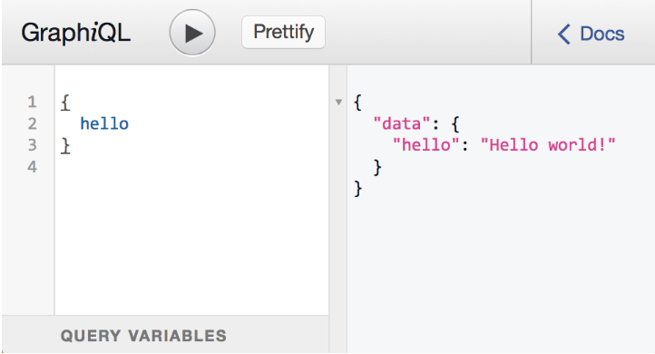
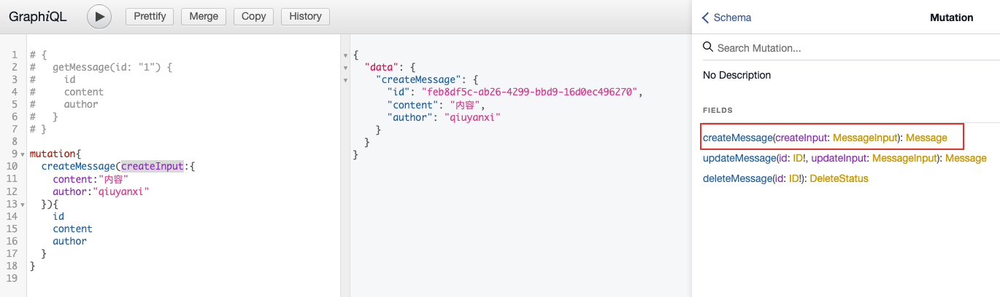

# 基本示例

## 服务端

使用 Express 并额外安装两个依赖：

```bash
npm install express express-graphql graphql --save
```

其中`express`用来启动服务器。`express-graphql`用来构建`GraphQL API`服务器，响应`/graphql`的 HTTP 请求。`graphql`用来创建 `schema`

```javascript
var express = require('express');
var { graphqlHTTP } = require('express-graphql');
var { buildSchema } = require('graphql');
 
// 使用 GraphQL Schema Language 创建一个 schema
var schema = buildSchema(`
  type Query {
    hello: String
  }
`);
 
// root 提供所有 API 入口端点相应的解析器函数
var root = {
  hello: () => {
    return 'Hello world!';
  },
};
 
var app = express();
app.use('/graphql', graphqlHTTP({
  schema: schema,
  rootValue: root,
  graphiql: true,
}));
app.listen(4000);
```

当服务端设置`graphiql: true`时，可以使用浏览器来手动执行`GraphQL`查询。

直接访问`http://localhost:4000/graphql`即可看到界面，然后用输入`GraphQL`查询语句，即可看到对应的数据类型：



## 客户端

浏览器端采用`fetch`也可以查询,在客户端打开开发者工具，输入以下代码：

```javascript
      async function request() {
        const res = await fetch('http://localhost:4000/graphql', {
          method: 'POST',
          headers: {
            'Content-Type': 'application/json',
            Accept: 'application/json',
          },
          body: JSON.stringify({ query: '{ hello }' }),
        });
        await res.json().then(data => console.log(data));
      }
      request();
```

就可以看到对应的数据

```json
{data: {hello: 'hello world'}}
```

# 基本类型

基本类型有`String`、`Int`、`Float`、`Boolean` 和 `ID`，这些类型在`buildSchema`中可以直接使用。

其中 ID 表示一个不会重复的值，下面的例子中使用`uuid`来生成。

默认情况下，每个类型都是可以为空的——这表示所有标量类型都可以返回 null。

如果不想为空则可以用一个感叹号表示一个类型不可为空，例如：`String!`表示非空字符串。

如果是列表类型，使用方括号将对应类型包起来，如 `[Int]` 就表示一个整数列表。

```js
var { v4: uuidv4 } = require('uuid');

var schema = buildSchema(`
type Query{
    name:String,
    age:Int,
    isMarried:Boolean,
    hobbies:[String!],
    id:ID
}
`);

var rootValue = {
  name() {
    return 'this is name';
  },
  age() {
    return 123;
  },
  isMarried() {
    return false;
  },
  hobbies() {
    return ['吃饭', '睡觉'];
  },
  id() {
    return uuidv4();
  },
};
```

# 传递参数

服务端 `schema`这样写：

```js
var schema = buildSchema(`
type Query{
    rollDice(numDice: Int!, numSides: Int): [Int]
}
`);
var rootValue = {
  rollDice({ numDice, numSides }) {
    let result = [];
    for (let i = 0; i < numDice; i++) {
      result.push(Math.floor(1 + Math.random() * numSides));
    }
    return result;
  },
};
```

**需要注意的点是` rootValue.rollDice`方法只接受一个参数，我们对应`schema`中的语句，**

```javascript
rollDice(numDice: Int!, numSides: Int): [Int]
```

**需要将查询的参数给解构出来。**

```javascript
rollDice({ numDice, numSides }){}
```

前端通过`GraphQL`查询：

```js
{
  rollDice(numSides:6,numDice:3)
}
```

通过代码查询，使用`$`来定义查询中的变量，并将变量作为单独映射来传递。

# 对象类型

现在我们把`name`、`age`、`hobbies`等都封装成一个对象类型，让很多地方可以通过查询 `user`来获取数据：

```js
var schema = buildSchema(`
type User{
    name:String,
    age:Int,
    isMarried:Boolean,
    hobbies:[String!],
    id:ID,
}
type Query{
    user:User
}
`);
var rootValue = {
  user() {
    return {
      name: rootValue.name,// 可以写函数方法，会自动调用
      age: rootValue.age,
      isMarried: rootValue.isMarried,
      hobbies: rootValue.hobbies(),// 也可以直接返回函数调用后的数据
      id: rootValue.id(),
    };
  },
  name() {
    return 'this is name';
  },
  age() {
    return 123;
  },
  isMarried() {
    return false;
  },
  hobbies() {
    return ['吃饭', '睡觉'];
  },
  id() {
    return uuidv4();
  }
};
```

这时候在前端`graphql`查询：

```js
{
  user {
    id
    name
    isMarried
    hobbies
    age
  }
}

/*
{
  "data": {
    "user": {
      "id": "a57fcb5d-1a32-4ac6-a047-818d1af3c54b",
      "name": "this is name",
      "isMarried": false,
      "hobbies": [
        "吃饭",
        "睡觉"
      ],
      "age": 123
    }
  }
}
*/
```

官方示例中的结合 class 实现是这样的：

比如现在要获取一个骰子，在后端的`Query`是这样写的：

```js
type RandomDie {
    numSides: Int!
    rollOnce: Int!
    roll(numRolls: Int!): [Int]
  }
type Query{
    getDie(numSides: Int): RandomDie,
}
```

然后定义一个`RandomDie`的类

```js
class RandomDie {
  numSides: number;
  constructor(numSides) {
    this.numSides = numSides;
  }

  rollOnce() {
    return 1 + Math.floor(Math.random() * this.numSides);
  }

  roll({ numRolls }) {
    var output = [];
    for (var i = 0; i < numRolls; i++) {
      output.push(this.rollOnce());
    }
    return output;
  }
}
```

然后在`rootValue`中返回这个类的实例，也就是对象

```js
var rootValue = {
  getDie: ({ numSides }) => {
    return new RandomDie(numSides || 6);
  },
};
```

此时可以通过`client`的`GraphQL`来查询：

```js
{
  getDie{
    roll(numRolls:3)
    numSides
    rollOnce
  }
}
```

当对一个返回对象类型的 API 发出 GraphQL 查询时，可以通过嵌套 GraphQL 字段名来一次性调用对象上的多个方法。

这种方式的好处是将相同类别的查询封装到一个 class 中，适合于面向类思维的编程方式。

# 变更和输入类型

如果对数据进行修改，比如插入或者更新操作，这时候需要使用`Mutation`类型而不是`Query`

比如现在要添加一个信息和查询一个信息，分别对应的`schema`是这样的：

```js
type Mutation {
  setMessage(message: String): String
}
 
type Query {
  getMessage: String
}
```

`mutation`会返回数据库所存的数据

例如，我把信息都存到一个变量里，最后返回出去的`rootValue`需要这么写：

```javascript
var fakeDatabase = {};
var root = {
  setMessage: ({message}) => {
    fakeDatabase.message = message;
    return message;
  },
  getMessage: () => {
    return fakeDatabase.message;
  }
};
```

前端根据上面的配置需要使用`mutation`来发送：

```javascript
mutation{
  setMessage(message:"这是前端发送的数据")
}
/*
{
  "data": {
    "setMessage": "这是前端发送的数据"
  }
}
*/
```

不过很多时候后端都会接受多个输入，但是输出是一致的。比如当 create 时，会判断前端有没有发送 id，如果没有则会新建一条消息，如果有则会更新与 id 相匹配的数据，最后返回给前端的都是同样的数据类型，这时候就要用输入类型来简化 `schema`，使用`input`关键字来定义输入：

```javascript
input MessageInput {
  content: String
  author: String
}
```

然后定义新增、更新和删除的`schema`

```javascript
type Message {
  id: ID!
  content: String
  author: String
}
 
type DeleteStatus{
    success:Boolean
}
type Mutation {
    createMessage(createInput:messageInput):Message
    updateMessage(id:ID!,updateInput: messageInput): Message
    deleteMessage(id:ID!):DeleteStatus
}
type Query {
    getMessage(id:ID!): Message
}
```

在 `rootValue` 中，我们都返回一个 `class`作为输出

```javascript
let dataBase: any = {
  '1': {
    content: '初始数据库的内容',
    author: 'qiuyanxi',
  },
};
// 如果 Message 拥有复杂字段，我们把它们放在这个对象里面。
class Message {
  id: string;
  content: string;
  author: string;
  constructor(id, { content, author }) {
    this.id = id;
    this.content = content;
    this.author = author;
  }
}

var rootValue = {
  getMessage({ id }) {
    return new Message(id, dataBase[id]);
  },
  createMessage({ createInput }) {
    let id = uuidv4();
    dataBase.id = createInput;
    return new Message(id, createInput);
  },
  updateMessage({ id, updateInput }) {
    dataBase[id] = updateInput;
    return new Message(id, updateInput);
  },
  deleteMessage({ id }) {
    if (!dataBase[id]) {
      return { success: false };
    }
    delete dataBase[id];
    return { success: true };
  },
};
```

最后我们在`GraphQL`浏览器端使用`mutation`进行查询

```javascript
mutation {
  createMessage(createInput: {author: "qiuyanxi", content: "这是内容"}) {
    id
    author
    content
  }
  updateMessage(id: "1", updateInput: {author: "qiuyanxi", content: "这是另一个内容"}) {
    author
    content
  }
  deleteMessage(id:"1") {
    success
  }
}


/*
{
  "data": {
    "createMessage": {
      "id": "5ab856bf-da39-4afd-8b6a-7c8ebee8c4e3",
      "author": "qiuyanxi",
      "content": "这是内容"
    },
    "updateMessage": {
      "author": "qiuyanxi",
      "content": "这是另一个内容"
    },
    "deleteMessage": {
      "success": true
    }
  }
}
*/
```

# 客户端携带参数请求

上面的案例中，客户端发送`query`请求并携带参数查询信息是这样写的：

```js
      async function request() {
        const id="1"
        const res = await fetch('http://localhost:4000/graphql', {
          method: 'POST',
          headers: {
            'Content-Type': 'application/json',
            Accept: 'application/json',
          },
          body: JSON.stringify({
            query: `
            {
              getMessage(id:${id}){
                id
                content
                author
              }
            }
            `,
          }),
        });
        await res.json().then(data => console.log(data));
      }
```

更加符合开发要求的写法是带上服务器中写的类型：

```js
          body: JSON.stringify({
            query: `
            query GetMessage($id:ID!){
              getMessage(id:$id){
                id
                content
                author
              }
            }
            `,
            variables: {
              id,
            },
          }),
```

通过`$id`来作为GraphQL 的变量，然后它的类型就是服务端 `GraphQL`服务端的类型`ID!`，最后通过`variables`将声明好的变量给传递进去。

对应`createMessage`的客户端查询是这么写的

```js
          body: JSON.stringify({
            query: `
            mutation CreateMessage($createInput:MessageInput){
              createMessage(createInput:$createInput){
                id
                content
                author
              }
            }
            `,
            variables: {
              createInput: {
                content: '内容',
                author: 'qyx',
              },
            },
          }),
```

客户端开发中，不可能去看服务端的代码，所以一般都会按照`GraphQL`的客户端 doc 来写对应的类型。



