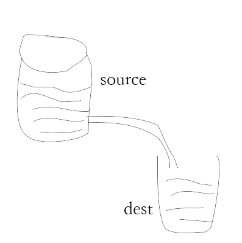
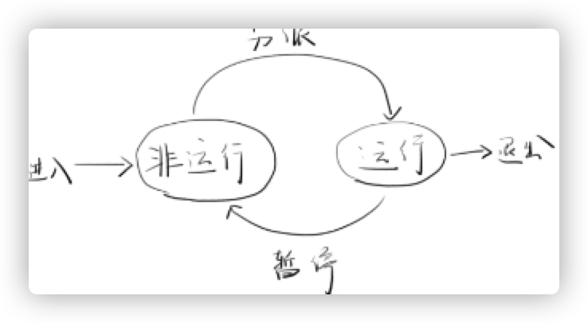
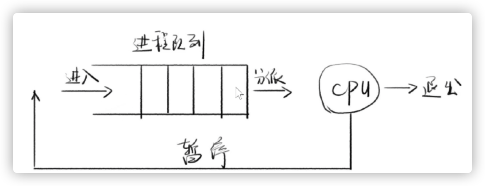
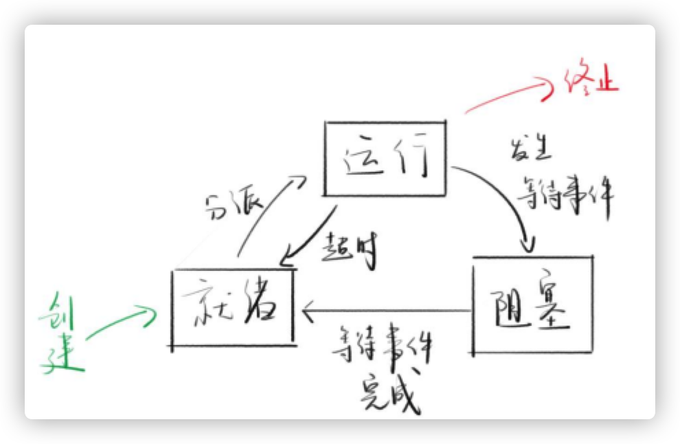

# 一、Node.js 的特性

常见的后端开发语言和技术有多种:

- 基于 Java 的 Spring
- 基于 Python 的 Django

...

相比其他后端技术，JavaScript 这门脚本语言需要一个解析器才能运行。在 HTML 页面的 JavaScript 程序，浏览器就是解析器。

而对于独立运行的 JavaScript 程序，Node 就是它的解析器。

Node 是一个让 JavaScript 运行在服务器端的开发平台。它让 JavaScript 脱离脚本语言，在后端能够与其他语言一样操控数据库、服务器等等。

Node 是基于 V8 引擎开发的，V8 引擎执行 JavaScript 程序的速度非常快，性能也非常好。

> Chrome V8 是一个由 Google 开发的开源 JavaScript 引擎，用于 GoogleChrome 及 Chromium 中。Chrome V8 在运行之前会将 JavaScript 代码编译成机器代码而非字节码，以此提升程序性能。更进一步，Chrome V8 使用了如内联缓存（Inline Caching）等方法来提高性能。有了这些功能，JavaScript 程序与 ChromeV8 引擎的运行速度可媲美二进制编译的程序。

## 1.1 模块化规范

模块化的开发可以提高代码的复用率，方便进行代码管理。通常一个文件就是一个模块，有自己的作用域，只向外暴露特定的变量和函数。

CommonJS 是 JavaScript 模块化的一种规范，该规范最初用在服务端的 Node 开发中，现在 Weback 打包工具也支持原生 CommonJS。

根据这个规范，每一个文件都是一个模块，其内部定义的变量是属于这个模块的，不会对外暴露，也就是说不会污染全局变量。

CommonJS 的核心思想就是通过 require()方法同步加载所要依赖的其他模块，然后通过 exports 或者 module.exports 来导出需要暴露的接口。

示例代码

```JavaScript
.
├── index.js
├── math.js
├── package-lock.json
└── package.json
```

其中 index.js 代码引入

```JavaScript
var math = require('./math.js');

console.log(math.add(10, 20)); // 30
```

math.js 代码导出

```JavaScript
var add = function (a, b) {
  return a + b;
};

module.exports.add = add;
```

在 package.json 上配置`scripts`和`type`属性

```
{
  "name": "demo-1",
  "version": "1.0.0",
  "description": "",
  "main": "index.js",
  "type": "commonjs",
  "dependencies": {},
  "devDependencies": {},
  "scripts": {
    "start": "node index.js"
  },
  "author": "",
  "license": "ISC"
}
```

type 属性中的 node index.js 表示从命令行运行 Node 脚本

运行

```bash
npm start
```

但 common.js 属于社区规范并非真正意义上的标准规范。

ES6 在语言标准层面上实现了模块功能。它成为浏览器和服务器通用的模块化解决方案。但是 ES6 目前无法在所有浏览器中执行，需要通过 Babel 将不被支持的 import 语法编译成当前受到广泛支持的 require 语法。

但在 Nodejs 中，则不需要这么做。

ES 6 模块的设计思想是尽量静态化，使得编译而非运行时就能确定模块的依赖关系，以及输入和输出的变量。

使用 ES6 模块化的示例项目结构如下

```JavaScript
.
├── index.js
├── math.js
├── package-lock.json
└── package.json
```

首先需要修改 package.json 文件的 type 属性

```JavaScript
"type": "module",
```

其中，index.js 代码如下

```JavaScript
import add from './math.js';

console.log(add(10, 20)); // 30
```

math.js 代码如下

```JavaScript
var add = function (a, b) {
  return a + b;
};

export default add;
```

执行 index.js 脚本

```JavaScript
npm start
```

## 1.2 异步 I/O 和事件驱动

1. 单线程

   Node 的 Runtime 是基于 V8 引擎的。V8 引擎是 chrome 浏览器中的 JavaScript 代码解析引擎，其最大的特点是单线程，因此 Node 也是单线程。

   简单来说单线程就是进行中只有一个线程，程序按照顺序执行，前面的程序执行完才会执行后面的程序。

   > 进程和线程的关系：进程是资源分配的最小单位，而线程是程序执行的最小单位（资源调度的最小单位）。线程可以看做是特殊的进程，某个进程下的多个线程共享部分资源，如地址空间。

   Node 的单线程指的是主线程是单线程。主线程按照代码顺序一步一步执行，如果遇到同步代码阻塞，主线程就被占用，则后续的程序代码执行就会被卡住。

   因为单线程具有这个特性，所以 Node 程序不能有耗时很长的同步处理程序阻塞程序的后续执行，对于耗时过长的程序，应该采用异步执行的方式。这就需要说到异步 I/O。

2. 异步 I/O

   I/O 分为以下情况：

   - 阻塞 I/O 与非阻塞 I/O

   - 同步 I/O 与异步 I/O

   对于阻塞 I/O，当需要执行 I/O 操作读取硬盘或者网络等数据时，线程就会被阻塞，直到要读取的数据全部准备好返回给用户，这时线程就会解除阻塞状态。

   对于非阻塞 I/O，当需要执行 I/O 操作时，线程可以在发起 I/O 处理请求后，不用等请求完成，继续做其他事情。但是程序如何知道要读取的数据已经准备好了呢？除了存在效率问题的轮询方法外，现在通常的做法是 I/O 多路复用的方式，即用一个阻塞函数同时监听多个文件描述符，当其中有一个文件描述符准备好了，就立刻返回。Linux 系统提供了 select、poll 和 epoll 等实现 I/O 多路复用的功能。

   因此，阻塞 I/O 和非阻塞 I/O 是基于线程是否会阻塞来区分的。

   同步 I/O 做操作的时候会阻塞线程，而异步 I/O 则不会造成任何阻塞。

   阻塞 I/O 和非阻塞 I/O 以及 I/O 多路复用都是同步 I/O。

   非阻塞 I/O 虽然在操作时不会阻塞线程，但是当其准备好数据以后还是要阻塞线程去内核读取数据的，因此不算异步 I/O。

   以下是模型图

   

## 1.3 事件驱动

Node 还有另一个重要的特性：事件驱动。

简单来说，事件驱动就是通过监听事件的状态变化来做出相应的操作。

例如：读取一个文件，文件读取完毕或者文件读取错误都会触发相应的状态，然后调用对应的回调函数来处理。

```javascript
var fs = require('fs');
fs.readFile('./math.js', { encoding: 'utf-8' }, function (error, data) {
  if (error) console.log(error);
  console.log(data);
});
```

上面的代码会读取 math.js 文件，然后将里面的内容打出来。如果没有，则会打出 error 信息。

对于事件驱动编程来说，如果某个事件的回调函数是计算密集型（CPU 被占用）函数，那么这个回调函数将会阻塞所有回调函数的执行。这也是 Node 不适用于计算密集型业务的原因。

# 二、RESTful 架构风格

REST 全称是 Representational State Transfer，即表征性状态转移。

REST 指的是一组架构约束条件和原则。

如果一个架构符合 REST 的约束条件和原则，那么就称它为 RESTful 架构。REST 本身没有创造新的技术、组件或者服务，隐藏在 RESTful 背后的理念是使用 Web 现有的特征和能力，以及更好地使用现有的 Web 标准的一些准则和约束。

RESTful 是目前最流行的 API 设计规范，我们可以从 3 个方面来理解 RESTful 的基本特征：

1. 资源和动作
2. 响应状态码
3. 响应数据

**资源和动作**

RESTful 架构应该遵循统一的接口原则。统一接口包含了一组受限的预定义操作，不管什么样的资源都使用相同的接口进行资源访问。

任何接口的 URL 都可以抽象成以下部分：

- 资源：必须是名词且都是复数形式。

- 动作：通过 HTTP 定义的方法来表述对资源的动作

  常用 5 种 HTTP 方法对应 CRUD 操作：

  ```
  GET：读取（Read）
  POST：新建（Create）
  PUT：更新（Update）
  PATCH：更新（Update）
  DELETE：删除（Delete）
  ```

  上面的更新分为 PUT 和 PATCH，它们的区别在于

  - PUT 是幂等的，即多次进行 PUT 操作后的资源总是相同的，因为 PUT 会更新整个资源。
  - PATCH 是非幂等的，多次进行 PATCH 操作会导致资源有不同的变化，PATCH 只更新资源的部分字段。

**响应状态码**

客户端每一次请求服务器都必须给出回应。服务器响应包括 HTTP 状态码和数据两部分。其中，状态码分为五大类，覆盖绝大部分情况。每一种状态码都有标准的解释，客户端只需要查看状态码就可以判断发生什么情况，因此客户端应该尽可能返回精确地状态码。

**响应数据**

API 返回的数据格式不推荐使用纯文本，应该返回标准化的结构数据，如 JSON 格式的数据。因此，在服务器响应的 HTTP 头上，将 Content-Type 设置为 application/json。

客户端请求时也要明确告诉服务器可以接受 JSON 数据的格式，即在请求的 HTTP 头上将 ACCEPT 属性设置为 application/json。

API 的调用者未必知道 URL 是如何设计的，一个解决方法是在响应中添加相关的链接，以便下一步操作。这样用户只需要记住一个 URL，就可以发现其他 URL，这种方法叫 HATEOAS。

以 GitHub 的 API 为例，当访问https://api.github.com/时，就可以得到其他相关的URL，如下：

```json
{
    ......
    "feeds_url": "https://api.github.com/feeds",
    "followers_url": "https://api.github.com/user/followers",
    "following_url": "https://api.github.com/user/following{/target}",
    "gists_url": "https://api.github.com/gists{/gist_id}",
    "hub_url": "https://api.github.com/hub",
    ......
}
```

# 三、回调函数和 Promise 对象

Node 具有单线程和事件驱动的特性，这意味着我们需要用到大量的异步代码以让程序不被阻塞。

下面是利用异步回调函数来读取文件的示例代码

```JavaScript
var fs = require('fs');

fs.readFile('./test.txt', { encoding: 'utf8' }, function (err, data) {
  if (err) {
    console.log(err);
  } else {
    console.log(data);
  }
});

console.log('read async');
```

使用异步回调函数能够大大提升 Node 单线程的处理能力，但是基于回调函数的编程风格会让代码可读性变得更加糟糕，即所谓的回调地狱。

为么解决这个问题，ES6 引进了 Promise 对象，有了 Promise 对象，就可以将异步操作以同步的流程表达出来，避免层层回调。

使用 Promise 对象后的读取文件的示例

```JavaScript
var fs = require('fs');

function getData(fileName, options) {
  return new Promise(function (resolve, reject) {
    fs.readFile(fileName, options, function (err, data) {
      if (err) {
        reject(err);
      } else {
        resolve(data);
      }
    });
  });
}

getData('./test.txt', { encoding: 'utf8' })
  .then(function (data) {
    console.log('Data: ', data);
  })
  .catch(function (error) {
    console.log('Error: ', error);
  });
```

# 四、Node.js 常用模块

## 4.1 全局变量

在浏览器中，window 是全局对象，在 Node 中的全局变量是 global，在任何地方都可以访问 global 的属性。

- 保留字

  两个常用保留字`__filename`和`__dirname`

  \_\_filename 表示正在执行脚本的文件名。它会输出文件所在位置的绝对路径，并且和命令行参数所指定的文件名并不一定相同。在模块中，返回的值是模块文件的路径。

  ```javascript
  console.log(__filename);

  /Users/qiuyanxi/Desktop/demo/NodeJS-demo/node-demo-1/index.js
  ```

  \_\_dirname 表示当前执行的脚本所在的目录。

  ```javascript
  console.log(__dirname);
  /Users/qiuyanxi/Desktop/demo/NodeJS-demo/node-demo-1
  ```

- 定时任务

  Node 开发中的定时器除了 setTimeout、setInterval 外，还有 setImmediate

- 控制台

  console.log：向标准输出流打印字符并以换行符结束，该方法接收若干个参数；

  console.info：输出提示信息，用法与 console.log 方法类似；

  console.warn：输出警告消息，在 Chrome 浏览器控制台会显示黄色的惊叹号；

  console.error：输出错误消息，在 Chrome 浏览器控制台会显示红色的叉。

  console.time：启动一个计时器；

  console.timeEnd：停止一个通过 console.time()启动的计时器。

- process 进程

  process 进程代表当前 Node 进程状态的对象，并提供一个与操作系统交互的简单接口。

  ```
  import process from 'process';

  process.on('exit', code => {
    console.log(process.cwd()); //打印出当前进程的工作目录
  });
  ```

  上面的代码监听进程退出时的生命周期。

## 4.2 系统模块-os

os 模块提供一些基本的系统操作函数，通过 os 模块，Node 程序可以实现和操作系统的交互。

```javascript
import os from 'os';
console.log('hostname:' + os.hostname()); //主机名
console.log('type:' + os.type()); //操作系统名
console.log(os.userInfo()); // 用户信息
```

## 4.3 路径模块-path

系统中的每个文件都有路径。

但是 macos 跟 windows 的路径符号是相反的，分别为`/`和`\`

path 模块提供用于处理文件路径和目录路径的工具来消除这种差异。

```javascript
import path from 'path';
var full_path = '/application/todoList/index.js';
//目录名
path.dirname(full_path); // /application/todoList

//返回路径的最后一部分
path.basename(full_path); // index.js

//后缀
path.extname(full_path); // .js

//路径片段分隔符
path.sep; // /

//拼接成规范路径
path.join('./user', 'local', 'bin'); // user/local/bin

//是否为绝对路径
path.isAbsolute(full_path); // true

//当包含类似 .、.. 或双斜杠等相对的说明符时，则尝试计算实际的路径
path.normalize('/users/joe/..//test.txt'); //'/users/test.txt'

// 解析对象的路径为组成其的片段
path.parse('/users/test.txt');
/*
{
  root: '/',
  dir: '/users',
  base: 'test.txt',
  ext: '.txt',
  name: 'test'
}
*/

// 接受 2 个路径作为参数。 基于当前工作目录，返回从第一个路径到第二个路径的相对路径。
path.relative('/Users/joe', '/Users/joe/test.txt'); //'test.txt'

//获得相对路径的绝对路径计算
path.resolve('joe.txt'); //'/Users/joe/joe.txt' 如果从主文件夹运行

//通过指定第二个参数，resolve 会使用第一个参数作为第二个参数的基准：
path.resolve('tmp', 'joe.txt'); //'/Users/joe/tmp/joe.txt' 如果从主文件夹运行

//第一个参数以斜杠开头，则表示它是绝对路径：
path.resolve('/etc', 'joe.txt'); //'/etc/joe.txt'
```

## 4.4 文件模块-fs

**获取详细信息**

每个文件都有一组详细信息，可以使用 fs 模块提供的 stat()方法获取。

```javascript
import fs from 'fs';
fs.stat('./math.ts', (err, Stats) => {
  console.log(Stats); //打印出math.js的信息
});
```

也可以使用同步的方法来获取信息，这个方法在文件属性准备就绪前会阻塞线程。

```javascript
import fs from 'fs';
const stats = fs.statSync('./math.ts');
```

文件的信息包含在属性变量中，我们可以通过以下常见的属性来获取信息

```javascript
console.log(stats.isFile()); //是否为文件
console.log(stats.isDirectory()); //是否为文件夹
console.log(stats.isSymbolicLink()); //是否符号链接
console.log(stats.size); // 文件大小
```

**读取文件**

```javascript
import fs from 'fs';
fs.readFile('./math.ts', 'utf8', (err, file) => {
  console.log(file);
});
```

**写入文件**

```javascript
fs.writeFile('./test.txt', 'hello23', { flag: 'a+' }, err => {
  console.log(err);
});
```

flag 标志可以指定写的行为。

> 默认为 ‘w’: 打开文件进行写入， 创建（如果它不存在）或截断（如果它存在）该文件。

追加内容到文件里还有个便捷的方法 `fs.appendFile()`

```javascript
import fs from 'fs';
fs.appendFile('./test.txt', '一些内容', err => {
  console.log(err);
});
```

**文件夹是否存在**

使用 `fs.access()` 检查文件夹是否存在以及 Node.js 是否具有访问权限。

**创建新的文件夹**

使用 `fs.mkdir()` 或 `fs.mkdirSync()` 可以创建新的文件夹。

```javascript
import fs from 'fs';
let folderName = './dir';
try {
  if (!fs.existsSync(folderName)) {
    fs.mkdirSync(folderName);
  }
} catch (error) {
  console.log(error);
}
```

**读取目录的内容**

使用 `fs.readdir()` 或 `fs.readdirSync()` 可以读取目录的内容并返回它们的相对路径

```javascript
console.log(fs.readdirSync(folderName)); // [ 'test.txt' ]
```

**删除文件夹**

使用 `fs.rmdir()` 或 `fs.rmdirSync()` 可以删除文件夹。

删除包含内容的文件夹可能会更复杂。

在这种情况下，最好安装 [`fs-extra`](https://www.npmjs.com/package/fs-extra) 模块，该模块非常受欢迎且维护良好。 它是 `fs` 模块的直接替代品，在其之上提供了更多的功能。

```javascript
import fs from 'fs-extra';
let folderName = './dir';
fs.remove(folderName, err => {
  console.log(err);
});

/* 或者可以这样用 */
let folderName = './dir';
(async () => {
  await fs.remove(folderName);
})();
```

在 fs 模块中，我们可以使用非常使用的函数来访问文件系统并与文件系统进行交互。

所有办法默认是异步的，但是通过添加上 Sync 就是同步代码。

```javascript
fs.rename();
fs.renameSync();
fs.write();
fs.writeSync();
```

当调用`fs.rename`方法时，异步 API 会与回调一起使用。

```javascript
let folderName = './dir';
fs.rename(folderName, 'afterDir', err => {
  console.log(err);
});
```

当使用同步 API 时，则使用 try/catch 捕获错误

```javascript
try {
  fs.renameSync('./dir', './afterDir');
} catch (error) {
  console.log(error);
}
```

主要的区别在于，同步 API 会阻塞脚本执行，直到文件操作成功。

# 五、流-stream

流是一种以高效的方式处理读/写文件、网络通信、或者任何类型的端到端的信息交换。

程序通过管道运算符`|`对流进行交互。

在传统的方式中，当告诉程序读取文件时，这会将文件从头到尾读入内存，然后进行处理。

使用流，则可以逐个片段地读取并处理（而无需一次性地把这些数据全部放入内存）。

流相对于其他数据处理方法的优点：

- 内存更效率：无需加载大量的数据到内存中即可进行处理
- 时间效率：当获得数据之后即可立即开始处理数据，这样所需的时间更少，而不必等到整个数据有效负载可用才开始。

以下是 Node 中常用的实现流接口的内建模块


上边的列表中有一些 Node.js 原生的对象，这些对象也是可以读写的流。这些对象中的一部分是既可读、又可写的流，例如 TCP sockets，zlib 以及 crypto。

需要注意的是这些对象是紧密关联的。虽然一个 HTTP 响应在客户端是一个可读流，但在服务器端它却是一个可写流。这是因为在 HTTP 的情况中，我们基本上是从一个对象（`http.IncomingMessage`）读取数据，向另一个对象（`http.ServerResponse`）写入数据。

还需要注意的是 `stdio` 流（`stdin`，`stdout`，`stderr`）在子进程中有着与父进程中相反的类型。这使得在子进程中从父进程的 `stdio` 流中读取或写入数据变得非常简单。

## 5.1 流跟传统磁盘读取的区别

```javascript
import fs from 'fs';
var sink = './index.txt'; // 水池
var chunk; // 块级小数据
var stream = fs.createWriteStream(sink); //创建一个写入流

for (let i = 0; i < 1000000; i++) {
  chunk = `第${i}行数据 \n`;
  stream.write(chunk); //写入流
}
stream.end(); //结束流
console.log('done');
```

上面的代码从创建流开始，会多次往 index.txt 中用流的方式写入内容

> stream 是水流，但里面没有水，stream.write 可以让水流中有水（数据）
>
> 写的小数据叫做 chunk（块）chunk 是不完整的数据
>
> 产生数据的地方叫 source（源头）
>
> 得到数据的地方叫 sink（水池）

**传统的磁盘读取并传输文件**

如果用普通磁盘的方式读取上述示例中用流写入的 index.txt 文件，如下面代码所示

```javascript
import http from 'http';
import fs from 'fs';
const server = http.createServer(function (req, res) {
  fs.readFile('./index.txt', 'utf8', (err, data) => {
    res.end(data);
  });
});
server.listen(3000);
```

任务管理器的内存会在程序运行时大量被占用，因为需要开辟内存来读取，并且读取完后要发送给客户端，操作开销非常大。

以下是客户端请求`localhost:3000`时的 node 开销


结束后的开销


使用传统方式时，readfile 会读取文件的全部内容，并在完成时调用回调函数。

如果文件很大，则操作会花费很多时间。最后通过回调将内容返回给客户端。

**使用流读取数据并传输**

如果用流方式读取上述示例中用流写入的 index.txt 文件，如下面代码所示

```javascript
import http from 'http';
import fs from 'fs';
const server = http.createServer(function (req, res) {
  const stream = fs.createReadStream('./index.txt'); //创建可读流
  stream.pipe(res);
  stream.on('end', () => {
    console.log('done');
  });
});
server.listen(3000);
```

> Node `fs` 模块中的 `createReadStream` 方法可以针对任何文件给我们返回一个可读流。我们可以把它和响应对象连接起来

客户端请求`localhost:3000`时的 node 开销


可以看出流占用的开销比普通磁盘小得多。

当要发送的数据块已获得时就立即开始流式传输到 HTTP 客户端，而不用等到文件全部被读取。

## 5.2 流的类型

流分为四类：

- `Readable`: 可以通过管道读取、但不能通过管道写入的流（可以接收数据，但不能向其发送数据）。 当推送数据到可读流中时，会对其进行缓冲，直到使用者开始读取数据为止。
- `Writable`: 可以通过管道写入、但不能通过管道读取的流（可以发送数据，但不能从中接收数据）。
- `Duplex`: 可以通过管道写入和读取的流，基本上相对于是可读流和可写流的组合。
- `Transform`: 类似于双工流、但其输出是其输入的转换的转换流。

Duplex 的读和写是双轨道的，读取的数据来源于 source（源头），写入的数据注入 sink（水池）。通俗点说就是别人的数据你来读，读完你来写入一个地方。**读跟写是互相独立的**

```bash
                             Duplex Stream
                          ------------------|
                    Read  <-----               External Source
            You           ------------------|
                    Write ----->               External Sink
                          ------------------|
            You don't get what you write. It is sent to another source.
```

Transform 的读和写的单轨道的，通俗点说就是你写的你自己读。**读来自于写，并非互相独立的关系**

```bash
															Transform Stream
                           --------------|--------------
            You     Write  ---->                   ---->  Read  You
                           --------------|--------------
            You write something, it is transformed, then you read something.
```

## 5.3 管道流

管道提供了一个输出流到输入流的机制。通常我们用于从一个流中获取数据并将数据传递到另外一个流中。



如上面的图片所示，我们把文件比作装水的桶，而水就是文件里的内容，我们用一根管子(pipe)连接两个桶使得水从一个桶流入另一个桶，这样就慢慢的实现了大文件的复制过程。

### 5.3.1 pipe()

所有的流都是 `EventEmitter` 的实例。它们发出可用于读取或写入数据的事件。然而，我们可以利用 `pipe` 方法以一种更简单的方式使用流中的数据。

`pipe()`方法用于管道操作

下面是用流读取一个文件后将数据通过管道流入一个可写流的代码

```javascript
import fs from 'fs';

const readStream = fs.createReadStream('./index.txt');
const writeStream = fs.createWriteStream('./name.txt');
readStream.pipe(writeStream); //注意看这行代码
writeStream.on('finish', () => {
  writeStream.end();
});
```

在这行简单的代码中，我们以管道的方式把一个可读流的输出连接到了一个可写流的输入。管道的上游（source）必须是一个可读流，下游（destination）必须是一个可写流。当然，它们也可以是双向流/变换流。

`pipe()`方法的返回值是目标流，它可以链式调用。

```javascript
src.pipe(dest1).pipe(dest2);
```

相当于

```javascript
src.pipe(dest1);
dest1.pipe(dest2);
```

它使得 stream 对象可以链接多个 `pipe()` 调用。

如果我们使用管道连接的是双向流，我们就可以像 Linux 系统里那样连接多个流：

```javascript
readableSrc
  .pipe(transformStream1)
  .pipe(transformStream2)
  .pipe(finalWrtitableDest);
```

`pipe` 方法会返回最后一个流，这使得我们可以串联多个流。对于流 `a` （可读），`b` 和 `c` （双向），以及 `d`（可写）。我们可以这样

```javascript
a.pipe(b).pipe(c).pipe(d)

# 等价于:
a.pipe(b)
b.pipe(c)
c.pipe(d)

# 在 Linux 中，等价于：
$ a | b | c | d
```

`pipe()`是语法糖，我们也可以用事件实现管道操作

```javascript
const stream1 = fs.createReadStream('./index.txt');
const stream2 = fs.createWriteStream('./name.txt');
// stream1一有数据就塞给stream2
stream1.on('data', chunk => stream2.write(chunk));
// stream1停了就让stream2也结束
stream1.on('end', () => stream2.end());
```

一般情况下使用 `pipe` 方法时你就不必再使用事件了。但如果你想以一种更加自定义的方式使用流，就要用到事件了。

## 5.4 流事件

**Readable Stream**

**data 事件**：监听每次读取数据的操作，我们能够在回调中知道 chunk 的内容

**end 事件**：监听读取数据结束的操作

```javascript
import http from 'http';
import fs from 'fs';
const server = http.createServer(function (req, res) {
  const stream = fs.createReadStream('./index.txt');
  stream.on('data', chunk => {
    console.log('chunk:' + chunk);
  });
  stream.on('end', () => {
    console.log('end');
  });
  stream.pipe(res);
});
server.listen(3000);
```

**Writeable Stream**

**drain 事件**：高速写入流的时候，有可能造成堵塞现象，类似水流在管道中由于流入太快，导致管道堵水，一时之间水无法全部流出管道。这时候就可以停止写入，再监听被流入的地方的 drain 事件，只要触发了就可以继续写入

```javascript
import http from 'http';
import fs from 'fs';
const server = http.createServer(function (req, res) {
  const stream1 = fs.createReadStream('./index.txt'); // 创建可读流
  const stream2 = fs.createWriteStream('./name.txt'); // 创建可写流
  stream1.on('data', chunk => {
    const flag = stream2.write(chunk);
    if (!flag) {
      // dont write any thing
    }
    stream2.on('drain', () => {
      //go on write
    });
  });
  stream1.on('end', () => {
    stream2.end();
  });
  stream1.pipe(res);
});
server.listen(3000);
```

上面的代码创建了可读流 stream1 和可写流 stream2，我们会从 stream1 中读出内容写到 stream2 中，如果此时流入过快导致管道堵塞，flag 会变成 false，此时不再进行写入。

当流入 stream2 的内容干涸之后再继续写的逻辑，所以此时需要监听 stream2 的 drain 事件。

> 可以理解成水池出水太快会造成管道无法快速排出，那么需要先塞住管道，等下方的水流干了之后再打开管道让水继续流

**finish 事件**：整个写入流的动作完成了触发的事件。

## 5.5 可读流的暂停和流动模式

可读流分两种状态：静止态 paused 和流动态 flowing

默认处于静止态。下面的代码会创建可读流，此时流的状态是静止的 paused

```
const stream = fs.createReadStream('./index.txt')
```

当添加 data 事件后，它的状态就变成流动态 flowing

```javascript
stream.on('data', chunk => {
  /* 此时变成流动态 */
});
```

`pipe()`方法是 data 事件+写入流的语法糖，当调用 pipe 事件时，也会变成流动态

`pause()`方法可以让流暂停-进入 paused 状态

`resume`方法可以让流恢复-进入 flowing 状态

下面的代码会先创建`name.txt`文件,然后暂停流入，直到 3 秒钟后再开始往`name.txt`中写入数据

```javascript
import fs from 'fs';

const readStream = fs.createReadStream('./index.txt');
const writeStream = fs.createWriteStream('./name.txt');
readStream.pipe(writeStream);
readStream.pause();
setTimeout(() => {
  readStream.resume();
}, 3000);
```

## 5.6 可写流的 drain 事件

这里结合 Readable 再谈谈可写流的 drain 事件，这个事件触发时机是 finish 事件还未触发，但是数据积压了的情况。

当调用`stream.write(chunk)`时,可能会得到`false`,造成的原因可能是读取快写入慢导致数据积压，此时我们不能再 write 了，需要先暂停流入`readStream.pause()`,再监听 drain 事件，当数据流干了，就触发 drain 事件，此时恢复流入`readStream.resume()`

```javascript
import fs from 'fs';
const writeStream = fs.createWriteStream('./name.txt');
const readStream = fs.createReadStream('./index.txt');

function write() {
  let flag;
  readStream.on('data', chunk => {
    flag = writeStream.write(chunk);
    if (!flag) {
      console.log('数据积压了...');
      readStream.pause(); //暂停流入
    }
    writeStream.once('drain', () => {
      console.log('水流干了,继续写入...');
      readStream.resume(); // 恢复流入
    });
  });
  readStream.on('end', () => {
    writeStream.end();
  });
}
write();
```

上面代码中的`index.txt`文件中拥有 10000 行数据，我们运行上面代码时，由于写入太快，会在 log 台上打印如下内容

```bash
数据积压了...
水流干了,继续写入...
数据积压了...
水流干了,继续写入...
数据积压了...
水流干了,继续写入...
```

当数据积压时，可以调用`readStream.pause()`停止数据流入。当`writeStream`监听的 drain 事件触发了（表示 writeStream 积压的数据写完了），此时恢复数据流动`readStream.resume()`。

## 5.7 自己动手实现流

我们经常使用的是`fs.createXXXSteam`来使用 fs 模块帮我们写好的流。

实际上该流是继承自`Stream`类的。

```javascript
const writeStream = fs.createWriteStream('./name.txt');
writeStream.__proto__ ===> Writable
Writable.__proto__===> Stream
Stream.__proto__ ===> EventEmitter
```

上面代码中通过 fs 模块创建的`writeStream`的原型链是链接到 Writable 上的，Writable 则是链接到 Stream 上。

这意味着 writeStream 可以调用 Writable、Stream 的方法。

本质上来说 fs 模块的`createWriteStream`方法针对特定文件，创建了一个“可写数据流”，创建的方式是对写入操作部署了`Stream`接口。

### 5.7.1 实现一个可写流

任何对象只要部署了`Stream.Writeable`接口，就拥有了“可写数据流”。这个对象就可以被写入流。

要实现一个可写流，我们需要使用来自 stream 模块的 `Writable` 类。

```javascript
const { Writable } = require('stream');
```

实现一个可写流的方式很多，例如我们可以继承 `Writable` 类

```javascript
class myWritableStream extends Writable {}
```

更简单的方法是直接给 `Writable` 构造函数传入配置项来创建一个对象。唯一必须的配置项是一个 `write` 函数，它用于暴露一个写入数据的接口。

```javascript
const { Writable } = require('stream');

const outStream = new Writable({
  write(chunk, encoding, callback) {
    console.log(chunk.toString());
    callback();
  },
});

process.stdin.pipe(outStream);
```

write 方法接受三个参数

- **chunk** 通常是一个 buffer，除非我们对流进行了特殊配置。

- **encoding** 通常可以忽略。除非 chunk 被配置为不是 buffer。

- **callback** 方法是一个在我们完成数据处理后要执行的回调函数。它用来表示数据是否成功写入。若是写入失败，在执行该回调函数时需要传入一个错误对象。

`process.stdin.pipe(outStream);`会将进程的标准输入通过管道`pipe`流向 outStream 中。

我们换事件的方式来看一下上面这行代码

```javascript
process.stdin.on('data', chunk => {
  outStream.write(chunk, 'chunk', () => {
    console.log('数据写入了');
  });
});
```

现在我们运行上面的代码，然后在控制台输入内容 1，就可以看到以下结果。


### 5.7.2 实现一个可读流

同样的，只要部署了`Stream.readable`接口，也拥有了可读数据流。这个对象就可以被读。

```javascript
const { Readable } = require('stream');

const inStream = new Readable();

inStream.push('ABCDEFGHIJKLM');
inStream.push('NOPQRSTUVWXYZ');

inStream.push(null); // 没有更多数据了

inStream.pipe(process.stdout);
```

当我们 `push` 一个 `null` 值，这表示该流后续不会再有任何数据了。

要使用这个可读流，我们可以把它连接到可写流 `process.stdout`。

当我们执行以上代码时，所有读取自 `inStream` 的数据都会被显示到标准输出上。

这种方式的缺点在于：我们在把流链接到`process.stdout`时,我们就已经推送了所有数据。

更好的方式是使用者要了，我们按需推送数据。我们可以通过在可读流配置中实现 `read()` 方法来达成这一目的：

```javascript
const inStream = new Readable({
  read(size) {
    this.push(String.fromCharCode(this.currentCharCode++));
    if (this.currentCharCode > 90) {
      this.push(null);
    }
  },
});

inStream.currentCharCode = 65;

inStream.pipe(process.stdout);
```

上面的例子中，当可读流的 read 方法被调用时，流实现可以向队列中推送部分数据。例如，从字符编码 65（A）开始，一次推送一个字母，每次推送后都把字符编码+1。

当使用者读取该可读流时，`read` 方法会持续被触发，我们不断推送字母。我们需要在某处停止该循环，这就是为何我们放置了一个 if 语句以便在 currentCharCode 大于 90（代表 Z） 时推送一个 null 值。

这段代码等价于之前的我们开始时编写的那段简单代码，但我们已改为在使用者需要时推送数据。你始终应该这样做。

### 5.7.3 实现一个双向流

双向流就是前面可读流和可写流的组合

```javascript
const { Duplex } = require('stream');

const inoutStream = new Duplex({
  write(chunk, encoding, callback) {
    console.log(chunk.toString());
    callback();
  },

  read(size) {
    this.push(String.fromCharCode(this.currentCharCode++));
    if (this.currentCharCode > 90) {
      this.push(null);
    }
  },
});

inoutStream.currentCharCode = 65;

process.stdin.pipe(inoutStream).pipe(process.stdout);
```

上面的代码中，我们在可读的`process.stdin`上插了一根管道以接入这个双向流，然后利用其可写的特点将其接入可写的`process.stdout`上。

在控制台我们首先可以看到 A-Z 的字母被写入到`process.stdout`上了。后续每次我们在`process.stdin`输入，都会经过管道最终流到`process.stdout`上。

理解双向流的读取和写入部分是完全独立的这一点非常重要。它只不过是把两种特性在同一个对象上实现罢了。

### 5.7.4 实现变换流

变换流是一种更有趣的双向流，因为它的输出是基于输入运算得到的。

对于一个变换流，我们不需要实现 `read` 或 `write` 方法，而是只需要实现一个 `transform` 方法即可，它结合了二者的功能。它的函数签名和 `write` 方法一致，我们也可以通过它 `push` 数据。

以下是一个把你输入的任何内容转换为大写字母的变换流：

```javascript
const { Transform } = require('stream');

const upperCaseTr = new Transform({
  transform(chunk, encoding, callback) {
    this.push(chunk.toString().toUpperCase());
    callback();
  },
});

process.stdin.pipe(upperCaseTr).pipe(process.stdout);
```

在这个变换流中，我们只实现了 `transform()` 方法，却达到了前面双向流例子的效果。在该方法中，我们把 `chunk` 转换为大写然后通过 `push` 方法传递给下游。

## 5.8 内置的 Transform 流

Node 内置了一些非常有用的变换流。这就是 zlib 和 crypto 流。

下面是一个组合了 `zlib.createGzip()` 和 `fs` 可读/可写流来压缩文件的脚本

```javascript
import fs from 'fs';
import zlib from 'zlib';
const filePath = './index.txt';
const stream = fs.createReadStream(filePath);
stream.pipe(zlib.createGzip()).pipe(fs.createWriteStream('./index.zip'));
```

我们可以通过上面的代码来读取`index.txt`文件并将其床底给 zlib 内置的变换流，压缩后通过一个可写流输出成`index.zip`

使用管道非常棒的一点在于，我们还可以用它来跟事件组合。例如，我希望能够在脚本执行的时候给用户一些提示，在脚本执行完成时显示完成。pipe 方法会返回下游流，我们就可以在下游流上监听 data 方法。

```javascript
import fs from 'fs';
import zlib from 'zlib';
const filePath = './index.txt';
const stream = fs.createReadStream(filePath);
stream
  .pipe(zlib.createGzip())
  .on('data', () => {
    process.stdout.write('.');
  })
  .pipe(fs.createWriteStream('./index.zip'))
  .on('finish', () => {
    console.log('Done');
  });
```

使用 pipe 方法，我们可以很简单地使用流。有需要时，我们可以通过事件进一步定制和流相关的交互。

`pipe` 方法的好处在于，我们可以用一种更加可读的方式通过若干片段**组合**我们的程序。例如，我们可以通过创建一个变换流来显示进度，而不是直接监听 `data` 事件。把 `.on()` 调用换成另一个 `.pipe()` 调用

```javascript
import fs from 'fs';
import zlib from 'zlib';
import { Transform } from 'stream';
const filePath = './index.txt';
const stream = fs.createReadStream(filePath);
const reportProgress = new Transform({
  transform(chunk, encoding, callback) {
    process.stdout.write('.');
    callback(null, chunk);
  },
});
stream
  .pipe(zlib.createGzip())
  .pipe(reportProgress)
  .pipe(fs.createWriteStream('./index.zip'))
  .on('finish', () => {
    console.log('Done');
  });
```

上面的代码会在转换进度时报告进度，最终将数据流向 index.zip。

在`reportProgress`方法里，我们将 chunk 通过 callback 的第二个参数传递给下游流，效果跟 push 后调用 callback 是一致的。

```javascript
const reportProgress = new Transform({
  transform(chunk, encoding, callback) {
    process.stdout.write('.');
    this.push(chunk);
    callback();
  },
});
```

组合流的过程拓展性极强，我们可以用它来加密数据、做数据的转换等其他形式的处理。

## 5.9 流对象模式

默认情况下，流接收的参数类型为 Buffer/String。我们可以通过设置 `objectMode` 参数使得流可以接受任何 JavaScript 对象。

以下变换流的组合用于把一个逗号分割的字符串转变成为一个 JavaScript 对象。传入 "a,b,c,d" 就变成了 `{a: b, c: d}`。

```javascript
const { Transform } = require('stream');
const commaSplitter = new Transform({
  readableObjectMode: true,
  transform(chunk, encoding, callback) {
    this.push(chunk.toString().trim().split(','));
    callback();
  },
});
const arrayToObject = new Transform({
  readableObjectMode: true,
  writableObjectMode: true,
  transform(chunk, encoding, callback) {
    const obj = {};
    for (let i = 0; i < chunk.length; i += 2) {
      obj[chunk[i]] = chunk[i + 1];
    }
    this.push(obj);
    callback();
  },
});
const objectToString = new Transform({
  writableObjectMode: true,
  transform(chunk, encoding, callback) {
    this.push(JSON.stringify(chunk) + '\n');
    callback();
  },
});
process.stdin
  .pipe(commaSplitter)
  .pipe(arrayToObject)
  .pipe(objectToString)
  .pipe(process.stdout);
```

我们给 `commaSplitter` 传入一个字符串（假设是 `"a,b,c,d"`），它会输出一个数组作为可读数据（`[“a”, “b”, “c”, “d”]`）。在该流上增加 `readableObjectMode` 标记是必须的，因为我们在给下游推送一个对象，而不是字符串。

我们接着把 `commaSplitter` 输出的数组传递给了 `arrayToObject` 流。我们需要设置 `writableObjectModel` 以便让该流可以接收一个对象。它还会往下游推送一个对象（输入的数据被转换成对象），这就是为什么我们还需要配置 `readableObjectMode` 标志位。最后的 `objectToString` 流接收一个对象但却输出一个字符串，因此我们只需配置 `writableObjectMode` 即可。传递给下游的只是一个普通字符串。

# 六、child_process

## 6.1 进程

当应用程序被打开时，会开启一个进程。比如打开 chrome.exe，这时候就会开启 chrome 的进程。

通过任务管理器查看的进程信息


进程的定义：

- 进程是程序的执行实例。
- 程序在 cpu 的活动也可以叫进程。

一个进程可以创建另一个进程。（父进程和子进程）

## 6.2 进程的状态

一个单核 CPU，在一个时刻，只能做一件事情。但是随着它不断地快速切换进程，就可以同时让用户看电影、听音乐、写代码等。

**多程序并发执行**

指多个程序在宏观并行，微观上串行。

每个进程都会出现执行-暂停-执行的规律。

多个进程之间可能会出现抢资源的现象

进程的状态

当我们进入某个应用程序时，进程就是非运行状态，当 cpu 运行进程时，进程会变成运行状态，这个过程叫分派（cpu 资源）。当 cpu 转移调度资源时（可能要执行其他程序），那么此时进程就会暂停，从运行状态变回到运行状态。直到运行结束后，进程退出。



以下是进程在 cpu 中的队列，遵循先进先出的规则，当 cpu 运行一段时间进程后，经过资源调度，有可能进程会退出，也可能会暂停并回到队尾，此时后面的进程往前走让 cpu 执行。



## 6.2 阻塞进程

当进程在进程队列中等待时，它们都处于非运行态。一些资源在等待 cpu 给资源，还有一些资源在等待 I/O 完成。（比如读取文件）

cpu 会执行最前面的进程。如果最前面的进程并不急于让 cpu 执行，比如这个进程正在等待 I/O 操作并不需要 cpu 的资源，此时这个进程就被称之为阻塞进程。那么分派资源的程序会将 cpu 的资源分配给非阻塞进程。这就类似于进程的资源调度。

## 6.3 进程的三个状态

由于阻塞进程的出现，我们发现，进程又可以被分成三个状态：



从创建开始，进程处于就绪状态，当 cpu 分派资源的时候，就会变成运行状态，此时 cpu 发现进程正在做其他操作，于是进程就会变成阻塞状态，此时调度资源的程序将资源分配给其他非阻塞的程序，等到阻塞进程的事件执行完毕，就会重新进入就绪状态等待 cpu 资源。

cpu 运行进程的时候也可能发生超时，于是进程从运行状态又回到就绪状态。

以上是 cpu 与进程的大概关系。

## 6.4 线程

在软件行业早期，操作系统是面向进程设计，进程是程序的基本执行实体，也就是资源分配的基本实体。随着后期的发展，产生了面向线程的设计，进程就不再是基本的运行单位了，而是线程的容器。

原因是进程在同一时间只能干一件事，进程在执行的过程中如果阻塞，整个进程就会挂起，于是引入了线程，线程作为执行的基本实体，而进程只是作为资源分配的基本实体。

将进程的执行和资源分配的两项任务分离开的好处就是运行效率提高了。

线程的基本概念

- 线程是 cpu 调度和执行的最小单位。
- 一个进程中至少有一个线程，可以有多个线程
- 一个进程中的线程共享进程的所有资源
- 进程的第一个线程叫初始化线程
- 线程的调度可以由操作系统负责，也可以用户自己负责

举例：

chrome 浏览器的进程就有渲染引擎、V8 引擎、存储模块、网络模块、用户界面模块等，每一个模块都由一个或多个线程负责执行。

## 6.5 Nodejs 操作子进程

使用子进程的目的在于能够执行命令行程序。

下面介绍运行命令行程序的一些 API

### 6.5.1 exec

```javascript
import { exec } from 'child_process';

//执行一个命令
exec('ls -al', (error, stdout, stderr) => {
  console.log('error', error);
  console.log('stdout:\n', stdout);
  console.log('stderr', stderr);
});
```

我们通过 child_process 来引进一个子进程。上面代码中子进程所做的事情是打印当前文件夹下的文件列表。

也可以用 stream 的形式

```javascript
import { exec } from 'child_process';

//执行一个命令
const stream = exec('ls -al');
stream.stdout!.on('data', chunk => {
  console.log(chunk);
});
```

使用`util.promisify`可以将子进程 promise 化

```javascript
import util from 'util';
import { exec } from 'child_process';

//执行一个命令
const exec2 = util.promisify(exec);
exec2('ls -al').then(data => {
  console.log(data.stdout);
});
```

### 6.5.2 execFile

exec 有漏洞，如果 cmd 被注入了，就会运行一些危险的命令。比如

```javascript
import { exec } from 'child_process';

//执行一个命令
const exec2 = util.promisify(exec);
exec2('ls -al && pwd').then(data => {
  console.log(data.stdout);
});
//当加入&&后，exec会再次运行pwd这个命令，所以说有注入风险
```

execFile 这个 APi 能够解决这个问题。它每次都只能运行一条命令，不会有注入风险。

```javascript
import { execFile } from 'child_process';

//执行一个命令
execFile('ls', ['-al'], (error, stdout) => {
  console.log(error);
  console.log(stdout);
});
```

execFile 的第二个参数是命令行的参数，所以不会有注入危险。

execFile 也是支持流的。

```javascript
import { execFile } from 'child_process';

//执行一个命令
const stream = execFile('ls', ['-al']);
stream.stdout!.on('data', chunk => console.log(chunk));
```

同时 execFile 的第三个参数如果是对象，那么就会被当成程序运行的选项，比如：

```javascript
const stream = execFile('ls', ['-al'], {
  cwd: './.vscode', //将当前目录下的.vscode目录作为脚本运行的工作目录
  env: { NODE_ENV: 'development' }, //环境变量
  shell: 'bash', //用什么shell
  maxBuffer: 1024 * 1024, //使用回调形式读取出来的结果的最大缓存量
});
```

### 6.5.3 spawn

这个 api 是用流的形式来运行脚本，相当于语法糖。用法与 execFile 类似，但是没有回调函数。

```javascript
import { spawn } from 'child_process';

//执行一个命令
const stream = spawn('ls', ['-al'], {
  cwd: './.vscode', //将当前目录下的.vscode目录作为脚本运行的工作目录
  env: { NODE_ENV: 'development' }, //环境变量
  shell: 'bash', //用什么shell
});
stream.stdout!.on('data', chunk => console.log(chunk.toString()));
```

一般情况下使用 spawn 会比 execFile 的形式更好

### 6.5.4 fork

fork 直接创建一个子进程。执行 Nodejs 程序。它是专用于执行 nodejs 的子进程的 API。

fork(‘./child.js’)相当于 spawn(‘node’,[‘./child.js’])

我们可以通过 fork 来进行进程通信。

```javascript
// index.ts
import { fork } from 'child_process';

const n = fork('./child.js');
n.on('message', m => {
  console.log('我是父进程，我得到值', m);
});
```

```javascript
// child.js
setTimeout(() => {
  process.send({ name: 'qiuyanxi' });
}, 1000);
```

上面代码会通过`fork(‘./child.js’)`来运行`child.js`的 node 代码。

此时 child.js 通过 process 来发送信息，而 index.ts 则监听 message 事件来获取 child.js 的发送信息，最终打出来的 m 为

```javascript
我是父进程，我得到值 { name: 'qiuyanxi' }
```

同时也可以在 index.ts 中发送信息给 child.js

```javascript
// child.js
process.on('message', n => {
  console.log(n);
});
// { hello: 'world' }
```

```javascript
// index.ts
n.send({
  hello: 'world',
});
```

# 七、使用 TypeScript 运行 Node

## 5.1 初始化项目

使用 TypeScript 运行 node，需要在 cli 运行以下命令

```bash
/* 初始化项目 */
yarn init

/* 最好安装一下typescript */
yarn add typescript --dev

/* 生成tsconfig文件 */
tsc --init

/* 安装ts-node 运行TypeScript版本的node程序 */
yarn add ts-node --dev

/* 安装ts-node-dev 能够自动运行TypeScript版本的node程序 */
yarn add ts-node-dev --dev

/* 安装node类型以支持代码提示 */
yarn add @types/node --dev
```

在 package.json 中配置 scripts 以自动运行 node 程序。

```javascript
  "scripts": {
    "start": "ts-node-dev --respawn --transpile-only index.ts"
  }
```

配置好后运行以下命令以自动运行`index.ts`文件

```javascript
yarn start
```

## 5.2 debug

在 vscode 中 debug 的方法，安装 vscode 插件 [TypeScript Debugger](https://marketplace.visualstudio.com/items?itemName=kakumei.ts-debug)

1. F5 选择调试环境

   

2. 根据 vscode 的提示自动创建 launch.json

3. 插件会自动配置好配置项内容

4. 在没有 yarn start 启动程序的情况下，点击 vscode 的某行代码打红点

   

5. F5 进入调试程序-完成

   

# 参考文献

[[译] Node.js 流: 你需要知道的一切](https://juejin.cn/post/6844903481308872712#headin)

[Stream 接口](https://javascript.ruanyifeng.com/nodejs/stream.html)

[Node.js 官方入门教程](http://nodejs.cn/learn)

[React+Node.js 开发实战：从入门到项目上线](https://weread.qq.com/web/reader/29b322f07224e31b29b76fckc81322c012c81e728d9d180)
