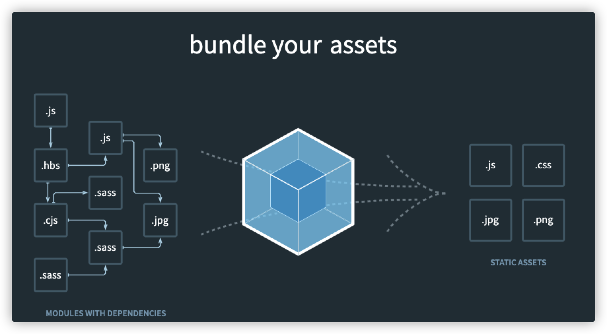

# 一、Webpack

## 1.1 Webpack是什么

Webpack是一个开源的JavaScript模块打包工具，其最核心的功能是解决模块之间的依赖，把前端的各种资源文件（js、css、jpg等）作为各个模块按照特定的规则和顺序组织在一起。

它根据模块的依赖关系进行静态分析，最终打包生成对应的静态资源。

这个过程就叫作模块打包。



## 1.2 JS中的模块

所谓模块，就是将特定功能的代码分拆成多个代码片段，每个片段实现一种目的，最终通过接口将它们组合在一起，各个模块协同工作，保证程序的正常运转。

在很长一段时间，JavaScript不像其他程序语言一般，能够使用模块化进行开发。因为这门语言诞生时，仅仅作为轻量级的脚本语言，为用户提供上传表单时的校验功能。

随着业务越来越复杂以及技术的发展，引入多个js文件到页面中已经逐渐成为常态，此时也暴露出一些问题：

* 需要手动维护JavaScript的加载顺序。页面中多个script之间通常存在依赖关系，但由于这种依赖关系是隐性的，当js文件过多时就容易出现问题。
* 每个script标签都意味着请求一次静态资源，过多的请求会拖慢页面的渲染速度。
* 每个script标签中，顶级作用域都是全局作用域，如果没有经过处理直接在代码中进行变量或者函数声明，会造成全局作用域的污染。

模块化则一一解决了上述问题：

* 通过导入和导出语句来分析模块间的依赖关系
* 使用工具将全部js文件打包成一个或多个文件，减少网络开销
* 多个模块间的作用域相互隔离，彼此之间不会存在命名冲突

对于模块化，社区提出了AMD、CMD、CommonJS等方案，ES6模块标准则将模块化提升到语言层面。但由于以下原因，ES6标准模块还不能用于实际应用：

1. 无法使用code splitting和tree shaking
2. 大部分npm模块采用ComminJS的规则，浏览器不支持其语法
3. 浏览器兼容性问题等

于是，我们依然使用模块打包工具。

模块打包工具的任务就是解决模块间的依赖，使其打包后的结果可以运行在浏览器上。

## 1.3 Webpack的优势

1. 默认支持多种模块标准，包括AMD、CommonJS、ES6模块等。它会帮我们处理好模块间的依赖关系。
2. 完备的代码分割（code splitting）解决方案。它可以分割打包后的资源，首屏只加载必要的部分，不太重要的功能动态加载。这有助于有效减少资源体积，提升首页渲染速度。
3. Webpack可以处理各种类型的资源，js、图片、css等等。
4. Webpack有庞大的社区支持。

## 1.4 五个核心概念

1. entry：入口。指定打包工具从哪个文件开始构建内部依赖图，并以此为起点打包
2. output：输出。指定打包好后的bundles资源最终输出到哪个地方，输出名字是什么
3. loader：加载器。让webpack能够处理非js文件的翻译、打包工作。（例如less、image等静态资源）
4. plugin：插件。让webpack能够处理打包优化、压缩等功能性任务
5. mode：模式。development模式、production模式、none。能够设置`process.env.NODE_ENV`的值，并且根据环境不同自动开启一些插件。

## 1.5 打包js文件

```bash
mkdir webpack-demo-1
cd webpack-demo-1
// 初始化
yarn init -y
// 安装webpack和cli工具
yarn add webpack webpack-cli --dev
// 查看版本
npx webpack -v
```

添加文件

```javascript
// index.js
import addContent from './add-content.js';
document.write('My first Webpack app.<br /> I using yarn build now');
addContent();
```

```javascript
// add-content.js
export default function () {
  document.write('Hello world!');
}
```

```html
// index.html
<!DOCTYPE html>
<html lang="zh-CN">
  <head>
    <meta charset="UTF-8" />
    <title>My first Webpack app.</title>
  </head>
  <body>
    <script src="./dist/bundle.js"></script>
  </body>
</html>
```

在`package.json`中添加命令：

```json
  ...
  "scripts": {
    "build": "webpack --entry=./index.js --output-filename=bundle.js --mode=development"
  },
  ...
```

添加命令后执行`yarn build`或者直接执行

```bash
npx webpack --entry=./index.js --output-filename=bundle.js --mode=development
```

命令行第1个参数和第2个参数的意思是：通过`entry`入口文件`index.js`将文件打包`output`输出成`bundle.js`。

Webpack会以当前文件下的index.js为入口点**查找模块依赖**，此时按照我们的`import`关键字，它一共可以找到`index.js`和`add-content.js`两个模块，并打包后放在`dist`目录下，打包后的文件名为`bundle.js`。

最后的参数mode指的是打包模式，一共有三种：development、production、none三种模式。它会自动添加适合于当前模式的一系列配置，减少了人为的工作量。

### 默认目录配置

webpack默认是从工程根目录的`src`目录下的`index.js`作为入口文件，打包好后的文件放在`dist`目录。

我们可以按照默认目录配置来简化我们的命令行。

上面的`index.js`和`add-content.js`一起存放在`src`目录，然后省略掉entry的配置。

```bash
  ...
  "scripts": {
    "build": "webpack --output-filename=bundle.js --mode=development"
  },
  ...
```

### 配置文件

Webpack提供大量的命令行参数，可以帮助我们满足各种场景的需求。

上面的例子我们已经看到了，我们可以定制入口文件和输出的文件名和指定模式等。

这些命令行参数可以使用下面的命令获取

```bash
npx webpack –h
```

命令中添加更多的参数仅适用于配置较少的项目，如果配置比较多，我们就需要专门的配置文件。

Webpack每次打包时都会读取该配置文件，这样就不必在命令行中添加太多参数了，方便后期修改维护。

默认的配置文件为`webpack.config.js`，也可以通过命令行参数`--config`指定配置文件。

```json
  "scripts": {
    "build": "webpack --config build.config.js",
  },
```

按照之前的命令行参数，默认的配置文件可以这样配：

```javascript
// webpack.config.js
module.exports = {
  entry: './src/index.js',
  output: { filename: 'bundle.js' },
  mode: 'development',
};
```

`output.filename`还是跟先前一样，但是如果要配置`output.path`——最终资源输出路径则需要**绝对路径**。

默认的配置输出路径是

```json
  output: {  path: path.join(__dirname, 'dist') } 
```

>  由于是默认配置所以webpack.config.js中省略了上面的配置

配置好配置文件后，我们就可以去除`package.json`中配置的打包参数了。

```json
  "scripts": {
    "build": "webpack"
  },
```

执行`yarn build`后，webpack会预读配置文件中的配置，再进行打包。


## 1.6 打包css

打包除js文件外的资源需要用到`loader`，根据目前的官方网站，配置如下：

```javascript
// webpack.config.js
module.exports = {
  ...
  module: {
    rules: [
      {
        test: /\.css$/i,
        use: ['style-loader', 'css-loader'],//注意顺序，webpack从右到左读取loader
      },
    ],
  },
};
```

安装两个loader

```bash
yarn add style-loader css-loader --dev
```

使用：

```javascript
import './login.css'
```

`style-loader`用于将css插入到页面中，`css-loader`是用于识别并打包css文件。


## 1.7 打包less

安装less和less-loader

```bash
yarn add less less-loader --dev
```

配置：

```js
// webpack.config.js
module.exports = {
  ...
  module: {
    rules: [
      {
        test: /\.less$/i,
        use: ['style-loader', 'css-loader', 'less-loader'],
      },
    ],
  },
};
```

## 1.8 postcss

postcss是利用JavaScript转换样式的工具。我们可以用它配合`autoprefixer`来给css添加更多兼容性的前缀代码以支持更多浏览器平台。

```bash
yarn add postcss autoprefixer postcss-loader --dev
```

配置：

```json
  module: {
    rules: [
      {
        test: /\.css$/i,
        use: [
          'style-loader',
          'css-loader',
          {
            loader: 'postcss-loader',
            options: {
              postcssOptions: {
                plugins: [require('autoprefixer')],
              },
            },
          },
        ],
      },
    ],
  },
```

postcss中还有很多有关于css加载所需要的插件，都集成到`postcss-preset-env`的插件中了，比如能够让浏览器支持`#12345678`这样的八位数颜色以及`autoprefixer`支持的功能。

使用方法：

```bash
yarn add postcss-preset-env --dev
```

直接配置在`options.postcssOptions.plugins`中即可

```json
              postcssOptions: {
                plugins: ['postcss-preset-env'],
              },
```

### **专用的postcss配置**

我们可以使用less、css等来书写css，而postcss则需要体现到所有css上，因此我们需要给所有css预编译工具配置postcss-loader，但这就会增加大量重复的配置代码。

为了解决这个问题，我们可以使用默认的`postcss.config.js`来给postcss做共同的配置。

```js
// postcss.config.js
module.exports = {
  plugins: ['postcss-preset-env'],
};
```

```js
// webpack.config.js
module.exports = {
...
  module: {
    rules: [
      {
        test: /\.css$/i,
        use: ['style-loader', 'css-loader', 'postcss-loader'],
      },
      {
        test: /\.less$/i,
        use: ['style-loader', 'css-loader', 'postcss-loader', 'less-loader'],
      },
    ],
  },
};
```

