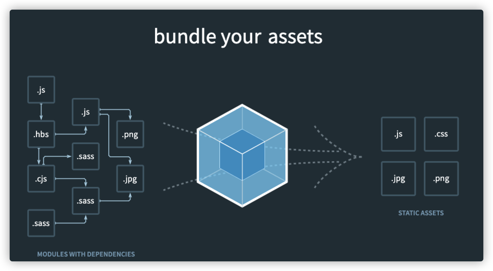

# 一、基本概念

## 1.1 Webpack是什么

Webpack是一个开源的JavaScript模块打包工具，其最核心的功能是解决模块之间的依赖，把前端的各种资源文件（js、css、jpg、png等等）作为各个模块按照特定的规则和顺序组织在一起。

它根据模块的依赖关系进行静态分析，最终打包生成对应的静态资源。

这个过程就叫作模块打包。

官网上的构建图示能很好地说明`Webpack`的作用




## 1.2 JS中的模块

所谓模块，就是将特定功能的代码分拆成多个代码片段，每个片段实现一种目的，最终通过接口将它们组合在一起，各个模块协同工作，保证程序的正常运转。

在很长一段时间，JavaScript不像其他程序语言一般，能够使用模块化进行开发。因为这门语言诞生时，仅仅作为轻量级的脚本语言，为用户提供上传表单时的校验功能。

随着业务越来越复杂以及前端技术的发展，引入多个js文件到页面中已经逐渐成为常态，此时也暴露出一些问题：

* 需要手动维护JavaScript的加载顺序。页面中多个script之间通常存在依赖关系，但由于这种依赖关系是隐性的，当js文件过多时就容易出现问题。
* 每个script标签都意味着请求一次静态资源，过多的请求会拖慢页面的渲染速度。
* 每个script标签中，顶级作用域都是全局作用域，如果没有经过处理直接在代码中进行变量或者函数声明，会造成全局作用域的污染。

模块化则一一解决了上述问题：

* 通过导入和导出语句来分析模块间的依赖关系
* 使用工具将全部js文件打包成一个或多个文件，减少网络开销
* 多个模块间的作用域相互隔离，彼此之间不会存在命名冲突

对于模块化，社区提出了AMD、CMD、CommonJS等方案，ES6模块标准则将模块化提升到语言层面。但由于以下原因，ES6标准模块还不能用于实际应用：

1. 无法使用code splitting和tree shaking
2. 大部分npm模块采用ComminJS的规则，浏览器不支持其语法
3. 浏览器兼容性问题等

于是，我们需要使用模块打包工具来帮助我们完成一系列工作。

模块打包工具的任务就是解决模块间的依赖，使其打包后的结果可以运行在浏览器上。


## 1.3 打包工具做了什么

使用打包工具的一个好处是 —— 它们可以更好地控制模块的解析方式，允许我们使用裸模块和更多的功能，例如 CSS/HTML 模块等。

打包工具做以下内容：

1. 从一个打算放在 HTML 中的 `<script type="module">` “主”模块开始。（Webpack默认从`index.js`开始）
2. 分析它的依赖：它的导入，以及它的导入的导入等。
3. 使用所有模块构建一个文件（或者多个文件，这是可调的），并用打包函数（bundler function）替代原生的 `import` 调用，以使其正常工作。还支持像 HTML/CSS 模块等“特殊”的模块类型。
4. 在处理过程中，可能会应用其他转换和优化：
   - 删除无法访问的代码。
   - 删除未使用的导出（“tree-shaking”）。
   - 删除特定于开发的像 `console` 和 `debugger` 这样的语句。
   - 可以使用 [Babel](https://babeljs.io/) 将前沿的现代的 JavaScript 语法转换为具有类似功能的旧的 JavaScript 语法。
   - 压缩生成的文件（删除空格，用短的名字替换变量等）。

如果我们使用打包工具，那么脚本会被打包进一个单一文件（或者几个文件），在这些脚本中的 `import/export` 语句会被替换成特殊的打包函数（bundler function）。因此，最终打包好的脚本中不包含任何 `import/export`，它也不需要 `type="module"`，我们可以将其放入常规的 `<script>`：

```html
<!-- 假设我们从诸如 Webpack 这类的打包工具中获得了 "bundle.js" 脚本 -->
<script src="bundle.js"></script>
```


## 1.4 Webpack的优势

1. 默认支持多种模块标准，包括AMD、CommonJS、ES6模块等。它会帮我们处理好模块间的依赖关系。

2. 完备的代码分割（code splitting）解决方案。它可以分割打包后的资源，首屏只加载必要的部分，不太重要的功能动态加载。这有助于有效减少资源体积，提升首页渲染速度。

3. Webpack可以处理各种类型的资源，js、图片、css等等。

4. Webpack有庞大的社区支持,插件齐全。

   

## 1.5 Webpack五个核心概念

* `entry`：入口。指定打包工具从哪个文件开始构建内部依赖图，并以此为起点打包

* `output`：输出。指定打包好后的bundles资源最终输出到哪个地方，输出名字是什么

* `loader`：加载器。让webpack能够处理非js文件的翻译、打包工作。（例如less、image等静态资源）

* `plugin`：插件。让webpack能够处理打包优化、压缩、生成模板等功能性任务。

* `mode`：模式。development模式、production模式、none。能够设置`process.env.NODE_ENV`的值，并且根据环境不同自动开启一些插件。


# 二、准备工作

## 2.1 初始化项目 

```bash
mkdir webpack-demo-1
cd webpack-demo-1
// 初始化
yarn init -y
// 安装webpack和cli工具
yarn add webpack webpack-cli --dev
// 查看版本
npx webpack -v
```

为了测试，我们首先在根目录下创建`src`目录，并创建三个文件(`index.html`在根目录下)

```bash
index.html
src
├── index.css
└── index.js

```

分别在里面添加内容:

index.css

```css
div {
  color: red;
  font-size: 16px;
}
```

index.html

```html
<!DOCTYPE html>
<html lang="en">
  <head>
    <meta charset="UTF-8" />
    <meta http-equiv="X-UA-Compatible" content="IE=edge" />
    <meta name="viewport" content="width=device-width, initial-scale=1.0" />
    <title>first webpack app</title>
  </head>
  <body></body>
  <script src="./dist/bundle.js"></script>
</html>
```

index.js

```js
function createElement() {
  const div = document.createElement('div');
  div.innerHTML = 'hello world';
  document.body.append(div);
}
createElement();
```

## 2.2 打包第一个js文件

初始化好后，我们可以看到`index.html`上的`<script src="./dist/bundle.js"></script>`，目前我们的项目并没有创建`dist`这个目录，`bundle.js`也是不存在的，我们期望能够用`webpack`打包`index.js`的内容。

此时在命令行上输入：

```bash
npx webpack --entry=./src/index.js --output-filename=bundle.js --mode=development
```

`npx webpack`是在本地用`npx`启动`webpack`的意思

`--entry` 参数是寻找当前目录下的`src/index.js`文件

`--output-filename` 是指定输出的文件名

`--mode `指的是开发模式

此时，根目录下应该会多了`dist`目录，下面有一个`bundle.js`的文件，它就是打包后的`index.js`文件。

如果此时用`http-server`或者`vscode`的`open in browser`插件打开本地项目，你会发现`chrome`浏览器屏幕前输出现`hello world`字样，代表打包成功了。

简单总结，我们刚才的操作是：

`Webpack`以`entry`指定的入口文件`src/index.js`为入口点**查找模块依赖**，此时没有其他依赖。于是通过`output`输出成`bundle.js`。

最后的参数mode指的是打包模式，一共有三种：development、production、none三种模式。它会自动添加适合于当前模式的一系列配置，减少了人为的工作量。

## 2.3 配置script

由于使用cli的方式会增加很多指令参数，不容易维护，所以我们需要在`package.json`中添加脚本，这样就不需要输入那么长的指令了。

在`package.json`中添加命令：

```json
  ...
  "scripts": {
    "build": "webpack --output-filename=bundle.js --mode=development"
  },
  ...
```

上面的脚本省略掉了`entry`的配置。

这是因为`webpack`默认是从工程根目录的`src`目录下的`index.js`作为入口文件，打包好后的文件自动放在`dist`目录。所以我们可以按照默认目录配置来简化我们的命令行。

此时通过`yarn build`也可以打包。

## 2.4 配置文件

Webpack提供大量的命令行参数，可以帮助我们满足各种场景的需求。

上面的例子我们已经看到了，我们可以定制入口文件和输出的文件名和指定模式等。

这些命令行参数可以使用下面的命令获取

```bash
npx webpack –h
```

命令中添加更多的参数仅适用于配置较少的项目，如果配置比较多，我们就需要专门的配置文件。

Webpack每次打包时都会读取该配置文件，这样就不必在命令行中添加太多参数了，方便后期修改维护。

默认的配置文件为`webpack.config.js`，也可以通过命令行参数`--config`指定配置文件。

```json
  "scripts": {
    "build": "webpack --config build.config.js",
  },
```

这里就按照之前的命令行参数，在根目录下创建`webpack.config.js`,并且加入配置项：

```javascript
// webpack.config.js
module.exports = {
  entry: './src/index.js',
  output: { filename: 'bundle.js' },
  mode: 'development',
};
```

`output.filename`还是跟先前一样，但是如果要配置`output.path`——最终资源输出路径则需要**绝对路径**。

默认的配置输出路径相当于

```js
  output: {  path: path.join(__dirname, 'dist') } 
```

>  由于是默认配置所以webpack.config.js中省略了`output.path`的配置

写好配置项后，我们就可以去除`package.json`中配置的打包参数了。

```json
  "scripts": {
    "build": "webpack"
  },
```

执行`yarn build`后，`webpack`会预读`webpack.config.js`中的配置，再进行打包。

当构建后，请使用编辑器打开并在chrome上查看结果。


# 三、开始实战

## 3.1 打包css 

我们在准备工作中虽然写了css，但是实际打包后并没有css的效果，这是因为webpack在分析依赖时，并没有找到css的引入语句。

我们可以在`index.js`上引入css

```js
import './index.css';
```

打包除js文件外的资源需要用到`loader`，我们先安装两个loader：

```bash
yarn add style-loader css-loader --dev
```

根据目前的官方网站，配置如下：

```javascript
// webpack.config.js
module.exports = {
  ...
  module: {
    rules: [
      {
        test: /\.css$/i,
        use: ['style-loader', 'css-loader'],//注意顺序，webpack从右到左读取loader
      },
    ],
  },
};
```

`style-loader`用于将css插入到页面中，`css-loader`是用于识别并打包css文件。

配置完后，请用`yarn build`构建并在`chrome`上查看结果，以下不再提示。

## 3.2 打包less

我们先在`src`目录下增加一个`style.less`的文件，内容如下：

```css
@width: 100px;
@height: 100px;
div {
  background-color: aqua;
  width: @width;
  height: @height;
  border: 1px solid red;
  user-select: none;
}
```

然后在`index.js`中引入`less`：

```css
import './style.less';
```

接着安装less和less-loader

```bash
yarn add less less-loader --dev
```

配置：

```js
// webpack.config.js
module.exports = {
  ...
  module: {
    rules: [
      ...
      {
        test: /\.less$/i,
        use: ['style-loader', 'css-loader', 'less-loader'],
      },
    ],
  },
};
```


## 3.3 postcss

postcss是利用JavaScript转换样式的工具。我们可以用它配合`autoprefixer`来给css添加更多兼容性的前缀代码以支持更多浏览器平台。

首先我们在当前的index.css上加一句css代码：

```css
@import './style.less';
div {
  color: red;
  font-size: 16px;
  /* 为了查看postcss-loader有没有效果 */
+ user-select: none;
}
```

```bash
yarn add postcss autoprefixer postcss-loader --dev
```

然后在webpack中配置规则：

```js
  module: {
    rules: [
      {
        test: /\.css$/i,
        use: [
          'style-loader',
          'css-loader',
          {
            loader: 'postcss-loader',
            options: {
              postcssOptions: {
                plugins: [require('autoprefixer')],
              },
            },
          },
        ],
      },
    ],
  },
```

经过打包后，查看打包后的页面，会发现已经被添加了兼容性的前缀代码


postcss中还有很多有关于css加载所需要的插件，都集成到`postcss-preset-env`的插件中了，比如能够让浏览器支持`#12345678`这样的八位数颜色以及`autoprefixer`支持的功能。

我们也可以直接使用这个预设的插件，这样就相当于用了很多个类似`autoprefixer`这样的小`loader`。

使用方法：

```bash
yarn add postcss-preset-env --dev
```

直接配置在`options.postcssOptions.plugins`中即可,这里就替换掉上面的`require(autoprefixer)`,因为`postcss-preset-env`已经拥有它的功能了。

```js
              postcssOptions: {
                plugins: ['postcss-preset-env'],
              },
```

### **专用的postcss配置**

我们可以使用less、css等来书写css，而postcss则需要体现到所有css上，因此我们需要给所有css预编译工具配置postcss-loader，但这就会增加大量重复的配置代码。

为了解决这个问题，我们可以使用默认的`postcss.config.js`来给postcss做共同的配置。

在根目录下创建`postcss.config.js`，内容如下：

```js
// postcss.config.js
module.exports = {
  plugins: ['postcss-preset-env'],
};
```

然后同步修改`webpack.config.js`配置

```js
// webpack.config.js
module.exports = {
...
  module: {
    rules: [
      {
        test: /\.css$/i,
        use: ['style-loader', 'css-loader', 'postcss-loader'],
      },
      {
        test: /\.less$/i,
        use: ['style-loader', 'css-loader', 'postcss-loader', 'less-loader'],
      },
    ],
  },
};
```

设置好后，webpack打包代码时，会从`use`的最后一项开始（比如`less-loader`）往前执行`loader`，当执行到`postcss-loader`时，会读取`postcss.config.js`的配置，最后执行`css-loader`和`style-loader`。


## 3.4 importLoader

css-loader能够支持类似于`@import xxx.css`之类的css引入。

例如我们在`index.css`中用这种方法引入的`test.css`

```js
@import './test.css';
div {
  color: red;
  font-size: 16px;
  /* 为了查看postcss-loader有没有效果 */
  user-select: none;
}
```

`test.css`内容如下：

```css
body {
  background-color: antiquewhite;
  min-height: 100vh;
  user-select: none;
}
```

但是根据目前配置，当`css-loader`识别到这个代码时，`postcss-loader`已经加载过了，就会导致`test.css`无法获得`postcss`的支持，所以需要修改`css-loader`的配置。

```js
  module: {
    rules: [
      {
        test: /\.css$/i,
        use: [
          'style-loader',
          {
            loader: 'css-loader',
            options: {
              importLoaders: 1, // 期望往回加载的位数，1代表往回1位-也就是postcss-loader加载
            },
          },
          'postcss-loader',
        ], //注意顺序，webpack从右到左读取loader
      },
      {
        test: /\.less$/i,
        use: ['style-loader', 'css-loader', 'postcss-loader', 'less-loader'],
      },
    ],
  },
```

当`css-loader`读取到新的css时（此时可能这段新的css没有被postcss-loader处理过），配置了`options.importLoaders`属性后，会重新往回找`options.importLoaders`位，再依次往后重新loader一遍。

上面的例子是往回1位找`postcss-loader`。如果此时`postcss-loader`前还有`other-loader`，我们又希望它能够加载，那么可以填2。

## 3.5 file-loader打包图片

实际开发中，我们会将图片等资源放到一个叫`assets`的目录下。现在我们在`src`目录下创建`assets`目录，然后随便放一张图片进去。

随后在`index.js`中加入以下代码

```js
import animal from './assets/animal.jpg';
// 或 const animal= require('./assets/animal.jpg')

function createImg() {
  const img = new Image();
  img.src = animal;
  document.body.append(img);
}
createImg();
```

然后下载

```bash
yarn add file-loader --dev
```

配置：

```js
module.exports = {
  module: {
    rules: [
      {
        test: /\.css$/i,
        use: [
          'style-loader',
          {
            loader: 'css-loader',
            options: {
              importLoaders: 1, // 期望往回加载的位数，1代表往回1位-也就是postcss-loader加载
              esModule: false, // 这里需要关闭esModule
            },
          },
          'postcss-loader',
        ], //注意顺序，webpack从右到左读取loader
      },
    // ...省略其他loader
      {
        test: /\.(png|jpe?g|gif)$/i,
        use: [
          {
            loader: 'file-loader',
            options: {
              esModule: false, //不转为 esModule
              name: '[name].[hash:6].[ext]',//按照name+6位hash+扩展名的规则来命名
              outputPath:'image' //输出目录
            },
          },
        ],
      },
    ],
  },
};
```

如果不配置`options.esModule`，则需要使用`require().default`或者仅使用`import xx from 'xxx' `语句。

除此之外，还需要在`css-loader`处关闭esModule，这是因为类似于下面的代码，会被替换成`require`语法，替换成`require`语法后，需要用`.default`才能正常访问，这是不符合正常开发习惯的。

```css
// index.css
div {
  background: url('./assets/animal.jpg');/*会被替换成require('./assets/animal.jpg') */
}
```

> 请在index.css上加入上面的代码，然后删除css-loader处的`esModule:false`代码测试一下。


## 3.6 url-loader打包图片

`url-loader`包含了`file-loader`的功能，此外它还可以将图片等资源打包成base64的形式，这样打包后的`dist`目录下就不会有对应的静态资源了，资源会转化成base64代码储存在打包后的`bundle.js`中。

好处是减少了静态资源的请求，坏处是静态资源越大，页面显示出来所需要的时间就越长。

我们开发时，一般都将体积小于10kb或者20kb的转成base64。

请在`assets`目录下分别放置一张20kb以上和一张20kb以下的图片，然后在`index.js`中引入比较大的图片，在`index.css`中引入比较小的图片

```js
// index.js
import dp from './assets/dp.png';// 这是比较大的图片
function createImg() {
  const img = new Image();
  img.src = dp;
  document.body.append(img);
}
```

```css
// index.css
div {
  background: url('./assets/animal.jpg');/* 这是比较小的图片 */
}
```

然后下载

```bash
yarn add url-loader --dev
```

将原来的`file-loader`配置修改成以下：

```js
      {
        test: /\.(png|jpe?g|gif)$/i,
        use: [
          {
            loader: 'url-loader',
            options: {
              esModule: false, //不转为 esModule
              name: '[name].[hash:6].[ext]', //按照name+6位hash+扩展名的规则来命名
              outputPath: 'image', //输出目录
              limit: 20 * 1024, // 限制20kb以下才打包成base64
            },
          },
        ],
      },
```

**请删除原来的`dist`目录**，然后重新打包，你会看到新生成的`dist`目录只有一个大的图片被打包了


这是因为我们的配置是将20kb以下的图片转成base64的代码，而20kb以上的依然打包到`image`目录下。

## 3.7 asset模块打包静态资源

webpack5内置了asset模块，它包含了`file-loader`和`url-loader`这两个旧模块的功能。

如果我们希望asset模块将所有静态资源以相同的命名规则打包到相同的目录下，则可以在`output.assetModuleFilename`中配置。

```js
  output: {
    ...
    assetModuleFilename: 'asset/[name].[hash:6][ext]', //asset模块全局配置
  },
```

> 由于静态资源的种类较多，包含图片、文件、字体等，所以一般不用全局配置。

如果我们希望有`file-loader`的功能，可以使用`asset/resource`

```js
  module: {
    rules: [
    ...
      {
        test: /\.(png|jpe?g|gif|svg)$/i,
        type: 'asset/resource',
        generator: {
          filename: 'assets/[name].[hash:6][ext]',
        },
      },
    ],
  }
```

如果希望有`url-loader`的功能，可以使用`asset/inline`

```js
  module: {
    rules: [
    ...
      {
        test: /\.(png|jpe?g|gif|svg)$/i,
        type: 'asset/inline',
      },
    ],
  }
```

如果希望混用，则直接使用`asset`

```js
  module: {
    rules: [
    ...
      {
        test: /\.(png|jpe?g|gif|svg)$/i,
        type: 'asset',
        generator: {
          filename: 'assets/[name].[hash:6][ext]', //输出规则
        },
        parser: {
          dataUrlCondition: {
            maxSize: 20 * 1024, // 小于20kb则解析成dataUrl
          },
        },
      },
    ],
  }
```

我在这里直接使用`asset`混用模式的配置来替换掉上面的`url-loader`模块。

> 请删除原来的dist目录再重新打包试一试。由于目前没配plugin，所以只能手动清除原有的dist目录。

## 3.8 使用plugin在打包前删除dist

webpack在打包时并不会删除原有的`dist`目录，而是在其基础上替换内容，所以我们需要手动删除`dist`目录，下面介绍打包时自动帮我们先删除`dist`目录的`plugin`。

```bash
yarn add clean-webpack-plugin --dev
```

使用：

```js
const { CleanWebpackPlugin } = require('clean-webpack-plugin');
const path = require('path');
module.exports = {
  entry: './src/index.js',
  output: {
    path: path.join(__dirname, 'dist'),
  ...
  },
  mode: 'development',
  module: {
  ...
  },
  plugins: [new CleanWebpackPlugin()],//插件会被当成类来用
};
```

这里有一点需要注意：我们需要手动设置上`output.path`。

`clean-webpack-plugin`在执行时，会读取`webpack.config.js`中的`output.path`，如果没加上的话，会报错：

```bash
clean-webpack-plugin: options.output.path not defined. Plugin disabled...
```

## 3.9 打包字体

`assets/resource`还可以用来打包字体，配置如下：

```js
  module: {
    rules: [
    ...
      {
        test: /\.(ttf|woff2?)$/i,
        type: 'asset/resource',
        generator: {
          filename: 'fonts/[name].[hash:3][ext]', //输出规则
        },
      },
    ],
  }
```

## 3.10 html-webpack-plugin

这个插件用于生成`index.html`。

用它可以指定一个`html`模板，每次打包后，webpack会用该模板新生成一个`index.html`，并且自动引入打包好的资源。

插件内置`.ejs`文件作为模板，我们也可以手动指定自己写好的模板,下面是使用自己创建的模板的示例：

在根目录的`public`目录下，创建了一个`template.html`的模板，内容如下：

```html
<!DOCTYPE html>
<html lang="en">
  <head>
    <meta charset="UTF-8" />
    <meta http-equiv="X-UA-Compatible" content="IE=edge" />
    <meta name="viewport" content="width=device-width, initial-scale=1.0" />
    <link rel="icon" href="<%=BASE_URL %>favicon.ico" />
    <title><%= htmlWebpackPlugin.options.title %></title>
  </head>
  <body>
    <div id="root"></div>
  </body>
</html>
```

下载

```bash
yarn add html-webpack-plugin --dev
```

插件配置：

```js
const { DefinePlugin } = require('webpack');//webpack自带的初始化插件
const HtmlWebpackPlugin = require('html-webpack-plugin');

module.exports = {
  entry: './src/index.js',
  output: {
  	...
  },
  mode: 'development',
  module: {
    rules: [
    ...
    ],
  },
  plugins: [
    new CleanWebpackPlugin(),
    new HtmlWebpackPlugin({
      title: 'my APP',
      template: './public/template.html', //指定index.html模板而不用插件内置的ejs模板
    }),
    new DefinePlugin({
      BASE_URL: '"./"', // 可以替换模板中的<%=BASE_URL %> 为”./“
    }),
  ],
};
```

执行`yarn build`后，请用chrome打开`dist/index.html`，会看到这个模板已经将打包好的资源都引入过来了。

这样就节省了我们手动引入资源到`index.html`下的繁琐环节了。

到这为止，我们就可以将根目录下的`index.html`删除掉了。

## 3.11 babel的使用

为了让浏览器平台直接使用`JSX`、`TS`、`es6`等代码，在打包前，可以用babel插件转换一下语法。

下载

```bash
yarn add @babel/core --dev // babel核心，需要跟各种插件配合
yarn add @babel/preset-env --dev // babel预设的插件集合
yarn add babel-loader --dev // babel的webpack loader
```

在项目`src`目录下，创建`es6.js`,内容如下：

```js
export const a = () => {
  const arr = [1, 2, 3];
  const arr2 = [...arr];
  const [a, ...rest] = arr2;
  console.log(a);
  console.log(rest);
};
```

然后在`index.js`中，引入并执行：

```js
import { a } from './es6';
a();
```

跟postcss一样，babel中包含大量的插件，比较好的实践是我们单独在根目录下创建`babel.config.js`

```js
// babel.config.js
module.exports = {
  presets: ['@babel/preset-env'],
};
```

在`webpack.config.js`中配置：

```js
// webpack.config.js 
  module: {
    rules: [
      {
        test: /\.js$/i,
        use: ['babel-loader'],
      },
    ],
  }
```

构建后打开`bundle.js`，仔细翻一下，可以看到我们的代码被转译了：


## 3.12 copy-webpack-plugin

实际项目中，有时候我们并不希望资源被打包，而仅仅是拷贝到dist目录下就行。

比如，开发时会把要打包的静态资源放到`src/assets`中，一些直接拿来就可以用的静态资源则会放到`public`目录下，然后`build`时在`public`目录下的资源我们希望它们可以不经过`loader`处理，直接被拷贝至`dist`目录，这样发布线上后可以直接使用。

这样的需求下，我们可以使用`copy-webpack-plugin`来帮我们做这件事。

安装：

```bash
yarn add copy-webpack-plugin --dev
```

在根目录下的`public`内放置一张图片或者其他静态资源，目前我的`public`目录结构是这样的：

```js
.
├── dp.png
├── template.html
```

其中`dp.png`是我需要直接拷贝到`dist`目录内的静态资源，`template.html`是模板。

接着在`index.js`中把原来的`createImage`函数修改成这样：

```js
function createImg() {
  const img = new Image();
  // 注意，这里不再使用require或者import语句，因为不需要经过打包，直接用拷贝到dist内的资源
  img.src = './dp.png'; 
  document.body.append(img);
}
```

我们在引用该静态资源时，已经预先知道它会被拷贝到`dist`目录下了，所以可以直接用`./`而不是`require`或`import`。

接着补充配置

```js
  plugins: [
  ...
    new CopyWebpackPlugin({
      patterns: [
        {
          from: 'public',
          globOptions: {
            ignore: ['**/template.html'], // 忽略public下的template.html
          },
        },
      ],
    }),
  ],
```

当前`public`下的`template.html`会被`html-webpack-plugin`拷贝到`dist`目录下并被读写成`index.html`模板，所以我们在这里就忽略它。

实际开发中，我们有时候也会这样用静态资源，很多框架就提供了这样的功能，一些特别大的静态资源（例如地图）等，我们并不需要它们再被打包工具“翻译”一遍，而是直接拷贝到`dist`目录，在这种情况下，我们就能够直接使用`./`的形式引入这些静态资源。

毫无疑问，如果你的项目中不需要被打包的静态资源特别多，那使用这种拷贝的方式能够大大提高上线前构建的速度。
