# Canvas 是什么

`Canvas` 是用过 `HTML` 的`<canvas>`元素和 `JavaScript`来绘制图形（主要是位图）的 API。

他可以用于：

* 动画
* 游戏画面
* 数据可视化
* 图片编辑
* 实时视频处理等

`Canvas API`主要用于 `2D`图形，不同于`WebGL`，虽然他们都用`<canvas>`元素，但`WebGL`主要用于绘制`2D` 和`3D` 图形。

一个简单的例子：

```html
  <style>
    #canvas {
      border: 1px solid red;
    }
  </style>
  <body>
    <canvas id="canvas"></canvas>

    <script>
      let canvas = document.getElementById("canvas");
      const ctx = canvas.getContext("2d");
      ctx.fillStyle = "green";
      ctx.fillRect(0, 0, 150, 100);
    </script>
  </body>
```

API 解释：

`canvas.getContext("2d")`获取这个元素的`context`，图像通过上下文来绘制。

2d 表示实际的绘制通过[`CanvasRenderingContext2D`](https://developer.mozilla.org/zh-CN/docs/Web/API/CanvasRenderingContext2D)来完成。

当前使用的是`fillStyle`来填充颜色，`fillRect`用来绘制矩形，这个 `API`将绘制的图像的左上角放在`canvas`的`(0,0)`位置，图像的大小为宽 150，高 100。

每个`canvas`的默认大小为 300*150，上面的代码会绘制出以下图形


# 基本概念

## canvas元素

如果需要使用 canvas，我们需要创建画布——这就是`<canvas>`标签。

`<canvas>`标签只有两个`attribute`属性——`width` 和 `height`。也可以使用 CSS 定义大小，但是绘制时图像会伸缩以适应它的框架尺寸，有时候会引发扭曲，所以我们需要用`width`和`height`来明确宽高。

`<canvas>`元素可以设置样式，如果没有规定规则时，会完全变成透明。

如果在里面放一些内容，那么浏览器会将其忽略。

比如下面的代码，在`<canvas>`加了一些文字，那么支持`<canvas>`的浏览器会忽略里面的内容，而只是渲染 canvas

```html
<canvas id="canvas"> 支持canvas 的浏览器会忽略这些文字</canvas>
```

## 渲染上下文（rendering context）

`<canvas>`元素创造了一个固定大小的画布，它公开了一个或多个**渲染上下文**，其可以用来绘制和处理要展示的内容。我们主要使用`2d`渲染上下文。

原先`<canvas>`是空白的，我们需要用 `JavaScript`获取`context`，然后在上面绘制。获取渲染上下文的 API 是`getContext()`方法。

```js
var ctx = canvas.getContext('2d');
```

一般我们需要通过`getContext`来判断浏览器是不是支持`<canvas>`标签。

```js
var canvas = document.getElementById('tutorial');

if (canvas.getContext){
  var ctx = canvas.getContext('2d');
  // drawing code here
} else {
  // canvas-unsupported code here
}
```

获取了上下文之后，我们可以用来绘制图形了。但在绘制图形之前，我们需要知道图形会画到画布的哪个位置。

`canvas` 栅格可以抽象表示画布的坐标和网格。

## canvas 栅格

每一个 canvas 都是带有栅格的画布，里面有坐标和各种网格。通常来说网格中的一个单元相当于canvas元素中的一像素。


栅格的起点是左上角`(0,0)`。所有元素的位置都相对于原点定位。

图中蓝色的坐标为距离左边 x 像素，距离顶部 y 像素，坐标为(x,y)。

## 绘制步骤

`<canvas>`只支持两种形式的图形绘制：**矩形和路径**，路径指的是由一个系列点连成的线段。

图形的基本元素是路径，路径是由不同颜色和宽度的线段或曲线相连形成的不同形状的点的集合。

一个路径是闭合的，使用路径绘制图形需要一些额外的步骤。

1. 创建路径起始点
2. 使用画图命令画路径
3. 闭合路径
4. 一旦路径生成，就只能通过描边或填充路径区域来渲染图形

对应的 API 如下：

* `beginPath()` 新建路径，生成后，图形绘制命令被指向到路径上生成路径
* `closePath()` 闭合路径之后图形绘制命令又被重新指向到上下文中
* `stroke()` 通过线条来绘制图形轮廓，就是描边
* `fill()` 通过填充路径的内容区域来生成实心图形，就是填充路径

生成路径的第一步叫做`beginPath`，实质上，路径是由很多子路径构成，这些子路径都是在一个列表中，所有的子路径（线、弧形等）构成图形。每次这个方法调用之后，列表清空重置，然后我们就可以重新绘制新的图形。

当调用`beginPath`后，第一条路径构造命令通常是`moveTo()`。因为我们需要专门指定起始位置。

第二步就是调用函数来指定绘制路径。

第三，就是闭合路径`closePath()`,这个方法不是必需要写的。这个方法会通过绘制一条从当前点到开始点的直线来闭合图形。如果图形已经闭合，那么什么都不做。

> 当调用 `fill` 函数时,所有没有闭合的形状都会自动闭合，所以我们不需要调用`closePath`函数。但是调用`stroke`不会自动闭合。

## moveTo 移动笔触

`moveTo`函数就类似在纸上将一支笔的笔尖从一个点移动到另一个点。然后以这个点为原点，开始绘制路径、描边等等。

通常在调用`beginPath`后，就需要移动笔触。

每次画完一个东西后，我们就需要移动笔触到新的地方来时描绘。

下面的代码可以画一个笑脸

```js
      function draw() {
        var canvas = document.getElementById("canvas");
        if (canvas.getContext) {
          var ctx = canvas.getContext("2d");

          ctx.beginPath();
          ctx.arc(75, 75, 50, 0, Math.PI * 2, true); // 绘制最外层的圆
          ctx.moveTo(110, 75); // 移动笔触到 110,75 的位置
          ctx.arc(75, 75, 35, 0, Math.PI, false); // 口(顺时针)
          ctx.moveTo(65, 65);
          ctx.arc(60, 65, 5, 0, Math.PI * 2, true); // 左眼
          ctx.moveTo(95, 65);
          ctx.arc(90, 65, 5, 0, Math.PI * 2, true); // 右眼
          ctx.stroke();
        }
      }
      draw();
```

`moveTo` 绘制的路径在实际图中我们看不到，以下用红色的路径将`moveTo`给画出来。


# 绘制形状

## lineTo 绘制直线

`lineTo(x,y)`

绘制一条从当前位置到指定x以及y位置的直线。

该方法有两个参数：x以及y ，代表坐标系中直线结束的点。开始点和之前的绘制路径有关，之前路径的结束点就是接下来的开始点，等等。。。开始点也可以通过`moveTo()`函数改变。

```js
      function draw() {
        var canvas = document.getElementById("canvas");
        if (canvas.getContext) {
          var ctx = canvas.getContext("2d");
          // 绘制填充三角形
          ctx.beginPath();
          ctx.moveTo(25, 25);
          ctx.lineTo(105, 25);
          ctx.lineTo(25, 105);
          ctx.fill();
          // 绘制描边三角形
          ctx.beginPath();
          ctx.moveTo(125, 125);
          ctx.lineTo(125, 45);
          ctx.lineTo(45, 125);
          ctx.closePath();
          ctx.stroke();
        }
      }
      draw();
```

上面的代码用`lineTo`绘制了路径，然后用`stroke`或者`fill`来渲染了路径，产生了两个不同的三角形。


由于`fill`会自动填充三角形，所以我们并不需要调用`closePath`来闭合它。但是`stroke`则需要`closePath`。

## 绘制矩形

绘制矩形可以使用三个语法糖方法：

* `fillRect(x,y,width,height)` 绘制一个填充的矩形
* `strokeRect(x,y,width,height)`绘制一个矩形的边框
* `clearRect(x,y,width,height)` 清除指定矩形区域，让清除部分完全透明

所有方法的参数都是一致的：

`x`和`y`是指定了在 canvas 画布上所绘制矩形的左上角的坐标。`width` 和` height`设置矩形的尺寸。

```js
      function drawn() {
        let canvas = document.getElementById("canvas");
        if (canvas.getContext) {
          const ctx = canvas.getContext("2d");
          ctx.fillRect(25, 25, 100, 100);
          ctx.clearRect(45, 45, 60, 60);
          ctx.strokeRect(50, 50, 50, 50);
        }
      }
```

`fillRect`绘制了边长为 100 的黑色正方形

`clearRect`从正方形的中心开始擦除一个 60*60 的正方形

`strokeRect`在清除区域内生成一个 50*50 的正方形边框

最终效果：


以上三种画矩形的方法都是基于`rect`方法来实现的语法糖：

`rect(x, y, width, height)`

绘制一个左上角坐标为（x,y），宽高为width以及height的矩形。

当该方法执行的时候，moveTo()方法自动设置坐标参数（0,0）。也就是说，当前笔触自动重置回默认坐标。

这个方式需要手动调用`stroke`或者`fill`方法来渲染路径，相当于

 `fillRect = rect + fill` 

`strokeRect = rect + stroke`

```js
      function draw() {
        var canvas = document.getElementById("canvas");
        if (canvas.getContext) {
          const ctx = canvas.getContext("2d");
          ctx.rect(25, 25, 100, 100);
          ctx.stroke();
        }
      }
```

画多个图形

```js
    <script>
      function drawn() {
        let canvas = document.getElementById("canvas");
        if (canvas.getContext) {
          const ctx = canvas.getContext("2d");
          ctx.fillStyle = "green";
          ctx.fillRect(10, 10, 150, 100);

          ctx.fillStyle = "red";
          ctx.fillRect(30, 30, 150, 100);
        }
      }
      drawn();
    </script>
```

上面的代码会渲染出以下图形：


所有其他类型的图形都是通过一条或者多条路径组合而成的。

## 绘制三角形

```html
  <body>
    <canvas id="canvas"></canvas>
    <script>
      function draw() {
        var canvas = document.getElementById("canvas");
        if (canvas.getContext) {
          var ctx = canvas.getContext("2d");

          ctx.beginPath();
          ctx.moveTo(75, 50); // 设置 canvas 内x 轴为 75，y 轴 50 的起点
          ctx.lineTo(100, 75); // 从起点往x 轴为 100，y 轴为 75 的地方绘制路径
          ctx.lineTo(100, 25); // 从上面的位置到x 轴为 100，y 轴为 25 的地方绘制路径
          ctx.closePath(); // 关闭路径，从现在的点回到起始点
          ctx.stroke(); // 绘制路径
        }
      }
      draw();
    </script>
  </body>
```


只有调用了`stroke`之后才会给路径渲染轮廓，否则只是把路径给绘制出来了，对视觉来说是透明的。


## arc 绘制圆弧

如果要画圆或者圆弧，我们使用`arc`方法。

[`arc(x, y, radius, startAngle, endAngle, anticlockwise)`](https://developer.mozilla.org/zh-CN/docs/Web/API/CanvasRenderingContext2D/arc)

这个 API 的意思是以(x,y)为圆心的以 radius 为半径的，从`startAngle`开始到`endAngle`结束，按照`anticlockwise`给定的方法（默认为顺时针）来生成。

`startAngle`以及`endAngle`参数用弧度定义了开始以及结束的弧度。这些都是以x轴为基准。参数`anticlockwise`为一个布尔值。为`true`时，是逆时针方向，否则顺时针方向。

弧度的计算：0 到`Math.PI`是半圆，0 到`Math.PI * 2`是全圆。

绘制一个圆的代码是：

```js
      function draw() {
        var canvas = document.getElementById("canvas");
        if (canvas.getContext) {
          var ctx = canvas.getContext("2d");

          ctx.beginPath();
          ctx.arc(55, 55, 50, 0, Math.PI * 2, true); // 绘制最外层的圆
          ctx.stroke();

          ctx.beginPath();
          ctx.arc(95, 95, 50, 0, Math.PI * 2, true); // 绘制最外层的圆
          ctx.fill();
        }
      }
      draw();
```


## 贝塞尔曲线

贝塞尔曲线可以描绘比较复杂的图形，有二次贝塞尔和三次贝塞尔曲线。

```
quadraticCurveTo(cp1x, cp1y, x, y)
```

绘制二次贝塞尔曲线，`cp1x,cp1y`为一个控制点，`x,y为`结束点。

```
bezierCurveTo(cp1x, cp1y, cp2x, cp2y, x, y)
```

绘制三次贝塞尔曲线，`cp1x,cp1y`为控制点一，`cp2x,cp2y`为控制点二，`x,y`为结束点。

二次贝塞尔曲线有一个开始点（蓝色）、一个结束点（蓝色）以及一个控制点（红色），而三次贝塞尔曲线有两个控制点。


参数x、y在这两个方法中都是结束点坐标。`cp1x,cp1y`为坐标中的第一个控制点，`cp2x,cp2y`为坐标中的第二个控制点。

使用二次以及三次贝塞尔曲线是有一定的难度的，因为不同于像Adobe Illustrators这样的矢量软件，我们所绘制的曲线没有给我们提供直接的视觉反馈。这让绘制复杂的图形变得十分困难。

下面直接贴例子吧：

多个二次贝塞尔曲线来渲染对话气泡。

```js
function draw() {
  var canvas = document.getElementById('canvas');
  if (canvas.getContext) {
    var ctx = canvas.getContext('2d');

    // 二次贝塞尔曲线
    ctx.beginPath();
    ctx.moveTo(75, 25);
    ctx.quadraticCurveTo(25, 25, 25, 62.5);
    ctx.quadraticCurveTo(25, 100, 50, 100);
    ctx.quadraticCurveTo(50, 120, 30, 125);
    ctx.quadraticCurveTo(60, 120, 65, 100);
    ctx.quadraticCurveTo(125, 100, 125, 62.5);
    ctx.quadraticCurveTo(125, 25, 75, 25);
    ctx.stroke();
   }
}
```


三次贝塞尔曲线画心

```js
function draw() {
  var canvas = document.getElementById('canvas');
  if (canvas.getContext){
    var ctx = canvas.getContext('2d');

     //三次贝塞尔曲线
    ctx.beginPath();
    ctx.moveTo(75, 40);
    ctx.bezierCurveTo(75, 37, 70, 25, 50, 25);
    ctx.bezierCurveTo(20, 25, 20, 62.5, 20, 62.5);
    ctx.bezierCurveTo(20, 80, 40, 102, 75, 120);
    ctx.bezierCurveTo(110, 102, 130, 80, 130, 62.5);
    ctx.bezierCurveTo(130, 62.5, 130, 25, 100, 25);
    ctx.bezierCurveTo(85, 25, 75, 37, 75, 40);
    ctx.fill();
  }
}
```


## Path2D 对象

`Path2D()`会返回一个新初始化的Path2D对象（可能将某一个路径作为变量——创建一个它的副本，或者将一个包含SVG path数据的字符串作为变量）。

```js
new Path2D();     // 空的Path对象
new Path2D(path); // 克隆Path对象
new Path2D(d);    // 从SVG建立Path对象
```

所有的路径方法比如`moveTo`, `rect`, `arc`或`quadraticCurveTo`等,都可以在 Path2D中使用。

Path2D API 添加了 `addPath`作为将`path`结合起来的方法。当你想要从几个元素中来创建对象时，这将会很实用。

```js
Path2D.addPath(path[,transform])
添加一条路径到当前路径。
```

```html
  <body>
    <canvas width="300" height="300"></canvas>
    <script>
      const canvas = document.querySelector("canvas");
      function draw() {
        let ctx = canvas.getContext("2d");

        // 用一个 Path2D将绘制矩形的路径保存起来
        var rectangle = new Path2D();
        rectangle.rect(10, 10, 50, 50);
        // 用一个 Path2D将绘制圆形的路径保存起来
        var circle = new Path2D();
        circle.moveTo(125, 35);
        circle.arc(100, 35, 25, 0, 2 * Math.PI);
        //ctx.fill和 ctx.stroke传入 Path2D进行绘制
        ctx.stroke(rectangle);
        ctx.fill(circle);
      }
      if (canvas.getContext) {
        draw();
      }
    </script>
  </body>
```

上面的代码是用 Path2D 对象来保存绘制出来的矩形和圆形，最后用 stroke 或者 fill 来把对象绘制在画布上。


Path2D对象还可以将 SVG paths绘制到画布上。

```js
        var strokeSvg = new Path2D("M10 10 h 80 v 80 h -80 Z");
        var fillSvg = new Path2D("M10 10 h 80 v 80 h -80 Z");
        
        ctx.stroke(strokeSvg);
        ctx.fill(fillSvg);
```

# 绘制样式

## 画颜色

给图形上色需要用到两个 api：

* fillStyle 填充颜色——相当于background-color
* strokeStyle 线条颜色——相当于 border-color

默认情况下线条或填充颜色都是黑色。

> 一旦您设置了 `strokeStyle` 或者 `fillStyle` 的值，那么这个新值就会成为新绘制的图形的默认值。

颜色只要符合 css 标准即可，也就是说，我们可以用以下形式的字符串：

1. `rgba(x,x,x,x,1)`
2. `rgb(x,x,x)`
3. `##FFA500`
4. `orange`

示例：绘制一个填充背景颜色的格子

```js
      function draw() {
        let ctx = canvas.getContext("2d");
        if (canvas.getContext) {
          ctx.fillStyle = "rgba(0,255,70,1)";
          ctx.fillRect(10, 10, 20, 20);
        }
      }
```

用两层 for 循环绘制出颜色板

```js
      function draw() {
        let ctx = canvas.getContext("2d");
        if (canvas.getContext) {
          for (let i = 0; i < 6; i++) {
            for (let j = 0; j < 6; j++) {
              ctx.fillStyle = `rgb(0,${Math.floor(255 - 42.5 * i)},${Math.floor(
                255 - 42.5 * j
              )})`;
              ctx.fillRect(20 * i, 20 * j, 20, 20);
            }
          }
        }
      }
```

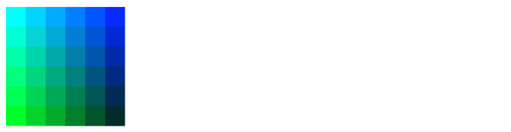

## 透明度

透明度用两种方法可以实现，一种是使用`rgba()`实现，另外一种是通过 `canvas` 提供的`globalAlpha`来实现。

```js
      function draw() {
        let ctx = canvas.getContext("2d");
        let colors = [
          "red",
          "green",
          "rgba(200,200,200,0.5)",
          "rgba(100,100,100,0.3)"
        ];
        if (canvas.getContext) {
          // 画正方形
          ctx.fillStyle = colors[0];
          ctx.fillRect(0, 0, 100, 100);
          ctx.fillStyle = colors[1];
          ctx.fillRect(100, 0, 100, 100);
          ctx.fillStyle = colors[2];
          ctx.fillRect(0, 100, 100, 100);
          ctx.fillStyle = colors[3];
          ctx.fillRect(100, 100, 100, 100);

          // 画圆形
          ctx.beginPath();
          // 用 globalAlpha 设置透明度
          ctx.globalAlpha = 0.5;
          ctx.fillStyle = "orange";
          ctx.arc(100, 100, 50, 0, Math.PI * 2, true);
          ctx.fill();
        }
      }
```

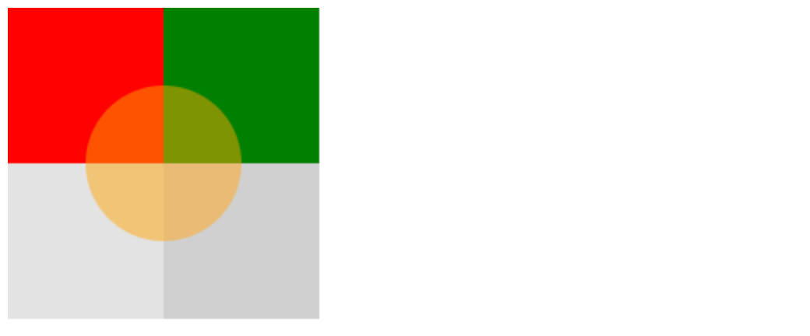

## 线型样式

lineWidth 线条宽度

lineCap 线条末端样式

lineJoin 线条

miterLimit 限制当两条线相交时交接处的最大长度

getLineDash 获取当前虚线的样式

setLineDash 设置当前虚线的样式

lineDashOffset 设置虚线样式的起始偏移量

### lineWidth线宽

`lineWidth` 能够控制线条的粗细，默认是 1。

```js
      function draw() {
        let ctx = canvas.getContext("2d");
        if (canvas.getContext) {
          ctx.lineWidth = 10;
          ctx.beginPath();
          ctx.moveTo(10, 10);
          ctx.lineTo(10, 100);
          ctx.stroke();
        }
      }
```

以上代码设置了一个宽为 10 的线条。

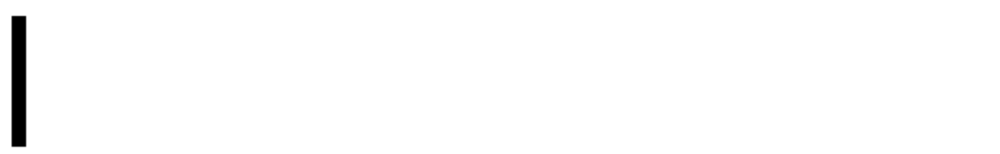

线宽是指给定路径的中心到两边的粗细，换句话说，会在路线的两边各绘制线宽的一半。因为画布的坐标并不和像素直接对应，当需要获得精确的水平或垂直线的时候要特别注意。

下面是一个例子，由于路径的定位问题，最左边的以及所有宽度为奇数的线并不能精确呈现：

```js
function draw() {
  var ctx = document.getElementById('canvas').getContext('2d');
  for (var i = 0; i < 10; i++){
    ctx.lineWidth = 1+i;
    ctx.beginPath();
    ctx.moveTo(5+i*14,5);
    ctx.lineTo(5+i*14,140);
    ctx.stroke();
  }
}
```


想要获取精确的线条，必须知道线条是如何被描绘出来的。我们用网格来替代canvas 的坐标格，每一个都是一个像素点。


在第一幅图中，矩阵的线刚好填充了`(2,1)`到`(5,5)`，区域的边界刚好落在像素边缘上，这样就可以得到清晰的矩阵。

而如果我们想要画一根线，这根线的线条路径在`(3,1)`到`(3,5)`,我们就可以得到图 2 的结果，深蓝色的填充区域仅仅延伸到路径两旁各一半像素。这一半像素仅仅是部分着色，结果就是以实际笔触颜色一半色调的颜色来填充整个区域（浅蓝和深蓝的部分）。这就是上例中为何宽度为 1.0 的线并不准确的原因。

如果想要解决这个问题，就需要必须对路径施以更加精确的控制。已知粗 1.0 的线条会在路径两边各延伸半像素，那么像第三幅图那样绘制从 (3.5,1) 到 (3.5,5) 的线条，其边缘正好落在像素边界，填充出来就是准确的宽为 1.0 的线条。

> 上面竖条的 Y 轴刚好落在对应的网格线上，否则也会出现跟 X 轴一样的问题。但是Y 轴的这个问题可以通过设置 `lineCap:square`来解决。通过设置成`square`可以让线条末端的样式得到扩展，这样就能够完全覆盖整个像素格。

### lineCap线条末端样式

属性 `lineCap` 的值决定了线段端点显示的样子。它可以为下面的三种的其中之一：`butt`，`round` 和 `square`。默认是 `butt。`

下面的例子绘制了三条直线，分别赋予不同的 lineCap 值，为了刚好看到他们的区别，还有两根辅助线。

```js
      function draw() {
        let ctx = canvas.getContext("2d");
        if (canvas.getContext) {
          // 绘制辅助线
          ctx.beginPath();
          ctx.strokeStyle = "red";
          ctx.moveTo(10, 10);
          ctx.lineTo(140, 10);
          ctx.stroke();
          ctx.moveTo(10, 140);
          ctx.lineTo(140, 140);
          ctx.stroke();

          const lineCap = ["butt", "round", "square"];
          ctx.lineWidth = 10;
          ctx.strokeStyle = "black";
          for (let i = 0; i < lineCap.length; i++) {
            ctx.beginPath();
            ctx.lineCap = lineCap[i];
            ctx.moveTo(20 + 50 * i, 10);
            ctx.lineTo(20 + 50 * i, 140);
            ctx.stroke();
          }
        }
      }
```

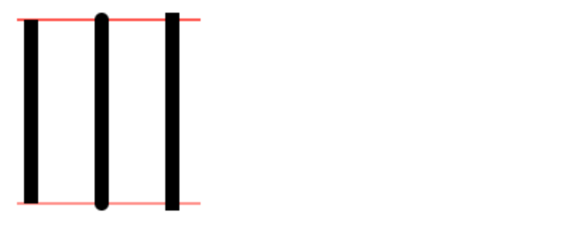

最左边的线用了默认的 `butt` 。可以注意到它是与辅助线齐平的。中间的是 `round` 的效果，端点处加上了半径为一半线宽的半圆。右边的是 `square` 的效果，端点处加上了等宽且高度为一半线宽的方块。

# 绘制文本

canvas 提供两种方法来绘制文本

* fillText(text,x,y[,maxWidth]) —— 在指定的(x,y)位置填充指定的文本，绘制的最大宽度是可选的.
* strokeText(text,x,y[,maxWidth]) —— 在指定的(x,y)位置绘制文本边框，绘制的最大宽度是可选的.

`fillText`示例：

```js
function draw() {
  var ctx = document.getElementById('canvas').getContext('2d');
  ctx.font = "48px serif";
  ctx.fillText("Hello world", 10, 50);
}
```

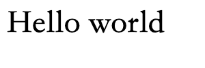

`strokeText`示例：

```js
function draw() {
  var ctx = document.getElementById('canvas').getContext('2d');
  ctx.font = "48px serif";
  ctx.strokeText("Hello world", 10, 50);
}
```


文本样式：

1. font —— 当前我们用来绘制文本的样式
2. textAlign —— 文本对齐选项. 可选的值包括：`start`, `end`, `left`, `right` or `center`. 默认值是 `start`。 
3. textBaseline —— 基线对齐选项. 可选的值包括：`top`, `hanging`, `middle`, `alphabetic`, `ideographic`, `bottom`。默认值是 `alphabetic。`
4. direction —— 文本方向。可能的值包括：`ltr`, `rtl`, `inherit`。默认值是 `inherit。`


## 测量文本宽度

当你需要获得更多的文本细节时，下面的方法可以给你测量文本的方法。

- [`measureText()`](https://developer.mozilla.org/zh-CN/docs/Web/API/CanvasRenderingContext2D/measureText)

  将返回一个 [`TextMetrics`](https://developer.mozilla.org/zh-CN/docs/Web/API/TextMetrics)对象的宽度、所在像素，这些体现文本特性的属性。

下面的代码段将展示如何测量文本来获得它的宽度：

```js
function draw() {
  var ctx = document.getElementById('canvas').getContext('2d');
  var text = ctx.measureText("foo"); // TextMetrics object
  text.width; // 16;
}
```

# 操作图片

canvas更有意思的一项特性就是图像操作能力。可以用于动态的图像合成或者作为图形的背景，以及游戏界面（Sprites）等等。

引入图像到canvas里需要以下两步基本操作：

* 获得一个指向`HTMLImageElement`的对象或者另一个 canvas元素的引用作为源，也可以通过提供一个 URL的方式来使用图片
* 使用`drawImage()`函数将图片绘制到画布上

## 获取图片

canvas 的 api 可以使用以下类型的任意一种作为图片的源：

* HTMLImageElement

  这些图片可以是`Image()`函数构成的，或者任何的``元素

* HTMLVideoElement

  用一个 HTML 的`<video>`元素作为图片的源,会从中抓取当前帧作为一个图像

* HTMLCanvasElement

  可以使用另一个`<canvas>`元素作为图片源

* ImageBitMap

  这是一个高性能的位图，可以延迟绘制

## 创建HTMLImageElement对象

下面是一个例子，我们使用 `HTMLImageElement` 来创建图像对象。

我们不单单使用``标签，也可以使用`Image()`构造函数来创建 `HTMLImageElement`对象。

```js
var img=new Image()
img.src='xxx.png'
```

当脚本执行后，图片开始装载。

我们需要等图片加载完成才继续操作下一步：

```js
img.onload=function(){
  // 执行drawImage语句
}
```

img的 src 不单单可以是图片的链接，也可以是 `base64url`

```js
img.src = 'data:image/gif;base64,R0lGODlhCwALAIAAAAAA3pn/ZiH5BAEAAAEALAAAAAALAAsAAAIUhA+hkcuO4lmNVindo7qyrIXiGBYAOw==';
```

## 绘制图片

一旦获得了源图对象，我们就可以使用 `drawImage` 方法将它渲染到 canvas 里。`drawImage` 方法有三种形态，下面是最基础的一种。

**`drawImage(image, x, y)`**

其中 `image` 是 image 或者 canvas 对象，`x` 和 `y 是其在目标 canvas 里的起始坐标。`

> 如果 image 是 svg图像，那么必须在`<svg>`根指定元素的宽度和高度

下面是使用外部图像作为背景，然后画一个折线图的示例：

```js
  function draw() {
    var ctx = document.getElementById('canvas').getContext('2d');
    var img = new Image();
    img.onload = function(){
      ctx.drawImage(img,0,0);
      ctx.beginPath();
      ctx.moveTo(30,96);
      ctx.lineTo(70,66);
      ctx.lineTo(103,76);
      ctx.lineTo(170,15);
      ctx.stroke();
    }
    img.src = 'https://mdn.mozillademos.org/files/5395/backdrop.png';
  }
```

用背景图我们就不需要绘制复杂的背景，省下不少代码。这里只用到一个 image 对象，于是就在它的 `onload` 事件响应函数中触发绘制动作。`drawImage` 方法将背景图放置在 canvas 的左上角 (0,0) 处。

最终结果是这样的：


## 缩放图片

`drawImage`方法能够传递`width`和`height`来控制画出来的图片的大小。

[`drawImage(image, x, y, width, height)`](https://developer.mozilla.org/zh-CN/docs/Web/API/CanvasRenderingContext2D/drawImage)

```js
      function draw() {
        if (canvas.getContext) {
          let ctx = canvas.getContext("2d");
          let image = new Image();
          image.src = "https://mdn.mozillademos.org/files/5397/rhino.jpg";
          image.onload = function () {
            ctx.drawImage(image, 0, 0, 30, 30);
          };
        }
      }
```

上面的代码可以绘制出 30*30 的图片

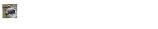

## 切片

切片也用`drawImage` 完成，参数是 8 个

[`drawImage(image, sx, sy, sWidth, sHeight, dx, dy, dWidth, dHeight)`](https://developer.mozilla.org/zh-CN/docs/Web/API/CanvasRenderingContext2D/drawImage)

第一个参数是源的引用，其它8个参数最好是参照右边的图解，前4个是定义图像源的切片位置和大小，后4个则是定义切片的目标显示位置和大小。


以下代码会截取原图片`(40,80)`位置的头像，并将其做成 100*100 大小的图片，放到`canvas` 画布坐标为`(120,120)`的位置。

```js
      function draw() {
        if (canvas.getContext) {
          let ctx = canvas.getContext("2d");
          let image = new Image();
          image.src = "https://mdn.mozillademos.org/files/5397/rhino.jpg";
          image.onload = function () {
            ctx.drawImage(image, 40, 80, 100, 100, 120, 120, 100, 100);
          };
        }
      }
```

换句话说，切片就是在缩放图片API中间加了 4 个参数来定义从哪个位置开始切片，切多大的图片。

## draw多个图片

一个 canvas 画布可以同时画多个图片，下面的例子是用多个图片来画相框的例子：

```html
    <canvas width="300" height="300"></canvas>
    
    <script>
      const canvas = document.querySelector("canvas");
      const frame = document.querySelector(".picture_frame");
      function draw() {
        if (canvas.getContext) {
          let ctx = canvas.getContext("2d");
          let image = new Image();
          image.src = "https://mdn.mozillademos.org/files/5397/rhino.jpg";
          image.onload = function () {
            ctx.drawImage(image, 40, 80, 100, 100, 120, 120, 100, 100);
            frame;
            ctx.drawImage(frame, 110, 110, 120, 120);
          };
        }
      }
      draw();
    </script>
```

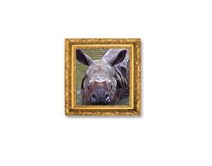

# 状态保存和恢复

* `save()`

  保存画布的所有状态

* `restore()`

  恢复canvas的状态

Canvas 的状态就是当前画面应用的所有样式和变形的一个快照。

当 `save` 时，`canvas`会将当前状态推送到一个栈中保存。

当`restore`调用后，上一个保存的状态就会从栈中弹出，状态会被恢复到上一次保存的状态。（注意，这不是撤销功能，而是将修改的状态变成上一个保存的状态）

下面的代码使用 `save` 和 `restore` 功能来绘制嵌套的矩形。

```js
      function draw() {
        if (canvas.getContext) {
          let ctx = canvas.getContext("2d");
          // 先画一个黑色的框
          ctx.fillStyle = "black";
          ctx.fillRect(0, 0, 300, 300);
          // 保存黑色样式
          ctx.save();
          // 再画一个蓝色的框
          ctx.fillStyle = "blue";
          ctx.fillRect(20, 20, 260, 260);
          // 保存蓝色样式
          ctx.save();
          // 最后画一个白色的框
          ctx.fillStyle = "white";
          ctx.fillRect(40, 40, 220, 220);
          // 恢复成蓝色
          ctx.restore();
          ctx.fillRect(60, 60, 180, 180);
          // 恢复成黑色
          ctx.restore();
          ctx.fillRect(80, 80, 140, 140);
        }
      }
```

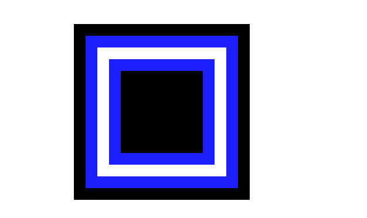

# 变形

变形`Transformations`可以对网格进行移动、缩放和旋转。（类似于 css3 的 transform）

## translate 移动

使用`translate`可以将 canvas 移动到不同的位置

```
translate(x, y)
```

`translate `方法接受两个参数。x 是左右偏移量，y 是上下偏移量。


在使用变形相关 API 时最好配合 `save`以及`restore`来保存和恢复状态，比如以下例子：

```js
      const canvas = document.querySelector("canvas");
      if (canvas.getContext) {
        const ctx = canvas.getContext("2d");
        ctx.strokeStyle = "red";
        // 保存红色边框颜色
        ctx.save();
        ctx.strokeStyle = "green";
        // 移动原点到（10,10）的位置
        ctx.translate(10, 10);
        ctx.strokeRect(0, 0, 50, 50);
        // 恢复状态
        ctx.restore();
        ctx.strokeRect(0, 0, 50, 50);
      }
```

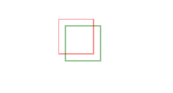

这个例子显示了一些移动 canvas 原点的好处。如果不使用 `translate `方法，那么所有矩形都将被绘制在相同的位置（0,0）。`translate `方法同时让我们可以任意放置这些图案，而不需要在 `strokeRect()` 方法中手工调整坐标值，既好理解也方便使用。

## rotate 旋转

 `rotate `方法，它用于以原点为中心旋转 canvas。

- `rotate(angle)`

  这个方法只接受一个参数：旋转的角度(angle)，它是顺时针方向的，以弧度为单位的值。

旋转的中心点始终是 canvas 的原点，如果要改变它，我们需要用到 `translate `方法。


```js
      const canvas = document.querySelector("canvas");
      if (canvas.getContext) {
        const ctx = canvas.getContext("2d");
        ctx.save();
        ctx.strokeStyle = "green";
        // 改变原点
        ctx.translate(100, 100);
        // 旋转
        ctx.rotate(45);
        ctx.strokeRect(0, 0, 50, 50);
      }
```

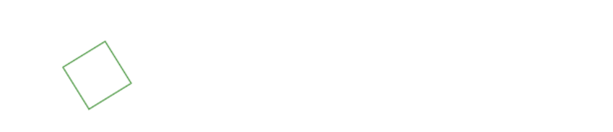

## scaling 缩放

```js
scale(x, y)
```

`scale ` 方法可以缩放画布的水平和垂直的单位。两个参数都是实数，可以为负数，x 为水平缩放因子，y 为垂直缩放因子，如果比1小，会缩小图形， 如果比1大会放大图形。默认值为1， 为实际大小。

```js
      const canvas = document.querySelector("canvas");
      if (canvas.getContext) {
        const ctx = canvas.getContext("2d");
        ctx.save();
        ctx.strokeStyle = "green";
        ctx.translate(40, 40);

        ctx.scale(2, 2);
        ctx.strokeRect(0, 0, 50, 50);

        ctx.restore();
        ctx.strokeStyle = "red";
        ctx.translate(75, 75);
        ctx.scale(0.5, 0.5);
        ctx.strokeRect(0, 0, 50, 50);
      }
```

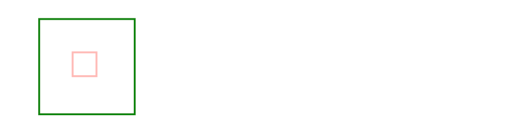

## transforms 变形

最后一个方法允许对变形矩阵直接修改。

```js
transform(a, b, c, d, e, f)
```

a是水平缩放

b 是垂直倾斜

c 是水平倾斜

d 是垂直缩放

e 是水平移动

f 是垂直移动

a 跟 d 相当于 scale，e 跟 f 相当于 translate

默认值是`(1,0,0,1,0,0)`

其中还有两个相关的 API：

* [`setTransform(a, b, c, d, e, f)`](https://developer.mozilla.org/zh-CN/docs/Web/API/CanvasRenderingContext2D/setTransform)

  这个方法会将当前的变形矩阵重置为单位矩阵，然后用相同的参数调用 `transform `方法。

  从根本上来说，该方法是取消了当前变形,然后设置为指定的变形,一步完成。

* [`resetTransform()`](https://developer.mozilla.org/zh-CN/docs/Web/API/CanvasRenderingContext2D/resetTransform)

  重置当前变形为单位矩阵，它和调用以下语句是一样的：`ctx.setTransform(1, 0, 0, 1, 0, 0);`

这里有个例子可以尝试一下：

[mdn-transform](https://developer.mozilla.org/zh-CN/docs/Web/API/CanvasRenderingContext2D/transform#示例)


