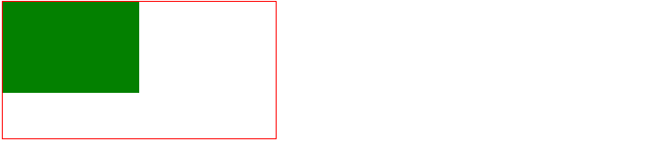
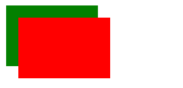
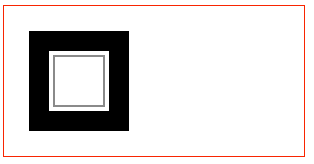
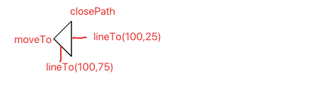
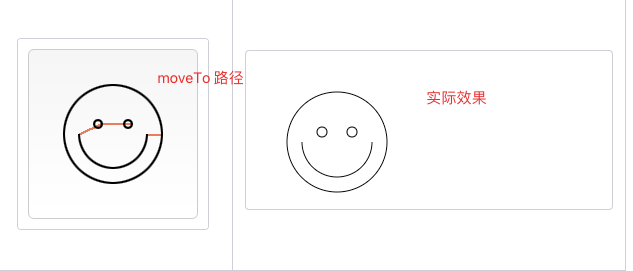
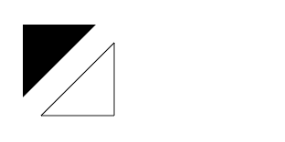
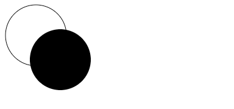
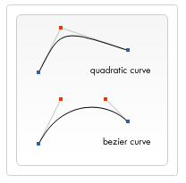
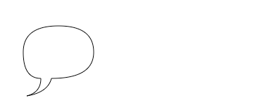
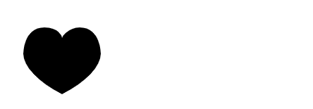

# Canvas 是什么

`Canvas` 是用过 `HTML` 的`<canvas>`元素和 `JavaScript`来绘制图形（主要是位图）的 API。

他可以用于：

* 动画
* 游戏画面
* 数据可视化
* 图片编辑
* 实时视频处理等

`Canvas API`主要用于 `2D`图形，不同于`WebGL`，虽然他们都用`<canvas>`元素，但`WebGL`主要用于绘制`2D` 和`3D` 图形。

一个简单的例子：

```html
  <style>
    #canvas {
      border: 1px solid red;
    }
  </style>
  <body>
    <canvas id="canvas"></canvas>

    <script>
      let canvas = document.getElementById("canvas");
      const ctx = canvas.getContext("2d");
      ctx.fillStyle = "green";
      ctx.fillRect(0, 0, 150, 100);
    </script>
  </body>
```

API 解释：

`canvas.getContext(2d)`获取这个元素的`context`，图像通过这个位置渲染

实际的绘制则通过[`CanvasRenderingContext2D`](https://developer.mozilla.org/zh-CN/docs/Web/API/CanvasRenderingContext2D)来完成。

当前使用的是`fillStyle`来填充颜色，`fillRect`用来将绘制的图像的左上角放在`canvas`的`(0,0)`位置，图像的大小为宽 150，高 100。

每个`canvas`的默认大小为 300*150，上面的代码会绘制出以下图形



# 基本用法

## canvas元素

`<canvas>`标签只有两个属性——`width` 和 `height`。也可以使用 CSS 定义大小，但是绘制时图像会伸缩以适应它的框架尺寸，有时候会引发扭曲，所以我们需要用`width`和`height`来明确宽高。

`<canvas>`元素可以设置样式，如果没有规定时，会完全变成透明。

如果在里面放一些内容，那么浏览器会将其忽略。

比如下面的代码，在`<canvas>`加了一些文字，那么支持`<canvas>`的浏览器会忽略里面的内容，而只是渲染 canvas

```html
<canvas id="canvas"> 支持canvas 的浏览器会忽略这些文字</canvas>
```

## 渲染上下文（rendering context）

`<canvas>`元素创造了一个固定大小的画布，它公开了一个或多个**渲染上下文**，其可以用来绘制和处理要展示的内容。我们主要使用`2d`渲染上下文。

原先`<canvas>`是空白的，我们需要用 `JavaScript`获取`context`，然后在上面绘制。获取渲染上下文的 API 是`getContext()`方法。

```js
var ctx = canvas.getContext('2d');
```

一般我们需要通过`getContext`来判断浏览器是不是支持`<canvas>`标签。

```js
var canvas = document.getElementById('tutorial');

if (canvas.getContext){
  var ctx = canvas.getContext('2d');
  // drawing code here
} else {
  // canvas-unsupported code here
}
```

获取了上下文之后，我们可以用来画多个图形

```js
    <script>
      function drawn() {
        let canvas = document.getElementById("canvas");
        if (canvas.getContext) {
          const ctx = canvas.getContext("2d");
          ctx.fillStyle = "green";
          ctx.fillRect(10, 10, 150, 100);

          ctx.fillStyle = "red";
          ctx.fillRect(30, 30, 150, 100);
        }
      }
      drawn();
    </script>
```

上面的代码会渲染出以下图形：




# 绘制形状

## canvas 栅格

每一个 canvas 都是带有栅格的画布，里面有坐标和各种网格。通常来说网格中的一个单元相当于canvas元素中的一像素。


栅格的起点是左上角`(0,0)`。所有元素的位置都相对于原点定位。

图中蓝色的坐标为距离左边 x 像素，距离顶部 y 像素，坐标为(x,y)。

## 绘制矩形

`<canvas>`只支持两种形式的图形绘制：**矩形和路径**，路径指的是由一个系列点连成的线段。

所有其他类型的图形都是通过一条或者多条路径组合而成的。

绘制矩形可以使用三个方法：

* `fillRect(x,y,width,height)` 绘制一个填充的矩形
* `strokeRect(x,y,width,height)`绘制一个矩形的边框
* `clearRect(x,y,width,height)` 清除指定矩形区域，让清除部分完全透明

所有方法的参数都是一致的：

`x`和`y`是指定了在 canvas 画布上所绘制矩形的左上角的坐标。`width` 和` height`设置矩形的尺寸。

```js
      function drawn() {
        let canvas = document.getElementById("canvas");
        if (canvas.getContext) {
          const ctx = canvas.getContext("2d");
          ctx.fillRect(25, 25, 100, 100);
          ctx.clearRect(45, 45, 60, 60);
          ctx.strokeRect(50, 50, 50, 50);
        }
      }
```

`fillRect`绘制了边长为 100 的黑色正方形

`clearRect`从正方形的中心开始擦除一个 60*60 的正方形

`strokeRect`在清除区域内生成一个 50*50 的正方形边框

最终效果：



还有一个画矩形的方法：

`rect(x, y, width, height)`

绘制一个左上角坐标为（x,y），宽高为width以及height的矩形。

当该方法执行的时候，moveTo()方法自动设置坐标参数（0,0）。也就是说，当前笔触自动重置回默认坐标。

这个方式需要手动调用`stroke`或者`fill`方法来渲染路径，相当于

 `fillRect = rect + fill` 

`strokeRect = rect + stroke`

```js
      function draw() {
        var canvas = document.getElementById("canvas");
        if (canvas.getContext) {
          const ctx = canvas.getContext("2d");
          ctx.rect(25, 25, 100, 100);
          ctx.stroke();
        }
      }
```

## 绘制路径

图形的基本元素是路径，路径是由不同颜色和宽度的线段或曲线相连形成的不同形状的点的集合。

一个路径是闭合的，使用路径绘制图形需要一些额外的步骤。

1. 创建路径起始点
2. 使用画图命令画路径
3. 封闭路径
4. 一旦路径生成，就只能通过描边或填充路径区域来渲染图形

对应的 API 如下：

* `beginPath()` 新建路径，生成后，图形绘制命令被指向到路径上生成路径
* `closePath()` 闭合路径之后图形绘制命令又被重新指向到上下文中
* `stroke()` 通过线条来绘制图形轮廓，就是描边
* `fill()` 通过填充路径的内容区域来生成实心图形，就是填充路径

生成路径的第一步叫做`beginPath`，实质上，路径是由很多子路径构成，这些子路径都是在一个列表中，所有的子路径（线、弧形等）构成图形。每次这个方法调用之后，列表清空重置，然后我们就可以重新绘制新的图形。

当调用`beginPath`后，第一条路径构造命令通常是`moveTo()`。因为我们需要专门指定起始位置。

第二步就是调用函数来指定绘制路径。

第三，就是闭合路径`closePath()`,这个方法不是必需要写的。这个方法会通过绘制一条从当前点到开始点的直线来闭合图形。如果图形已经闭合，那么什么都不做。

> 当调用 `fill` 函数时,所有没有闭合的形状都会自动闭合，所以我们不需要调用`closePath`函数。但是调用`stroke`不会自动闭合。

## 绘制三角形

```html
  <body>
    <canvas id="canvas"></canvas>
    <script>
      function draw() {
        var canvas = document.getElementById("canvas");
        if (canvas.getContext) {
          var ctx = canvas.getContext("2d");

          ctx.beginPath();
          ctx.moveTo(75, 50); // 设置 canvas 内x 轴为 75，y 轴 50 的起点
          ctx.lineTo(100, 75); // 从起点往x 轴为 100，y 轴为 75 的地方绘制路径
          ctx.lineTo(100, 25); // 从上面的位置到x 轴为 100，y 轴为 25 的地方绘制路径
          ctx.closePath(); // 关闭路径，从现在的点回到起始点
          ctx.stroke(); // 绘制路径
        }
      }
      draw();
    </script>
  </body>
```



只有调用了`stroke`之后才会给路径渲染轮廓，否则只是把路径给绘制出来了，对视觉来说是透明的。

## moveTo 移动笔触

`moveTo`函数就类似在纸上将一支笔的笔尖从一个点移动到另一个点。然后以这个点为原点，开始绘制路径、描边等等。

通常在调用`beginPath`后，就需要移动笔触。

每次画完一个东西后，我们就需要移动笔触到新的地方来时描绘。

下面的代码可以画一个笑脸

```js
      function draw() {
        var canvas = document.getElementById("canvas");
        if (canvas.getContext) {
          var ctx = canvas.getContext("2d");

          ctx.beginPath();
          ctx.arc(75, 75, 50, 0, Math.PI * 2, true); // 绘制最外层的圆
          ctx.moveTo(110, 75); // 移动笔触到 110,75 的位置
          ctx.arc(75, 75, 35, 0, Math.PI, false); // 口(顺时针)
          ctx.moveTo(65, 65);
          ctx.arc(60, 65, 5, 0, Math.PI * 2, true); // 左眼
          ctx.moveTo(95, 65);
          ctx.arc(90, 65, 5, 0, Math.PI * 2, true); // 右眼
          ctx.stroke();
        }
      }
      draw();
```

`moveTo` 绘制的路径在实际图中我们看不到，以下用红色的路径将`moveTo`给画出来。




## lineTo 绘制直线

`lineTo(x,y)`

绘制一条从当前位置到指定x以及y位置的直线。

该方法有两个参数：x以及y ，代表坐标系中直线结束的点。开始点和之前的绘制路径有关，之前路径的结束点就是接下来的开始点，等等。。。开始点也可以通过`moveTo()`函数改变。

```js
      function draw() {
        var canvas = document.getElementById("canvas");
        if (canvas.getContext) {
          var ctx = canvas.getContext("2d");
          // 绘制填充三角形
          ctx.beginPath();
          ctx.moveTo(25, 25);
          ctx.lineTo(105, 25);
          ctx.lineTo(25, 105);
          ctx.fill();
          // 绘制描边三角形
          ctx.beginPath();
          ctx.moveTo(125, 125);
          ctx.lineTo(125, 45);
          ctx.lineTo(45, 125);
          ctx.closePath();
          ctx.stroke();
        }
      }
      draw();
```

上面的代码用`lineTo`绘制了路径，然后用`stroke`或者`fill`来渲染了路径，产生了两个不同的三角形。



由于`fill`会自动填充三角形，所以我们并不需要调用`closePath`来闭合它。但是`stroke`则需要`closePath`。

## arc 绘制圆弧

如果要画圆或者圆弧，我们使用`arc`方法。

[`arc(x, y, radius, startAngle, endAngle, anticlockwise)`](https://developer.mozilla.org/zh-CN/docs/Web/API/CanvasRenderingContext2D/arc)

这个 API 的意思是以(x,y)为圆心的以 radius 为半径的，从`startAngle`开始到`endAngle`结束，按照`anticlockwise`给定的方法（默认为顺时针）来生成。

`startAngle`以及`endAngle`参数用弧度定义了开始以及结束的弧度。这些都是以x轴为基准。参数`anticlockwise`为一个布尔值。为true时，是逆时针方向，否则顺时针方向。

弧度的计算：0 到`Math.PI`是半圆，0 到`Math.PI * 2`是全圆。

绘制一个圆的代码是：

```js
      function draw() {
        var canvas = document.getElementById("canvas");
        if (canvas.getContext) {
          var ctx = canvas.getContext("2d");

          ctx.beginPath();
          ctx.arc(55, 55, 50, 0, Math.PI * 2, true); // 绘制最外层的圆
          ctx.stroke();

          ctx.beginPath();
          ctx.arc(95, 95, 50, 0, Math.PI * 2, true); // 绘制最外层的圆
          ctx.fill();
        }
      }
      draw();
```



## 贝塞尔曲线

贝塞尔曲线可以描绘比较复杂的图形，有二次贝塞尔和三次贝塞尔曲线。

```
quadraticCurveTo(cp1x, cp1y, x, y)
```

绘制二次贝塞尔曲线，`cp1x,cp1y`为一个控制点，`x,y为`结束点。

```
bezierCurveTo(cp1x, cp1y, cp2x, cp2y, x, y)
```

绘制三次贝塞尔曲线，`cp1x,cp1y`为控制点一，`cp2x,cp2y`为控制点二，`x,y`为结束点。

二次贝塞尔曲线有一个开始点（蓝色）、一个结束点（蓝色）以及一个控制点（红色），而三次贝塞尔曲线有两个控制点。



参数x、y在这两个方法中都是结束点坐标。`cp1x,cp1y`为坐标中的第一个控制点，`cp2x,cp2y`为坐标中的第二个控制点。

使用二次以及三次贝塞尔曲线是有一定的难度的，因为不同于像Adobe Illustrators这样的矢量软件，我们所绘制的曲线没有给我们提供直接的视觉反馈。这让绘制复杂的图形变得十分困难。

下面直接贴例子吧：

多个二次贝塞尔曲线来渲染对话气泡。

```js
function draw() {
  var canvas = document.getElementById('canvas');
  if (canvas.getContext) {
    var ctx = canvas.getContext('2d');

    // 二次贝塞尔曲线
    ctx.beginPath();
    ctx.moveTo(75, 25);
    ctx.quadraticCurveTo(25, 25, 25, 62.5);
    ctx.quadraticCurveTo(25, 100, 50, 100);
    ctx.quadraticCurveTo(50, 120, 30, 125);
    ctx.quadraticCurveTo(60, 120, 65, 100);
    ctx.quadraticCurveTo(125, 100, 125, 62.5);
    ctx.quadraticCurveTo(125, 25, 75, 25);
    ctx.stroke();
   }
}
```



三次贝塞尔曲线画心

```js
function draw() {
  var canvas = document.getElementById('canvas');
  if (canvas.getContext){
    var ctx = canvas.getContext('2d');

     //三次贝塞尔曲线
    ctx.beginPath();
    ctx.moveTo(75, 40);
    ctx.bezierCurveTo(75, 37, 70, 25, 50, 25);
    ctx.bezierCurveTo(20, 25, 20, 62.5, 20, 62.5);
    ctx.bezierCurveTo(20, 80, 40, 102, 75, 120);
    ctx.bezierCurveTo(110, 102, 130, 80, 130, 62.5);
    ctx.bezierCurveTo(130, 62.5, 130, 25, 100, 25);
    ctx.bezierCurveTo(85, 25, 75, 37, 75, 40);
    ctx.fill();
  }
}
```



## Path2D 对象

`Path2D()`会返回一个新初始化的Path2D对象（可能将某一个路径作为变量——创建一个它的副本，或者将一个包含SVG path数据的字符串作为变量）。

```js
new Path2D();     // 空的Path对象
new Path2D(path); // 克隆Path对象
new Path2D(d);    // 从SVG建立Path对象
```

所有的路径方法比如`moveTo`, `rect`, `arc`或`quadraticCurveTo`等,都可以在 Path2D中使用。

Path2D API 添加了 `addPath`作为将`path`结合起来的方法。当你想要从几个元素中来创建对象时，这将会很实用。

```js
Path2D.addPath(path[,transform])
添加一条路径到当前路径。
```


