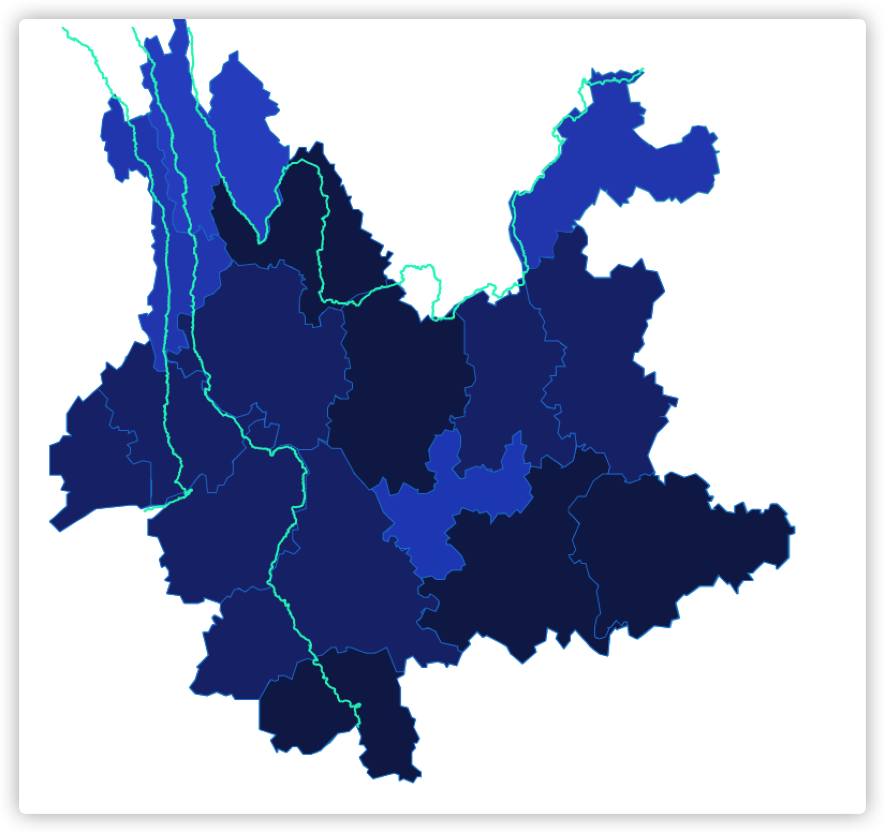
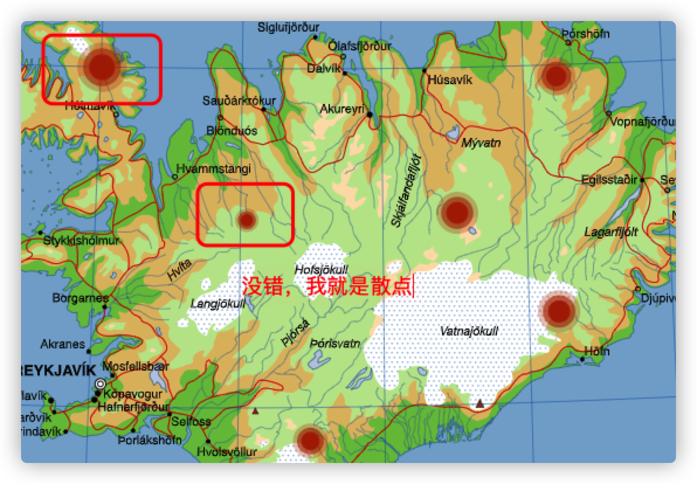
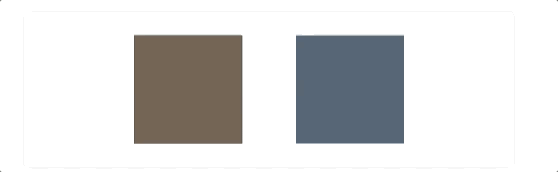
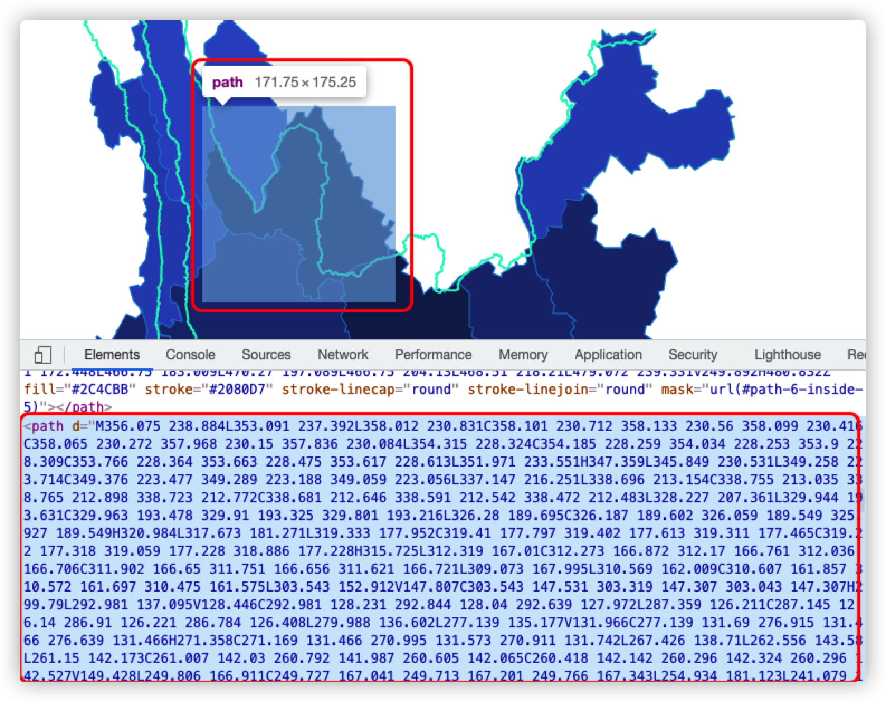
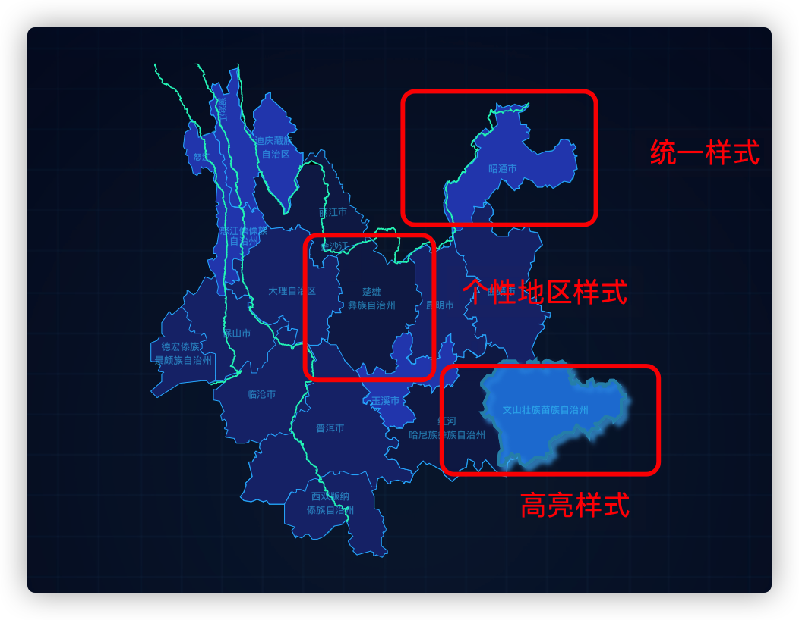

# 如何使用 Echarts 和 SVG 文件写大屏地图

- [如何使用 Echarts 和 SVG 文件写大屏地图](#如何使用-echarts-和-svg文件写大屏地图)
  - [契机](#契机)
  - [选择正确的地图组件](#选择正确的地图组件)
  - [具名元素](#具名元素)
  - [实战开始吧！](#实战开始吧)
    - [给 path 加上具名元素](#给-path-加上具名元素)
    - [基本用法](#基本用法)
    - [给地图加上文字](#给地图加上文字)
    - [高亮强调 emphasis](#高亮强调emphasis)
    - [地域分块 regions 自定义样式](#地域分块regions自定义样式)
    - [layout 布局](#layout布局)
    - [series 系列](#series系列)
    - [获取坐标轴](#获取坐标轴)
    - [事件](#事件)
  - [结束语](#结束语)

## 契机

最近公司要做一个政务大屏项目，由于在员工竞优大会上表（jing）现（chui）良（niu）好（b）的我说希望未来能做一个大屏项目，于是这个任务自然交到我头上（需求来得真快），当我拿到图的时候发现地图上有定制化的元素，就是下面图中的三条河流



如果想要使用 GeoJSON 的方式，那就必须知道三条河流的坐标系才行，可是 UI 小姐姐说需求方给的河流就是个图层，她只贴到地图上而已，并没有坐标方面的数据。

我需要根据 SVG 将地图渲染出来。并添加一些额外的元素。

于是便有了这篇文章。

纯当是一次实践记录。

## 选择正确的地图组件

原先我们的地图则只能使用 GeoJSON 格式来作为底图进行描绘，Echarts 从最新的第 5 版本开始支持地理坐标系（geo）和地图系列（map series）中使用 SVG 作为底图。

- [地理坐标系（geo）](https://echarts.apache.org/zh/option.html#geo) ：地理坐标系组件。地理坐标系组件用于地图的绘制，支持在地理坐标系上绘制[散点图](https://echarts.apache.org/zh/option.html#series-scatter)，[线集](https://echarts.apache.org/zh/option.html#series-lines)。
- [地图系列（map series）](https://echarts.apache.org/zh/option.html#series-map) ：地图，主要用于地理区域数据的可视化，配合 [visualMap](https://echarts.apache.org/zh/option.html#visualMap) 组件用于展示不同区域的人口分布密度等数据。

地理坐标系跟地图系列的最大不同可能就是绘制散点图、线集的，这点在官方网站上是有写的

> 如果要实现点数据或者线数据的可视化，可以使用在[地理坐标系组件](https://echarts.apache.org/zh/option.html#geo)上的[散点图](https://echarts.apache.org/zh/option.html#series-scatter)和[线图](https://echarts.apache.org/zh/option.html#series-lines)。

当然，我们学习 Echarts 不可能干啃 API，自然需要结合生动的例子，这里就用官方的示例[庖丁解牛](https://echarts.apache.org/examples/zh/editor.html?c=geo-beef-cuts)和[散点图](https://echarts.apache.org/examples/zh/editor.html?c=geo-svg-scatter-simple)来作为两者的区别所在，通过官方的配置项我们可以看到配置是不同的

```js
        series: [{
            name: 'French Beef Cuts',//庖丁解牛配的是地图系列
            type: 'map',
            map: 'Beef_cuts_France',
            ...
        }]
```

```js
        geo: {
            tooltip: {
                show: true
            },
            map: 'iceland_svg',//散点图配的是地图坐标系
           ...
        },
```

视觉上的不同自然就是散点了，散点长这样



由于我们的项目需要加很多散点，所以我们自然要选择 geo 组件。

## 具名元素

什么是具名元素呢？就是有名字的 SVG 元素。

如果我们希望跟 SVG 元素做交互，则需要先标记这些元素，标记非常简单，就是给它加一个 name 属性。比如我们拿到 SVG 文件后，可以在 path 上加上名称属性`name="named_rect"`,那么这个 path 就是具名元素。

加了名字的元素跟没有名字的元素有非常大的区别，一旦加上名字，就可以拥有高亮、淡入淡出、文字标注、提示框等交互功能，作为例子，以下放官方给的例子

```html
<svg
  xmlns="http://www.w3.org/2000/svg"
  version="1.2"
  fill-rule="evenodd"
  xml:space="preserve"
>
  <path name="named_rect" d="M 0,0 L 0,100 100,100 100,0 Z" fill="#765" />
  <path d="M 150,0 L 150,100 250,100 250,0 Z" fill="#567" />
</svg>
```



左边的矩形由于加了 name，就自动拥有 hover 时高亮的效果，而右边的则没有。

而且加了 name 后的具名元素还可以在 Echarts 的 options 中配置[geo.regions](https://echarts.apache.org/zh/option.html#geo.regions)以做特定的配置效果，这个配置效果会跟我们起的 name 做匹配。

```
option = {
    geo: {
        map: 'some_svg',
        regions: [{
            name: 'element_name_1',//这里跟 svg 源文件中的 name做匹配
            itemStyle: { ... }
        },
    }
};
```

注意:

- 只有这些 SVG 元素可以被命名： `rect`、`circle`、`line`、`ellipse`、`polygon`、`polyline`、`path`、`text`、`tspan`、`g`。
- 支持多个元素以相同的名称命名，这样它们能被同时高亮、选中。

## 实战开始吧！

下面我将使用[slice(没加 text 标签和 name).svg](https://github.com/18888628835/Blog/blob/main/前端可视化/大屏项目的 svg/slice(没加 text 标签和 name).svg)作为底图，这个文件是 UI 小姐姐通过 figma 导出来给到我的。

我们的目标是使用此文件配合 Echarts 在浏览器上描绘地图，并做一些简单的交互效果来熟悉 Echarts 的配置项。

### 给 path 加上具名元素

拿到 SVG 文件后，我们需要使用 Chrome 打开它， 使用 vscode 打开后的 SVG 是一串 XML 标签，而 Chrome 打开后会自动解析（就跟解析 HTML 一样），并且渲染出效果来。

每个 SVG 矢量文件本质上是很多定义好的线和形状来创建的图形，里面最常用的可能是 path 路径标签，而且它是最强大的一个，可以通过它创建各种线条、曲线、弧形等等。

我们在浏览器中打开 F12 开发者工具，并且选择小箭头对准渲染出来的图片，就可以看到某块区域的 path



现在已经很清楚了，整块底图都是用大量的 path 进行描绘的，而 path 的形状是通过属性 d 来定义的。

我们不关心 d 属性是怎样写出来的，现在要做的，就是在 SVG 源文件中给对应的 path 加上 name 属性。

```html
<path name="昭通市"  d="M480.832 ..."
```

### 基本用法

接着我们需要在框架中使用 Echarts 了，这里选用 React 作为 UI 框架，这里是基本结构

```react
import React, { useEffect } from 'react';
import * as echarts from 'echarts';
import jQuery from 'jquery';
window.$ = jQuery;

export const Middle = () => {
  //创建 map 的函数，在里面写 Echarts 的配置项
  const createMap = id => {};
  useEffect(() => {
    createMap('map');
  }, []);
  return <div id='map' />;
};
```

接着我们在`createMap`这个函数中使用 Echarts，这里是 SVG 作为底图的写法

```js
  const createMap = id => {
    const myChart = echarts.init(document.getElementById(id)!);
    //$.get()里写你的SVG 文件路径
    $.get('/slice.svg', function (svg) {
      //首先向 echarts 注册 SVG 字符串或解析过的 SVG DOM
      echarts.registerMap('map', { svg: svg });
      var option = {
        toolTip: {},
        //开启地理坐标系组件。地理坐标系组件用于地图的绘制，支持在地理坐标系上绘制散点图，线集。
        geo: {
          map: 'map', //这里写注册过的map 名字
        },
      };
      myChart.setOption(option);
    });
  };
```

现在打开浏览看可以查看到效果了，不出意外的话，你可以看到这样的效果


由于我只给一个 path 添加 name，所以只有这一个元素会移动时高亮。

### 给地图加上文字

上面的效果是 hover 时拥有文字效果，这里有两种方式可以加文字

- SVG 源文件中加 text 标签
- Echarts 中配置

SVG 源文件中加就比较基础了，需要我们写 xml 标签，比如这样

```xml
<text xml:space="preserve" style="font-size:14px;font-style:normal;font-variant:normal;font-weight:bold;font-stretch:normal;text-align:center;text-anchor:middle;fill:rgba(61,215,255,55%);fill-opacity:1;stroke:none;font-family:DejaVu Sans;-inkscape-font-specification:Bitstream Vera Sans Bold" x="128.21919" y="112.48651" id="text3831" transform="matrix(0.99999776,-0.00211681,0.00211681,0.99999776,0,0)">
<tspan sodipodi:role="line" x="550.59958" y="160.12965" id="tspan38351">
昭通市</tspan>
</text>
```

这是我在 SVG 源文件里面写的，缺点是要找 x 点和 y 点，然后写在对应的 x 属性和 y 属性中。

更简单的方法是直接用 Echarts 的配置项 option.geo 自动加上标注文字。

```js
        geo: {
          map: 'map', //这里写注册过的map 名字
          //文字标注的配置
          label: {
            show: true,//显示
            color: 'rgba(61, 215, 255, 0.55)',//颜色
          },
        },
```

我在这里选择的方式是在源文件中写 text 标签，因为需要还原设计稿，统一的配置无法满足我的要求，具体看需求就行。

我加好 name 跟 text 的文件在这：[map(加了 text 和 name).svg](https://github.com/18888628835/Blog/blob/main/前端可视化/大屏项目的 svg/map(加了 text 和 name).svg)

### 高亮强调 emphasis

默认的高亮无法满足我们的要求，所以我们可以通过 emphasis 来配置高亮的效果

```js
        geo: {
         ...
          emphasis: {
            focus: 'none', //高亮时聚焦自己
            itemStyle: {
              areaColor: '#2080D7',
              borderColor: '#2B91B7', //地图区域的颜色。
              borderWidth: 2,
              opacity: 1,
              shadowColor: 'rgba(74, 188, 251, 0.4)',
              shadowBlur: 3,
              shadowOffsetX: 3,
              shadowOffsetY: 3,
            },
            label: {
              show: false, //高亮时文字不要出现
            },
          },
        },
```

具体配置都是查的官方文档，[geo.emphasis](https://echarts.apache.org/zh/option.html#geo.emphasis)

现在的效果是这样的


### 地域分块 regions 自定义样式

如果想要统一设置样式，可以使用 geo.itemStyle 配置

```js
          //统一样式配置
          itemStyle: {
            areaColor: '#1C3079',
            borderColor: '#2ab8ff',
          },
```

如果需要分块定制配置，就需要使用 geo.regions 这个配置项。

```js
            //单独定制的区块设置
            regions: [
              {
                name: '昭通市',
                itemStyle: {
                  areaColor: 'rgba(44, 76, 187, 1)',
                },
              },
              {
                name: '玉溪市',
                itemStyle: {
                  areaColor: 'rgba(44, 76, 187, 1)',
                },
              },
              {
                name: '怒江傈傈族自治州',
                itemStyle: {
                  areaColor: 'rgba(44, 76, 187, 1)',
                },
              },
              {
                name: '迪庆藏族自治区',
                itemStyle: {
                  areaColor: 'rgba(44, 76, 187, 1)',
                },
              },
              {
                name: '楚雄彝族自治州',
                itemStyle: {
                  areaColor: 'rgba(16, 34, 84, 1)',
                },
              },
              {
                name: '红河哈尼族彝族自治州',
                itemStyle: {
                  areaColor: 'rgba(16, 34, 84, 1)',
                },
              },
              {
                name: '丽江市',
                itemStyle: {
                  areaColor: 'rgba(16, 34, 84, 1)',
                },
              },
            ],
```

目前我们分别有 geo.regions.itemStyle、geo.itemStyle、geo.emphasis.itemStyle，他们分别可以定制化地区的样式、全局统一样式和高亮时的样式，API 颗粒度的划分非常精细，只需要到对应的父级配置项查询即可。



### layout 布局

如果希望整个地图能够尽量占满我们设定好的 div 的宽高，就需要在 geo 中配置以下内容，以填充 Echarts 容器。

```js
  layoutSize: '100%', //布局尺寸
  layoutCenter: ['50%', '50%'], //布局位置
```

### series 系列

series 是 Echarts 中最重要的属性，几乎配置任何图表都离不开它，通过 series 的 type 属性，我们可以定制诸如折线 line、柱状图 bar、饼图 pie、散点气泡图 scatter 等等特效效果。

我的项目中需要使用到 series-effectScatter（带有涟漪效果的散点图）和 series-scatter（散点气泡图），具体 API 可以通过[option](https://echarts.apache.org/zh/option.html#series-scatter)查看，这里我就直接贴代码

```js
const mapData = [
  {
    name: '古水水电站1', //数据名称，对应 option.tooltip.formatter
    value: [190, 215], //坐标
  },
  {
    name: '红色水电站8',
    value: [366, 260],
  },
  {
    name: '红色水电站9',
    value: [436, 270],
  },
  {
    name: '红色水电站10',
    value: [470, 500],
  },
  {
    name: '红色水电站11',
    value: [520, 310],
  },
];
```

```js
      var option = {
        //全局开启提示框的样式配置,这里如果配置，有几率下面所有散点图不会出现提示框。
        tooltip: {
          show: true,//开启全局提示框
          formatter: '{b}',//格式化，选择显示数据名称
          backgroundColor: 'rgba(7, 26, 55, 0.8)',
          borderColor: '#3DD7FF',
          borderWidth: 1,
          padding: [3, 5, 3, 5],
          textStyle: {
            color: 'white',
          },
        },
        ...
        series: [
          {
            //带有涟漪特效动画的散点（气泡）图
            type: 'effectScatter',
            coordinateSystem: 'geo', //该系列使用的坐标系
            tooltip: {
              show: false,//这个系列不要提示框
            },
            //涟漪特效相关配置。
            rippleEffect: {
              brushType: 'stroke', //波纹的绘制方式 一笔一笔
              scale: 4,
            },
            showEffectOn: 'render', //绘制完成后显示特效 'emphasis' 高亮（hover）的时候显示特效
            symbol: 'circle', //涟漪特效的标记图形
            symbolSize: [8, 5], //图形尺寸 宽 高
            zlevel: 1, //优先级
            //图形样式
            itemStyle: {
              color: 'yellow',
            },
            //系列中的数据内容数组。数组项通常为具体的数据项。
            data: mapData.map(item => item.value),
          },
          {
            //系列类型 散点（气泡）图。
            type: 'scatter',
            coordinateSystem: 'geo',
            tooltip: {
              show: true,//这个系列要提示框
            },
            symbol: 'pin',
            emphasis: {
              scale: true,
            },
            symbolSize: [30, 33],
            symbolOffset: [0, -5],
            zlevel: 20,
            itemStyle: {
              color: 'red',
            },
            data: mapData,
          },
        ],
      };
```

这样效果就大概有了


### 获取坐标轴

上面的 mapData 中的 value，在这个项目中表示坐标轴（具体看 data 的配置，也可以是数据），但是我们并不知道坐标轴是多少，如果挨个试太浪费时间，还好 Echarts 提供给我们 API，我们可以通过监听事件来获取坐标

```js
//获取 svg 底图的坐标
myChart.getZr().on('click', function (params) {
  var pixelPoint = [params.offsetX, params.offsetY];
  var dataPoint = myChart.convertFromPixel({ geoIndex: 0 }, pixelPoint);
  // 在 SVG 上点击时，坐标会被打印。
  // 这些坐标可以在 `series.data` 里使用。
  console.log(dataPoint);
});
```

### 事件

如果要对 SVG 元素进行操作，可以指定事件

```js
// 'name1' 是一个 SVG 元素的名字。
myChart.on('click', { geoIndex: 0, name: 'name1' }, function (params) {
  console.log(params);
});
```

如果想要对 series 中诸如 type 为 scatter 的散点图绑定点击事件，则可以这样写

```js
myChart.on('click', 'series.scatter', function (params: any) {
  console.log(params);
});
```

每个项目都少不了自适应，如果想要 Echarts 的地图自适应，则需要监听 window 的 resize 事件，然后调用 Echarts 实例的 resize 方法

```js
window.addEventListener('resize', () => {
  myChart?.resize();
});
```

目前我的项目只需要用到这三个事件 API，还有更多定制化的事件，可按需查文档[echarts-event](https://echarts.apache.org/zh/api.html#events)

## 结束语

以上的记录只是项目的一个基本结构，不代表最终项目品质。基于上面的结构，我们已经能够在 SVG 地图上做出非常多样的样式效果和定制服务了。

如果觉得自己配置比较麻烦的话，可以参考这个网站[makeapie](https://www.makeapie.com/explore.html#sort=rank~timeframe=all~author=all)，找别人写好的案例，copy 一下配置项即可。

最后推广一下本人长期维护的 github 博客

> 1.从学习到总结，记录前端重要知识点，涉及 Javascript 深入、HTTP 协议、数据结构和算法、浏览器原理、ES6、前端技巧等内容。

> 2.在 README 中有目录可对应查找相关知识点。

如果对您有帮助，欢迎 star、follow。

[地址在这里](https://link.juejin.cn/?target=https%3A%2F%2Fgithub.com%2F18888628835%2FBlog)

enjoy！！
