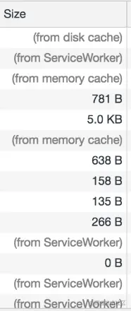
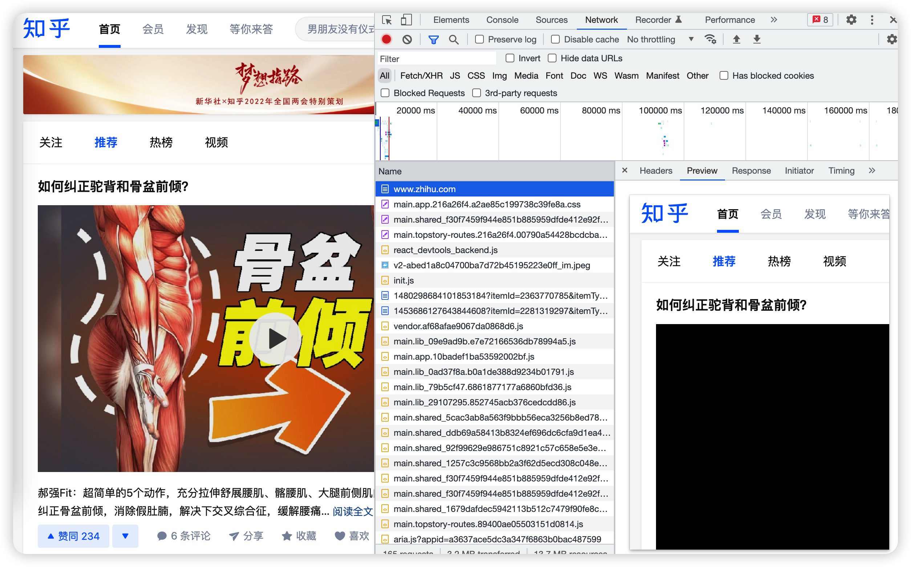

# 一、性能优化思路

性能优化的最终目标是提高用户体验。

当用户将url输入浏览器后，会发生以下过程：

1. DNS解析，通过域名查找服务器IP
2. 建立TCP连接
3. HTTP请求
4. 服务器将结果返回给浏览器
5. 浏览器解析返回的结果并渲染页面

性能优化就是尽可能提高这几个过程的效率，让用户更快、更爽地与客户端进行交互。

比如说：

* 建立HTTP请求是非常消耗网络资源和服务器资源的行为，我们可以减少请求次数和减少请求花费的时间
* 静态资源从服务器返回给客户端同样消耗带宽和服务器，我们可以利用CDN和HTTP缓存加快请求静态资源的速度
* 浏览器的回流非常消耗性能，我们可以在代码上优化DOM，比如React使用useMemo和useCallback等钩子来减少非必要的组件更新
* 用节流和防抖来延缓用户频繁操作带来的副作用
* 浏览器一次性需要渲染的内容太多，可能导致白屏，用户等待焦灼，可以放一个骨架屏延缓用户焦虑
* 渲染长列表时，可能因为数据量太大导致浏览器卡顿，我们可以利用分时函数（timeChunk）来慢慢渲染页面或者将数据缓存、分页
* Lazy-load 实现图片懒加载等
* ...

总的来说，前端性能优化就是从网络、资源消耗、浏览器渲染这三个维度入手，对每个过程进行优化。


# 二、资源压缩合并-Webpack性能调优

HTTP优化有两个大方向：

* 减少请求次数
* 减少单次请求花费的时间

一个网站可能有非常多的静态资源、JS文件，如果能够减少静态资源的体积，合并某些静态资源（比如很多个css样式表），那么就能够对HTTP进行优化。

对**资源的压缩和合并**，我们可以利用打包工具来完成。目前打包工具主流还是使用 webpack，通过合理优化webpack的配置，能够让资源的压缩与合并达到理想的效果。

优化webpack的思路也是两个方向：

* 更快（提高构建速度，减少花费时间）
* 更小（减少打包体积）


## 2.1 如何更快——优化打包速度

打包速度影响到的是开发过程中的热更新速度以及上线前的构建速度。

通过以下方式我们可以优化打包速度：

### mode属性

webpack内部对`production`或者`development`有做优化，所以针对开发和生产环境我们需要配置不同的`mode`。

### resolve配置

通过`resolve`解析规则，我们可以手动控制`webpack`的查找规则，除了对开发友好外，相当于显式告诉`webpack`利用`resolve`中的配置规则查找文件，合理的配置会提高`webpack`查找文件的效率。

- **alias设置别名**

  通过`alisa`设置别名可以让`webpack`通过规则项从上到下查找文件，而不是递归查找。

  ```javascript
      alias: {
        '@': path.resolve(process.cwd(), 'src'),
      },
  ```

  通过上面的别名设置，除了让我们开发时可以通过`import xx from '@/xxx'` 引用`src`目录下的内容以外，还对`webpack`的查找规则非常友好——`webpack`知道可以`src`目录从上到下查找文件，而不是通过相对路径递归向上查找文件。

- **extensions高频扩展名前置**

  通过设置`extensions`可以在引入时不写扩展名。

  ```javascript
    resolve: {
      extensions: ['.js', '.jsx', '.tsx'],
    },
  ```

  webpack会从前到后遍历`extensions`属性来匹配是否有对应扩展名的文件，一些高频的后缀放在前面可以提高webpack搜索的速度

- **`modules`告诉webpack 解析模块时应该搜索的目录**

  ```javascript
  const path = require('path');
  
  module.exports = {
    //...
    resolve: {
      modules: [path.resolve(__dirname, 'src'), 'node_modules'],
    },
  };
  ```

  上面的代码将告诉`webpack`搜索`src`目录和`node_modules`目录，`src`目录优先搜索。

  这样有助于加快搜索时间

### cache属性

```javascript
module.exports = {
  //...
  cache: {
    type: 'filesystem',
  },
};
```

通过设置cache属性为文件系统缓存生成的 webpack 模块和 chunk，来改善构建速度。

### thread-loader

在耗时的操作中使用此loader可以生成独立的worker池。每个 worker 都是一个独立的 node.js 进程。

相当于开启了多进程来处理耗时慢的`loader`，这样就达到了多`loader`同时处理的效果。

下面是官方文档的示例：

```javascript
module.exports = {
  module: {
    rules: [
      {
        test: /\.js$/,
        include: path.resolve('src'),
        use: [
          "thread-loader",
          // 耗时的 loader （例如 babel-loader）
        ],
      },
    ],
  },
};
```

### 指定 include 或 exclude 

最常见的方式是通过`include`或`exclude`属性来帮我们避免不必要的转译，以 babel-loader 为例

```javascript
module: {
  rules: [
    {
      test: /\.js$/,
      exclude: /(node_modules|bower_components)/,
      use: {
        loader: 'babel-loader',
        options: {
          presets: ['@babel/preset-env']
        }
      }
    }
  ]
}
```

上面的属性表示babel无需对 node_modules 文件夹或者 bower_components 文件夹做任何处理。

### 开启 loader 的cache 功能

有些 loader支持缓存功能，比如说 babel-loader 可以配置`cacheDirectory`属性,这个功能开启后能够用指定目录来缓存 loader 的执行结果。这样当 webpack 再次构建时，能够读取缓存来避免每次执行时，可能产生的高消耗的编译过程。

### DLLPlugin ❌

 DLLPlugin 在 webpack5 中已经不用了，害我配了半天。


### happypack ❌

这个功能跟 thread-loader 差不多，都是开启多进程，webpack5 已经不需要了。


## 2.2 如何更小——缩小打包体积

缩小打包体积的思路有利用一些plugin来缩小代码量，或者利用webpack的Tree-shaking功能来删除没用过的代码。

### mode 属性

使用 `mode` 为 `"production"` 的配置项以启用[更多优化项](https://webpack.docschina.org/concepts/mode/#usage)，包括压缩代码与 tree shaking。

### 开启压缩

通过[optimization](https://webpack.docschina.org/configuration/optimization/#optimizationminimizer)属性开启压缩功能。告知 webpack 使用 [TerserPlugin](https://webpack.docschina.org/plugins/terser-webpack-plugin/) 或其它在 [`optimization.minimizer`](https://webpack.docschina.org/configuration/optimization/#optimizationminimizer)定义的插件压缩 bundle。

```javascript
module.exports = {
  //...
  optimization: {
    minimize: true,
  },
};
```

### 压缩JS

使用webpack5 开箱即用的插件[TerserWebpackPlugin](https://webpack.docschina.org/plugins/terser-webpack-plugin/)来压缩 JavaScript，只需要将插件添加到 `webpack`配置文件中即可。

```javascript
const TerserPlugin = require("terser-webpack-plugin");

module.exports = {
  optimization: {
    minimize: true,//记得开启压缩功能
    minimizer: [new TerserPlugin()],
  },
};
```


### 压缩css

> [Optimize CSS Assets Webpack Plugin](https://www.npmjs.com/package/optimize-css-assets-webpack-plugin)
>
> 使用方式参照官方文档
>
> ```javascript
> var OptimizeCssAssetsPlugin = require('optimize-css-assets-webpack-plugin');
> module.exports = {
>   module: {
>   ...
>   },
>   plugins: [
>     new OptimizeCssAssetsPlugin({
>       assetNameRegExp: /\.optimize\.css$/g,
>       cssProcessor: require('cssnano'),
>       cssProcessorPluginOptions: {
>         preset: ['default', { discardComments: { removeAll: true } }],
>       },
>       canPrint: true
>     })
>   ]
> };
> ```
>
> ❌ 这个插件已经过时了

webpack5 推荐使用 [CssMinimizerWebpackPlugin](https://webpack.docschina.org/plugins/css-minimizer-webpack-plugin/) 插件，它在 source maps 和 assets 中使用查询字符串会更加准确，支持缓存和并发模式下运行。

安装

```javascript
$ npm install css-minimizer-webpack-plugin --save-dev
```

**webpack.config.js**

```javascript
const MiniCssExtractPlugin = require("mini-css-extract-plugin");
const CssMinimizerPlugin = require("css-minimizer-webpack-plugin");

module.exports = {
  module: {
    rules: [
      {
        test: /.s?css$/,
        use: [MiniCssExtractPlugin.loader, "css-loader", "sass-loader"],
      },
    ],
  },
  optimization: {
    minimizer: [
      // 在 webpack@5 中，你可以使用 `...` 语法来扩展现有的 minimizer（即 `terser-webpack-plugin`），将下一行取消注释
      // `...`,
      new CssMinimizerPlugin(),
    ],
  },
  plugins: [new MiniCssExtractPlugin()],
};
```

### Tree Shaking

*tree shaking* 是一个术语，通常用于描述移除 JavaScript 上下文中的未引用代码(dead-code)。

`webpack`内置这个功能，只需要通过`mode:"production"`来开启就行。


# 三、优化图片体积

优化图片的体积对于网页的效果是显著的，前端开发者需要根据实际情况对不同的图片合理取舍。

以下是不同图片格式的特点：

* **JPG/JPEG**

  特点是有损压缩，体积小，加载快。适合用于大图，比如 Banner 图、背景图等。

* **PNG-8 与 PNG-24**

  PNG 格式是无损压缩的高保真图片格式，比 JPG 有更多的色彩表现力，缺点是体积太大。适合LOGO 图、一些小图。

* **SVG**

  SVG 是一种矢量图，是基于 XML 语法的图像格式，优点是图片可无限放大不失真，即使放到视网膜屏幕上也能够保持较高的品质，而且 SVG 可被编程，灵活性高。缺点是浏览器渲染成本高。适合用于做图标。

* **Base64**

  Base64 是文本文件，把图片解码成 Base64 字符串直接写入 img 标签中，是可以被浏览器解析成图片的，这样做的好处是不需要再去发送 HTTP 请求即可显示图片，节省了传统的浏览器单独向服务器请求图片资源的HTTP开销。但是过大的图片转成Base64 会给浏览器的解析带来困扰，所以推荐用来放20kb 以内，体积小，更新频率低的图片。

## 3.1 通过 webpack 自动将图片转成 Base64

webpack 有个 asset 模块，支持将图片在打包时直接打包成 Base64 格式，我们需要这样配置：

**webpack.config.js**

```javascript
  module: {
    rules: [
    ...
      {
        test: /\.(png|jpe?g|gif|svg)$/i,
        type: 'asset',
        generator: {
          filename: 'assets/[name].[hash:6][ext]', //输出规则
        },
        parser: {
          dataUrlCondition: {
            maxSize: 20 * 1024, // 小于20kb则解析成dataUrl
          },
        },
      },
    ],
  }
```

上面的配置意思是将 20kb 以内的 png/jpg/jpeg/svg 等打包成Base64，其他的情况依然打包成原来的格式。


## 3.2 WebP图片格式

webP 是 google 提出来专门为 Web 开发的**旨在加快图片加载速度**的图片格式，它支持有损压缩和无损压缩。

它集多种图片文件格式的优点于一身，官方介绍是这样的：

> 与 PNG 相比，WebP 无损图像的尺寸缩小了 26％。在等效的 SSIM 质量指数下，WebP 有损图像比同类 JPEG 图像小 25-34％。

这种图片格式太新，对用户的浏览器来说太新颖的东西兼容性就差。

但目前淘宝依然有很多这种格式图片的应用，以下是淘宝中的某一个图片的链接：

```html

```

它在.webp 前面，额外跟了一个.jpg 后缀。

然后用 js判断浏览器能不能支持 webP ，如果不能就使用 JavaScript切割字符串，将 webP 转化为 jpg 格式。


### 转换为 webP 图片

可以手动，也可以加入构建自动化生成。

- 手动，可以使用**webP-converter**、智图等工具，但建议使用官方webP-converter，除了便捷性，同质量下体积各方面均优于智图。

```
./cwebp -q 75 login_plane_2.png -o login_plane_2.webp
复制代码
```

- 自动化生成，可以使用image-min-webp或其他webpack插件


### 建议兼容方案 

比起淘宝的方案，这里有种更简单的方法

* HTML中使用，`<picture>`标签兼容

  ```html
  <picture>
      <source srcset="hehe.webp" type="image/webp">
      
  </picture>
  ```

  如果浏览器支持 `image/webp` 类型的图片，则加载 `<source>` 元素中 `srcset` 属性指向的资源，如果不支持则跳过 `<source>` 元素，加载 `` 元素

  

* CSS中使用，需要配合JS做判断

  ```javascript
  // main.js
  window.addEventListener('DOMContentLoaded', () => {
      const isSupportWebP = document.createElement('canvas')
      .toDataURL('image/webp')
      .indexOf('data:image/webp') === 0
      document.documentElement.classList.add(isSupportWebP ? '' : '.no-support-webp');
  })
  // css
  .support-webp .bg{
      background-image: url("hehe.webp");
  }
  
  .no-support-webp .bg {
      background-image: url("hehe.png");
  }
  ```

  就是多写一套 css，然后通过判断是否支持 webP 来给 HTML 标签加类名以触发不同的图片格式。


# 四、利用HTTP缓存机制

浏览器缓存机制有四个方面，按照资源请求时的优先级是这样排列的：

1. Memory Cache
2. Service Worker Cache
3. HTTP Cache
4. Push Cache

我们可以通过 NetWork 看到资源来自什么缓存。



前端的重点优化策略是 HTTP Cache ，详情可以看[【HTTP 缓存控制】](https://github.com/18888628835/Blog/blob/main/HTTP/HTTP缓存控制.md)


# 五、使用 CDN 缓存静态资源

CDN 全称是内容分发网络Content Delivery Network，它是浏览器和服务器之间的内容架设，它应用了 HTTP 协议中的缓存和代理技术，能够代理源站响应客户端的请求。

使用 CDN 的一个好处是能够加快静态资源被本地浏览器读取的速度，即提高服务器响应速度的能力。

它可以缓存源站数据，让浏览器不用再千里迢迢到达源站服务器，而是在半路直接获取响应。如果 cdn 的调度算法优秀，那么就可以找到距离用户更近的节点，大幅度缩短响应时间。

举个例子，假设我的服务器是在北京，用户在杭州，那么用户打开网站向北京的服务器发送请求，这个响应速度一定没有我直接将服务器放在杭州快。

CDN 就可以充当放在杭州的服务器，它向北京的服务器拷贝资源，杭州的用户访问时，直接访问杭州的 CDN 缓存资源，使得响应速度大大提升。如果用户的资源在 CDN 上没有，CDN 会向北京的服务器索要这个资源。

CDN 的核心点有两个，一个是**缓存**，一个是**回源**。

缓存就是拷贝资源，回源就是当没有这个资源时，向根服务器要资源的过程。


## CDN 的实际应用

CDN 往往被用来存放静态资源。

静态资源就是 CSS、图片等一些不需要经过服务器计算的资源。

与静态资源对应的是动态资源，动态资源往往需要经过业务服务器对用户的权限验证，再决定呈现给用户怎样的内容，换句话说是后端生成的。比较常见的动态资源是 JSP、服务端渲染的页面。

参考淘宝网，它的大量图片都被存到 CDN 服务器中，以下是淘宝 WEB 端请求CDN 获取的一张图片

```javascript
https://img.alicdn.com/imgextra/i2/O1CN010DBuyg1LkqcCrN3MF_!!6000000001338-2-tps-630-400.png
```

目前市面上大部分云服务器厂商都会提供 CDN 服务，并且拥有自动回源功能，只需要用户将服务器地址配置到购买的 CDN 服务器上，如果 CDN 服务器上没有缓存，就会先去用户的服务器上拉取图片，再对外输出；如果命中缓存，则直接对外输出。 这样对于经常访问的图片，理论上只会有CDN 服务器拉取一次，用户的请求流量都打到CDN 上。


# 六、服务端渲染SSR

服务端渲染是一个相对的概念，它的对立面是“客户端渲染”。

## 客户端渲染

客户端渲染模式下，服务端会把渲染需要的静态文件发送给客户端，客户端加载过来之后，自己在浏览器里跑一遍 JS，根据 JS 的运行结果，生成相应的 DOM。这种特性使得客户端渲染的HTML源代码总是特别简洁，往往是这样：

```html
<!doctype html>
<html>
  <head>
    <title>我是客户端渲染的页面</title>
  </head>
  <body>
    <div id='root'></div>
    <script src='bundle.js'></script>
  </body>
</html>
```

我们常见的 Vue、React 等的框架代码就是被打包在`bundle.js` 中，当浏览器将加载过来的 `bundle.js`跑一遍后，才将 root 节点内的 DOM 给创造出来。

## 服务端渲染

服务端渲染的模式下，当用户第一次请求页面时，由服务器把需要的组件或页面渲染成 HTML 字符串，然后把它返回给客户端。客户端拿到手的，是可以直接渲染然后呈现给用户的 HTML 内容，不需要为了生成 DOM 内容自己再去跑一遍 JS 代码。

使用服务端渲染的网站，可以说是“所见即所得”，**页面上呈现的内容，我们在 html 源文件里也能找到**。

知乎就是采用 SSR 渲染的，我们打开知乎的首页可以看到它的内容跟服务器传送过来的是一致的。



## React 简单实现服务端渲染

以下简单介绍如何使用 React 做服务端渲染，首先我们需要准备好要渲染的组件，它可能是这样的：

**VDom.jsx**

```jsx
import React from 'react'

const VDom = () => {
  return <div>我是一个被渲染为真实DOM的虚拟DOM</div>
}

export default VDom
```

在服务端的入口处，引入这个组件，然后使用 React 提供的 SSR方法生成DOMString。

```javascript
import express from 'express'
import React from 'react'
import { renderToString } from 'react-dom/server'
import VDom from './VDom'

// 创建一个express应用
const app = express()
// renderToString 是把虚拟DOM转化为真实DOM的关键方法
const RDom = renderToString(<VDom />)
// 编写HTML模板，插入转化后的真实DOM内容
const Page = `
            <html>
              <head>
                <title>test</title>
              </head>
              <body>
                <span>服务端渲染出了真实DOM:  </span>
                ${RDom}
              </body>
            </html>
            `
// 配置HTML内容对应的路由
app.get('/index', function(req, res) {
  res.send(Page)
})

// 配置端口号
const server = app.listen(8000)            
```

此时，访问 `localhost:8000/index`路由就可以拿到服务端渲染的内容了。


整体的流程只需要三步：

* 让React 代码在 Node 环境下跑一遍，生成虚拟 DOM
* 调用 renderToString() 方法将结果转化成真实 DOM
* 最后将 DOM塞进HTML模板中返回给浏览器

## 服务端渲染解决的问题

1.  SEO 

   在 SEO 方面，服务端渲染要优于客户端渲染。

   采用客户端渲染有个缺点，需要跑完 JS 脚本才能将所有内容呈现出来，搜索引擎爬虫只能够爬取 HTML 源代码，并不会跑 JS 脚本，这就使得客户端渲染出来的网站内容不能被搜索引擎给收集到。

   服务端渲染是直接生成 HTML 源代码，这些现成的内容方便搜索引擎收集，我们的网站也就能够更快地被用户定位到。

2. 首屏加载

   在客户端渲染模式下，浏览器除了加载基本的 HTML，还要将打包过的 JS 文件执行一遍才能最终将页面渲染出来。在 JS 文件执行的这段时间，用户一直处于等待的状态。

   相比之下，服务端渲染就直接将结果呈现给用户，中间环节已经被服务器给做掉了，这样就提高了首屏加载的速度。


## 服务端渲染的缺陷

服务端渲染本质上就是将浏览器做的事，搬到性能更强的服务器上做了。

通过这样的方式的确可以加快资源呈现的速度，但对服务器的性能开销要求也是极大的。

所以服务端渲染一般是用于对网页加载速度要求极高或者对 SEO 有极高需求的网站。


# 七、避免浏览器解析阻塞

当主线程正在执行 JavaScript 脚本文件时，渲染线程是停止工作的，所以JavaScript 会影响页面加载首屏的速度。

当页面构建 DOM 和 CSSOM 树时，如果给JavaScript 脚本添加上 defer 或者 async 属性，就能够有效解决这种问题。

[浏览器加载页面过程](https://github.com/18888628835/Blog/blob/main/浏览器/浏览器渲染过程.md)

[浏览器加载文档和资源](https://github.com/18888628835/Blog/blob/main/浏览器/浏览器加载文档和资源.md)


# 八、减少不必要的 DOM 操作

每次操作 DOM 都是一次性能开销，它意味着需要修改 DOM 树，还有可能触发浏览器的回流和重绘。

如果巧用 DOMFragment 或者数组方式减少 DOM 操作开销，就可以提高浏览器渲染的速度。

[DocumentFragment](https://github.com/18888628835/Blog/blob/main/浏览器/Document.md)


# 九、用宏/微任务异步执行

浏览器采用事件循环来管理同步、异步代码。

简单来说，浏览器就是在内部有两个队列，宏任务队列和微任务队列，其中微任务队列是在宏任务开启后生成的，并非独立于宏任务的队列。

1. 宏任务队列的第一个任务是 script 脚本，
2. 在执行宏任务时会往内部的微任务队列中塞微任务（queueMicrotask、promise.then）等，当微任务队列里的所有任务都执行完，就会触发UI 线程的 render 行为。
3. 继续往宏任务队列中塞宏任务，比如 setTimeout 或者用户的点击事件、XHR等，继续第 2 步..
4. 整个过程循环往复进行...

根据这个特点，我们可以将某些费时的任务放在异步完成，这样就能减轻浏览器单线程执行代码的压力，好处是页面执行速度变快了，减少页面卡顿。

[事件循环](https://github.com/18888628835/Blog/blob/main/浏览器/事件循环.md)


# 十、Lazy-Load

两种方式的图片懒加载，

单个图片懒加载：[虚拟代理实现图片预加载](https://github.com/18888628835/Blog/blob/main/JavaScript设计模式/单例模式、策略模式、代理模式、发布订阅模式、命令模式、组合模式.md#63-虚拟代理实现图片预加载)

图片列表实现懒加载：[原生实现图片懒加载](https://github.com/18888628835/Blog/issues/48)


# 十一、防抖节流

代码：[手写防抖节流](https://github.com/18888628835/Interview/issues/12)

细节：[手写防抖和节流](https://github.com/18888628835/Blog/issues/42)或[掘金-「查漏补缺」手写节流throttle和防抖debounce](https://juejin.cn/post/6906501329209393159)


