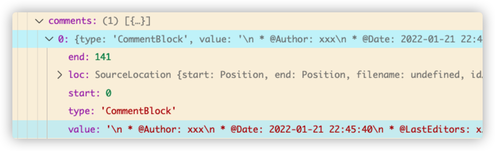

# 一、babel

babel插件可以通过三个函数来转换代码，它们是：

1. parse：把代码 code 变成 AST
2. traverse：遍历 AST 修改代码
3. generator：把 AST 变成 code2

## 1.1 parse阶段

举个例子,以下为两个文件：

```js
// main.js
/*
 * @Author: xxx
 * @Date: 2022-01-21 22:45:40
 * @LastEditors: xxx
 * @LastEditTime: 2022-01-21 22:45:40
 * @FilePath: /demo-1/main.js
 */
let a = 'let';
let b = 123;
```

```typescript
// index.ts
import { parse } from '@babel/parser';
import traverse from '@babel/traverse';
import generator from '@babel/generator';
import fs from 'fs';
fs.readFile('./main.js', function (error, data) {
  const ast = parse(code.toString(), { sourceType: 'module' });
});
```

上面的代码是用fs模块将`main.js`中的文本引入后，使用`babel`的`parse`函数进行分析，此时会生成AST语法树。

AST是什么呢？本质上来说，它跟DOM树类似，就是树形节点的JavaScript对象。我们来看一下上面代码中会生成怎样的AST语法树。

以下是通过断点查看的ast对象，它是这样的：


主要观察我圈红的`comments`和`program`,两个属性分别对应`main.js`中的注释和代码。

```js
// main.js
/* ------ 以下为comments  -------- */
/*
 * @Author: xxx
 * @Date: 2022-01-21 22:45:40
 * @LastEditors: xxx
 * @LastEditTime: 2022-01-21 22:45:40
 * @FilePath: /demo-1/main.js
 */
/* -------- 以下为program ------  */ 
let a = 'let';
let b = 123;
```

其中`comments`属性是一个数组，里面有一个数组元素，它是这样的：



Babel将多行注释块解析成一个对象，这个对象的`type`是`commentBlock`,`value`是包含转义字符的具体注释文本。

`program`则是将代码块解析成一个对象，这个对象的`body`属性也是一个数组，数组中每个子项长这样：


* `kind`——是声明的方式，有三种：`let` `var` `const`
* `id`——里面包含声明的变量信息，比如`name:'a'`表示声明的变量名
* `init`——里面包含值的信息，比如`value:'let'`表示变量名a的值为`let`，`type:'StringLiteral'`表示值的类型是字符串。
* `type`——类型，上图中类型是变量声明（VariableDeclaration）
* ...

总而言之，babel提供的`parse`函数是将一个文件中的代码给解析成`AST`语法树——这个语法树抽象了代码的各种信息。通过它，我们能够知道代码具体是使用哪种声明、声明后的值是什么类型、代码中的注释情况等等。

## 1.2 traverse阶段

`traverse`阶段是遍历AST语法树的阶段，当我们遍历语法树时，可以获取到每个节点里面的信息，也可以修改语法树的内容。以下的代码是将变量声明的方式从`let`修改成`var`。

```js
  // 遍历ast
  traverse(ast, {
    // 每进入节点时调用enter函数
    enter: item => {
      // 如果节点的类型是变量声明
      if (item.node.type === 'VariableDeclaration') {
        // 变量声明的种类是let
        if (item.node.kind === 'let') {
          // 设置成var
          item.node.kind = 'var';
        }
      }
    },
  });
```

## 1.3 generator阶段

`generator`阶段是将语法树重新设置成代码的阶段。

```js
  // 将ast转化成代码
  const result = generator(ast, {}, data.toString());
  // 用w+的方式将代码写入到main2.js中
  fs.writeFile('./main2.js', result.code, { flag: 'w+' }, error => {
    console.log(error);
  });
```

## 1.4 借助工具将es6的代码转化成es5

我们可以通过一些别人写好的插件简化代码转化的过程，比如，通过`@babel/core`和`@babel/preset-env`将es6的代码转化成es5。

```javascript
// es6.js
let a = [1, 2, 3, 4];
let b = [...a];
for (let item of a) {
  console.log(item);
}
let [c, ...rest] = a;
```

通过下面的代码，我们将`es6.js`中的代码转换成`es5`

```typescript
// index.ts
import { parse } from '@babel/parser';
import * as babel from '@babel/core';
import * as fs from 'fs';

fs.readFile('./es6.js', function (error, code) {
  const ast = parse(code.toString(), { sourceType: 'module' });
  const result = babel.transformFromAstSync(ast, code.toString(), {
    presets: ['@babel/preset-env'],
  });
  fs.writeFile('./es5.js', result.code, { flag: 'w+' }, () => {});
});
```

转换后的结果：

```javascript
// es5.js
"use strict";

var a = [1, 2, 3, 4];
var b = [].concat(a);

for (var _i = 0, _a = a; _i < _a.length; _i++) {
  var item = _a[_i];
  console.log(item);
}

var c = a[0],
    rest = a.slice(1);
```


## 1.5 小结

babel转换代码需要经过三个主要阶段：

1. parse——解析代码成AST
2. traverse——遍历AST
3. generator——将AST转换成新的代码

AST语法树就是代码的抽象化后形成的类似于DOM树的对象。它将代码的类型、声明方式、变量名、值类型等所有信息都转化成对象的属性，通过AST，我们既可以知道代码的详细信息，还可以通过修改AST将代码转化成新的代码。


