# 一、浏览器环境和规格

一开始 JavaScript 是为浏览器创建的语言，现在它已经能够在多平台运行了。

平台可以是一个浏览器，也可以是一个 web 服务器，或者其他主机(host)。这些平台都能够运行 JavaScript 程序并且提供了特定的功能。JavaScript 称它们为“主机环境”。

主机环境提供了自己的对象和语言核心外函数。Web 浏览器提供了控制页面的方法，Node.JS 提供了服务端的功能等。

JavaScript 在浏览器中运行时，能有以下的操作功能


有一个叫做 window 的根对象。它有两个角色：

- JavaScript 代码的全局对象
- 它代表浏览器窗口，并且提供控制它的方法

比如，当我们创建一个全局函数时，我们可以通过 window 访问到它

```javascript
function sayHi() {
  console.log('hello');
}
window.sayHi(); // 全局函数是全局对象的方法
```

我们还可以用它访问浏览器窗口高度

```javascript
window.innerHeight; // 内部窗口的高度
```

## 1.1 DOM

文档对象模型（document Object Model），简称 DOM，将所有页面的内容表现为可以修改的对象。

`document`对象是页面的主要入口点。我们可以用它来修改或者创建页面上的任何内容

```javascript
// 修改页面内容的背景颜色为绿色
document.body.style.background = 'green';
```

> DOM 不仅仅用于浏览器
>
> DOM 规范解释了文档的结构，并提供了操作文档的对象。有的非浏览器设备也使用了 DOM。
>
> 例如：下载 HTML 文件并对其进行处理的服务端脚本也可以使用 DOM。但它们可能只支持规范中的部分内容

> 对应于 DOM 结构，还有 CSSOM，这是一份针对 css 规则和样式表的规范，它解释了将 css 表示为对象，以及如何读写这些对象。
>
> 当我们修改文档的样式规则时，CSSOM 与 DOM 是一起使用的。但实际上，很少需要 CSSOM，因为我们很少需要从 JavaScript 中修改 CSS 规则（我们通常只是添加/移除一些 CSS 类，而不是直接修改其中的 CSS 规则），但这也是可行的。

## 1.2 BOM

BOM 是浏览器对象模型(Browser Object Model)，表示由浏览器作为主机环境提供用于文档（document）之外的所有内容的对象。

例如：

- navigator 对象提供有关浏览器和操作系统的背景信息。navigator 有许多属性，最广为人知的是：`navigator.userAgent`——当前浏览器 和`navigator.platform`——关于平台信息（Windows/Mac/Linux）等
- location 对象允许我们读取当前 URL，并且可以将浏览器重定向到新的 URL

```javascript
location.href = 'http://www.baidu.com'; // 跳转到百度页面
```

函数`alert/confim/prompt`也是 BOM 的一部分，BOM 与文档(document)没有直接关系，但它代表了浏览器与用户之间通信的浏览器方法。

> BOM 是 HTML 规范的一部分，HTML 规范不仅是关于 HTML 语言，还涵盖了一些对象、方法和特定的 DOM 扩展。这就是广义的 HTML

## 1.3 小结

JavaScript 的主机环境如果是浏览器，则会有一个全局对象 window，里面涵盖了 DOM、BOM、JavaScript 代码等内容。这些内容遵循一些标准规范：

- HTML 规范 —— HTML 语言以及 BOM（浏览器对象模型） —— 各种浏览器函数（setTimeout、alert、location）等
- DOM 规范 —— 浏览器中 document 文档的结构、操作和事件的规范
- CSSOM 规范 —— 描述 css 样式表和样式规则，对它们的操作、以及它们与文档的绑定等规范
- 其他规范

# 二、DOM 树

HTML 文档的主干是标签（tag）。

根据文档对象模型(DOM)，每个 HTML 标签都是一个对象。嵌套的标签是闭合标签的“子标签（children）”。标签内的文本也是一个对象。

所有这些对象都可以通过 JavaScript 来访问，我们可以使用它们来修改页面。

例如，`document.body` 是表示 `<body>` 标签的对象。

## 2.1 DOM 的例子

```html
<!DOCTYPE html>
<html>
  <head>
    <title>About elk</title>
  </head>
  <body>
    The truth about elk.
  </body>
</html>
```

以上的 HTML 被 DOM 表示为标签的树形结构，就类似这样：


每棵树的节点都是一个对象。

标签被称为元素节点，并形成树形结构：html 在根节点，head 和 body 是其子节点。

元素内的文本形成文本节点，被标记为`#text`。一个文本节点只包含一个字符串。它没有子项，而且总是树的叶子。

例如：title 标签里面有文本“About elk”。

有两种特殊的字符：

- 换行符（\n）
- 空格

这两种都是有效的字符，它们也能形成文本节点并成为 DOM 的一部分。

例如，head 标签前面有一些空格，也有一个换行符，它们形成一个#text 节点。

- `<head>`之前的空格和换行符会被忽略（历史原因）
- `</body>`后的东西会被放置到 body 内，并放在 body 的底部。（HTML 规范）所以`</body>` 之后没有空格。

> 浏览器工具不会在文本开始/结尾显示空格，并且在标签之间也不会显示换行符

## 2.2 自动修正

如果浏览器遇到格式不正确的 HTML，它会在形成 DOM 时自动更正它。

例如，顶级标签总是 `<html>`。即使它不存在于文档中 — 它也会出现在 DOM 中，因为浏览器会创建它。

在生成 DOM 时，浏览器会自动处理文档中的错误，关闭标签等。

比如说以下标签

```html
<p>
  Hello
  <li>Mom</li>
  <li>and</li>
  <li>Dad</li>
</p>
```

DOM 最终会修正错误，帮助闭合标签，并且生成 HTML 标签、BODY 标签、body 标签等

表格是一个有趣的“特殊的例子”。按照 DOM 规范，它们必须具有 `<tbody>`，但 HTML 文本却忽略了它。然后浏览器在创建 DOM 时，自动地创建了 `<tbody>`。

下面的例子中的代码在浏览器中会自动出现`<tbody>`

```html
<table id="table">
  <tr>
    <td>1</td>
  </tr>
</table>
```

## 2.3 其他节点类型

除了元素和文本节点外，还有其他节点类型：

- 注释
- `<!DOCTYPE...>`等

## 2.4 小结

HTML/XML 文档在浏览器内均被表示为 DOM 树

- 标签(tag)是元素节点，并形成文档结构
- 文本(text)是文本节点
- ...HTML 中所有东西都能在 DOM 树中有所映射，注释也可以。

一般我们直接使用 F12 开发者工具来手动检查或者修改它们。

# 三、遍历 DOM

对 DOM 的所有操作都是以`document`对象开始的。从它我们可以访问任何节点。

下图是描述对象间关系的图片，通过这些关系我们可以在 DOM 节点之间切换

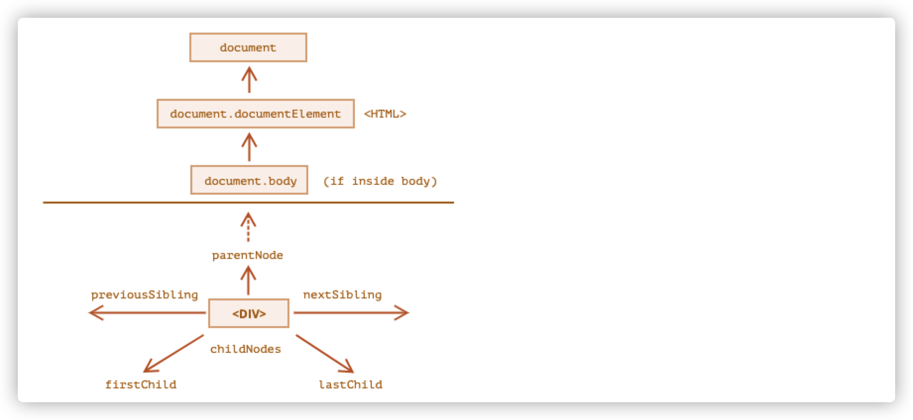

## 3.1 document.documentElement 和 Body

最顶层的树节点可以直接作为 document 对象的属性来使用：

- `<html>`=document.documentElement 顶层 DOM 节点
- `<body>`=document.body
- `<head>`=document.head

document.body 可以是个 null。

如果我们没写 body 标签，DOM 会自动创建，但是在以下情况下 body 可能是个 null

```html
<html>
  <head>
    <script>
      alert('From HEAD: ' + document.body); // null，这里目前还没有 <body>
    </script>
  </head>

  <body>
    <script>
      alert('From BODY: ' + document.body); // HTMLBodyElement，现在存在了
    </script>
  </body>
</html>
```

因为 DOM 节点是从上到下解析并形成的，如果脚本在 head 就开始运行了，浏览器还没读到 body，所以就不存在 document.body。

## 3.2 子节点：childNodes，firstChild，lastChild

- 子节点含义：对应的直系子元素。它们被完全被嵌套在给定的元素中。例如`head`和`body`标签就是`html`元素的子元素。
- 子孙元素含义：嵌套在给定元素的所有元素，包括子元素以及子元素的子元素等。

如以下代码

```html
<html>
  <body>
    <div>Begin</div>

    <ul>
      <li>
        <b>Information</b>
      </li>
    </ul>
  </body>
</html>
```

body 节点的子节点是 div 节点跟 ul 节点（包括一些空白空格的文本节点）

body 的子孙元素是包含 div、ul、li、b 等子孙元素。

**查子节点**

我们可以用`childNodes`来列出所有子节点，包括文本节点。

```html
<html>
  <body>
    <div>Begin</div>

    <ul>
      <li>Information</li>
    </ul>

    <div>End</div>

    <script>
      for (let i = 0; i < document.body.childNodes.length; i++) {
        alert(document.body.childNodes[i]); // Text, DIV, Text, UL, ..., SCRIPT
      }
    </script>
    ...more stuff...
  </body>
</html>
```

上面的代码会将 body 的所有子节点都打出来。

但不会打出`...more stuff ... `因为脚本运行时这个内容还没解析出来，所以浏览器读不到。

查第一个子节点：firstChild

查最后一个子节点：lastChild

查是否有子节点：node.hasChildNodes()

## 3.3 DOM 集合

childNodes 是一个伪数组，是部署了 iterator 接口的可迭代伪数组。

我们可以用 for..of 迭代它，但无法使用数组的方法。

不过我们可以用一些方法来让它使用数组的方法：

- `Array.from`、`[...childNodes]`变成真数组
- 用 call、apply 等方法

有几个注意点：

- DOM 集合是只读的，我们不能用 childNodes[i]=...的操作来替换一个子节点
- DOM 集合是实时的，它反映 DOM 的当前状态
- 不要用 for...in 对集合进行迭代，原因是 for..in 会遍历所有可枚举（enumerable）属性。DOM 集合中就有一些我们并不需要的这些属性会被 for..in 迭代到

## 3.4 兄弟节点和父节点

兄弟(Sibling)节点指的是有同一个父节点的节点。

```html
<html>
  <head>
    ...
  </head>
  <body>
    ...
  </body>
</html>
```

- body 是 head 的下一个兄弟节点

- head 是 body 的前一个兄弟节点

父节点：parentNode

上一个兄弟节点：previousSibling

下一个兄弟节点：nextSibling

```javascript
console.log(document.body.parentNode.tagName); // HTML
console.log(document.head.nextSibling.tagName); // BODY
console.log(document.body.previousSibling.tagName); // HEAD
```

## 3.5 纯元素导航

childNodes 中有很多节点，包括文本节点、元素节点、注释节点等。

但是有时候我们只想要元素节点。

以下就是纯元素节点的导航

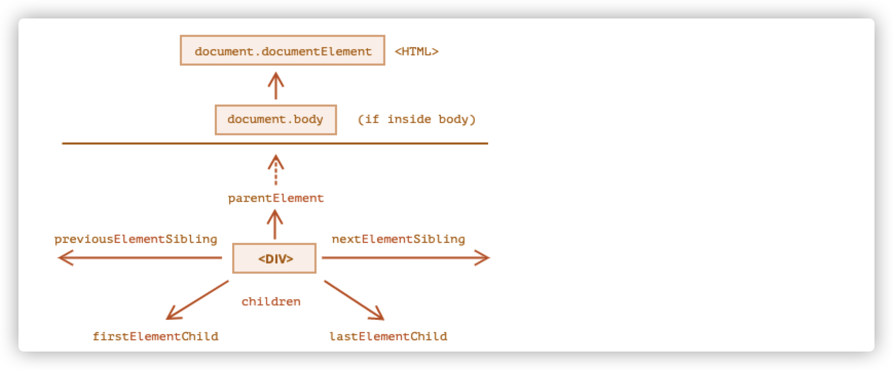

这些纯元素节点跟上面的节点访问类似，区别在于需要添加`Element`

- Children —— 纯元素节点的子节点
- firstElementChild —— 第一个子元素节点
- lastElementChild —— 最后一个子元素节点
- previousElementSibling —— 上一个兄弟元素节点
- nextElementSibling —— 下一个兄弟元素节点
- parentElement —— 父元素节点

**parentElement 和 parentNode 的区别**

从语义上来说 parentElement 是找父元素节点而 parentNode 是找父节点。

一般来说这两个是一样的，都是用于获取父节点。

不过出现这个 API 可能是由于`document.documentElement`的`parentElement`和`parentNode`不一致导致的

```javascript
document.documentElement.parentNode; // document
document.documentElement.parentElement; // null
```

因为 html 的父节点就是 document 对象

但是 document 并不是元素节点。

当我们希望从下到上遍历到 html 时，可能这个细节有用

```javascript
while(elem === elem.parentElement){ //向上遍历，直到html顶层
	...
}
```

## 3.6 特定的 DOM 属性

某些类型的 DOM 元素可能会提供特定于类型的其他属性。

比如表格（Table）

`<Table>`除了支持上面的基本属性，还额外支持以下属性：

- table.rows - `<tr>`元素的集合
- `table.caption/tHead/tFoot` - 引用表格的` <caption>``<thead>``<tfoot> `
- table.tBodies - `<tbody>`元素的集合

**`<thead>`，`<tfoot>`，`<tbody>`** 元素提供了 `rows` 属性：

- `tbody.rows` — 表格内部 `<tr>` 元素的集合。

**`<tr>`**：

- `tr.cells` — 在给定 `<tr>` 中的 `<td>` 和 `<th>` 单元格的集合。
- `tr.sectionRowIndex` — 给定的 `<tr>` 在封闭的 `<thead>/<tbody>/<tfoot>` 中的位置（索引）。
- `tr.rowIndex` — 在整个表格中 `<tr>` 的编号（包括表格的所有行）。

**`<td>` 和 `<th>`：**

- `td.cellIndex` — 在封闭的 `<tr>` 中单元格的编号。

## 3.7 小结

给定一个 DOM 节点，我们可以使用导航（navigation）属性 访问其直接的邻居

- 对于所有节点：parentNode、childNodes、firstChild、lastChild、nextSibling、previousSibling
- 对于所有元素节点：parentElement、children、firstElementChild、lastElementChild、nextElementSibling、previousElementSibling
- 有一些特定的元素还能有额外的属性

# 四、搜索 DOM

## 4.1 搜索具有 id 的元素

`document.getElementById`或者只使用`id`

```javascript
document.getElementById('elem').style.background = 'red'; // 通过getElementById搜索对应元素
// elem 是对带有 id="elem" 的 DOM 元素的引用
elem.style.background = 'red'; // 也可以直接通过id访问
// id="elem-content" 内有连字符，所以它不能成为一个变量
// ...但是我们可以通过使用方括号 window['elem-content'] 来访问它
```

使用 id 方式直接访问 dom 是一种兼容性的支持，并不推荐在项目开发中使用。可以用于在元素来源非常明显且不会跟变量名重复的情况。（可用于写 demo）

如果有具有相同名称的变量，那么则以变量名为优先。

> 保持 id 的唯一性，全局不要有重复的 id，否则使用搜索 API 搜索某一个元素时，可能会随机返回另一个元素。
>
> document.getElementById 只能被在 document 上调用，没有 elem.getElementById

## 4.2 querySelectorAll

`querySelectorAll(css_selector)`方法可以搜索跟 CSS 选择器相匹配的**所有**元素。

` querySelector(css_selector)`方法可以搜索跟 CSS 选择器相匹配的第一个元素，相当于 `querySelectorAll(css_selector)[0]`

```html
<ul>
  <li>The</li>
  <li>test</li>
</ul>
<ul>
  <li>has</li>
  <li>passed</li>
</ul>
<script>
  let elements = document.querySelectorAll('ul > li:last-child');

  for (let elem of elements) {
    alert(elem.innerHTML); // "test", "passed"
  }
  let element = document.querySelector('ul > li:last-child');
  alert(element.innerHTML); // "test"
</script>
```

querySelector 方法可以供 elem 调用

```html
<div class="container">
  <div>123</div>
</div>

<script>
  let containerElem = document.querySelector('.container');
  let div = containerElem.querySelector('div');
  console.log(div.innerHTML); // 123
</script>
```

## 4.3 getElementsBy\*

旧的 API 中还有类似通过标签、类等查找节点的方法。`querySelector` 功能更强大，写起来更短，所以这些旧 API 通常在老代码中存在

- elem.getElementsByTagName(tag) 查询标签名的集合

  ```html
  <h1>This is a static template</h1>
  <script>
    const elem = document.getElementsByTagName('h1');
    console.log(elem[0].innerText); // This is a static template
  </script>
  ```

- elem.getElementsByClassName(className) 返回具有给定 css 类的元素

  ```html
  <h1 class="template">This is a static template</h1>
  <script>
    const elem = document.getElementsByClassName('template');
    console.log(elem[0].innerText);
  </script>
  ```

- document.getElementsByName(name) 返回在文档范围内具有给定 name 特性的元素。(很少用)

  ```html
  <form action="" name="form">
    <input type="text" />
  </form>
  <script>
    const elem = document.getElementsByName('form');
    console.log(elem[0].children);
  </script>
  ```

注意点：

- 不要忘记字母 s
- 返回的是一个集合（伪数组）

## 4.4 实时的集合

所有的“getElementsBy\*”返回的都是**实时**的集合。这样的集合始终反映的是文档的当前状态，并且在文档发生更改时会自动更新。

```html
<div>First div</div>

<script>
  let divByGetElements = document.getElementsByTagName('div');
  let divBySelector = document.querySelectorAll('div');
  console.log(divByGetElements.length); // 1
  console.log(divBySelector.length); // 1
</script>

<div>Second div</div>

<script>
  console.log(divByGetElements.length); // 2
  console.log(divBySelector.length); // 1
</script>
```

上面的例子中，通过两种方式搜索出来的 div，在文档发生改变后，通过`getElementsBy*`获取的元素集合更新了，而通过`querySelector`获取的元素集合是**静态**的，不会实时更新。

## 4.5 matches

matches 可以检查`elem`是否和 css 选择器相匹配。它返回布尔值。

当我们遍历元素时，可以用这个 API 过滤我们需要的元素

```javascript
<a href="http://example.com/file.zip">...</a>
<a href="http://ya.ru">...</a>

<script>
  // 不一定是 document.body.children，还可以是任何集合
  for (let elem of document.body.children) {
    if (elem.matches('a[href$="zip"]')) {
      alert("The archive reference: " + elem.href );
    }
  }
</script>
```

## 4.6 closest

`elem.closest(css_selector)`这个 API 可以返回最靠近的并且与 css 选择器相匹配的祖先。elem 自己也会被搜索。

换句话说，方法`closest`在元素中得到了提升，并检查每个父级和自己。如果与 css 选择器相匹配，则会返回对应的祖先元素（包括自己）

```html
<h1>这是外层元素</h1>
<div>
  <ul>
    <li>li1</li>
    <li>li2</li>
    <li>li3</li>
  </ul>
</div>
<script>
  let elem = document.body.querySelector('li');
  console.log(elem.closest('li').innerHTML); // li1
  console.log(elem.closest('ul').tagName); // UL
  console.log(elem.closest('div').tagName); // DIV
  console.log(elem.closest('h1').tagName); // 找不到
</script>
```

## 4.7 contains

`elemA.contains(elemB)`这个 API 可以用来检查元素 A 是否是另一个元素 B 的祖先（元素 B 是否在元素 A 内），它返回 boolean 值。

如果 elemA===elemB，那么会返回 true

```html
<h1>这是外层元素</h1>
<div>
  <ul>
    <li>li1</li>
    <li>li2</li>
    <li>li3</li>
  </ul>
</div>
<script>
  let divElem = document.body.querySelector('div');
  let h1Elem = document.body.querySelector('h1');
  let ulElem = divElem.querySelector('ul');
  let liElem = ulElem.querySelector('li');
  console.log(divElem.contains(ulElem)); // true
  console.log(divElem.contains(liElem)); // true
  console.log(ulElem.contains(liElem)); // true
  console.log(divElem.contains(h1Elem)); // false
</script>
```

## 4.8 小结

在 DOM 中搜索节点，可以用以下方式：

| 方法名                 | 搜索方式     | 能够给元素调用 | 实时性 |
| ---------------------- | ------------ | -------------- | ------ |
| querySelector          | CSS-selector | ✅             | ❌     |
| querySelectorAll       | CSS-selector | ✅             | ❌     |
| getElementById         | id           | ❌             | ❌     |
| getElementsByTagName   | tag 或者 \*  | ✅             | ✅     |
| getElementsByClassName | class        | ✅             | ✅     |
| getElementsByName      | Name         | ❌             | ✅     |

最常用的是 querySelector 和 querySelectorAll

此外：

`elem.matches(css_selector)`这个 API 用于检查 elem 与 css 选择器是否匹配

`elem.closest(css_selector)`这个 API 用于检查 elem 与 css 选择器相匹配的祖先（包括自己）

`elemA.contains(elemB)`这个 API 用于检查子级与父级的关系 —— 如果 elemA 包含 elemB（或者相等），则返回 true

# 五、Attributes 和 properties

当浏览器加载页面时，它会解析 html 并形成 DOM 对象，对于元素节点，大多数标准的 HTML 特性（attributes）会自动变成 DOM 对象的属性（properties）。

比如：如果`<body id='body'>`那么 DOM 对象中就会存在`document.body.id=‘body’`

但是特性跟属性的映射并非一一对应的。

## 5.1 DOM 属性 properties

DOM 节点的属性和方法是常规的 JavaScript 对象：

- 它们可以有很多值
- 它们大小写敏感

我们可以自由地增加 DOM 属性

比如，我们可以给 body 增加属性和方法

```javascript
document.body.data = {
  name: 'body',
};
document.body.sayHi = function () {
  console.log('hi,my name is ' + this.data.name);
};
document.body.sayHi();
```

也可以在原型上添加方法

```javascript
Element.prototype.sayHi = function () {
  console.log('hi,my name is ' + this.tagName);
};

document.body.sayHi(); // hi,my name is BODY
```

## 5.2 HTML 特性 attributes

HTML 中，标签可能拥有特性（attributes）。当浏览器解析 HTML 文本，并根据标签创建 DOM 对象时，浏览器会辨别 **标准的** 特性并以此创建 DOM 属性。

当一个 HTML 标签拥有标准特性时，会生成对应的 DOM 属性。但是非标准特性就不会

```html
<div id="elem" another="another"></div>
<script>
  // 标准特性会获得id属性
  console.log(elem.id); // elem
  // 非标准特性不会获得another属性
  console.log(elem.another); // undefined
</script>
```

不同的 HTML 标签有不一样的标准特性，比如`<input>`拥有 type 特性，但是`<body>`就不拥有这个标准特性。

如果一个特性并不是标准的，我们就无法通过 DOM 的 API 去获取这些特性，以下方法可以帮助我们获取这些特性：

1. `elem.hasAttribute(name)` —— 检查是否有这个特性
2. `elem.getAttribute(name)` —— 获取这个特性值
3. `elem.setAttribute(name,value)` —— 设置特性值
4. `elem.removeAttribute(name)` —— 移除这个特性值
5. `elem.attributes` —— 读取所有特性：属于内建 Attr 类的对象的集合，具有 name 和 value 属性。

这些方法操作的是 HTML 的内容。以下是一个示例

```html
<body something="non-standard">
  <script>
    alert(document.body.getAttribute('something')); // 非标准的
  </script>
</body>
```

HTML 特性有以下特征：

- 它们的名字对大小写不敏感（id 与 ID 相同）
- 它们的值总是字符串类型的

```html
<div id="elem" about="Elephant"></div>

<script>
  console.log(elem.getAttribute('About')); // (1) 'Elephant'，读取

  elem.setAttribute('Test', 123); // (2) 写入

  console.log(elem.outerHTML); // (3) <div id="elem" about="Elephant" test="123"></div>

  for (let attr of elem.attributes) {
    // (4) 列出所有
    console.log(`${attr.name} = ${attr.value}`);
  }
</script>
```

1. 在第(1)步中，我们读取的是”About”,在 HTMl 中是 about，但这并不影响读取它的值，这说明对大小写不敏感

2. 我们可以将任何东西都设置成特性的值，但最终会变成字符串，第(2)步写入的 123 会变成字符串

3. 所有特性，在我们`outerHTML`后都是可见的

4. `attributes`是可迭代的集合，该对象将所有特性（标准和非标准）都作为`name`和`value`属性存储在对象中

## 5.3 属性-特性同步

当一个标准特性被修改时，对应的属性也会自动更新（也有例外）。

```html
<input type="text" />

<script>
  const elem = document.querySelector('input');
  // 设置特性
  elem.setAttribute('id', 'id');
  // 查看属性
  console.log(elem.id); // id 特性=>属性 更新了
  //设置属性
  elem.id = 'newId';
  //查看特性
  console.log(elem.getAttribute('id')); // newId 属性=>特性 更新了
</script>
```

上面的例子中，我们设置 input 的标准特性 id，从属性到特性，再从特性到属性都是可以同步的。

但是也有一些例外。input 的 value 只能从特性同步到属性，反过来就不行：

```javascript
// 设置value特性为123
elem.setAttribute('value', '123');
console.log(elem.value); // 123 说明特性=>属性成功

// 设置value属性为456
elem.value = '456';
console.log(elem.getAttribute('value')); // 123 属性=>特性不成功
```

从上面的例子中：

- 我们设置了 value 特性，会发现属性更新了
- 属性的更改不会影响特性

这个情况在实际开发中可能有效，比如用户更改了 value 值，如果想要恢复成默认值，就可以直接从特性中取原始值。

## 5.4 属性不一定与特性保持一致

相对于特性的值总是字符串类型，DOM 属性是多类型的并且不一定与特性是一致的。例如，input.checked 是布尔型的，checked 特性则是空字符串

```html
<input type="text" checked />

<script>
  const elem = document.querySelector('input');
  console.log(elem.getAttribute('checked')); // checked特性是空字符串

  console.log(elem.checked); // true
</script>
```

style 特性是字符串型的，但 style 属性却是对象类型

```html
<div style="background: chocolate; border: 1px solid red;"></div>

<script>
  const elem = document.querySelector('div');
  console.log(elem.getAttribute('style')); // background: chocolate; border: 1px solid red;

  alert(elem.style); //[object CSSStyleDeclaration]
  console.log(elem.style.color); // chocolate
</script>
```

还有一种情况，两者都是字符串类型，但是值却是不一样的。

下面的 a 元素的 href 特性与 href 属性就不一致，href 的 DOM 属性一直是一个完整的 URL，即使该特性包含一个相对路径或者包含一个`#hash`

```html
<a id="a" href="#location"></a>

<script>
  console.log(a.href); // https://1mgz6.csb.app/#location 完整形式的url
  console.log(a.getAttribute('href')); // #location
</script>
```

## 5.5 非标准特性，dataset

我们有时候会用到自定义特性，这是一种非标准的特性，常常被应用于将自定义数据从 HTML 传到 JavaScript。

```html
<!-- 标记这个 div 以在这显示 "name" -->
<div show-info="name"></div>
<!-- 标记这个 div 以在这显示 "age" -->
<div show-info="age"></div>

<script>
  const user = { name: 'qiuyanxi', age: 10 };
  let divs = document.body.querySelectorAll('div[show-info]'); //获取所有标记了show-info属性的元素
  for (let div of divs) {
    const field = div.getAttribute('show-info'); // 获取要标记的字段
    div.innerHTML = user[field]; //按照要标记的字段来展示对应内容
  }
</script>
```

上面的代码可以按照自定义的特性来展示特性值映射的内容。最终页面上会显示姓名跟年龄。

还可以使用特性来设置元素的样式

```html
<style>
  /* 样式依赖于自定义特性 "order-state" */
  .order[order-state='new'] {
    color: green;
  }

  .order[order-state='pending'] {
    color: blue;
  }

  .order[order-state='canceled'] {
    color: red;
  }
</style>

<div class="order" order-state="new">A new order.</div>

<div class="order" order-state="pending">A pending order.</div>

<div class="order" order-state="canceled">A canceled order.</div>
```

使用自定义特性来替代`.order-state-new`,`.order-state-pending`,`.order-state-canceled`等类样式，会更加容易管理，我们可以轻松更改状态。

```javascript
// 比删除旧的或者添加一个新的类要简单一些
div.setAttribute('order-state', 'new');
```

但是使用自定义特性有一个问题，随着 HTML 标准的延伸，很有可能我们曾经用过的自定义特性会变成标准。这样的话可能就会产生意料不到的影响。

为了避免冲突，我们可以使用`data-*`特性

所有以`data-`开头的特性均会被保留以供程序员使用，它们都在 dataset 属性中。

比如，`data-about`特性可以通过 DOM 属性`dataset.about`读取

```html
<div id="div" data-about="me"></div>
<script>
  console.log(div.dataset.about); // me
</script>
```

像`data-order-state`这样的多词特性可以用驼峰式`dataset.orderState`调用

```html
<div id="div" data-order-state="new"></div>
<script>
  console.log(div.dataset.orderState); // new
  div.dataset.orderState = 'old'; //不仅可以读取，还可以修改，修改后的结果也是实时同步到特性中的
  console.log(div.outerHTML); // <div id="div" data-order-state="old"></div>
</script>
```

使用`data-*`是一种合法且安全的传递自定义数据的方式，我们不仅可以读取数据，还可以修改数据。修改后的结果会同步。

## 5.6 小结

- 特性（attribute）：写在 HTML 中的内容
- 属性（property）：写在 DOM 对象中的内容

当浏览器解析 HTML 后会将大多数特性转化为 DOM 属性，但不一定是一一对应的映射关系。

- 非标准特性不能转化为 DOM 属性
- 标准特性转化后也不一定与 DOM 属性保持一致
  - 特性一般是字符串类型，而 DOM 属性则是多类型的,可以是任何值。
  - 即使特性和属性同为字符串，也不一定一致。例如 `href` 属性一直是一个 **完整的** URL，但是`href`特性可能是“原始的”值。
  - 特性大小写不敏感，属性大小写敏感
- 标准特性与 DOM 属性大多数情况下是同步的，即修改了特性会影响属性，修改属性会同步影响特性，但有些属性修改并不会同步修改特性，比如 input 的 value 值
- 为了避免非标准特性未来与标准特性重复造成影响，我们可以使用`data-*`特性，这个非标准特性可以通过`dataset`属性获取内容。不仅可以读取数据，还可以修改数据，特性跟属性之间会同步数据。

除此之外，我们还可以使用以下 API 去获取 HTML 特性

1. `elem.hasAttribute(name)` —— 检查是否有这个特性
2. `elem.getAttribute(name)` —— 获取这个特性值
3. `elem.setAttribute(name,value)` —— 设置特性值
4. `elem.removeAttribute(name)` —— 移除这个特性值
5. `elem.attributes` —— 读取所有特性：属于内建 Attr 类的对象的集合，具有 name 和 value 属性。

在大多数情况下 ，最好使用 DOM 属性，当 DOM 属性无法满足需求时，可以考虑使用特性。

# 六、document 文档的 CRUD

## 6.1 创建元素

创建元素节点：`document.createElement(tag)`

创建文本节点：`document.createTextNode(text)`

例子：

```javascript
const div = document.createElement('div'); //创建div元素节点
div.className = 'alert'; //给div节点赋值上class
div.innerHTML = '<strong>this is a alert div</strong>'; //添加内容
```

## 6.2 向页面增加元素

- `node.append(...nodes or strings)` —— 在 `node` **里面的末尾** 插入节点或字符串，
- `node.prepend(...nodes or strings)` —— 在 `node` **里面的开头** 插入节点或字符串，
- `node.before(...nodes or strings)` —— 在 `node` **前面** 插入节点或字符串，
- `node.after(...nodes or strings)` —— 在 `node` **后面** 插入节点或字符串，
- `node.replaceWith(...nodes or strings)` —— 将 `node` 替换为给定的节点或字符串。

这些方法的参数可以是一个要插入的任意的 DOM 节点列表，或者文本字符串（会被自动转换成文本节点）。

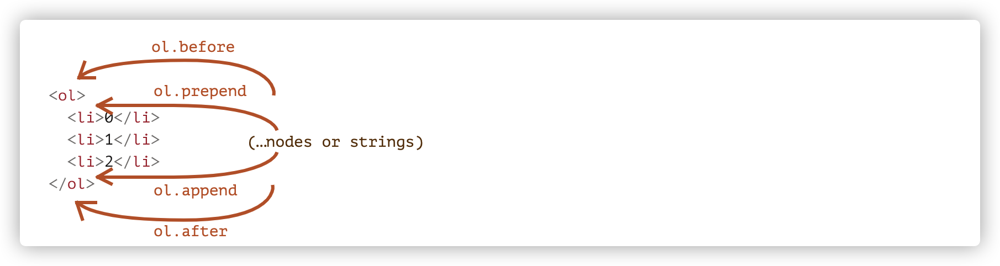

这些方法可以在单个调用中插入多个节点列表和文本片段。

例如，在这里插入了一个字符串和一个元素：

```html
<div id="div"></div>
<script>
  div.before('<p>Hello</p>', document.createElement('hr'));
</script>
```

请注意：这里的文字都被“作为文本”插入，而不是“作为 HTML 代码”。因此像 `<`、`>` 这样的符号都会被作转义处理来保证正确显示。

所以最终插入的其实是这样的：

```html
&lt;p&gt;Hello&lt;/p&gt;
<hr />
<div id="div"></div>
```

`&lt;p&gt;Hello&lt;/p&gt;`最终会被浏览器解析成以下**字符串**内容

```html
<p>Hello</p>
```

换句话说，字符串被以一种安全的方式插入到页面中，就像 `elem.textContent` 所做的一样。

所以，这些方法只能用来插入 DOM 节点或文本片段。

## 6.3 insertAdjacentHTML/Text/Element

如果我们希望有一种方法类似于 innerHTML 能够插入 HTML 代码，我们可以使用通用方法：`elem.insertAdjacentHTML(where, html)`

这个方法的第一个参数是代码字，指定相对于 elem 的插入位置。必须为以下之一：

- beforebegin —— 将 html 插入到 elem 前
- afterbegin —— 将 html 插入到 elem 里面的开头
- beforeend —— 将 html 插入到 elem 里面的末尾
- afterend —— 将 html 插入到 elem 后

第二个参数是 html 字符串，这些字符串会被作为 html 插入。

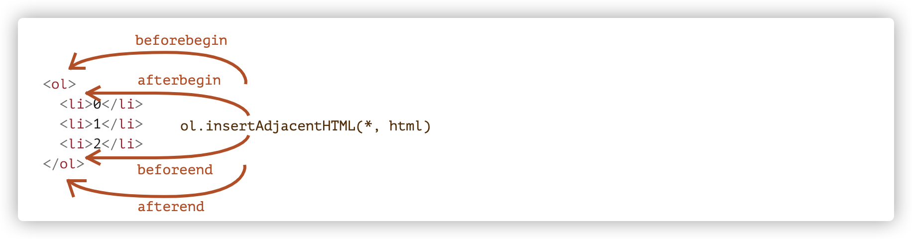

这个方法还有两个兄弟：

- `elem.insertAdjacentText(where, text)` — 语法一样，但是将 `text` 字符串“作为文本”插入而不是作为 HTML
- `elem.insertAdjacentElement(where, elem)` — 语法一样，但是插入的是一个元素

这两兄弟的存在仅仅只是让语法看起来统一，实际上用的最多的是插入 HTML，而这两个兄弟的功能我们可以使用 before、after 等代替。

## 6.4 删除节点

想要移除一个节点，可以使用`elem.remove()`

这个方法很简单，有一点细节需要注意，如果我们想要将节点移动到另一个地方，则无需将其从原来的位置删除。

**所有插入方法都会自动从旧位置删除节点。**

比如

```html
<div id="elem">i am elem</div>
<script>
  const div = document.createElement('div');
  div.innerHTML = 'i am div ';
  elem.before(div); //将div插入到elem的前面
  setTimeout(() => {
    elem.after(div); // 1秒后div会移到elem的后面
  }, 1000);
</script>
```

## 6.5 克隆节点 cloneNode

如果我们想插入一个类似的元素，我们可以创建一个函数来复用代码。还有一种方法是克隆现有的节点，并修改其中的一些内容。

当我们有一个很大的节点，使用克隆的方式更加简单。

`Elem.cloneNode(boolean)`可以传入参数来控制是否需要深克隆：

- true —— 包含所有 attribute 和子元素
- false —— 不包含子元素

这是一个深克隆的例子

```html
<div id="elem">
  i am elem
  <span>i am span in elem</span>
</div>
<script>
  const cloneDiv = elem.cloneNode(true);
  cloneDiv.querySelector('span').textContent = 'i am span in cloneElem';
  elem.after(cloneDiv);
</script>
```

## 6.6 DocumentFragment

`DocumentFragment`是一个特殊的 DOM 节点，用来作为传递节点列表用的包装器。

我们可以向其插入内容，当我们将其插入到某个位置时，则相当于插入它里面的内容。

```html
<ul id="ul"></ul>
<script>
  function getList() {
    const fragment = new DocumentFragment();
    for (let i = 0; i < 3; i++) {
      const li = document.createElement('li');
      li.textContent = i;
      fragment.append(li);
    }
    return fragment;
  }
  ul.append(getList()); // (*)
</script>
```

第\*行我们将 fragment 插入到 ul 内部，现在它里面的内容已经跟 ul 融合到一起了，最终形成的结构是这样的

```html
<ul id="ul">
  <li>0</li>
  <li>1</li>
  <li>2</li>
</ul>
```

这个 API 很少被使用，如果可以改为返回一个节点数组，那为什么还要附加到特殊类型的节点上呢？

重写如下：

```html
<ul id="ul"></ul>
<script>
  function getList() {
    const result = [];
    for (let i = 0; i < 3; i++) {
      const li = document.createElement('li');
      li.textContent = i;
      result.push(li);
    }
    return result;
  }
  ul.append(...getList()); // append + "..." operator
</script>
```

## 6.7 旧的增删 API

由于历史原因，目前还有一些老式的 DOM 操作方法，列举如下：

- **parentElem.appendChild(node)：**将 `node` 附加为 `parentElem` 的最后一个子元素。
- **parentElem.insertBefore(node, nextSibling)：**在 `parentElem` 的 `nextSibling` 前插入 `node`
- **parentElem.replaceChild(node, oldChild)：**将 `parentElem` 的后代中的 `oldChild` 替换为 `node`。
- **parentElem.removeChild(node)：**从 `parentElem` 中删除 `node`（假设 `node` 为 `parentElem` 的后代）。

这些方法都会返回插入/删除的节点。由于这些 API 很怪异，想要做操作都要通过父元素节点才能办到，所以现代 JavaScript 下是不用这些 API 了。

## 6.8 document.write

`document.write`方法是非常古老的、来自于没有 DOM、没有标准的 web 上古时期的给页面添加内容的方法。

语法是这样的：

```html
<p>Somewhere in the page...</p>
<script>
  document.write('<b>Hello from JS</b>');
</script>
<p>The end</p>
```

调用这个方法后，html 会马上写入到页面中。html 字符串是动态生成的，所以这个方法很灵活。

`document.write`调用只在页面加载时工作。如果我们稍后调用它，那现有文档内容会被擦除。

```html
<p>After one second the contents of this page will be replaced...</p>
<script>
  // 1 秒后调用 document.write
  // 这时页面已经加载完成，所以它会擦除现有内容
  setTimeout(() => document.write('<b>...By this.</b>'), 1000);
</script>
```

上面的方法会将 p 标签内的内容全部擦除。

换句话说，它在加载完成阶段是不可用的。

这是它的坏处。

它的好处是运行奇快，它不涉及 DOM 修改，可以直接写入到页面文本中，而此时 DOM 尚未构建。

如果我们需要向 HTML 动态地添加大量文本，并且我们正处于页面加载阶段，并且速度很重要，那么它可能会有帮助。

## 6.9 小结

创建新节点的方法：

- `document.createElement(tag)` —— 用给定的标签创建一个元素节点
- `document.createTextNode(value)` —— 创建一个文本节点
- `elem.cloneNode(deep)` —— 克隆元素

插入和移除节点的方法：

- `node.append(...nodes or strings)` —— 在 node 内部的末尾插入
- `node.prepend(...nodes or strings)`—— 在 node 内部的开头插入
- `node.before(...nodes or strings)`—— 在 node 前面插入
- `node.after(...nodes or strings)`—— 在 node 后面插入
- `node.replaceWith(...nodes or strings)` ——替换 node
- `node.remove()` ——删除 node 节点

文本字符串被作为文本输入

老式方法：

- **parentElem.appendChild(node)：**将 `node` 附加为 `parentElem` 的最后一个子元素。
- **parentElem.insertBefore(node, nextSibling)：**在 `parentElem` 的 `nextSibling` 前插入 `node`
- **parentElem.replaceChild(node, oldChild)：**将 `parentElem` 的后代中的 `oldChild` 替换为 `node`。
- **parentElem.removeChild(node)：**从 `parentElem` 中删除 `node`（假设 `node` 为 `parentElem` 的后代）。

在指定位置插入 HTML，`elem.insertAdjacentHTML(where, html)` 会根据 `where` 的值来插入它：

- `"beforebegin"` — 将 `html` 插入到 `elem` 前面，
- `"afterbegin"` — 将 `html` 插入到 `elem` 的开头，
- `"beforeend"` — 将 `html` 插入到 `elem` 的末尾，
- `"afterend"` — 将 `html` 插入到 `elem` 后面。

还有类似的方法，`elem.insertAdjacentText` 和 `elem.insertAdjacentElement`，它们会插入文本字符串和元素，但很少使用。

在页面加载完成之前可以使用`document.write(html)`将 HTML 写到页面上,如果在页面加载完成后使用，会擦除页面内容。

# 七、样式和类

我们有两种常用的设置元素样式的方法：

- 通过 class 类
- 通过内联样式 style

JavaScript 可以修改类和 style 属性。我们首选应该通过类来添加样式，仅当类无法处理的时候，才使用 style 属性。

比如我们需要给用 JavaScript 给元素添加一个坐标，那么用`style`是可以接受的。

```javascript
let top = /* 复杂的计算 */;
let left = /* 复杂的计算 */;

elem.style.left = left; // 例如 '123px'，在运行时计算出的
elem.style.top = top; // 例如 '456px'
```

对于其他情况，如果能跟在 class 样式中实现，那么就选择添加类，这样做到了样式与功能分离，代码更加灵活。

## 7.1 className 和 classList

`elem.className`对应于`class`特性。例如：

```html
<body class="main page">
  <script>
    alert(document.body.className); // main page
  </script>
</body>
```

如果我们希望对`elem.className`进行赋值，它会替换掉类中的所有字符串。但有时候我们希望能够单独添加/删除类，这就需要用到`classList`。

`elem.classList`是一个特殊的对象，它具有`add/remove/toggle`单个类的方法。

```html
<body class="main page">
  <script>
    // 添加一个 class
    document.body.classList.add('article');

    console.log(document.body.className); // main page article
  </script>
</body>
```

因此，我们既可以使用`className`对完整的类字符串进行操作，也可以用`classList`对单个类进行操作。

以下是`classList`的方法：

- `elem.classList.add/remove(class)` —— 添加/移除类
- `elem.classList.toggle(class)` —— 如果类不存在就添加类，存在就移除它
- `elem.classList.contains(class)` —— 检查给定类，返回`true/false`

`classList`是可以迭代的。

## 7.2 元素样式

`elem.style`属性是一个对象，它对应于`style`特性中所写的内容。`elem.style.width="100px"`的效果等价于我们在 style 特性中有一个`width:100px`字符串。

对于多词属性，则用驼峰式`camelCase`访问：

```javascript
background-color => elem.style.backgroundColor
```

> 像 `-moz-border-radius` 和 `-webkit-border-radius` 这样的浏览器前缀属性，也遵循同样的规则：连字符 `-` 表示大写。
>
> ```javascript
> button.style.MozBorderRadius = '5px';
> button.style.WebkitBorderRadius = '5px';
> ```

## 7.3 重置样式属性

有时候我们会设置`elem.style.display=‘none’`来隐藏元素。

过段时间我们希望移除这个效果，这时候我们不应该使用`delete elem.style.display`，而是应该使用`style.display=''`来将属性赋值为空。

通常我们使用`style.*`来对各样式属性进行赋值，如果我们想用字符串的形式新建或者重置整个 style，可以用两种简便方法：

- `elem.style.cssText ='width:10px' `
- `elem.setAttribute('style','width:10px')`

## 7.4 记得添加单位

当我们使用`style.*`时，千万不要忘记添加单位，否则添加无效。

```javascript
// 无效！
document.body.style.margin = 20;
alert(document.body.style.margin); // ''（空字符串，赋值被忽略了）

// 现在添加了 CSS 单位（px）— 生效了
document.body.style.margin = '20px';
```

## 7.5 读取类的样式

`elem.stlye`属性只针对 html 的`style`特性,而不能读取到任何 css 类有关的内容，比如以下代码：

```html
<style>
  #div {
    width: 100px;
  }
</style>
<div id="div"></div>
<script>
  console.log(div.style.width); //读到的是'' 而不是'100px'
</script>
```

我们需要用这个方法来获取：`getComputedStyle`

语法如下：

```javascript
getComputedStyle(element, [pseudo]);
```

**element：**需要被读取样式值的元素。

**pseudo：**伪元素（如果需要），例如 `::before`。空字符串或无参数则意味着元素本身。

结果是一个具有样式属性的对象，像 `elem.style`，但现在对于所有的 CSS 类来说都是如此。

```html
<style>
  #div {
    width: 100px;
  }
</style>
<div id="div"></div>
<script>
  console.log(getComputedStyle(div).width); //'100px'
</script>
```

> **计算值和解析值**
>
> 在 [CSS](https://drafts.csswg.org/cssom/#resolved-values) 中有两个概念：
>
> 1. **计算 (computed)** 样式值是所有 CSS 规则和 CSS 继承都应用后的值，这是 CSS 级联（cascade）的结果。它看起来像 `height:1em` 或 `font-size:125%`。
> 2. **解析 (resolved)** 样式值是最终应用于元素的样式值值。诸如 `1em` 或 `125%` 这样的值是相对的。浏览器将使用计算（computed）值，并使所有单位均为固定的，且为绝对单位，例如：`height:20px` 或 `font-size:16px`。对于几何属性，解析（resolved）值可能具有浮点，例如：`width:50.5px`。
>
> 很久以前，创建了 `getComputedStyle` 来获取计算（computed）值，但事实证明，解析（resolved）值要方便得多，标准也因此发生了变化。
>
> 所以，现在 `getComputedStyle` 实际上返回的是属性的解析值（resolved）。

> **应用于 `:visited` 链接的样式被隐藏了！**
>
> 可以使用 CSS 伪类 `:visited` 对被访问过的链接进行着色。
>
> 但 `getComputedStyle` 没有给出访问该颜色的方式，因为否则，任意页面都可以通过在页面上创建它，并通过检查样式来确定用户是否访问了某链接。
>
> JavaScript 看不到 `:visited` 所应用的样式。此外，CSS 中也有一个限制，即禁止在 `:visited` 中应用更改几何形状的样式。这是为了确保一个不好的页面无法测试链接是否被访问，进而窥探隐私。

## 7.6 小结

**要管理 class,可以用两个 dom 属性：**

- className —— 字符串值
- classList —— 具有 add/remove/toggle/contains 方法的对象，可以被迭代

**要改变样式：**

`style.*`可以访问内联样式的各个属性。对其进行读取和修改跟直接修改`style`特性中的各个属性有相同的效果

`style.cssText`属性对应整个 style 特性，即完整的样式字符串

**要读取类样式：**

`getComputedStyle(elem,[pseudo])`返回与`style`对象类似的，且包含所有类的对象。这是只读的属性。

# 八、元素大小和滚动

本节介绍 JavaScript 中有关元素的宽度、高度和其他信息。

示例元素：

```html
<style>
  #example {
    width: 300px;
    height: 200px;
    border: 25px solid #e8c48f;
    padding: 20px;
    overflow: auto;
  }
</style>
<div id="example">
  <h3>Introduction</h3>
  <p>
    This Ecma Standard is based on several originating technologies, the most
    well known being JavaScript (Netscape) and JScript (Microsoft). The language
    was invented by Brendan Eich at Netscape and first appeared in that
    company's Navigator 2.0 browser. It has appeared in all subsequent browsers
    from Netscape and in all browsers from Microsoft starting with Internet
    Explorer 3.0. The development of this Standard started in November 1996. The
    first edition of this Ecma Standard was adopted by the Ecma General Assembly
    of June 1997.
  </p>

  <p>
    That Ecma Standard was submitted to ISO/IEC JTC 1 for adoption under the
    fast-track procedure, and approved as international standard ISO/IEC 16262,
    in April 1998. The Ecma General Assembly of June 1998 approved the second
    edition of ECMA-262 to keep it fully aligned with ISO/IEC 16262. Changes
    between the first and the second edition are editorial in nature.
  </p>

  <p>
    The third edition of the Standard introduced powerful regular expressions,
    better string handling, new control statements, try/catch exception
    handling, tighter definition of errors, formatting for numeric output and
    minor changes in anticipation of forthcoming internationalisation facilities
    and future language growth. The third edition of the ECMAScript standard was
    adopted by the Ecma General Assembly of December 1999 and published as
    ISO/IEC 16262:2002 in June 2002.
  </p>
</div>
```

这个示例元素包含 border、padding、scrolling 等属性，但是不包含 margin，因为它并不是元素的一部分。

这个元素的示例图是这样的：

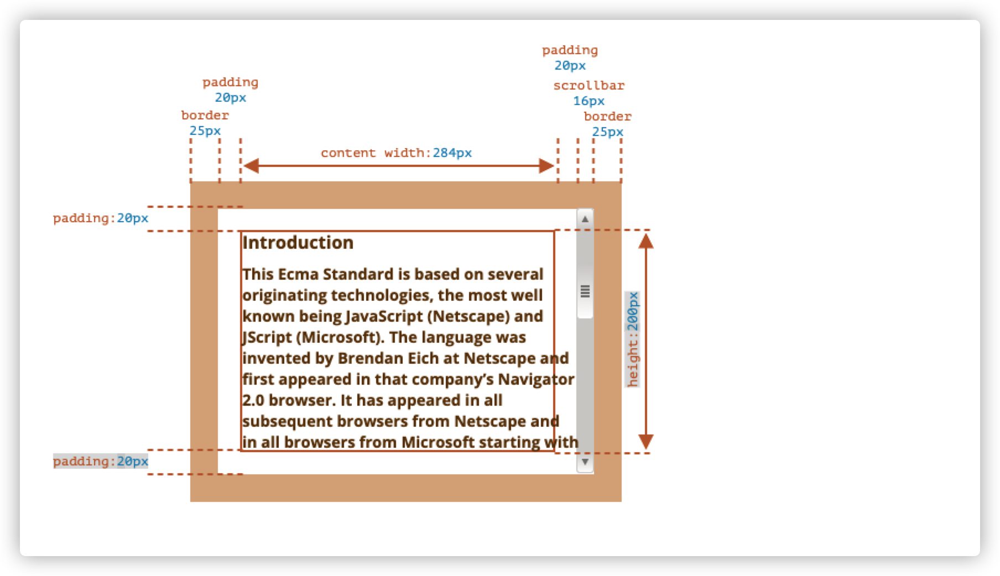

这个元素是具有滚动条的。一些浏览器通过从内容（content-width）中获取空间来给滚动条保留空间。

因此，如果没有滚动条，内容宽度将是 300px，但如果滚动条为 16px，那么还剩下 284px。我们应该考虑滚动条的因素。

## 8.1 几何

对应于上面的标记 css 属性的图片，以下是一个带有元素几何属性的图片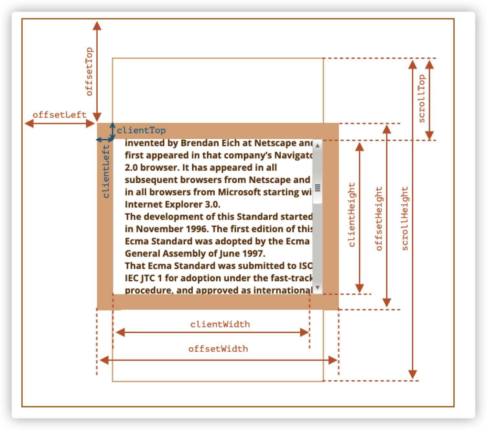

这些属性的值是数字类型，它们是像素测量值。

下面我们介绍这些元素的几何属性

## 8.2 offsetParent，offsetLeft/offsetTop

这些属性时最外层的属性：

offsetParent 是最接近的祖先，在浏览器渲染时，它们被用于计算坐标。

最近的祖先是下列之一：

- css 定位的祖先（position 为 absolute、relative 或者 fixed）
- `<td>`,`<th>`,`<table>`
- `<body>`

offsetLeft/offsetTop 则提供相对于 offsetParent 左上角的 x/y 坐标。

比如下面例子中，div 有 main 作为 offsetParent，并且`offsetLeft/offsetTop`是它距离左上角的位移。

```
    <main style="position: relative;" id="main">
      <article>
        <div id="example" style="position: absolute; left: 180px; top: 150px;">
          ...
        </div>
      </article>
    </main>
    <script>
      console.log(example.offsetParent); // main节点
      console.log(example.offsetTop); // 150 注意：这是一个数字，不是字符串 "180px"
      console.log(example.offsetLeft); // 180
    </script>
```

有几种情况下，offsetParent 可能是 null

- 未显示的元素（display 为 none 或者不在文档中）
- body 和 html
- `position:fixed`的元素

## 8.2 offsetWidth/Height

这两个属性是最简单的，它们提供元素的“外部”宽高。也就是说，它提供了元素的完整大小。

offsetWidth = 元素的 width + paddingLeft/Right + borderLeft/Right

offsetHeight = 元素的 height + paddingTop/Bottom + boderTop/Bottom

以下是示例元素的解析图

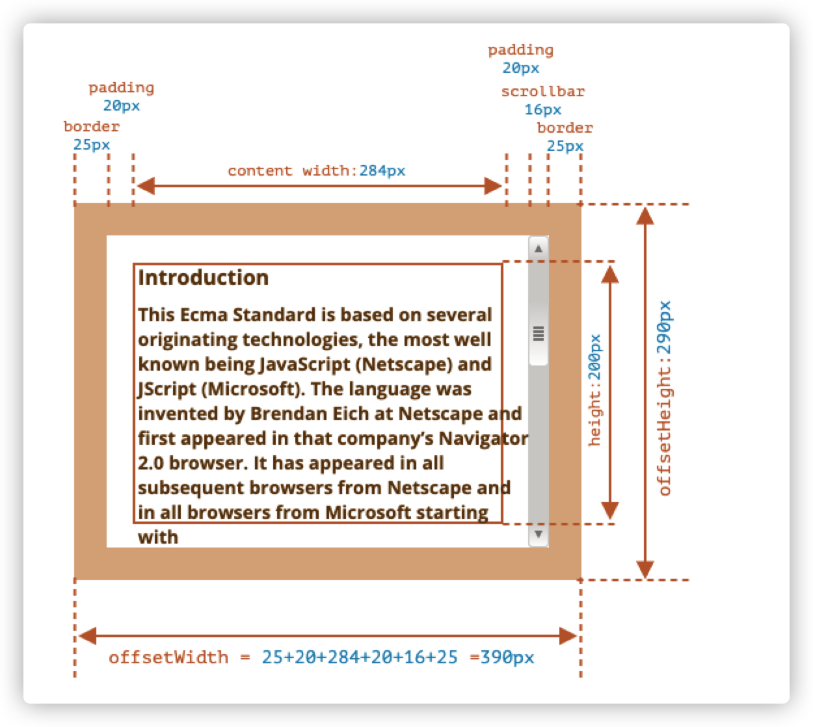

仅针对显示的元素计算几何属性，对于未显示的元素，几何属性为 0/null。

如果一个元素（或者其祖先）具有`display:none`或者不在文档中，则所有几何属性为 0。（或`offsetParent`为`null`）

## 8.3 clientTop/Left

在元素内部，我们有边框（border）。

为了测量它们，可以使用 clientTop/Left。

在例子中，我们的元素的 border 为 25px。那么 clientTop/Left 均为 25px

- `clientTop` —— 上边框高度
- `clientLeft` —— 左边框宽度

准确的说，这些属性不是边框的 width/height,而是元素内侧和元素外侧的相对坐标。

当操作系统为阿拉伯语或希伯来语时，此时浏览器将滚动条设置在右边，而不是在左边，此时`clientLeft`就包含了滚动条的宽度。

在这种情况下，clientLeft 就是`25+16 = 41`

## 8.4 clientWidth/Height

这两个属性提供元素边框区域内的大小。

它们包括了`content width`和`padding`，但不包括滚动条宽度。

在示例元素中，我们的元素的边框区域内大小是这样的：

- `clientHeight`:`content height`+`paddingTop`+`paddingBottom`=200+20+20
- `clientWidth`:`content width`+`paddingLeft`+`paddingRight`=284+20+20

这里的`content width`并不是`300px`,而是去除滚动条 16px 后的 284

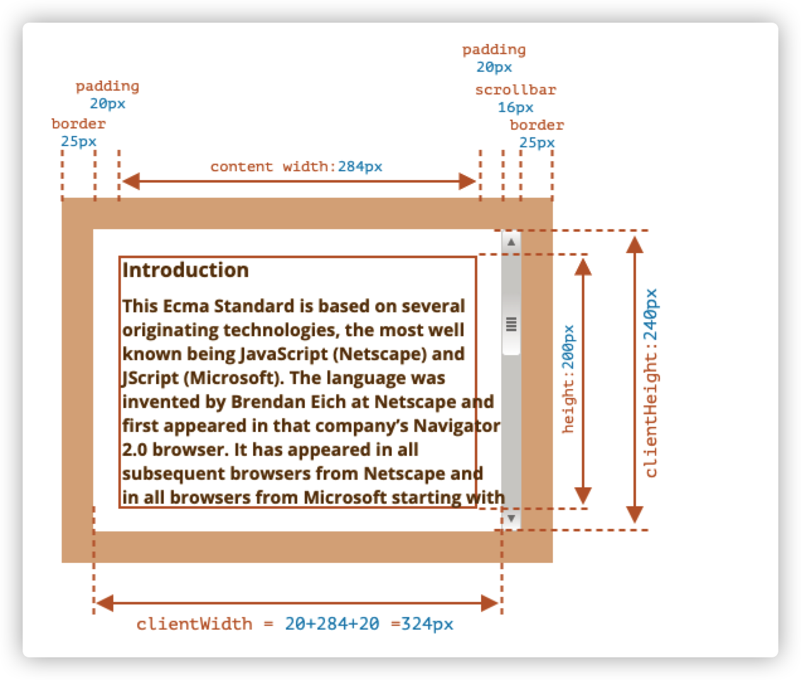

如果这里没有 padding，**那么 `clientWidth/Height` 代表的就是内容区域，即 border 和 scrollbar（如果有）内的区域。**

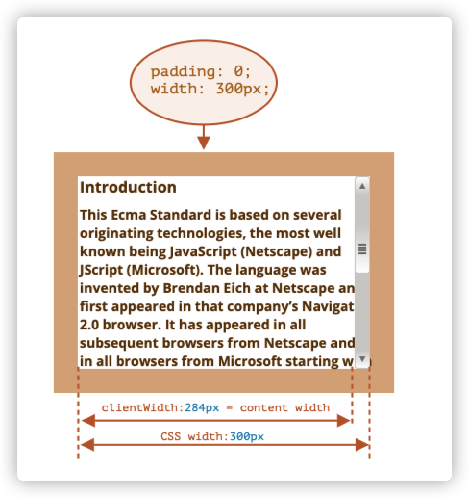

因此，当没有 padding 时，我们可以直接使用`clientWidth/Height`来获取内容区域的大小。

## 8.5 scrollWidth/Height

这个属性跟`clientWidth/Height`差不多，区别是它们还包括滚动超出的部分。

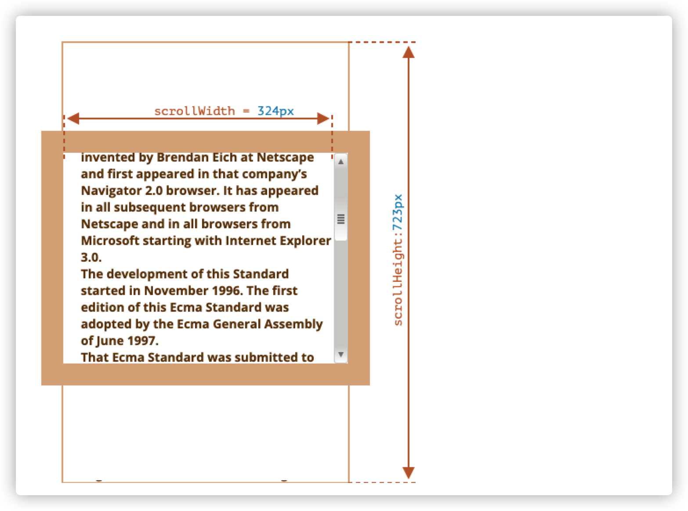

在上图中，包含 padding 的元素 clientWidth 跟 scrollWidth 是一样的。

但 clientHeight 跟是 scrollHeight 不一样，scrollHeight 是内容区域的完整内部高度，包括滚出的部分。

因此：

- `scrollHeight = 723` — 是内容区域的完整内部高度，包括滚动出的部分。
- `scrollWidth = 324` — 是完整的内部宽度，这里我们没有水平滚动，因此它等于 `clientWidth`。

我们可以使用这个特点来讲元素展开（expand）到整个 width/height。

```javascript
// 将元素展开（expand）到完整的内容高度
element.style.height = `${element.scrollHeight}px`;
```

## 8.6 scrollLeft/scrollTop

属性`scrollLeft/scrollTop`是元素隐藏的、滚动部分的`width/height`

在下图中，我们可以看到带有垂直滚动块的`scrollHeight`和`scrollTop`


也就是说，`scrollTop`就是已经滚动了多少的意思。

> 大多数的几何属性是可读的，但是 scrollTop/Left 是可修改的，浏览器会滚动该元素。
>
> 将 scrollTop 设置成 0 或者一个大的值，将会使元素滚动到顶部/底部

## 8.7 不要从 css 中获取 width/height

DOM 的几何元素用于获取宽度、高度和计算距离。

为什么我们不用`getComputedstyle`来读取 css 的 width 和 height 呢？

这里有三个原因：

- css 的 width/height 受`box-sizing`影响，同样拥有 300px 的 width 的元素，在不同的 box-sizing 下在浏览器的渲染效果是不同的。如果用 css 修改了`box-sizing`则会影响 JavaScript 代码。

  ```html
  <style>
    .div {
      width: 300px;
      height: 200px;
      border: 25px solid #e8c48f;
      padding: 20px;
    }
    .div2 {
      box-sizing: border-box;
    }
  </style>
  <div class="div"></div>
  <div class="div div2"></div>

  <script>
    const div1 = document.body.querySelector('.div');
    const div2 = document.body.querySelector('.div2');
    console.log(getComputedStyle(div1).width); // 300px
    console.log(getComputedStyle(div2).width); // 300px
    console.log(div1.offsetWidth); // 390
    console.log(div2.offsetWidth); // 300
  </script>
  ```

  上面的代码中，div1 和 div2 只有`box-sizing`不同，但是用`getComputedStyle`取到的是一样的，只有用几何属性才能取到正确的值。

- 其次，CSS 的 `width/height` 可能是 `auto`，例如内联（inline）元素

  ```html
  <span id="elem">Hello!</span>

  <script>
    alert(getComputedStyle(elem).width); // auto
  </script>
  ```

- 滚动条，如果一个元素有滚动条，那它就会占用内容的空间。因此，可用于内容的实际宽度小于 css 宽度。

  使用`getComputedStyle(elem).width`时，某些浏览器返回的是实际内部宽度减去滚动条宽度，而有些浏览器是返回 css 宽度，忽略了滚动条。在这样的差异下，我们不能使用`getComputedStyle`来获取元素的宽高。

## 8.8 小结

元素具有以下几何属性：

- `offsetParent`是离元素最接近的 css 定位的祖先，或者是 `td`，`th`，`table`，`body`。

- `offsetLeft/Top`是相对于`offsetParent`的左上角的坐标
- `offsetWidht/Height`是元素外部的宽和高，包括了边框。
- `clientTop/Left`是元素左上角外角到左上角内角的距离。对于从左到右显示内容的操作系统来说，它们始终是左侧/顶部 border 的宽度。而对于从右到左显示内容的操作系统来说，垂直滚动条在左边，所以 `clientLeft` 也包括滚动条的宽度。
- `clientWidth/Height`是元素内部的宽高，不包括边框，不包括滚动条，包括 content width 和 padding。
- `scrollWidth/Height`是元素内部的宽高，跟`clientWidth/Height`是一样的，但是它还包括元素滚动出的不可见的部分。
- `scrollLeft/Top`是从元素左上角开始，滚动出元素上半部分的宽高。简单来说就是滚动了多少。

除了`scrollLeft/scrollTop`外，其他几何属性都是只读的。

# 九、window 大小和滚动控制

## 9.1 窗口的 width/height

我们要如何获取整个浏览器的宽高呢？我们可以使用`html`标签对应的`document.documentElement`中`clientWidth`和`clientHeight`

`window.innerWidth/Height`也能够获取，它们的区别是`clientWidth/Height`是一定不包含滚动条的。

我们一般需要的是可用的内容空间以放置元素，而`inner*`属性有可能会返回包含滚动条的空间，所以我们应该使用`client*`属性更加准确一些。

## 9.2 文档的完整宽高

从理论上来说，我们可以通过`documentElement.scrollWidth/Height`来获取文档的完整宽高。

但由于历史原因，我们必须采用以下方式来可靠地获取文档的完整宽高。

```javascript
let scrollHeight = Math.max(
  document.body.scrollHeight,
  document.documentElement.scrollHeight,
  document.body.offsetHeight,
  document.documentElement.offsetHeight,
  document.body.clientHeight,
  document.documentElement.clientHeight
);
let scrollWidth = Math.max(
  document.body.scrollWidth,
  document.documentElement.scrollWidth,
  document.body.offsetWidth,
  document.documentElement.offsetWidth,
  document.body.clientWidth,
  document.documentElement.clientWidth
);
```

## 9.3 文档当前滚动状态

我们能够通过`scrollTop`和`scrollLeft`来得知 DOM 元素当前的滚动状态。

文档滚动我们大多数情况也可以通过`document.documentElement.scrollTop/Left`来获取。

但由于浏览器的兼容性原因，我们最好使用以下属性获取当前文档的滚动状态。

```javascript
alert('Current scroll from the top: ' + window.pageYOffset);
alert('Current scroll from the left: ' + window.pageXOffset);
```

不过这个属性是只读的。

## 9.4 控制滚动

- 元素滚动：设置 `scrollTop/scrollLeft`

- 文档滚动：设置`document.documentElement.scrollTop/Left`，Safari 浏览器需要用`document.body.scrollTop/Left`，不建议用

- 通用滚动（根据当前位置的（x,y）坐标偏移）：`window.scrollBy(x,y)`。例如，`scrollBy(0,10)` 会将页面向下滚动 `10px`。

- 通用滚动（根据页面的绝对坐标（x,y））：`window.scrollTo(pageX,pageY)`。例如，`scrollTo(0,0)`会让文档滚动到最顶上。

- 通用滚动（滚动到某个元素上）：`elem.scrollIntoView(top)`

  当`top=true`时，页面滚动，使`elem`出现在窗口顶部。默认值

  当`top=false`时，页面滚动，使`elem`出现在窗口底部。

## 9.5 禁止滚动

- 禁止页面滚动：`document.body.style.overflow = "hidden"`
- 取消禁止页面滚动：`document.body.style.overflow = ""`
- 禁止元素滚动：把`document.body`换成`elem`元素即可

这个方法的缺点是会使滚动条消失。如果滚动条占用了一些空间，它原本占用的空间就会空出来，那么内容就会“跳”进去以填充它。

我们可以对比冻结前后的 `clientWidth`。如果它增加了（滚动条消失后），那么我们可以在 `document.body` 中滚动条原来的位置处通过添加 `padding`，来替代滚动条，这样这个问题就解决了。

## 9.6 小结

1. 窗口的宽高：`document.documentElement.clientWidth/Height`
2. 文档的完整宽高最好不要直接使用`document.documentElement.scrollWidth/Height`
3. 读取当前的滚动：`window.pageYOffset/pageXOffset`。
4. 更改当前的滚动：
   - `window.scrollTo(pageX,pageY)` — 绝对坐标，
   - `window.scrollBy(x,y)` — 相对当前位置进行滚动，
   - `elem.scrollIntoView(top)` — 滚动以使 `elem` 可见（`elem` 与窗口的顶部/底部对齐）。

# 十、坐标

两种坐标系(通过 event 获取)：

- 相对于窗口的`clientX/clientY` —— 类似于`position:fixed`，从窗口的顶部/左侧边缘计算而出
- 相对于文档的`pageX/pageY` —— 从文档的顶部/左侧边缘计算得出

当页面在最开始时，窗口的左上角与文档的左上角对齐，它们的坐标彼此相等。

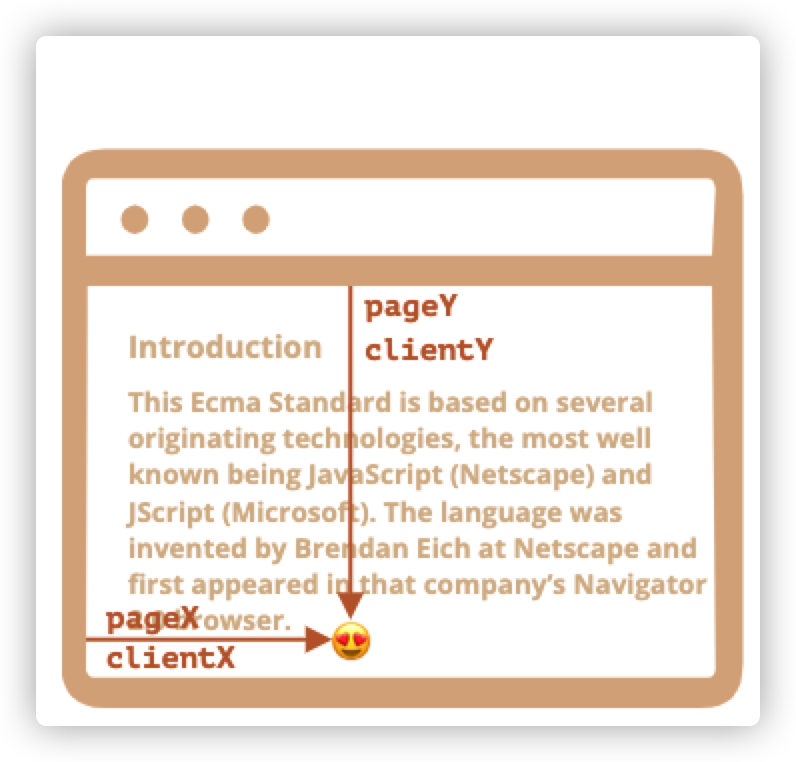

当文档移动之后，元素的窗口相对坐标会发生变化，因为元素在窗口中移动，而元素在文档中的相对坐标是保持不变的。

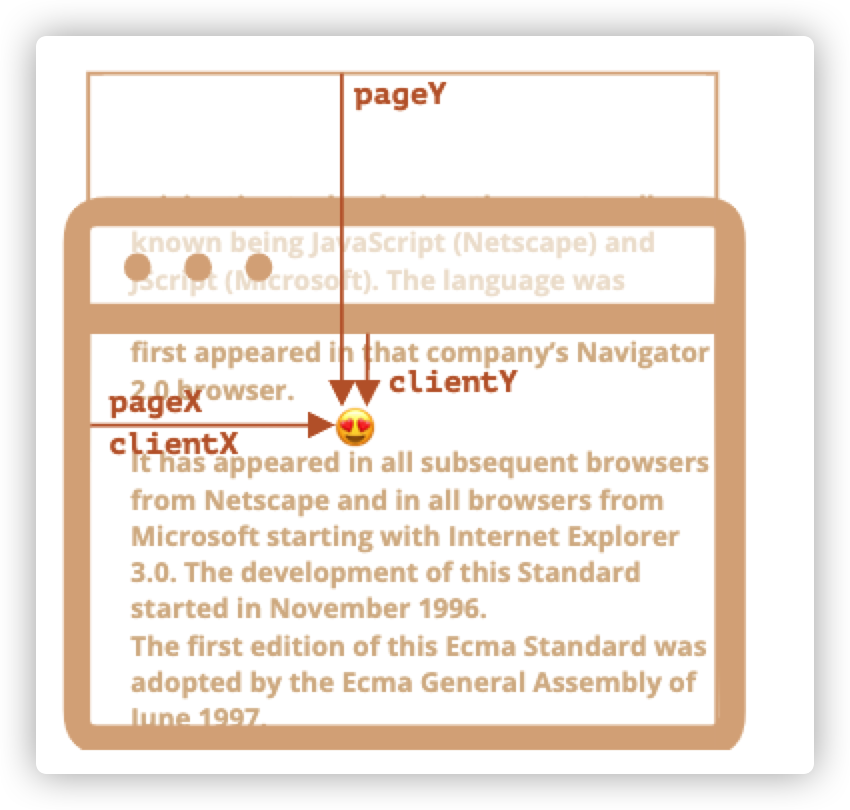

上两张图中表示，当元素滚动了：

pageY —— 元素在文档中的相对坐标是不变的，从文档顶部开始计算

clientY —— 元素在窗口中的相对坐标变化了，因为元素被滚上去了，它越来越靠近窗口顶部

## 10.1 元素坐标 getBoundingClientRect

`elem.getBoundingClientRect()`返回最小矩形的窗口坐标、返回元素的大小及其相对于视口的位置。

如果是标准盒子模型，元素的尺寸等于`width/height` + `padding` + `border-width`的总和。如果`box-sizing: border-box`，元素的的尺寸等于 `width/height`。

这个矩形将`elem`作为 DOMRect 类的对象。

主要的`DOMRect`的属性如下：

- x/y —— 矩形原点相对于窗口的 x/y 坐标
- width/height —— 矩形的 width/height （可以为负）
- top/bottom —— 顶部/底部矩形边缘的坐标
- left/right —— 左/右矩形边缘的 X 坐标

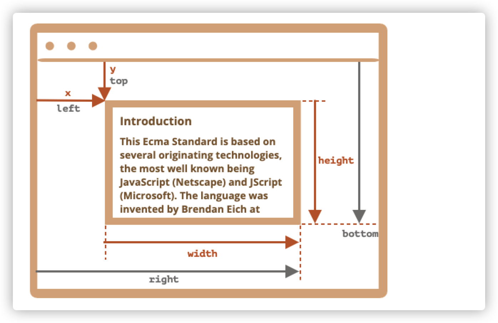

- `left = x`
- `top = y`
- `right = x + width`
- `bottom = y + height`

当我们使用`getBoundingClientRect`获取元素的各坐标时，很有可能我们会获取到：

- 小数
- 负数，例如元素被滚上去之后，y 就是 top，相对于窗口来说就是负的

> `top/left`与`x/y`从矩形的角度来说很有可能是不一致的，而且 width/height 属性也不一定是正数（虽然一直都会返回正数）。
>
> 原因是矩形有定向这么一说，如果是左上角开始往下伸展算是正向，那么从右下角往上伸展就是负向。所以矩形的 height/width 就是负数的。
>
> 以下就是一个由右下角往上伸展的矩形，它的 width/height 就应该是负数的（矩形角度分析）。那么此时，它的 x/y 就应该在右下角的起点位置，因为那才是矩形的原点。
>
> 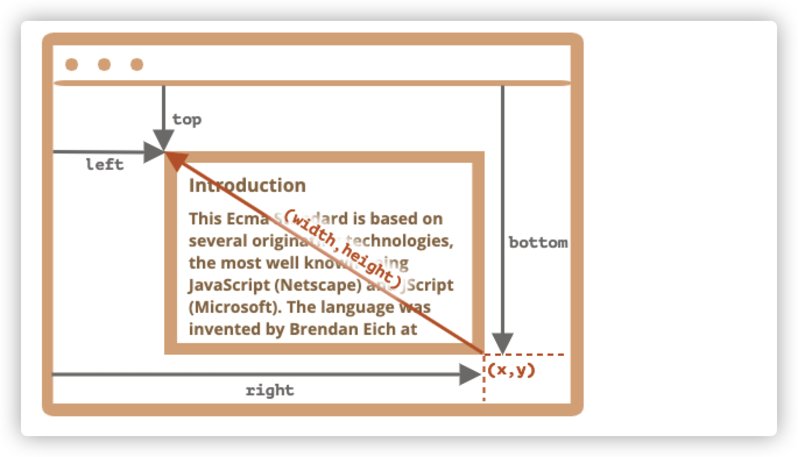

**坐标的 right/bottom 与 css position 属性不同**
我们用`css position:fixed`让元素根据文档定位后的`left/top`与`getBoundingClientRect`获取的`left/top`是类似的逻辑（如果不滚动的话，抛开单位，值可能相同），但是`right/bottom`是完全不一样的逻辑。

因为 css 定位中的 right 属性是距右边缘的距离，bottom 是距下边缘的距离。

而坐标的`right/bottom`永远是按照窗口的左上角开始计算的。

## 10.2 elementFromPoint(x, y)

对 `document.elementFromPoint(x, y)` 的调用会返回在窗口坐标 `(x, y)` 处嵌套最多（the most nested）的元素。

因为它使用的是窗口坐标，所以元素可能会因当前滚动位置而有所不同。

**注意：**

方法 `document.elementFromPoint(x,y)` 只对在可见区域内的坐标 `(x,y)` 起作用。

**对于在窗口之外的坐标，**`elementFromPoint` **返回** `null`

## 10.3 用于“fixed”的定位

如果我们希望创建一个独立存在于窗口上的元素（即使滚动后也依然存在），那么就可以用 fixed 定位后，再设置元素的 left 或者 top 即可。

下面是一个在`button`附近创建一个文字提示的例子

```html
<style>
  body {
    min-height: 2000px;
  }
  button {
    display: block;
    margin: 0 auto;
  }
</style>
<button id="btn">在我下面创建一个提示信息</button>
<script>
  const rect = btn.getBoundingClientRect();
  const [left, bottom] = [rect.left, rect.bottom];
  btn.onclick = createMessage;
  function createMessage() {
    const span = document.createElement('span');
    span.style.cssText = 'color:red;position:fixed';
    span.innerHTML = '我是提示信息';
    span.left = left + 'px';
    span.bottom = bottom + 'px';
    document.body.append(span);
  }
</script>
```

在最小高度为 2000px 的页面高度下，提示信息会始终出现在窗口的同一位置上，即使滚动了也是如此。

如果不想要这种效果，可以将`fixed`改成`absolute`。

## 10.4 文档坐标

文档坐标是从文档的左上角开始计算而不是窗口。

在 css 中，窗口坐标对应`position:fixed`，文档坐标则对应顶部元素的`position:absolute`

我们可以结合`absolute`来将元素放到文档的某个位置。

目前我们没有标准的方法可以获取元素的文档坐标。我们可以通过计算：

- 元素的文档坐标 x = 文档水平滚出的部分的宽度 + 元素的窗口水平坐标 x
- 元素的文档坐标 y = 文档垂直滚出的部分的宽度 + 元素的窗口垂直坐标 y

下面的函数是获取元素的文档坐标的函数

```javascript
function getCoords(elem) {
  const rect = elem.getBoundingClientRect();
  let left = window.pageXOffset + rect.left;
  let right = window.pageXOffset + rect.right;
  let top = window.pageYOffset + rect.top;
  let bottom = window.pageYOffset + rect.bottom;
  return {
    left,
    right,
    top,
    bottom,
  };
}
```

## 10.5 小结

页面的任何点都有坐标：

1. 元素相对于窗口的坐标可以通过`getBoundingClientRect`获取
2. 元素相对于文档的坐标可以通过`window.pageXoffset/pageYoffset` + `getBoundingClientReact`获取

如果我们想要让元素相对于窗口调整位置，可以设置 css 属性`position:fixed`

如果我们想要让元素相对于文档调整位置，可以设置 css 属性`position:absolute`

# 十一、节点属性 type，tag 和 content

## 11.1 DOM 节点类

不同的 DOM 节点可能有不同的属性，但是这些 DOM 之间存在共有的属性和方法，所有类型的 DOM 节点都形成一个单一层次的结构。

每个 DOM 节点都属于相应的内置类。

- EventTarget —— 根的抽象类。该类的对象从未被创建，它是一个基础，以便让所有节点都能够支持事件。
- Node —— 抽象类，是 DOM 节点的基础，它提供了 DOM 节点的一些属性：`nextSibling`,`parentNode`等。
- Element —— DOM 元素的基本类，它提供元素的导航，即：`nextElementSibling`和`children`等属性。
- HTMLElement —— 所有 HTML 元素的基本类。各种 HTML 元素继承于它：
  - HTMLInputElement —— input 元素的类
  - HTMLBodyElement —— body 元素的类
  - 每个标签都可以有自己的类，这些类都有指定属性和方法

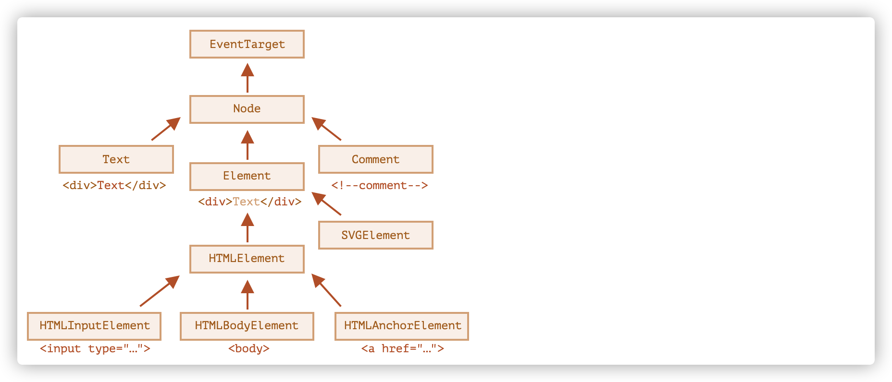

因此，节点的全部属性和方法都是继承的结果。

DOM 节点是常规的 JavaScript 对象，它们使用基于原型的类进行继承。

> 我们可以通过`console.dir`来探究 DOM 节点的属性

## 11.2 nodeType 属性

这是一种过时的获取节点类型的方法。

- 元素节点`elem.nodeType===1`
- 文本节点`elem.nodeType===3`
- document 对象 `elem.nodeType===9`

现在，我们可以通过`instanceof`或者其他基于类的方法来判断节点类型。

```javascript
instanceof HTMLBodyElement
instanceof HTMLInputElement
```

## 11.3 nodeName 和 tagName

nodeName 和 tagName 都可以返回元素的标签名。

它们的区别在于`nodeName`是任意 Node 定义的，而`tagName`仅属于`Element`节点

## 11.4 InnerHTML 内容

`innerHTML`属性允许将元素内的 HTML 用字符串的形式返回出来。

同时，我们也可以用它以字符串的形式来设置节点内的 HTML。

```javascript
document.body.innerHTML = '<button>我被设置了</button>';
```

如果我们用 innerHTML 在页面上设置一个 script 标签，它并不会运行。

当我们用`innerHTML+=‘...’`添加内容时，它实际的工作是这样的：

- 移除旧的内容
- 写入新的 innerHTML（新旧结合）

**因为内容已“归零”并从头开始重写，因此所有的图片和其他资源都将重写加载。**

并且还会有其他副作用。例如，如果现有的文本被用鼠标选中了，那么大多数浏览器都会在重写 `innerHTML` 时删除选定状态。如果这里有一个带有用户输入的文本的 `<input>`，那么这个被输入的文本将会被移除。诸如此类。

## 11.5 outerHTML 元素的完整 HTML

outerHTML 包含元素的完整 HTML。就像 innerHTML 加上元素自身一样。

```html
<div id="elem">Hello <b>World</b></div>

<script>
  alert(elem.outerHTML); // <div id="elem">Hello <b>World</b></div>
</script>
```

**注意：与 `innerHTML` 不同，写入 `outerHTML` 不会改变元素。而是在 DOM 中替换它。**

```html
<div>Hello, world!</div>

<script>
  let div = document.querySelector('div');

  // 使用 <p>...</p> 替换 div.outerHTML
  div.outerHTML = '<p>A new element</p>'; // (*)

  // 蛤！'div' 还是原来那样！
  alert(div.outerHTML); // <div>Hello, world!</div> (**)
</script>
```

在 `(*)` 行，我们使用 `<p>A new element</p>` 替换 `div`。在外部文档（DOM）中我们可以看到的是新内容而不是 `<div>`。但是正如我们在 `(**)` 行所看到的，旧的 `div` 变量并没有被改变。

`outerHTML` 赋值不会修改 DOM 元素（在这个例子中是被 ‘div’ 引用的对象），而是将其从 DOM 中删除并在其位置插入新的 HTML。

所以，在 `div.outerHTML=...` 中发生的事情是：

- `div` 被从文档（document）中移除。
- 另一个 HTML 片段 `<p>A new element</p>` 被插入到其位置上。
- `div` 仍拥有其旧的值。新的 HTML 没有被赋值给任何变量。

在这儿很容易出错，我们可以向 `elem.outerHTML` 写入内容，但是要记住，它不会改变我们所写的元素（‘elem’）。而是将新的 HTML 放在其位置上。我们可以通过查询 DOM 来获取对新元素的引用。

## 11.6 nodeValue/data:文本节点内容

innerHTML 仅对元素节点有用，如果我们想获取其他节点的内容，可以使用 nodeValue/data。这两个几乎没有差别。一般我们用 data，因为它更短。

```html
<body>
  Hello
  <!-- Comment -->
  <script>
    let text = document.body.firstChild;
    alert(text.data); // Hello

    let comment = text.nextSibling;
    alert(comment.data); // Comment
  </script>
</body>
```

## 11.7 textContent :纯文本

我们能够使用`textContent`读写元素内的纯文本，而不包含`<tags>`

```html
<div id="news">
  <h1>Headline!</h1>
  <p>Martians attack people!</p>
</div>

<script>
  // Headline! Martians attack people!
  alert(news.textContent);
</script>
```

如果我们希望写入的类似这样的字符串`<a>123</a>`被当做文本插入元素中，而不是被当做 HTML 插入，那么对`elem.textContent`进行赋值可以完成这样的需求。

## 11.8 hidden 属性

hidden 是 DOM 属性，也是 HTML 的特性。它指定元素是否可见。

它的作用类似`display:hidden`，但是它更简短。

```javascript
element.setAttribute('hidden', ''); //设置hidden特性
element.hidden = true; //设置hidden属性
```

## 11.9 小结

每个 DOM 节点都属于特定的类，这些类形成一个层次结构。完整的属性和方法是继承后的结果。

主要的 DOM 节点属性：

- nodeType 节点类型
- nodeName/tagName 节点名/标签名
- innerHTML 元素的 HTML 内容，可读写
- outerHTML 元素包括自己的 HTML 内容，可读写。但写入只是替换新的 HTML。
- nodeValue/data 非元素节点获取内容，可以读写
- textContent 元素的纯文本内容，可读写
- hidden 相当于`display:none`,但更简洁。
- ...其他
