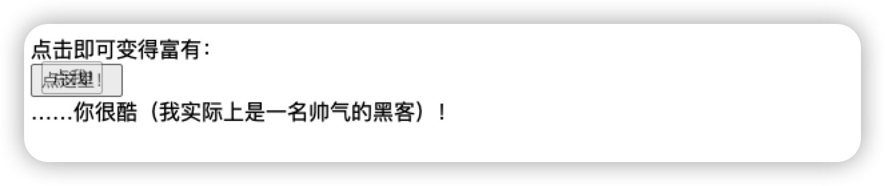

# 弹窗和 window 的方法

使用下面的方法可以打开一个新的弹窗，大多数浏览器都是新建一个选项卡，并打开`url`

```javascript
window.open('https://xxx')
```

弹窗是一种在不关闭主窗口的情况下显示其他内容的设计。

> 现在更普遍的方法是，使用 ajax 请求到内容，然后将其动态加载到`<div>`中。

## 阻止弹窗

现代浏览器会通过阻止弹窗来保护用户以避免恶意网站滥用弹窗，比如推送广告。

**如果弹窗是在用户触发的事件处理程序（如 `onclick`）之外调用的，大多数浏览器都会阻止此类弹窗。**

例如：

```javascript
// 弹窗被阻止
window.open('https://javascript.info');

// 弹窗被允许
button.onclick = () => {
  window.open('https://javascript.info');
};
```

不过还是有一些方法可以绕过这种机制，比如在`setTimeout`之后调用

```javascript
// 3 秒后打开弹窗
setTimeout(() => window.open('http://google.com'), 1000);
```

## window.open

这个函数的语法是`window.open(url, name, params)`

* url 是新窗口要加载的 URL。第一个参数是`/`就会直接将当前窗口的`origin`放到新的弹窗中。

* name 新窗口的名称。每个窗口都有一个 `window.name`，在这里我们可以指定哪个窗口用于弹窗。如果已经有了一个这样的名字的窗口，就在这个窗口打开URL。

* params 新窗口的配置字符串。它包括设置，用逗号分割，参数之间不能有空格，例如 `width=20,height=100`

  `params`的设置项如下：

  * 位置
    * `left/top` ——屏幕上窗口的左上角坐标。这里的限制是新窗口不能超到屏幕外边去
    * `width/height` —— 新窗口的宽度和高度。宽高的最小值是有限制的。
  * 窗口功能（yes/no）
    * `menubar` —— 显示或隐藏新窗口的浏览器菜单。
    * `toolbar` ——显示或隐藏新窗口的浏览器导航栏（后退，前进，重新加载等）。 
    * `location` ——  显示或隐藏新窗口的 URL 字段。Firefox 和 IE 浏览器不允许默认隐藏它。
    * `status` —— 显示或隐藏状态栏。同样，大多数浏览器都强制显示它。
    * `resizable` —— 允许禁用新窗口大小调整。不建议使用。
    * `scrollbars` —— 允许禁用新窗口的滚动条。不建议使用。


## 示例

在浏览器中运行以下代码

```javascript
let params = `scrollbars=no,resizable=no,status=no,location=no,toolbar=no,menubar=no,
width=600,height=300,left=100,top=100`;

open('/', 'test', params);
```

它会打开一个宽 600、高 300，距离左边和最右边都是 100 的新窗口。这个新窗口会隐藏某些窗口功能。


## 访问弹窗

`open`方法调用会返回对新窗口的引用，这样我们就可以用来操作新的弹窗的属性，可以更改它的位置等等操作。

比如以下方法打开一个空弹窗。并在上面写一些内容：

```javascript
let newWin = window.open("about:blank", "hello", "width=200,height=200");

newWin.document.write("Hello, world!");
```

当我们要对新窗口进行操作时，应该在某些页面的生命周期下进行，因为我们可能需要等他完全加载完成。

比如：

```javascript
let newWindow = open('/', 'example', 'width=300,height=300')
newWindow.focus();

alert(newWindow.location.href); // (*) about:blank，加载尚未开始

newWindow.onload = function() {
  let html = `<div style="font-size:30px">Welcome!</div>`;
  newWindow.document.body.insertAdjacentHTML('afterbegin', html);
};
```

上面的代码中，我们在监听弹窗的`onload`事件来插入一段 HTML 到body 中，否则可能无法成功，因为页面可能没有加载完成。

也可以使用`window.DOMContentLoaded` 等待 DOM 树构建完成了再做操作。

> 只有在窗口是同源的时，窗口才能自由访问彼此的内容（`相同的协议://domain:port`）。
>
> 否则，例如，如果主窗口来自于 `site.com`，弹窗来自于 `gmail.com`，则处于安全性考虑，这两个窗口不能访问彼此的内容。


## 弹窗访问当前窗口

窗口之间的连接是双向的：主窗口和弹窗之间可以互相引用。

在弹窗中可以使用`window.opener`来访问当前打开弹窗的那个窗口。

比如下面的代码，会打开一个弹窗，然后在弹窗中插入一段脚本，脚本的内容是将当前窗口的所有内容替换成`Test`

```javascript
let newWin = window.open("about:blank", "hello", "width=200,height=200");

newWin.document.write(
  "<script>window.opener.document.body.innerHTML = 'Test'<\/script>"
);
```

## 关闭弹窗

关闭一个窗口：`win.close()`

查看窗口是否被关闭：`win.closed`

以下代码会先加载再关闭弹窗

```javascript
let newWindow = open('/', 'example', 'width=300,height=300');

newWindow.onload = function() {
  newWindow.close();
  alert(newWindow.closed); // true
};
```

如果窗口被关闭了，那么 `closed` 属性则为 `true`。


## 滚动和调整大小

```
win.moveBy(x,y)
```

将窗口相对于当前位置向右移动 `x` 像素，并向下移动 `y` 像素。允许负值（向上/向左移动）。

```
win.moveTo(x,y)
```

将窗口移动到屏幕上的坐标 `(x,y)` 处。

```
win.resizeBy(width,height)
```

根据给定的相对于当前大小的 `width/height` 调整窗口大小。允许负值。

```
win.resizeTo(width,height)
```

将窗口调整为给定的大小。

还有 `window.onresize` 事件。

> 上面的方法仅对于弹窗
>
> JavaScript 无法最小化或者最大化一个窗口。这些操作系统级别的功能对于前端开发者而言是隐藏的。
>
> 移动或者调整大小的方法不适用于最小化/最大化的窗口。


## 滚动窗口

- `win.scrollBy(x,y)`

  相对于当前位置，将窗口向右滚动 `x` 像素，并向下滚动 `y` 像素。允许负值。

- `win.scrollTo(x,y)`

  将窗口滚动到给定坐标 `(x,y)`。

- `elem.scrollIntoView(top = true)`

  滚动窗口，使 `elem` 显示在 `elem.scrollIntoView(false)` 的顶部（默认）或底部。

这里也有 `window.onscroll` 事件。


## 弹窗聚焦/失焦

使用 `window.focus()` 和 `window.blur()` 方法可以使窗口获得或失去焦点。

这里还有 `focus/blur` 事件，可以捕获到访问者聚焦到一个窗口和切换到其他地方的时刻。

但浏览器也做了某些限制，以防止某些网站的恶意行为，比如：

```javascript
window.onblur = () => window.focus();
```

当用户从当前窗口切出去时，这段代码会让用户又重新回到窗口，因此，浏览器做了很多限制，以禁用此类代码。

不过有些情况下，弹窗聚焦/失焦很有用：

* 当我们打开一个弹窗时，在它上面执行`newWindow.focus()`是好主意，它可以确保用户现在就位于新窗口中。
* 如果我们想要追踪用户何时在实际使用我们的 web应用程序，我们可以跟踪`window.onfocus/onblur`。这使我们可以暂停/恢复页面活动和动画等。但是请注意，`blur` 事件意味着访问者从窗口切换了出来，但他们仍然可以观察到它。窗口处在背景中，但可能仍然是可见的。


## 总结

如果我们要打开一个弹窗，将其告知用户是一个好的实践。在链接或按钮附近的“打开窗口”图标可以让用户免受焦点转移的困扰，并使用户知道点击它会弹出一个新窗口。

- 可以通过 `open(url, name, params)` 调用打开一个弹窗。它会返回对新打开的窗口的引用。
- 浏览器会阻止来自用户行为之外的代码中的 `open` 调用。通常会显示一条通知，以便用户可以允许它们。
- 默认情况下，浏览器会打开一个新标签页，但如果提供了窗口参数，那么浏览器将打开一个弹窗。
- 弹窗可以使用 `window.opener` 属性访问 opener 窗口（即打开弹窗的窗口）。
- 如果主窗口和弹窗同源，那么它们可以彼此自由地读取和修改。否则，它们可以更改彼此的地址（location），[交换消息](https://zh.javascript.info/cross-window-communication)。
- 要关闭弹窗：使用 `close()` 调用。用户也可以关闭弹窗（就像任何其他窗口一样）。关闭之后，`window.closed` 为 `true`。
- `focus()` 和 `blur()` 方法允许聚焦/失焦于窗口。但它们并不是一直都有效
- `focus`和 `blur` 事件允许跟踪窗口的切换。但是请注意，在 `blur` 之后，即使窗口在背景状态下，窗口仍有可能是可见的。


# 跨窗口通信

同源策略限制了窗口window 和 frame 的互相访问。

在非同源的情况下，如果一个用户有两个打开的页面：一个来自 `john-smith.com`，另一个是 `gmail.com`，那么 `john-smith.com` 的脚本不可以访问 `gmail.com` 中的内容，以免用户信息被盗窃。


## 同源

如果两个 URL 具有相同的协议，域名和端口，则称它们是“同源”的。

以下的几个 URL 都是同源的：

- `http://site.com`
- `http://site.com/`
- `http://site.com/my/page.html`

但是下面这几个不是：

- `http://www.site.com`（另一个域：`www.` 影响）
- `http://site.org`（另一个域：`.org` 影响）
- `https://site.com`（另一个协议：`https`）
- `http://site.com:8080`（另一个端口：`8080`）


同源策略规定：

* 如果我们有对另外一个窗口（`window.open` 创建的弹窗，或者窗口中的 `iframe`）的引用，并且该窗口是同源的，那么我们具有对该窗口的全部访问权限
* 如果不是同源的，那么我们无法访问窗口中的内容。唯一的例外是虽然我们无法读取 location，但是可以修改它。

## iframe

使用`<iframe>`标签能够在当前页面单独嵌入一个窗口，它具有自己的`document`和`window`。

- `iframe.contentWindow` 获取 `<iframe>` 中的 window。
- `iframe.contentDocument` 获取 `<iframe>` 中的 document，是 `iframe.contentWindow.document` 的简写形式。

当我们访问嵌入的窗口中的东西时，浏览器会检查 iframe 是否具有同样的源。如果不是，则会拒绝读写（可以改 location）

```html
  <body>
    <iframe id="iframe" src="https://www.bilibili.com" frameborder="0"></iframe>
    <script defer>
      iframe.onload = () => {
        let iframeWindow = iframe.contentWindow;
        console.log(iframeWindow); // 可以拿到 iframe 的window
        let doc = iframe.contentDocument;
        console.log(doc); // null 拿不到 document
        try {
          let href = iframe.contentWindow.location.href;
        } catch (error) {
          console.log(error); // Error
        }

        iframe.contentWindow.location = "https://www.youtube.com/"; // 可以修改
        iframe.onload = null; // 记得清除 onload，否则会一直执行 onload 事件，并修改 location
      };
    </script>
  </body>
```

上述代码只能做以下事情：

* 通过`iframe.contentWindow`读取 `iframe` 的 `window`
* 改 `location`

如果是同源的，则可以做任何事情：

```html
    <iframe id="iframe" src="./iframe.html" frameborder="0"></iframe>
    <script defer>
      iframe.onload = () => {
        let doc = iframe.contentDocument; // #document 读到了
      };
    </script>
```

`iframe.onload`事件与`iframe.contentWindow.onload`基本相同，都是在嵌入的窗口所有资源加载完成后触发。区别在于：

* `iframe.onload` 访问的是当前窗口下的 `iframe`,`iframe.contentWindow.onload`访问的是`iframe`的`window`对象
* 如果不同源的 `iframe`，我们就没办法使用`iframe.contentWindow.onload`了。


## 相同二级域跨窗口

根据同源策略，域名不同则属于不同的源，会有同源限制。

但是，如果窗口的二级域名是相同的，比如 `john.site.com`，`peter.site.com` 和 `site.com`（它们共同的二级域是 `site.com`），我们可以通过设置让浏览器把它们当做同源来对待，这样就可以做到无限制的跨窗口通信了。

方法是这样的，让每个窗口都执行以下代码

```javascript
document.domain = 'site.com';
```

这仅适用于具有相同二级域的页面。


## 同源下访问 doc 的陷阱

当iframe 来自于同一个源时，我们可能会访问其`document`，但是这里有一个陷阱：

在创建 iframe时，iframe 会立即有一个`document`,但是该文档不同于加载到其中的文档！

因此，如果我们要对文档进行操作，可能会出问题。

下面的代码能够反映出这个陷阱：

```html
    <iframe id="iframe" src="./iframe.html" frameborder="0"></iframe>
    <script defer>
      let oldDoc = iframe.contentDocument;
      iframe.onload = () => {
        let newDoc = iframe.contentDocument;
        // 加载后的文档与初始的文档不同！！！
        console.log(oldDoc === newDoc); // false
      };
    </script>
```

我们不应该对尚未加载完成的 iframe 进行处理，那是错误的。

正确的文档在`iframe.onload`时就已经就位了。

这里有个小缺点，iframe.onload 只有在整个 iframe 和它所有资源都加载完成后才触发，如果我们希望更早一点获取到新的文档，则可以使用`setInterval`来检查

```html
<iframe src="/" id="iframe"></iframe>

<script>
  let oldDoc = iframe.contentDocument;

  // 每 100ms 检查一次文档是否为新文档
  let timer = setInterval(() => {
    let newDoc = iframe.contentDocument;
    if (newDoc == oldDoc) return;

    alert("New document is here!");

    clearInterval(timer); // 取消 setInterval，不再需要它做任何事儿
  }, 100);
</script>
```

## window.frames 集合

获取`<iframe>`的 `window`对象的另外一个方法是从命名集合`window.frames`中获取

* 通过索引获取：`window.frames[0]` —— 文档中第一个 iframe 的 window 对象
* 通过名称获取：`window.frames.iframeName` —— 获取`name='iframeName'`的 iframe 的 window 对象。

```html
<iframe src="/" style="height:80px" name="win" id="iframe"></iframe>

<script>
  alert(iframe.contentWindow == frames[0]); // true
  alert(iframe.contentWindow == frames.win); // true
</script>
```

一个 iframe 内可能嵌套了其他的 iframe。相应的 `window` 对象会形成一个层次结构（hierarchy）。

可以通过以下方式获取：

- `window.frames` —— “子”窗口的集合（用于嵌套的 iframe）。
- `window.parent` —— 对“父”（外部）窗口的引用。
- `window.top` —— 对最顶级父窗口的引用。

例如：

```javascript
window.frames[0].parent === window; // true
```

我们可以使用 `top` 属性来检查当前的文档是否是在 iframe 内打开的：

```javascript
if (window == top) { // 当前 window == window.top?
  alert('The script is in the topmost window, not in a frame');
} else {
  alert('The script runs in a frame!');
}
```

## iframe 特性 sandbox

`sandbox`特性允许在`<iframe>`中禁止某些特定的行为。它通过对 iframe 应用一些限制来实现“沙盒化”。

假设 iframe 的标签是这样写的

```html
<iframe sandbox src="...">
```

那么就会对这个 iframe 应用最严格的限制，但是我们可以用一个空格分割的列表，来列出想要移除的限制。

例如：

```html
<iframe sandbox="allow-forms allow-popups">
```

上面的列表表示也就是允许表单提交和允许在 `iframe` 中使用 `window.open` 打开弹窗。

以下是限制列表：

* **allow-same-origin** 

  默认情况下，`"sandbox"` 会为 iframe 强制实施“不同来源”的策略。即使其 `src` 指向的是同一个网站也是如此。这样浏览器就会对 iframe 实行所有非同源下的限制。这个选项会移除这个限制

* **allow-top-navigation**

  允许 `iframe` 更改 `parent.location`。

* **allow-forms**

  允许在 `iframe` 中提交表单。

* **allow-scripts**

  允许在 `iframe` 中运行脚本。

* **allow-popups**

  允许在 `iframe` 中使用 `window.open` 打开弹窗。

更多信息可以查看 [MDN-iframe](https://developer.mozilla.org/zh-CN/docs/Web/HTML/Element/iframe)

**请注意：**

`"sandbox"` 特性的目的仅是 **添加更多** 限制。它无法移除这些限制。尤其是，如果 iframe 来自其他源，则无法放宽同源策略。


## 跨窗口通信

`postMessage`允许窗口之间互相通信，无论来自什么源。

因此，它允许来自于 `john-smith.com` 的窗口与来自于 `gmail.com` 的窗口进行通信，并交换信息，但前提是它们双方必须均同意并调用相应的 JavaScript 函数。这可以保护用户的安全。

### postMessage

如果当前窗口想要给接收窗口发送信息，可以调用接收窗口的`postMessage`方法。举个🌰，如果我们想要把消息发送给`win`，我们需要调用`win.postMessage(data,targetOrigin)`

参数：

* **data**

  要发送的数据。可以是任何对象，数据会被通过使用“结构化序列化算法（structured serialization algorithm）”进行克隆。IE 浏览器只支持字符串，因此我们需要对复杂的对象调用 `JSON.stringify` 方法进行处理，以支持该浏览器。

  

* **targetOrigin**

  指定目标窗口的源，以便只有来自给定的源的窗口才能获得该消息。

指定 `targetOrigin` 可以确保窗口仅在当前仍处于正确的网站时接收数据。

例如，这里的 `win` 仅在它拥有来自 `http://example.com` 这个源的文档时，才会接收消息：

```html
<iframe src="http://example.com" name="example">

<script>
  let win = window.frames.example;

  win.postMessage("message", "http://example.com");
</script>
```

如果我们不希望做这个检查，可以将 `targetOrigin` 设置为 `*`。

```html
<iframe src="http://example.com" name="example">

<script>
  let win = window.frames.example;

  win.postMessage("message", "*");
</script>
```

使用 `window.open`打开新窗口并发送一个消息

**主窗口**

```html
    <button id="btn">open iframe</button>
    <script defer>
      btn.onclick = () => {
        let win = window.open("./iframe.html");
        win.onload = () => {
          win.postMessage("123", "*");
        };
      };
    </script>
```

**被打开窗口**

```html
    <script>
      window.addEventListener("message", (e) => {
        alert(`message ${e.data} from ${e.origin}`);
      });
    </script>
```


### message事件

目标窗口监听`message`事件。当`postMessage`被调用时触发这个事件（并且 `targetOrigin` 检查成功）

event 对象具有特殊属性：

* **data**

  从`postMessage`传递来的数据

* **origin**

  发送方的源

* **source**

  对发送方窗口的引用。我们可以立即`source.postMessage(...)`回去

应该使用`addEventListener`来监听 `message`事件

```javascript
window.addEventListener("message", function(event) {
  if (event.origin != 'http://javascript.info') {
    // 来自未知的源的内容，我们忽略它
    return;
  }

  alert( "received: " + event.data );

  // 可以使用 event.source.postMessage(...) 向回发送消息
});
```


## 总结

要调用另一个窗口的方法或者访问另一个窗口的内容，我们应该首先拥有对其的引用。

对于弹窗，我们有两个引用：

* `window.open` 打开新的窗口，返回一个新窗口的引用
* `window.opener` 弹窗中对打开此弹窗的窗口的引用


对于 iframe，我们可以使用以下方式访问父/子窗口

* `window.frames` 嵌套的子窗口 `window` 对象的集合，能够访问 `iframe` 的 `window`
* `window.parent`,`window.top` 对父窗口和顶级窗口的引用
* `iframe.contentWindow`是`<iframe>`标签内的 `window`对象


如果窗口是不同源的，那么只能做以下事情：

* 更改 location
* `postMessage` 发送消息

例外情况：

* 二级域名相同的窗口可以通过均设置`domain`属性的方式，使它们能被浏览器认为是同源的
* 如果 iframe 具有 sandbox 特性，那么默认非同源，除非指定`allow-same-origin`


`postMessage`允许任何源的窗口之间互相通信：

1. 发送方调用`targetWin.postMessage`
2. 如果 `targetOrigin` 不是 `'*'`，那么浏览器会检查窗口 `targetWin` 是否具有源 `targetOrigin`。
3. 如果它具有，`targetWin` 会触发具有特殊的属性的 `message` 事件：
   * `origin` —— 发送方窗口的源
   * `source` —— 对发送方窗口的引用
   * `data` —— 数据，可以是任何对象。但是 IE 浏览器只支持字符串，因此我们需要对复杂的对象调用 `JSON.stringify` 方法进行处理，以支持该浏览器。

应该使用`addEventListener`在目标窗口监听`message`事件


# 点击劫持攻击

点击劫持攻击就是恶意的页面 **以用户的名义** 点击受害网站。

## 原理

1. 访问者被恶意页面吸引
2. 页面上有一个看起来无害的链接（例如：点我，超好玩）
3. 恶意页面在这个按钮下方有一个透明的`<iframe>`，这个 `src`来自于`bilibili`，这就使得“点赞”按钮恰好位于该链接下方。这是使用透明+ `z-index`实现的
4. 用户点击这个链接，实际上点击的是点赞按钮

真实情况下点击后可能会损害用户的其他利益，这里用点赞代替。


## 示例 

**index.html  恶意网站**

```html
    <style>
      iframe {
        /* 来自受害网站的 iframe */
        width: 400px;
        height: 100px;
        position: absolute;
        top: 20px;
        opacity: 0.5; /* 在实际中为 opacity:0 */
        z-index: 1;
      }
    </style>

    <div>点击即可变得富有：</div>

    <!-- 来自受害网站的 url -->
    <iframe src="bilibili.html" frameborder="0"></iframe>

    <button>点这里！</button>

    <div>……你很酷（我实际上是一名帅气的黑客）！</div>
```

**bilibili.html 受害网站**

```html
    <input type="button" onclick="alert('你成功点了个赞!')" value="点我!" />
```

整体的样子是这样的



上面的例子中，我们有一个半透明的`<iframe src="bilibili.html" frameborder="0"></iframe>`,它位于点击按钮之上。用户的点击实际上会点击到 iframe 上，但是用户不知情，因为 iframe 是透明的。

如果用户此时登陆了bilibili,那么点击劫持攻击行为就成功了。（B 站需要登陆才能点赞）

点击劫持行为一般是对点击事件，而非键盘事件。

很简单的原因—— 因为 iframe 是不可见的，用户键入的内容会被隐藏，当用户发现输入的字符看不见时，通常会停止打字。


## 传统防御措施（弱）

最早的防御措施是一段禁止在 frame 中打开页面的 JavaScript 代码，它是这样写的：

```javascript
if (top != window) {
  top.location = window.location;
}
```

意思是如果 window 发现它并不在顶部，那就顶部的 location 设置为自己的。

但是这种方法并不牢靠。

有多种方法可以让上面的代码无效，例如：

* top 页面监听 `beforeunload`事件，阻止页面离开。

  ```javascript
  window.onbeforeunload = function() {
    return false;
  };
  ```

  当 `iframe` 试图更改 `top.location` 时，访问者会收到一条消息，询问他们是否要离开页面。

  在大多数情况下，访问者会做出否定的回答，因为他们并不知道还有这么一个 iframe，他们所看到的只有顶级页面，他们没有理由离开。所以 `top.location` 不会变化！

* Sandbox 特性

  sandbox 特性的限制之一就是导航。沙箱化的 iframe 不能更改 `top.location`。

  ```html
  <iframe sandbox="allow-scripts allow-forms" src="facebook.html"></iframe>
  ```

  上述代码中添加了允许脚本和允许表单的属性，但没添加`allow-top-navigation`，因此更改`top.location`是被禁止的。


## 有效的防御措施


### 服务端设置[X-Frame-Options](https://zh.javascript.info/clickjacking#xframeoptions)

服务端的 header属性`X-Frame-Options`允许或禁止在 `frame` 中显示页面。

这个 header 包含 3 个值：

* **DENY**

  始终禁止在 frame 中显示此页面

* **SAMEORIGIN**

  允许在和父文档同源的 frame 中显示此页面

* **ALLOW-FROM domain**

  允许在来自给定域的父文档的 frame 中显示此页面

例如，百度就是这样设置的

```http
X-Frame-Options:sameorigin
```

### 用一个 div 覆盖整个页面

用一个覆盖全屏的`<div>`拦截所有点击，只有确定不需要保护时，才移除`<div>`按钮

```html
<style>
  #protector {
    height: 100%;
    width: 100%;
    position: absolute;
    left: 0;
    top: 0;
    z-index: 99999999;
  }
</style>

<div id="protector">
  <a href="/" target="_blank">前往网站</a>
</div>

<script>
  // 如果顶级窗口来自其他源，这里则会出现一个 error
  // 但是在本例中没有问题
  if (top.document.domain == document.domain) {
    protector.remove();
  }
</script>
```


### Samesite cookie 特性

具有 `samesite` 特性的 `cookie` 仅在网站是通过直接方式打开（而不是通过 `frame` 或其他方式）的情况下才发送到网站。通过这种方式，即使用户点击了，`cookie` 也不会被发送出去，这样很多行为都会失效。

它可以这样设置：

```http
Set-Cookie: authorization=secret; samesite
```

当不使用 cookie 时，`samesite` cookie 特性将不会有任何影响。这可以使其他网站能够轻松地在 iframe 中显示我们公开的、未进行身份验证的页面。

唯一不好之处就是有些网站不使用 cookie 对用户身份进行验证，那还是会受到劫持攻击。


## 总结

点击劫持是一种诱骗用户在不知情的情况下点击恶意网站的方式。如果是重要的点击操作，这是非常危险的。

我们有三种有效的方法来防范这种攻击：

* 设置`X-Frame-Options: SAMEORIGIN`不让非同源的网站用 frame 嵌入
* 用一个 div 覆盖，只有满足条件才删除这个 div，这样用户就没办法点到 frame 中的按钮了
* 通过`samesit`特性，仅在网站通过直接方式打开的（而不是通过 frame 或其他方式）的情况下才发送 cookie，这样即使用户点击到也是无效的操作，这种方法仅适用于用 cookie 做身份验证的网站。