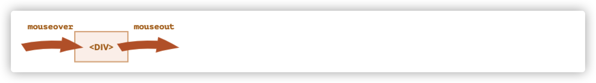
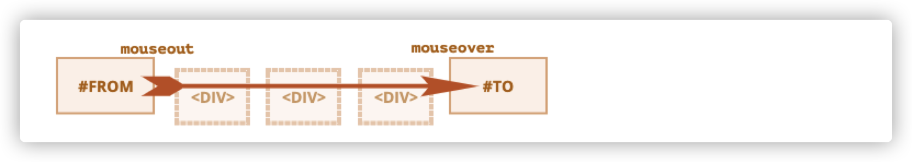
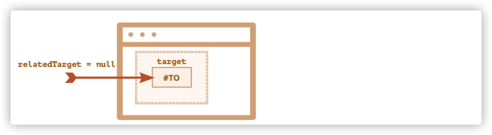
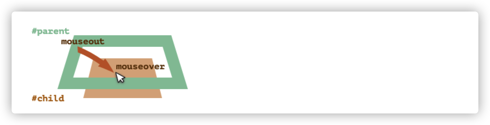
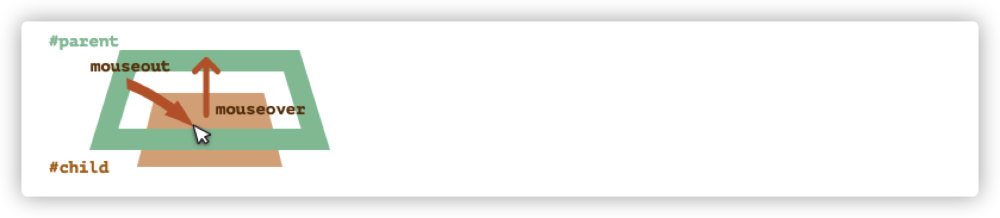
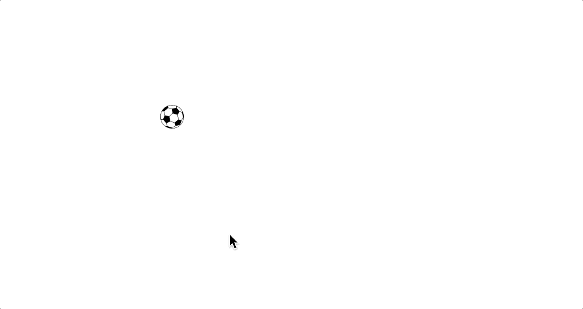
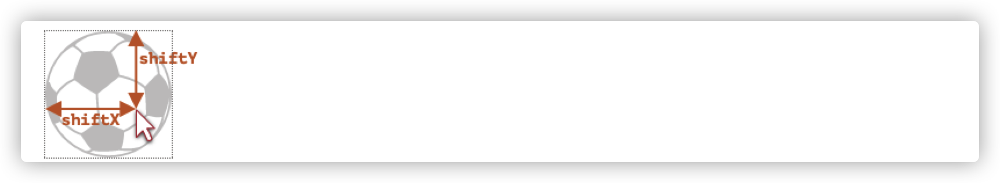
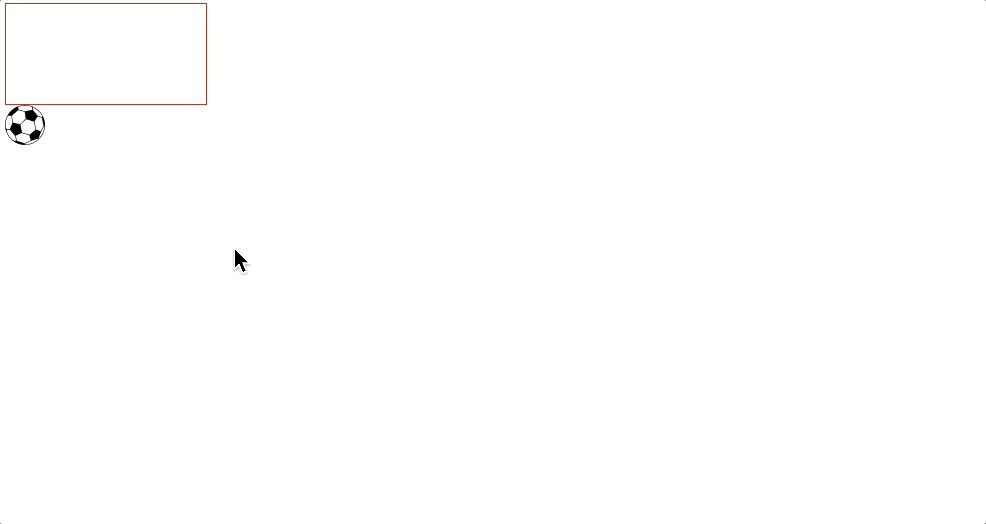
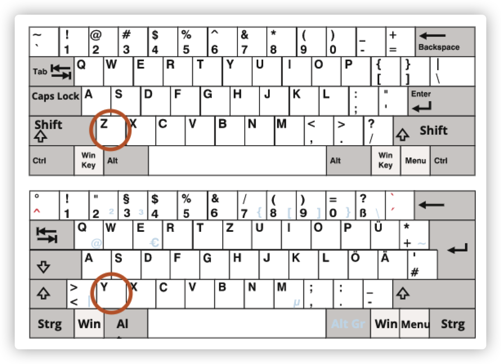

# 一、鼠标事件

鼠标事件不单单来自于鼠标，还可能来自手机或平板，它们对此类操作进行了模拟以实现兼容。

## 1.1 鼠标事件类型

```
mousedown/mouseup
```

在元素上点击/释放鼠标按钮。

```
mouseover/mouseout
```

鼠标指针从一个元素上移入/移出。

```
mousemove
```

鼠标在元素上的每个移动都会触发此事件。

```
click
```

如果使用的是鼠标左键，则在同一个元素上的 `mousedown` 及 `mouseup` 相继触发后，触发该事件。

```
dblclick
```

在短时间内双击同一元素后触发。如今已经很少使用了。

```
contextmenu
```

在鼠标右键被按下时触发。还有其他打开上下文菜单的方式，例如使用特殊的键盘按键，在这种情况下它也会被触发，因此它并不完全是鼠标事件。

## 1.2 事件顺序

一个操作可能会触发多个事件。

在单动作触发多个事件时，事件是固定的，例如鼠标被按下时，会触发`mousedown`—> `mouseup` —>`click`的顺序。

## 1.3 鼠标按钮属性

与点击相关的事件中有一个`event.button`属性，这个属性可以知道用户具体点击了哪个鼠标按钮。

一般来说，我们不会在`click`和`contextmenu`事件中使用，因为我们已经知道了，前者用的是左键，后者用的是右键。

但是`mousedown`和`mouseup`事件中则可能需要用到这个属性，因为不管用户点到哪个键，都会触发这两个事件，所以我们需要知道用户到底按的是鼠标的哪个按钮。

`event.button` 的所有可能值如下：

| 鼠标按键状态     | `event.button` |
| :--------------- | :------------- |
| 左键 (主要按键)  | 0              |
| 中键 (辅助按键)  | 1              |
| 右键 (次要按键)  | 2              |
| X1 键 (后退按键) | 3              |
| X2 键 (前进按键) | 4              |

还有一个 `event.buttons` 属性，其中以整数的形式存储着当前所有按下的鼠标按键。


## 1.4 组合键

鼠标是可以跟键盘按键组合的，鼠标事件中会包含组合键的信息

- `shiftKey`：Shift
- `altKey`：Alt（或对于 Mac 是 Opt）
- `ctrlKey`：Ctrl
- `metaKey`：对于 Mac 是 Cmd,**在 Mac 上我们通常使用** `Cmd` **代替** `Ctrl`

如果在事件期间按下了相应的键，则它们为 `true`。

比如，下面这个按钮仅在 Alt+Shift+click 时才有效:

```html
<button id="button">Alt+Shift+Click on me!</button>

<script>
  button.onclick = function(event) {
    if (event.altKey && event.shiftKey) {
      alert('Hooray!');
    }
  };
</script>
```

## 1.5 鼠标坐标：clientX/Y，pageX/Y

1. 相对于窗口的坐标：`clientX` 和 `clientY`。
2. 相对于文档的坐标：`pageX` 和 `pageY`。


## 1.6 防止在鼠标按下时的选择

双击鼠标后它会选择文本。

如果按下鼠标左键，不松开的情况下移动鼠标，也会选择文本。

如果不想要这种默认行为，最合理的方式是防止浏览器对`mousedown`进行操作的默认行为。

```javascript
      elem.addEventListener("mousedown", function (event) {
        //这样就不会对文本选择
        event.preventDefault();
      });
```

## 1.7 防止复制

如果我们允许用户选择文本，但是不允许用户复制内容，我们可以用另外一个事件：`copy`

在`copy`事件上禁止默认行为就可以保护页面内容不被复制。

```javascript
      elem.addEventListener("copy", function (event) {
        event.preventDefault();
      });
```

> 当然，用户如果打开开发者工具还是可以复制的...

## 1.8 小结

鼠标有以下属性：

* `button` —用户点的是鼠标的哪个键
* 组合键，如果按下则为`true`：`altKey`，`ctrlKey`，`shiftKey` 和 `metaKey`（Mac）。
  * `mac`下的`metaKey`等于`window`下的`ctrlKey`

* 文档坐标`pageX/Y`
* 窗口坐标`clientX/Y`

`mousedown` 的默认浏览器操作是文本选择，如果不想要，则可以取消这个默认行为。

# 二、移动鼠标

## 2.1 事件mouseover/mouseout，relatedTarget

1. `mouseover` ：鼠标指针移动上去触发
2. `mouseout`：鼠标指针移动出去触发



这些事件很特别，因为它们具有`relatedTarget`属性。这个属性是对`target`的补充。

当鼠标从一个元素离开去另一个元素时，其中一个元素就变成了`target`，另一个就变成了`relatedTarget`。

对于`mouseover`：

* `event.target` —— 是鼠标移过的那个元素。
* `event.relatedTarget` —— 是鼠标来自的那个元素（`relatedTarget` → `target`）。

`mouseout`则刚好相反：

* `event.target` —— 是鼠标移出的那个元素。
* `event.relatedTarget` —— 是鼠标当前移动到那个元素（`target` → `relatedTarget`）。

这很合理，当鼠标移入`a`元素时，此时触发`mouseover`事件，`target`自然是当前`a`元素。

当鼠标从`a`元素转为移入`b`元素时，对`a`来说，触发了`mouseout`事件，对`b`来说，触发了`mouseover`事件，所以`mouseout`下的`target`就是`a`，`mouseover`（此时为`b`元素触发的事件）中的`relatedTarget`则是`a`。

`relatedTarget`可以是`null`，比如鼠标来自窗口之外，或者离开了窗口。

## 2.2 跳过元素

当鼠标移动时，会触发`mousemove`事件。**但不意味着每个元素都会导致一个事件**。

浏览器会一直检查鼠标的位置，如果发生了变化，就会触发事件。

如果访问者非常快速地移动鼠标，那么某些DOM元素就可能被跳过。



如果鼠标从上图所示的 `#FROM` 快速移动到 `#TO` 元素，则中间的 `<div>`（或其中的一些）元素可能会被跳过。`mouseout` 事件可能会在 `#FROM` 上被触发，然后立即在 `#TO` 上触发 `mouseover`。

这对性能有好处，因为可能有很多中间元素，我们并不想真的要处理每一个移入和离开的过程。

鼠标指针并不会访问所有元素，它可以跳过一些元素。

因此，当鼠标从窗口外调到页面中间，这种情况下，`relatedTarget`就可能是`null`。



在鼠标快速移动下，中间元素可能会被忽略。但如果`mouseover`被触发了，当鼠标离开元素时，则一定会有`mouseout`事件

## 2.3 当移动到一个子元素时 mouseout

`mouseout`有一个重要的知识点——当鼠标指针从元素移动到其后代的时候会触发，例如下面这个结构，从`#parent`到`#child`：

```html
<div id="parent">
  <div id="child">...</div>
</div>
```

如果我们在`#parent`上，将鼠标指针移到`#child`上，`#parent`会得到一个`mouseout`事件。



根据浏览器的逻辑，鼠标指针可能随时位于单个元素上 —— 嵌套最多的那个元素（或z-index最大的那个）。

因此，如果他转到另一个元素（可能是后代），那么它将离开前一个元素。

这里的事件处理有一个重要的细节：

后代的`mouseover`事件会冒泡。因此如果`#parent`具有`mouseover`处理程序，它也将被触发。



所以当鼠标移动到`#child`时，会触发`#parent`的`moustout`事件和`mouseover`事件

我们并不希望发生这种情况，我们可以通过检查`relatedTarget`来避免这种事的发生。

但还有一种更好的方式：`mouseenter`和`mouseleave`事件，它们没有这样的问题。


## 2.4 mouseenter和mouseleave

 当鼠标指针进入一个元素时 —— 会触发 `mouseenter`。而鼠标指针在元素或其后代中的确切位置无关紧要。

当鼠标指针离开该元素时，事件 `mouseleave` 才会触发。

这两个事件跟`mouseover`和`mouseleave`差不多，但它们有以下区别：

* 在元素内部与后代之间的转换不会有影响
* 不会冒泡

当鼠标移入子元素时，就算此时触发了子元素的`mouseenter`，但是并不会冒泡给父元素。

## 2.5 事件委托

由于`mouseenter`和`mouseleave`并不会冒泡，所以我们不能用它们来进行事件委托。

但如果我们一定要用到事件委托，就只能够用`mouseover`和`mouseout`来做额外的处理。

[这里有个例子](https://zh.javascript.info/mousemove-mouseover-mouseout-mouseenter-mouseleave#shi-jian-wei-tuo)

## 2.6 小结

1. 快速地鼠标移动可能会忽略掉某些元素
2. `mouseover/out`和`mouseenter/leave`事件还有一个附加属性：`relatedTarget`。
3. 如果我们从父元素转到子元素，也会触发`mouseover/out`事件。浏览器假定鼠标一次只会在最深的那个元素。
4. `mouseenter/leave`跟`over/out`不同，它们仅在鼠标进入和离开时才会触发。它们并不会冒泡。


# 三、鼠标拖放事件

## 3.1 鼠标事件实现拖放

本质上来说，一个鼠标的位置变动就是让我们设置元素的`left`和`top`。

基本的拖放算法是这样的：

1. 鼠标点击后，获取元素的坐标：元素当前相对于窗口的坐标、鼠标点击的坐标、鼠标到元素边缘的距离
2. 鼠标移动，设置元素的属性为`position:absolute`,并用`left`和`top`来移动它的位置
3. 鼠标抬起后取消移动事件

预览：



直接贴代码：

```html
  <style>
    #ball {
      position: absolute;
    }
  </style>
  <body>
    
    <script>
      let mouseX, mouseY, elemX, elemY, shiftX, shiftY;
      // 1 取消浏览器对图片和一些其他元素的拖放处理的默认行为
      ball.ondragstart = function () {
        return false;
      };
      function onMove(event) {
        // 4
        ball.style.left = event.pageX - shiftX + "px";
        ball.style.top = event.pageY - shiftY + "px";
      }
      // 2
      ball.addEventListener("mousedown", function (event) {
        //取坐标
        mouseX = event.clientX; //鼠标位置x
        mouseY = event.clientY; //鼠标位置y
        elemX = this.getBoundingClientRect().left; //元素的窗口位置x
        elemY = this.getBoundingClientRect().top; //元素的窗口位置Y
        // 3
        shiftX = mouseX - elemX; //鼠标位置距离元素左边的坐标
        shiftY = mouseY - elemY; //鼠标位置距离元素右边的坐标
        //2 向document添加移动事件监听
        document.addEventListener("mousemove", onMove);
      });

      ball.addEventListener("mouseup", function (event) {
        //取消移动事件 5
        document.removeEventListener("mousemove", onMove);
      });
    </script>
  </body>
```

这里一共需要三个API，分别为鼠标按下去`mousedown`、鼠标移动`mousemove`、鼠标抬起`mouseup`。

1. 由于拖动的元素是图片，浏览器有自己的对图片和一些其他元素的拖放处理，所以要禁止默认行为`ondragstart`。

2. `mousemove` 会经常被触发，但不会针对每个像素都如此。因此，在快速移动鼠标后，鼠标指针可能会从球上跳转至文档中间的某个位置（甚至跳转至窗口外）。总而言之，快速的鼠标移动让浏览器跳过了`ball`上的鼠标移动事件，所以这里需要在`document`上跟踪`mousemove`，而不是`ball`上。

3. `shiftX`跟`shiftY`代表的是鼠标的位置距离元素左侧/上侧边缘坐标的距离。

   

   本质上来说，一个鼠标的位置变动就是让我们设置元素的`left`和`top`。

   我们需要计算鼠标在窗口的位置 - 元素在窗口的位置，就能够得到鼠标距离元素边缘的`shiftX`和`shiftY`

   * `shiftX`=鼠标的`pageX` - 元素的窗口坐标`getBoundingClientRect().left`
   * `shiftY`=鼠标的`pageY` - 元素的窗口坐标`getBoundingClientRect().top`

   > 有个太先进而导致浏览器还未全部兼容的API，offsetX跟offsetY，可以直接得到shiftX和shiftY的值。

4. **移动后的鼠标相对于文档（不是窗口）的位置**减去`shiftX/Y`就可以得到`left`和`top`。

5. 当鼠标抬起代表移动要结束，直接删除移动事件就可以了。


## 3.2 放置目标 

球可以放置在任何地方，下面完成一个当球放置在目标元素时，目标元素高亮的功能。

我们需要知道目标元素是什么。当我们拖动时，我们可以利用`document.elementFromPoint(clientX,clientY)`通过坐标的位置来知道当前被移动到的是哪个元素。

问题是我们的鼠标是一直在球这个元素上的，所以我们需要另外处理一下，否则`document.elementFromPoint(clientX,clientY)`将会一直返回球（因为它在最上面）。

处理方式如下：

```javascript
        ball.hidden = true;// 先隐藏球
        currentDrop = document.elementFromPoint(event.clientX, event.clientY);//获取球下面的元素
        ball.hidden = false;
```

当返回的元素是目标元素或者是它的子元素时，我们就可以处理让目标元素高亮的元素了。

```javascript
        if (currentDrop.closest("#div")) {//匹配球下面的元素的祖先（或自己）的id是否为目标元素的。
          enterDroppable(div);
        } else {
          leaveDroppable(div);
        }
```

实现效果：



完整代码：

```html
  <style>
    body {
      height: 2000px;
      width: 100%;
    }
    #ball {
      position: absolute;
    }
    #div {
      width: 200px;
      height: 100px;
      border: 1px solid red;
    }
  </style>
  <body>
    <div id="div"></div>
    
    <script>
      let mouseX, mouseY, elemX, elemY, shiftX, shiftY, currentDrop;
      // 1 取消浏览器对图片和一些其他元素的拖放处理的默认行为
      ball.ondragstart = function () {
        return false;
      };
      function enterDroppable(elem) {
        elem.style.background = "red";
      }
      function leaveDroppable(elem) {
        elem.style.background = "";
      }
      function onMove(event) {
        // 4
        ball.style.left = event.pageX - shiftX + "px";
        ball.style.top = event.pageY - shiftY + "px";

        ball.hidden = true;
        currentDrop = document.elementFromPoint(event.clientX, event.clientY);
        ball.hidden = false;

        if (currentDrop.closest("#div")) {
          enterDroppable(div);
        } else {
          leaveDroppable(div);
        }
      }
      // 2
      ball.addEventListener("mousedown", function (event) {
        //取坐标
        mouseX = event.clientX; //鼠标位置x
        mouseY = event.clientY; //鼠标位置y
        elemX = this.getBoundingClientRect().left; //元素的窗口位置x
        elemY = this.getBoundingClientRect().top; //元素的窗口位置Y
        // 3
        shiftX = mouseX - elemX; //鼠标位置距离元素左边的坐标
        shiftY = mouseY - elemY; //鼠标位置距离元素右边的坐标
        //2 向document添加移动事件监听
        document.addEventListener("mousemove", onMove);
      });

      ball.addEventListener("mouseup", function (event) {
        //取消移动事件 5
        document.removeEventListener("mousemove", onMove);
      });
    </script>
  </body>
```

## 3.3 小结

基础的使用鼠标的拖放方法是这样的：

1. 事件构成：`mousedown` —> `mousemove` —> `mouseup` (由于浏览器对图片等有默认拖拽行为，所以这里取消`dragstart`的默认行为)
2. 拖放本质上就是给被拖放的元素设置`left`和`top`，这里需要获取到鼠标指针对于元素的边缘的坐标距离`shiftX/shiftY`,也可以直接用`offsetX/Y`但兼容性不好
3. 使用 `document.elementFromPoint` 检测鼠标指针下的 “droppable” 的元素。
4. 由于`mousemove`事件触发频繁，有可能会忽略元素，所以需要设置在顶层`document`上。


# 四、键盘事件

## 4.1 keydown和keyup

* `keydown` 键盘按下
* `keyup` 键盘抬起

事件对象的`key`属性允许获得字符，而`code`属性则允许获取物理按键代码。

以下以按键z/Z为例

| Key       | `event.key` | `event.code`                |
| :-------- | :---------- | :-------------------------- |
| Z         | `z`（小写） | `KeyZ`                      |
| Shift+Z   | `Z`（大写） | `KeyZ`                      |
| F1        | `F1`        | `F1`                        |
| Backspace | `Backspace` | `Backspace`                 |
| Shift     | `Shift`     | `ShiftRight` 或 `ShiftLeft` |

同一个按键 Z，可以与或不与 `Shift` 一起按下。我们会得到两个不同的字符：小写的 `z` 和大写的 `Z`。

`event.key` 正是这个字符，并且它将是不同的。但是，`event.code` 是相同的。

`event.code`可以标明是左边的还是右边的shift被按下了。

我们要处理一个热键：Ctrl+Z（或 Mac 上的 Cmd+Z）,则可以用以下代码：

```javascript
document.addEventListener('keydown', function(event) {
  if (event.code == 'KeyZ' && (event.ctrlKey || event.metaKey)) {
    alert('Undo!')
  }
});
```

`event.code` 有一个问题。对于不同的键盘布局，相同的按键可能会具有不同的字符。

下面是美式布局（“QWERTY”）和德式布局（“QWERTZ”）



对于同一个按键，美式布局为 “Z”，而德式布局为 “Y”（字母被替换了）。

从字面上看，对于使用德式布局键盘的人来说，但他们按下 Y 时，`event.code` 将等于 `KeyZ`。

因此，`event.code` 可能由于意外的键盘布局而与错误的字符进行了匹配。不同键盘布局中的相同字母可能会映射到不同的物理键，从而导致了它们有不同的代码。

为了可靠地跟踪与受键盘布局影响的字符，使用 `event.key` 可能是一个更好的方式。

另一方面，`event.code` 的好处是，即使访问者更改了语言，绑定到物理键位置的 `event.code` 会始终保持不变。因此，即使在切换了语言的情况下，依赖于它的热键也能正常工作。

我们想要处理与布局有关的按键？那么 `event.key` 是我们必选的方式。

或者我们希望一个热键即使在切换了语言后，仍能正常使用？那么 `event.code` 可能会更好。

## 4.2 自动重复

如果按下一个键足够长的时间，它就会开始“自动重复”：`keydown` 会被一次又一次地触发，然后当按键被释放时，我们最终会得到 `keyup`。因此，有很多 `keydown` 却只有一个 `keyup` 是很正常的。

对于由自动重复触发的事件，`event` 对象的 `event.repeat` 属性被设置为 `true`。

## 4.3 默认行为

默认行为各不相同，因为键盘可能会触发很多可能的东西。

例如：

- 出现在屏幕上的一个字符（最明显的结果）。
- 一个字符被删除（Delete 键）。
- 滚动页面（PageDown 键）。
- 浏览器打开“保存页面”对话框（Ctrl+S）
- ……等。

阻止对 `keydown` 的默认行为可以取消大多数的行为，但基于 OS 的特殊按键除外。例如，在 Windows 中，Alt+F4 会关闭当前浏览器窗口。并且无法通过在 JavaScript 中阻止默认行为来阻止它。

## 4.4 keypress事件

过去曾经有一个 `keypress` 事件，还有事件对象的 `keyCode`、`charCode` 和 `which` 属性。

大多数浏览器对它们都存在兼容性问题，虽然浏览器还在支持它们，但现在完全没必要再使用它们。

## 4.5 小结

按一个按键总是会产生一个键盘事件，无论是符号键，还是例如 Shift 或 Ctrl 等特殊按键。唯一的例外是有时会出现在笔记本电脑的键盘上的 Fn 键。它没有键盘事件，因为它通常是被在比 OS 更低的级别上实现的。

键盘事件：

- `keydown` —— 在按下键时（如果长按按键，则将自动重复），
- `keyup` —— 释放按键时。

键盘事件的主要属性：

- `code` —— “按键代码”（`"KeyA"`，`"ArrowLeft"` 等），特定于键盘上按键的物理位置。
- `key` —— 字符（`"A"`，`"a"` 等），对于非字符（non-character）的按键，通常具有与 `code` 相同的值。

过去，键盘事件有时会被用于跟踪表单字段中的用户输入。这并不可靠，因为输入可能来自各种来源。


# 五、滚动事件

`scroll`事件在`window`和可滚动元素上都可以运行。

下面是一个滚动事件的示例：

```javascript
      window.addEventListener("scroll", function (event) {
        console.log(this.pageXOffset);
        console.log(this.pageYOffset);
      });
```

## 5.1 防止滚动

我们不能通过在 `onscroll` 监听器中使用 `event.preventDefault()` 来阻止滚动，因为默认事件是在滚动发生 **之后** 才触发的。

我们可以设置`overflow: hidden;`来让防止滚动。
