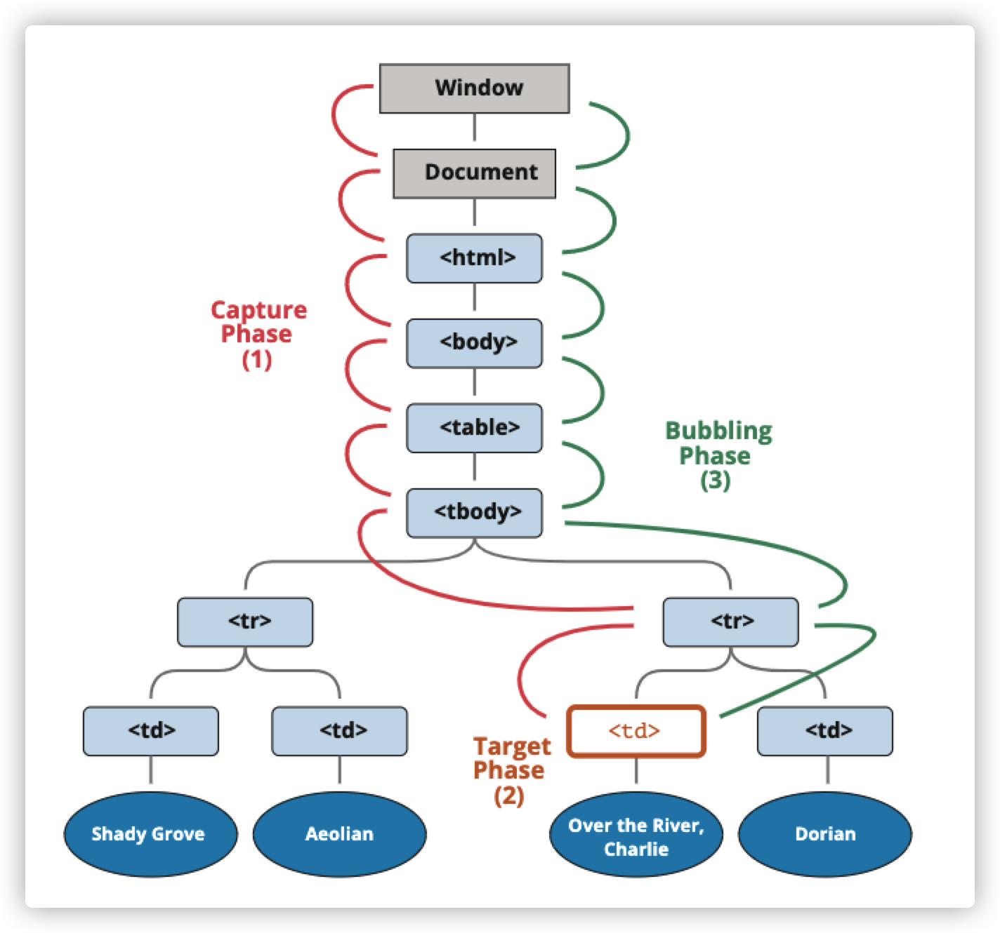

# 一、事件简介

事件是某些事发生的信号。所有DOM节点都可以生成这样的信号。

以下是常用DOM事件列表：

* 鼠标事件
  * `click` — 当鼠标点击一个元素时
  * `contextmenu` — 当鼠标右键点击一个元素时
  * `mouseover/mouseout` — 当鼠标移入/移除一个元素时
  * `mousedown/mouseup` — 当在元素上上按下/抬起鼠标时
  * `mousemove` — 当鼠标移动时
* 键盘事件
  * `keydown/keyup` — 当按下和松开一个按键时
* 表单事件
  * `submit` — 当访问者提交了一个`form`时
  * `focus` — 当访问者聚焦一个元素时
* Document事件
  * `DOMContentLoaded` — 当HTML的加载和处理均完成，DOM被完全构建完成时
* CSS事件
  * `transitionend` — 当一个css动画完成时

## 1.1 事件处理程序

为了对事件做出响应，我们可以在代码中给相应的元素分配一个处理程序—— 即事件函数。

当发生用户行为（action）时会运行这个函数。

有三种添加事件处理程序的方式：

* HTML 特性

  处理程序可以写在HTML的`on(event)`特性中。

  例如，以下是给`input`分配一个`click`的处理程序。

  ```html
  <input value="Click me" onclick="alert('Click!')" type="button">
  ```

  当鼠标点击时，代码就会运行。

  由于特性本身使用的是双引号，所以我们在代码中需要使用非双引号，否则代码无法被正确解析，也就无法正确运行。

  在特性中，我们没办法大量书写JavaScript代码，因此我们最好创建一个函数，然后在HTML特性中调用这个函数。

  ```html
  <script>
    function countRabbits() {
      for(let i=1; i<=3; i++) {
        alert("Rabbit number " + i);
      }
    }
  </script>
  
  <input type="button" onclick="countRabbits()" value="Count rabbits!">
  ```

  HTML 特性名是大小写不敏感的，所以 `ONCLICK` 和 `onClick` 以及 `onCLICK` 都一样可以运行。但是特性通常是小写的：`onclick`。

* DOM属性

  标准特性跟DOM属性总是有映射关系的，我们可以使用DOM属性`on(event)`来分配处理程序。

  例如：

  ```html
  <input id="elem" type="button" value="Click me">
  <script>
    elem.onclick = function() {
      alert('Thank you');
    };
  </script>
  ```

  如果处理程序是通过HTML特性的方式来写的，那么浏览器会读取它，并从特性的内容创建一个**新的函数**，然后将这个函数写入DOM属性。

  因此，DOM属性和HTML特性的两种写法效果是一样的，只是初始化的方式不同。特性是从HTML中初始化，属性是从DOM属性中初始化。

  如果我们希望一个元素的一个事件有两个事件处理程序怎么办？由于一个元素只有一个onclick属性，所以我们没办法通过HTML和DOM的方式来实现这样的功能。


## 1.2 访问元素：this

处理程序中的this值是对应的元素。就是处理程序所在的那个元素。

  ```html
  <button onclick="alert(this.innerHTML)">Click me</button>
  // 会输出：Click me
  ```


## 1.3 可能出现的错误

  1. DOM属性中的事件处理程序不要加括号
  2. HTML特性中的事件处理程序需要加括号。因为特性转化成属性时，浏览器会自动创建一个函数，并让这个函数执行特性中的内容
  3. DOM属性大小写敏感，HTML大小写不敏感
  4. `elem.setAttribute("onclick", "alert(123)")`，也可以这样写HTML特性。

  

  ## 1.4 addEventListener

我们可以用发布订阅模式来给事件分配**多个**处理程序，这就用到 `addEventListener` 和 `removeEventListener`

添加处理程序的语法：

```javascript
element.addEventListener(event, handler[, options]);
```

`event`

事件名

`handler`

处理程序

`options`

是具有以下属性的附加可选对象：

* once ： 如果为`true`，可以在触发后自动删除监听器
* capture：事件处理阶段，false为冒泡阶段，true是捕获阶段
* passive：如果为`true`，处理程序将不会调用`preventDefault`


移除处理程序的语法：

```javascript
element.removeEventListener(event, handler[, options]);
```

> 要移除处理程序，我们需要传入与分配函数的地址完全相同的函数。
>
> ```javascript
> elem.addEventListener( "click" , () => alert('Thanks!'));
> // ....
> elem.removeEventListener( "click", () => alert('Thanks!'));
> //相同的代码，完全无用
> ```
>
> ```javascript
> function handler() {
>   alert( 'Thanks!' );
> }
> 
> input.addEventListener("click", handler);
> // ....
> input.removeEventListener("click", handler);
> // 这种方式才有效
> ```
>
> 请注意 —— 如果我们不将函数存储在一个变量中，那么我们就无法移除它。由 `addEventListener` 分配的处理程序将无法被“读回”。


多次调用`addEventListener`允许添加多个处理程序。

```javascript
  function handler1() {
    alert('Thanks!');
  };

  function handler2() {
    alert('Thanks again!');
  }

  elem.onclick = () => alert("Hello");
  elem.addEventListener("click", handler1); // Thanks!
  elem.addEventListener("click", handler2); // Thanks again!
```

一般我们会选择DOM属性或者`addEventListener`其中一种来添加事件处理程序。

对于某些事件，我们无法通过DOM属性来分配。只能使用 `addEventListener`。

比如`DOMContentLoaded`事件，该事件在文档加载完成且DOM构建完成时触发。

```javascript
// 这种方式可以运行
document.addEventListener("DOMContentLoaded", function() {
  alert("DOM built");
});

// 永远不会运行
document.onDOMContentLoaded = function() {
  alert("DOM built");
};
```

## 1.5 事件对象

当事件发生后，浏览器会创建一个`event`对象，将详细信息放在其中，并将其作为参数传递给处理程序。

event对象有一些属性：

`event.type`—事件类型

`event.currentTarget`— 处理事件的元素。与this相同，除非处理程序是箭头函数，或者它的this绑定到了其他东西上，那我们就可以用`event.currentTarget`来获取元素

`event.clientX/clientY`— 指针事件的指针的窗口相对坐标。

...等等

以下是从event对象中获取鼠标指针的坐标的示例：

```html
<input type="button" value="Click me" id="elem">

<script>
  elem.onclick = function(event) {
    // 显示事件类型、元素和点击的坐标
    alert(event.type + " at " + event.currentTarget);
    alert("Coordinates: " + event.clientX + ":" + event.clientY);
  };
</script>
```

在HTML特性中，我们可以这样使用event对象

```html
<input type="button" onclick="alert(event.type)" value="Event type">
```

## 1.6 对象处理程序：handleEvent

除了可以使用函数来作为事件处理程序，还可以使用对象的形式。当事件发生时，会调用这个对象内部的`handleEvent`方法。

```javascript
  let obj = {
    handleEvent(event) {
      alert(event.type + " at " + event.currentTarget);
    }
  };

  elem.addEventListener('click', obj);
```

只要能读取到这个对象的`handleEvent`方法，那么`handleEvent`写在原型上也是没问题的，以下是通过类创建对象处理程序的示例，`handleEvent`会放在类的原型上。

```javascript
  class Menu {
    handleEvent(event) {
      switch(event.type) {
        case 'mousedown':
          elem.innerHTML = "Mouse button pressed";
          break;
        case 'mouseup':
          elem.innerHTML += "...and released.";
          break;
      }
    }
  }

  let menu = new Menu();
  elem.addEventListener('mousedown', menu);
  elem.addEventListener('mouseup', menu);
```

利用对象处理程序，我们不必让`handleEvent`通过自己来处理，它可以调用其他特定于事件的方法

```javascript
  class Menu {
    handleEvent(event) {
      // mousedown -> onMousedown
      let method = 'on' + event.type[0].toUpperCase() + event.type.slice(1);
      this[method](event);
    }

    onMousedown() {
      elem.innerHTML = "Mouse button pressed";
    }

    onMouseup() {
      elem.innerHTML += "...and released.";
    }
  }

  let menu = new Menu();
  elem.addEventListener('mousedown', menu);
  elem.addEventListener('mouseup', menu);
```

现在事件处理程序已经明确分离出来了，更容易代码的编写和后期的维护。

> 在handleEvent方法中，this是当前对象

## 1.7 小结

有三种添加事件处理程序的方式：

* HTML特性方法
* DOM属性方法
* `addEventListener`方法,`removeEventListener` 用于移除

HTML特性很少用，因为在字符串中写JavaScript代码看起来跟奇怪。

DOM属性还不错，但是无法添加多个处理程序

`addEventListener`最灵活，有一些事件只支持这种方式。同时`addEventListener`还支持对象作为事件处理程序，在这种情况下，会调用对象中的`handleEvent`方法。

无论用哪种方式，都会接受浏览器处理过的`event`对象作为第一个参数，通过这个参数我们可以获取一些事件信息，比如鼠标坐标，事件类型等。

# 二、冒泡和捕获

## 2.1 冒泡

冒泡的原理是：当一个事件发生在一个元素上，它会首先运行在该元素上的处理程序，然后运行父元素的处理程序，然后一直向上到其他祖先上的处理程序。

几乎所有事件都会冒泡。

## 2.2 event.target

父元素上的处理程序始终可以获取事件实际发生位置的详细信息

引发事件的那个嵌套层级最深的元素被称为目标元素，可以通过`event.target`访问。

以下是`event.target`与`event.currentTarget`的区别：

* `event.target` —— 引发事件的目标元素，它在冒泡过程中不会变化，当点击事件发生在自身时，它就是`this`
* `event.currentTarget` ——正在运行处理程序的当前元素（绑定了处理程序的元素），它在冒泡过程中会变化。大部分情况下，它就是`this`

```html
    <button id="btn">我不是嵌套元素</button>
    <div id="div">
      <p>我是嵌套元素</p>
    </div>
    <script>
      btn.onclick = function (event) {
        console.log(this === event.currentTarget); //true
        console.log(this === event.target); //true
      };
      div.onclick = function (event) {
        console.log(this === event.currentTarget); //true
        console.log(this === event.target); //false
      };
    </script>
```

上面的代码中，当点击了`p`标签时，会触发父盒子`div`的事件处理程序，此时`this`就是`currentTarget`而不是`target`

## 2.3 停止冒泡

冒泡事件从目标元素开始向上冒泡。通常，它会一直升到`html`，然后再到`document`对象，有些事件甚至会到达`window`。

但是我们可以调用`event.stopPropagation()`控制不让其冒泡。

```html
<body onclick="alert(`the bubbling doesn't reach here`)">
  <button onclick="event.stopPropagation()">Click me</button>
</body>
```

如果一个元素有多个事件处理程序，当其中一个停止冒泡后，其他处理程序也会运行，但不会再冒泡。

```html
  <body onclick="alert('点击到我了')">
    <button id="btn">点记我</button>

    <script>
      btn.addEventListener("click", function (event) {
        event.stopPropagation();
        console.log(123);
      });
      btn.addEventListener("click", function () {
        console.log(456);
      });
    </script>
  </body>
```

> 有一个 `event.stopImmediatePropagation()` 方法，可以用于停止冒泡，并阻止当前元素上的处理程序运行。使用该方法之后，其他处理程序就不会被执行。

**不要在没有需要的情况下停止冒泡！**

有时停止冒泡会造成隐藏的陷阱。

比如：

我们创建了一个嵌套菜单，每个子菜单都有自己的点击事件，并停止冒泡。

但如果我们下一步决定追踪用户在浏览器窗口内点击的位置，以做某些分析处理，那么被冒泡的那个区域很明显会变成一个死区，用户的行为我们不能记录下来了。

所以通常没有必要去阻止冒泡。 

## 2.4 捕获

事件处理的另外一个阶段是捕获（“capturing”）。

事件传播有三个阶段：

* 捕获阶段—— 事件从window向下走近元素
* 到达目标阶段——事件到达目标元素
* 冒泡——事件从元素上开始冒泡



以`table`为例，当我们点击`<td>`时，事件会通过祖先向下到达元素（捕获阶段），然后到达目标（目标阶段），最后上升到冒泡阶段。在途中调用处理程序。

默认使用 `on<event>` 属性或使用 HTML 特性（attribute）或使用两个参数的 `addEventListener(event, handler)` 添加的处理程序，对捕获一无所知，它们仅在第二阶段和第三阶段运行。

如果我们希望在捕获阶段处理事件，那么可以将处理程序的`capture`选项设置为`true`

```javascript
elem.addEventListener(..., {capture: true})
// 或者，用 {capture: true} 的别名 "true"
elem.addEventListener(..., true)
```

`capture` 选项有两个可能的值：

- 如果为 `false`（默认值），则在冒泡阶段设置处理程序。
- 如果为 `true`，则在捕获阶段设置处理程序。

请注意，虽然形式上有 3 个阶段，但第 2 阶段（“目标阶段”：事件到达元素）没有被单独处理：捕获阶段和冒泡阶段的处理程序都在该阶段被触发。

> **要移除处理程序，`removeEventListener` 需要同一阶段**
>
> 如果我们 `addEventListener(..., true)`，那么我们应该在 `removeEventListener(..., true)` 中提到同一阶段，以正确删除处理程序。

## 2.5 小结

当一个事件发生时 —— 发生该事件的嵌套最深的元素被标记为“目标元素”（`event.target`）。

* 事件从文档根节点向下移动到`event.target`，并在途中会调用分配了`addEventListener(...,true)`的处理程序
* 然后，在目标元素自身调用处理程序
* 然后，事件开始冒泡，从下到上冒泡到根，会调用`on<event>`、HTML 特性（attribute）和没有第三个参数的，或者第三个参数为 `false/{capture:false}` 的 `addEventListener` 分配的处理程序。

每个处理程序都可以访问到`event`对象的属性：

* `event.target` —— 引发事件的元素
* `event.currentTarget` —— 具有处理程序的元素
* `event.eventPhase` —— 当前阶段（capturing=1，target=2，bubbling=3）

捕获阶段很少使用，通常我们会在冒泡（默认）时处理事件。

每个处理程序都可以通过调用`event.stopPropagation`来停止冒泡。但不建议这样做，因为我们不确定是否确实不需要冒泡上来的事件。

> event.stopPropagation()也可以用于捕获阶段,所以更确切的叫法应该是停止传播

冒泡和捕获为“事件委托”奠定了基础 —— 一种非常强大的事件处理模式。


# 三、事件委托

冒泡和捕获的机制允许我们将事件处理程序放到元素的祖先上，这样如果我们有很多类似方式处理的元素，就不必为每个元素分配处理程序。这种实现方式就是事件委托。

在事件委托下，我们可以通过`event.target`知道用户具体点击了哪个元素。

```html
 <style>
      .highLight {
        color: red;
      }
    </style>
    <ul>
      <li>1</li>
      <li>2</li>
      <li>3</li>
      <li>4</li>
      <li>5</li>
      <li>6</li>
    </ul>
    <script>
      const ul = document.querySelector("ul");
      let clickedNode;
      function highLight(node) {
        if (clickedNode) oldNode.classList.remove("highLight");

        node.classList.add("highLight");
        clickedNode = node;
      }
      ul.addEventListener("click", function (event) {
        //如果用户点击的是ul自己，那么就不操作
        if (event.target === event.currentTarget) {
          return;
        }
        //高亮
        highLight(event.target);
      });
    </script>
```

上面的代码是点击li后使得文字变成红色的代码。

使用了事件委托的方式后，所有`<li>`的事件被移到父元素`<ul>`上。

`event.target`能帮助我们判别点击的是哪个`<li>`。

## 3.1 委托示例：标记行为

除了上面父元素与子元素的委托行为外，事件委托还能够有很多用途。

比如，下面有三个在同一级别的`<button>`，它们分别需要做不同的行为。它们的行为被写在`data-action`特性中，当点击后，通过对象处理程序的`handleEvent`方法，获取特性中的action，然后调用对应的方法。

```html
   <div id="menu">
      <button data-action="save" ="">保存</button>
      <button data-action="load">加载</button>
      <button data-action="search">搜索</button>
    </div>

    <script>
      class Menu {
        handleEvent(event) {
          const self = event.target;
          const action = self.dataset.action;
          this[action]();
        }
        save() {
          console.log("save");
        }
        load() {
          console.log("load");
        }
        search() {
          console.log("search");
        }
      }
      menu.addEventListener("click", new Menu());
    </script>
```

这里的委托使得我们无需为每一个按钮分配处理程序，只需要创建一个方法并将其标记即可。

## 3.2 行为模式

我们还可以使用事件委托将“行为（behavior）”以 **声明方式** 添加到具有特殊特性（attribute）和类的元素中。

行为模式分为两个部分：

1. 我们将自定义特性添加到描述其行为的元素。
2. 用文档范围级的处理程序追踪事件，如果事件发生在具有特定特性的元素上 —— 则执行行为（action）。

下面是一个切换隐藏/显现状态的代码

```javascript
<button data-toggle-id="subscribe-mail">
  Show the subscription form
</button>

<form id="subscribe-mail" hidden>
  Your mail: <input type="email">
</form>

<script>
  document.addEventListener('click', function(event) {
    let id = event.target.dataset.toggleId;
    if (!id) return;

    let elem = document.getElementById(id);

    elem.hidden = !elem.hidden;
  });
</script>
```

我们利用自定义特性将需要处理行为的元素的id添加到特性中，然后在`JavaScript`中给`document`对象添加事件，当点击的元素拥有自定义特性时，获取自定义特性的值（也就是元素的`id`），然后隐藏该元素。

这样我们只需要将逻辑写在`document`上，而无需挨个为需要处理的元素编写`JavaScript`代码，文档级处理程序使其适用于页面的任意元素。

我们也可以组合单个元素上的多个行为。

## 3.3 小结

DOM事件中最有用的模式之一就是事件委托

它通常为许多相似的元素添加相同的处理，但不仅限于此。

它的过程：

* 在容器上放置一个处理程序
* 在处理程序中——检查触发元素`event.target`
* 给触发元素做一个标记，如果是我们希望的元素，那么就处理该事件

用事件委托的方式最直观的好处就是代码减少了，我们将逻辑放到父级，能够比较大程度减少编写元素的事件处理函数。

事件委托有一个局限：事件必须冒泡。

# 四、浏览器默认行为

许多事件会自动触发浏览器执行某些行为。

比如：

* 点击一个链接 —— 触发导航到该url的行为
* 点击表单的提交按钮 —— 触发提交到服务器的行为
* 在文本上按下鼠标按钮并移动 ——选中文本

有时候我们不希望发生相应的浏览器行为，而想要自己实现其行为。

## 4.1 阻止浏览器行为

有两种方式可以让浏览器不执行默认行为

* 主流方式 ——`event.preventDefault`方法
* 非主流 —— `on<event>`方式添加事件处理函数并`return false`

```javascript
<a href="/" onclick="return false">Click here</a>
or
<a href="/" onclick="event.preventDefault()">here</a>
```

通常，在事件处理程序里的返回值是没有意义的，会被忽略。唯一的例外是从使用 `on<event>` 分配的处理程序中返回的 `return false`。

某些事件会相互转化，如果我们阻止了第一个事件，那就没有第二个事件了。

比如，在`input`上我们阻止了`mousedown`事件的默认行为，那么会让`focus`事件无法聚焦。

因为`mousedown`这个行为会让一个`input`元素发生聚焦，并触发`focus`。但阻止默认行为后没有焦点了。

```html
<input onmousedown="return false" onfocus="this.value=''" value="Click me">
```

不过如果我们用`Tab`键来聚焦，那么`focus`事件还是会触发的。只是用鼠标不行。

## 4.2 处理程序选项“passive”

`addEventListener`的可选性有一个`passive:true`，它是你跟浏览器的承诺，表示你的处理程序不会调用`event.preventDefault`。

为什么有这样的API呢？

原因是移动设备上有一些事件，比如`touchmove`事件（用户在屏幕上移动手指），默认情况下会导致滚动页面，但是我们可以用`event.preventDefault`来阻止滚动。

因此，当浏览器检测到这样的事件时，它必须首先处理所有处理程序，然后如果没有任何地方调用`event.preventDefault`,它才会滚动页面。这样会造成UI中不必要的延迟和抖动。

`passive: true` 选项告诉浏览器，处理程序不会取消滚动。然后浏览器立即滚动页面以提供最大程度的流畅体验，并通过某种方式处理事件。

对于某些浏览器（Firefox，Chrome），默认情况下，`touchstart` 和 `touchmove` 事件的 `passive` 为 `true`。

## 4.3 event.defaultPrevented

如果默认行为被阻止了，那么`event.defaultPrevented`属性为`true`，否则为`false`。

现在我们有两个右键事件，通常在浏览器文档中，右键后会有默认的上下文菜单显示出来。在这里我将其默认行为给取消掉，然后用`alert`作为新的上下文菜单。

```html
  <body>
    <button id="btn">右键点击我</button>

    <script>
      btn.oncontextmenu = function (event) {
        event.preventDefault();
        alert("btn被点击了");
      };
      document.oncontextmenu = function (event) {
        event.preventDefault();
        alert("document被点击了");
      };
    </script>
  </body>
```

现在不会再出现默认的上下文菜单了。当右键点击`button`后，会弹出两个弹窗，分别是`btn`的和`document`的。

如果我们只希望出现`btn`的而不希望`document`的，我们可以用`event.stopPropagation`来阻止冒泡，对吧？

但是这样的话如果需要在`document`上添加一个右键事件来统计全局页面下用户的行为，那`btn`这个右键行为将永远不会被统计在内了。

在这种需求下我们可以利用`event.defaultPrevented`属性来帮助我们实现。只需要在`document`的`oncontextmenu`事件中检查默认行为是否有被阻止即可。

```html
    <button id="btn">右键点击我</button>

    <script>
      btn.oncontextmenu = function (event) {
        event.preventDefault();
        alert("btn被点击了");
      };
      document.oncontextmenu = function (event) {
        //...这里做一些统计工作
        //发现默认行为被阻止了，那么就退出函数，不显示document的右键菜单
        if (event.defaultPrevented) return;

        event.preventDefault();
        alert("document被点击了");
      };
    </script>
```

由于在btn中的事件已经触发过阻止默认行为了，所以`event`对象向上冒泡传递的过程中，其`defaultPrevented`属性变成了`true`。

> 从这点也可以看出，触发事件后的`event`对象从被触发的元素开始，在向上冒泡的过程中会被传递给所有绑定了该事件的事件处理函数。

现在我们实现了我们的需求，`btn`跟`document`都有自己的上下文菜单,而且也不再同时弹出两个上下文菜单。

当然我们也可以在`document`上用事件委托实现同样的需求，只要我们能够在代码中标记对应的`btn`并实现与之对应的逻辑即可。

## 4.4 小结

有很多默认的浏览器行为：

* `mousedown` —— 开始选择（移动鼠标进行选择）。
* 在 `<input type="checkbox">` 上的 `click` —— 选中/取消选中的 `input`。
* `submit` —— 点击 `<input type="submit">` 或者在表单字段中按下 Enter 键会触发该事件，之后浏览器将提交表单。
* `keydown` —— 按下一个按键会导致将字符添加到字段，或者触发其他行为。
* `contextmenu` —— 事件发生在鼠标右键单击时，触发的行为是显示浏览器上下文菜单。
* ……还有更多……

所有的默认行为都是可以被阻止的。

我们可以使用两种方式：

* `event.preventDefault`
* `on<event>`中`return false`

`addEventListener`中的`passive`会告诉浏览器该行为不会被阻止。这对于某些移动端事件非常有用，会提升页面流畅性。

如果默认行为被阻止，那么`event.defaultPrevented`的值会变成`true`，否则为`false`。


# 五、创建自定义事件

我们可以自定义生成事件。自定义事件就是代码层面的事件触发机制。

## 5.1 事件构造器

内建事件类形成一个层次结构，类似DOM元素类，跟是内建的Event类。

我们可以创建`Event`对象

```javascript
let event = new Event(type[, options]);
```

- **type** —— 事件类型，可以是像这样 `"click"` 的字符串，或者我们自己的像这样 `"my-event"` 的参数。

- **options** —— 具有两个可选属性的对象：

  - `bubbles: true/false` —— 如果为 `true`，那么事件会冒泡。
  - `cancelable: true/false` —— 如果为 `true`，那么“默认行为”就被允许可以阻止。

  默认情况下，以上两者都为 false：`{bubbles: false, cancelable: false}`。

## 5.2 dispatchEvent

事件对象被创建后，我们应该用`elem.dispatchEvent(event)`来调用它。

下面是一个自定义的`click`事件。

```html
    <button id="elem">Autoclick</button>

    <script>
      let event = new Event("click", { bubbles: true }); //允许冒泡 1
      // dispatchEvent(event)会调用这里的函数，并传递event进去
      elem.addEventListener("click", function (event) {
        //对于脚本生成的事件，event.isTrusted 属性为 false。
        alert(event.isTrusted); //false 2
        alert("custom-click");
      });

      document.addEventListener("click", function (event) {
        alert(event.target.id); // elem
      });
      elem.dispatchEvent(event); // 3
    </script>
```

1. 为了让自定义的`click`事件被`document`捕获，我们在初始化`event`时就允许自定义事件冒泡，否则事件不会冒泡。
2. 对于来自真实用户操作的事件，`event.isTrusted` 属性为 `true`，对于脚本生成的事件，`event.isTrusted` 属性为 `false`。
3. 通过`elem.dispatchEvent(event)`来触发自定义事件

对于自定义事件，我们都应该使用`addEventListener`，`on<event>`仅存在于内置事件中。

上面的案例中，我们使用自定义的`click`事件来覆盖掉原有的内置`click`，这是可以用`on<event>`的。

```javascript
      elem.addEventListener("click", function (event) {
        //对于脚本生成的事件，event.isTrusted 属性为 false。
        alert(event.isTrusted); //false 2
        alert("custom-click");
      });
      /******上面的代码可以替换成下面的******/
      elem.onclick = function (event) {
        alert(event.isTrusted);
        alert("custom-click");
      };
```

但如果把`click`换成`hello`就不行了，因为不存在`elem.onhello`这个属性。

## 5.3 MouseEvent,keyboardEvent及其他

`Event`是顶级事件对象，下面是其他UI事件类型列表：

- `UIEvent`
- `FocusEvent`
- `MouseEvent`
- `WheelEvent`
- `KeyboardEvent`
- …

如果我们想要创建这样的事件，我们应该使用它们而不是 `new Event`。例如，`new MouseEvent("click")`。

正确的构造器允许为该类型的事件指定标准属性。

就像鼠标事件的 `clientX/clientY` 一样：

```javascript
let event = new MouseEvent("click", {
  bubbles: true,
  cancelable: true,
  clientX: 100,
  clientY: 100
});

alert(event.clientX); // 100
```

请注意：通用的 `Event` 构造器不允许这样做。

从技术上讲，我们可以通过在创建后直接分配 `event.clientX=100` 来解决这个问题。所以，这是一个方便和遵守规则的问题。浏览器生成的事件始终具有正确的类型。

规范中提供了不同 UI 事件的属性的完整列表。

## 5.4 自定义事件

对于全新的事件类型，我们应该使用`new CustomEvent`。技术来说它与`Event`一样，除了一点不同。

在第二个参数（对象）中，我们可以为我们想要与事件一起传递的任何自定义信息添加一个附加的属性 `detail`。

```javascript
      let event = new CustomEvent("hello", {
        bubbles: true,
        detail: { name: "qiuyanxi" }
      });
      elem.addEventListener("hello", function (event) {
        console.log(event.detail.name);
      });
      elem.dispatchEvent(event); // qiuyanxi
```

虽然我们可以在创建后将任何属性都分配给常规的`new Event`对象，但是为了避免与其他事件属性冲突，`CustomEvent`提供了特殊的`detail`字段。

`detail`属性可以有任何值。

## 5.5 event.preventDefault()

浏览器事件有默认行为，一个全新的自定义事件绝对没有默认的浏览器行为。

我们可以用代码的形式给自定义事件创建默认行为，当调用`event.preventDefault`后，`elem.dispatchEvent(event)`会返回false，我们可以通过判断它的返回值来控制默认行为。

比如以下代码，通过点击按钮，会调用自定义事件的`dispatch(event)`，我们在`onclick`事件中设置自定义事件`hello`的默认行为为弹出一个`alert`框。

```javascript
    <button id="elem">Autoclick</button>

    <script>
      let event = new CustomEvent("hello", {
        cancelable: true, // 1
        detail: { name: "qiuyanxi" }
      });
      elem.onclick = function () {
        // 3
        if (elem.dispatchEvent(event)) {
          alert("hello" + event.detail.name);
        }
      };
      elem.addEventListener("hello", function (event) {
        // 2
        if (window.confirm("取消默认行为?")) event.preventDefault();
      });
    </script>
```

1. **自定义事件必须具有 `cancelable: true` 标志，否则 `event.preventDefault()` 调用将会被忽略。**
2. 当用户通过浏览器的`confirm`点击确定后，会取消默认行为。反之则会弹出`hello qiuyanxi`的字样
3. 这个实现是通过对`elem.dispatch(event)`的返回值判断来完成的

## 5.6 事件中的事件触发是同步的

一般来说，事件是在浏览器队列中处理的。比如说，浏览器正处理了一个`onclick`事件，然后发生了一个新的事件，比如`mousemove`事件，那么浏览器会先处理完`onclick`后再去处理`mousemove`事件。

但如果一个事件中，马上触发了一个事件，比如在`onclick`中触发了`dispatchEvent`。那么这类事件会被马上处理。

比如下面的代码，会打印出分别打印1 —> nested —>  2。

其中1和2来自于`onclick`事件，`nested`来自`menu-open`事件。

`menu-open` 事件会被立即执行，不用等到`click`事件完成。

```html
<button id="menu">Menu (click me)</button>

<script>
  menu.onclick = function() {
    alert(1);

    menu.dispatchEvent(new CustomEvent("menu-open", {
      bubbles: true
    }));

    alert(2);
  };

  // 在 1 和 2 之间触发
  document.addEventListener('menu-open', () => alert('nested'));
</script>
```

## 5.7 小结

要从代码中生成一个事件，我们需要生成事件对象。

通过`Event(name,options)`构造器可以创建事件对象。

其中`options`对象有两个重要属性：

* `bubbles` 控制是否冒泡，默认`false`
* `cancelable `控制是否能够被阻止默认行为，默认`false`

还有一些原生事件的构造器，都接受该事件类型的标准属性。

对于完全自定义的事件，我们最好使用`CustomEvent`来构造，它有一个`detail`属性可以附加事件信息。

尽管技术上可以生成像 `click` 或 `keydown` 这样的浏览器事件，但我们还是应谨慎使用它们。

我们不应该生成浏览器事件，因为这是运行处理程序的一种怪异（hacky）方式。

