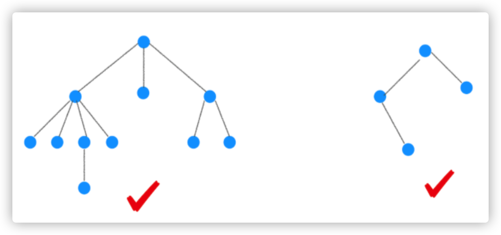
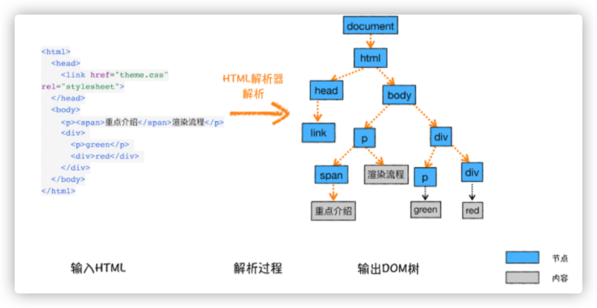
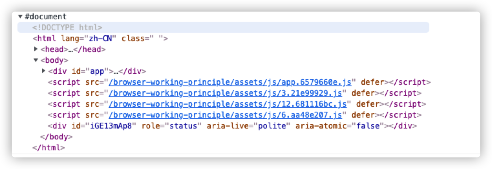

# 浏览器渲染

浏览器渲染分为以下步骤(包括但不限于)

1. 构建 HTML 树(DOM 树)
2. 构建 CSS 树(CSSOM 树)
3. 合并两棵树为一棵(Render Tree)
4. Layout 布局(文档流/盒模型/大小/位置等计算)主动要 HTML 布局相关
5. paint 绘制(颜色/阴影等)主要动 css 绘制相关属性
6. compsite 合并 根据层叠关系展示页面

下面我将重点对每个过程用 I/O 的方式进行阐述,具体分为:

- 每个过程的输入内容
- 每个过程做了什么
- 每个过程输出了什么

# 构建 DOM 树

*DOM*全拼为 Document Object Model,翻译过来叫 文档对象模型。

DOM 树是对 HTML 的关系映射,由于浏览器无法直接理解 HTML,所以需要有专门的 `HTML`解析器,该解析器能够将 HTML 解析成浏览器可以理解的树形数据结构,这就是 DOM 树的由来.

下图为树的数据结构样例



每一棵 DOM 树都有节点,相连的节点我们称之为父子节点。

下图为 HTML 与 DOM 树的关系映射：反映不同标签之间的关系和层次结构



我们也可以打开开发者工具,在 `console`下打印`document`来获取完整的 DOM 结构



DOM 树是一种比较抽象但真实存在的数据,它存在于浏览器的内存之中,我们可以通过 JavaScript 来修改 DOM 的内容。

## 影响 DOM 树的因素

通过整体树的结构，我们可以发现 DOM 节点越多，那么构建 DOM 树所需要的时间就越长，这是一定的。

有没有其他会影响到 DOM 树生成的因素?

比如说解析 HTML 时会遇到图片资源,CSS 样式等,甚至还有`script`脚本？

目前的 HTML 解析器非常智能，它可以继续请求某些资源(图片、样式等)并继续解析，我们称这些资源为非阻塞资源。

但没有`async`和`defer`属性的`script`是例外。

脚本代码会阻塞渲染并停止 HTML 的解析——可能由于渲染线程跟 JS 线程的互斥。

为了加快 DOM 树的构建完成，浏览器用了一种叫预加载扫描器的东西

## 预加载扫描器

预加载扫描器是通过扫描并分析出高优先级的资源，比如 CSS、JavaScript 等资源，在后台检索资源，并且提前运行或者下载，等到解析器执行到那一步时，资源可能已经准备好了。

预加载扫描器提供的优化减少了阻塞，比如下面的代码

```html
<link rel="stylesheet" src="styles.css" />
<script src="myscript.js"></script>

<script src="anotherscript.js"></script>
```

当主线程在解析 HTML 和 CSS 时,预加载扫描器可能提前扫描到脚本和图像,并开始下载它们。

等待和获取 CSS 并不会阻塞 HTML 的解析或者下载,但是 CSS 有可能阻塞`script`脚本,所以 有必要让预加载扫描器也提前加载某些非阻塞资源。

> 为了确保脚本不会阻塞进行,可以给 script 添加 async 属性或 defer 属性

# 构建 CSSOM 树

第二步是处理 CSS 并构建 CSSOM 树。CSSOM 跟 DOM 是类似的,是浏览器将 CSS 的规则转化为可以理解的数据的一种结构关系映射。

当构建 CSSOM 树时,其他资源,包括 JavaScript 也正在被下载(通过预加载扫描器),JavaScript 代码被解释、编译、解析和执行。脚本会被解析为抽象语法树(AST)。

# 构建 Render 树

当构建完 DOM 树和 CSSOM 树后,渲染步骤开始了,它包括样式/布局/绘制,可能还包括合成等。

渲染刚开始时,会将 DOM 树和 CSSOM 树组合成 Render 树,它的过程是从 DOM 树的根节点开始构建,将每个节点都应用上 CSSOM 的规则。

这里有个小细节:`head` 标签和`script`标签天生具有`display:none`,这些标签和其子节点以及其他具有`display:none`的标签不会出现的 `Render` 树上

`Render` 树会保存所有具有内容和计算样式的可见节点,并根据 CSS 级联确定每个节点的计算方式。

# Layout 阶段

**布局就是确定所有应该呈现在页面上的节点的宽度、高度和位置，以及确定节点相互之间的位置关系等的一种过程。**

当构建完 Render 树后,开始布局。渲染树标识显示哪些节点（即使不可见）及其计算样式，但不标识每个节点的尺寸或位置。为了确定每个对象的确切大小和位置，浏览器从渲染树的根开始遍历它并计算每个节点的布局。

布局通常从 `body` 开始,用每个元素的框模型来排列`body`子孙元素的尺寸,为它们提供占位空间。

这个阶段有可能触发回流，回流的意思是重新对页面的某些内容或者整个文档的大小和位置进行确定。

第一次确定节点大小和位置称为布局，随后任何对节点大小和位置的重新计算称为回流。

# Paint 阶段

这一阶段是将各个节点绘制到到屏幕上的阶段。

在这个阶段，浏览器就可以根据布局计算的框来转化成屏幕上的实际像素，并将元素的每个可视部分绘制到屏幕上，包括文本、颜色、边框、阴影、图像等。

# Composite 合成

当文档的各个部分以不同的层绘制，相互重叠时，必须进行合成，以确保它们以正确的顺序绘制到屏幕上，并正确显示内容。

# JavaScript 对渲染过程的影响

当打开页面时,浏览器会通过渲染引擎执行上述操作,最终形成一个页面。

当使用 JavaScript 更新样式时，又分为以下三种渲染方式


根据渲染规则，我们可以发现，假设我把 html 改变了（位置、盒模型、大小）等有关的 css 或本身（删除节点），这一过程可能会经过 layout 布局阶段。

但是如果我们只是改变了 background-color，那么就可能不会经过 layout，会直接经过 paint 绘制阶段。

如果我们用了 transform，那么既不会经过 layout 布局阶段，又不会经过 paint 阶段。会直接到达合成阶段 compsite。（虽然有可能改变位置、大小。）

这样做的结果是浏览器整个渲染效率提高了。

# 参考

https://developer.mozilla.org/zh-CN/docs/Web/Performance/How_browsers_work
