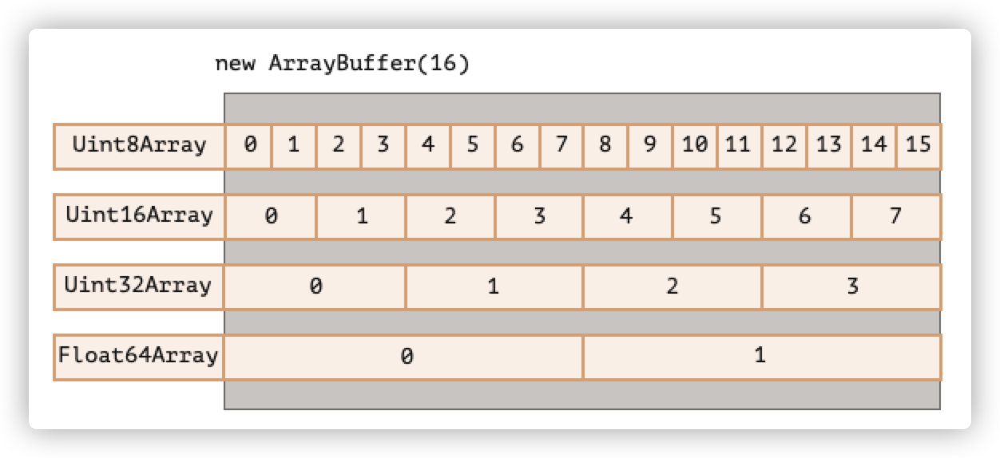
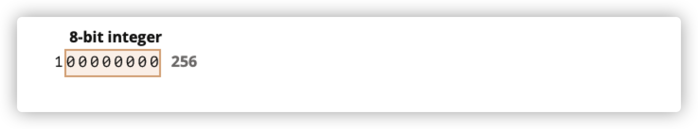
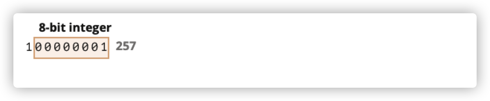
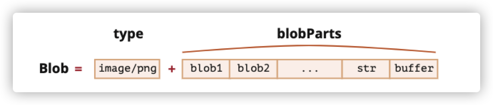

# 一、ArrayBuffer和二进制数组

当我们处理文件时（创建、上传、下载），经常会遇到二进制数据。

在JavaScript中有很多二进制数据的格式，比如

* ArrayBuffer、Uint8Array、DataView、Blob、File等

最基本的二进制对象是ArrayBuffer——对固定长度的连续内存空间的引用。

我们这样来创建它

```javascript
let buffer=new ArrayBuffer(16) //创建一个长度为16的数组缓冲区
buffer.byteLength // 16 访问buffer的字节长度
```

上面的代码会分配一个16个字节的连续内存空间，并用0进行预填充。

> 需要注意的是，ArrayBuffer并不是某种东西的数组，它与Array没有任何共同之处：
>
> * 它的长度是固定的，不能像数组一样增加或者减少。
> * 它正好占用那么多内存空间
> * 要访问单个字节，需要用“视图对象”来实现，而不能像数组一样用buffer[index]来访问某个字节

ArrayBuffer是一个内存区域，它里面存储着原始的字节序列。

想要操作ArrayBuffer，我们需要用到“视图对象”

视图对象本身不存储任何东西，它就像一幅眼镜，通过它来解释ArrayBuffer中的字节。

比如以下视图对象：

* Uint8Array —— 将ArrayBuffer中的每个字节都视为0-255之间的单个数字（每个字节是8位）。这称为“8位无符号整数”。
* Uint16Array —— 将每2个字节视为一个0-65535之间的整数。这称为“16位无符号整数”
* Uint32Array —— 将每4个字节视为一个0-4294967295之间的整数。这称为“32位无符号整数”
* Float64Array —— 将每8个字节视为一个`5.0x10-324` 到 `1.8x10308` 之间的浮点数。

比如说，0的二进制是0，1的二进制是01，2的二进制是10，3的二进制是11...255的二进制是1111 1111。

所以Unit8Array的二进制最高为一个字节8位数长度（byteLength），故而最大的整数就是255。以此类推，Unit16Array就占用2个字节，最长为16位。

如果用格子表示字节，那么8位字节下0-255只能占用一个格子，而16位字节下0-255可以占用两个格子。



ArrayBuffer是核心对象，是原始的二进制数据，是所有的基础。

如果我们要对他进行操作（遍历、写入）等，基本上所有的操作，我们都必须使用视图（View）。

```javascript
let buffer = new ArrayBuffer(16);// 创建16位字节长度的buffer
let view = new Uint32Array(buffer);// 用32位的视图对象去读它,将 buffer 视为一个 32 位整数的序列
console.log(Uint32Array.BYTES_PER_ELEMENT); //32位视图对象视角下 每个整数占4字节
console.log("view", view); // {0:0,1:0,2:0,3:0}
console.log(view.length); //4 里面存储4个整数 预设都为0
console.log(view.byteLength); //字节中长度 16

view[0] = 123;
view[1] = 456;
view[2] = 789;

for (let i of view) {
  console.log(i); // 123 456 789 0  一共4个值
}
```

## 1.1、TypedArray

所有的视图有一个通用术语—— TypedArray（类型化数组） 。

它是视图对象的统称术语。并不存在TypedArray的构造函数，它可以用来表示Uint8Array，也可以用来表示Uint64Array等视图。

之所以用这个统称是因为所有视图对象都有同一组方法和属性，用统称的形式更容易表达。

类型化数组的行为类似于常规数组：具有索引，也可以被迭代。

一个类型化数组的构造器（不管是Int8Array还是Float64Array都无关紧要），它们的行为取决于参数类型。

参数有5种变体：

```javascript
new TypedArray(buffer, [byteOffset], [length]);
new TypedArray(object);
new TypedArray(typedArray);
new TypedArray(length);
new TypedArray();
```

1. 如果参数是一个buffer对象，则会创建一个视图。后面的参数则是可选的。

   byteOffset是起始位置（默认为0）以及length（默认是buffer的末尾），我们可以指定buffer的某些部分。

2. 如果给定的是Array，或者是其他类数组对象，则会创建一个相同长度的类型化数组，并复制其内容。

   ```javascript
   let arr = new Uint16Array([1, 2, 3, 4, 5]);
   console.log(arr.length); // 5
   console.log(arr[1]); // 2
   console.log(Array.isArray(arr)); // false 说明返回的是类型化数组
   ```

3. 如果给定的是另一个类型化数组(TypedArray),会创建一个相同长度的类型化数组，并复制其内容。

   ```javascript
   let arr16 = new Uint16Array([1, 1000]);
   let arr8 = new Uint8Array(arr16);
   console.log(arr8[0]); // 1
   console.log(arr8[1]); // 232 试图复制 1000，但无法将 1000 放进 8 位字节中
   ```

4. 对于数字参数length —— 创建类型化数组可以包含那么多元素，它的字节长度是length乘以单个TypedArray.BYTES_PER_ELEMENT的字节数。

   ```javascript
   let arr = new Uint16Array(4); // 为 4 个整数创建类型化数组
   alert(Uint16Array.BYTES_PER_ELEMENT); // 每个整数 2 个字节
   alert(arr.byteLength); // 8（字节中的大小）
   ```

5. 不带参数的情况下，创建长度为0的类型化数组。

我们可以直接创建一个TypedArray，而无需传入ArrayBuffer。但是视图离不开底层的ArrayBuffer，因此，除第一种情况（提供buffer）外，其他所有情况都会自动创建ArrayBuffer。

想要访问自动创建的ArrayBuffer,可以用以下属性：

* arr.buffer —— 引用ArratBuffer
* arr.byteLength —— ArrayBuffer的字节长度

因此，我们总是可以从一个视图转换到另一个视图

```javascript
let arr8 = new Uint8Array([0, 1, 2, 3]);

// 同一数据的另一个视图
let arr16 = new Uint16Array(arr8.buffer);
```

## 1.2、越界行为

当我们将越界值写入类型化数组时，多余的位会被切除。

比如，Uint8Array的最大字节长度为8，当我们放入256时，256的二进制值为100000000（9位数），但是Unit8Array最大字节数只能放8位，于是仅保存最右边的8位，其余部分会被切除。



所以结果会是0。

257的二进制格式位100000001，最右边的8位会被储存，因此数组中会有1



## 1.3、TypedArray方法

TypedArray方法具有常规的Array方法，但是有个明显的例外

我们可以遍历（部署了iterate接口），map、slice、find和reduce等。

但是我们没办法做：

* 没有splice —— 因为我们没办法删除一个值，因为类型化数组时缓冲区（buffer）的视图，并且缓冲区（buffer）是固定的、连续的内存区域。我们所能做的就是分配一个零值。
* 没有concat方法

但拥有两种其他方法：

* `arr.set(fromArr,[offset])`从offset开始。将`fromArr`中的所有元素复制到arr
* `arr.subarray([begin,end])`创建一个从`begin`到`end`（不包括）相同类型的新视图。这有点类似于slice方法，但不复制任何内容 —— 只是创建一个新视图，以对给定片段地数据进行操作。

## 1.4、DataView

`DataView`是在`ArrayBuffer`上的一种特殊的超灵活`未类型化`的视图，它允许以任何格式访问任何偏移量（offset）的数据。

* 对于类型化的数组，构造器决定了其格式。整个数组应该是统一的，第i个数字是`arr[i]`。
* 通过DataView。我们可以使用`.getUint8(i)`或者`.getUint16(i)`之类的方法访问数据。我们在调用方法时选择格式，而不是在构造的时候。

语法：

```javascript
new DataView(buffer,[byteOffset],[byteLength])
```

* Buffer ——底层的ArrayBuffer。与类型化数组不同的是，DataView不会自己创建缓冲区（buffer）。我们需要实现准备好。
* byteOffset —— 视图的起始字节位置（默认为0）
* byteLength —— 视图的字节长度（默认到buffer的末尾）

例如，这里我们从同一个buffer中提取不同格式的数字：

```javascript
// 4 个字节的二进制数组，每个都是最大值 255
let buffer = new Uint8Array([255, 255, 255, 255]).buffer;

let dataView = new DataView(buffer);

// 在偏移量为 0 处获取 8 位数字
alert( dataView.getUint8(0) ); // 255

// 现在在偏移量为 0 处获取 16 位数字，它由 2 个字节组成，一起解析为 65535
alert( dataView.getUint16(0) ); // 65535（最大的 16 位无符号整数）

// 在偏移量为 0 处获取 32 位数字
alert( dataView.getUint32(0) ); // 4294967295（最大的 32 位无符号整数）

dataView.setUint32(0, 0); // 将 4 个字节的数字设为 0，即将所有字节都设为 0
```

## 1.5、小结

ArrayBuffer是核心对象，是对固定长度的连续内存区域的引用。

几乎任何对ArrayBuffer的操作，都需要一个视图来完成。

* 视图可以是TypedArray：
  * `Uint8Array`，`Uint16Array`，`Uint32Array` —— 用于 8 位、16 位和 32 位无符号整数。
  * `Uint8ClampedArray` —— 用于 8 位整数，在赋值时便“固定”其值。
  * `Int8Array`，`Int16Array`，`Int32Array` —— 用于有符号整数（可以为负数）。
  * `Float32Array`，`Float64Array` —— 用于 32 位和 64 位的有符号浮点数。
* DataView —— 使用方法来指定格式的视图，例如：getUint8(offset)

在大多数情况下，我们直接对类型化数组进行创建和操作，而将ArrayBuffer作为通用标识符隐藏起来。我们可以通过`.buffer`来访问它，并在需要时创建另一个视图。

另外还有两个术语，用于对二进制数据进行操作的方法的描述：

* ArrayBufferView是所有这些视图的总称
* BufferSource是ArrayBuffer或者ArrayBufferView的总称


# 二、TextDecoder和TextEncoder

## 2.1、TextDecoder

如果二进制数据实际上是一个字符串，我们可以用textDecoder对象在给定缓冲区buffer和编码格式encoding的情况下，将值读取到实际的字符串。可以理解为这是给实际内容字符串的二进制数据解码。

语法是这样的

1. 创建一个解码对象

   ```javascript
   let decoder=new TextDecoder([label],[options])
   ```

   label —— 编码格式，默认为`utf-8`，同时也支持big5、windows-1251等编码格式

   options —— 可选对象：

   * fatal —— 布尔值，如果为`true`则为无效字符（不可解码）字符抛出异常，否则用字符`\uFFFD`替换无效字符。
   * ignoreBOM —— 布尔值，如果为`true`则BOM（可选的字节顺序unicode标记）

2. 解码

   ```javascript
   let str = decoder.decode([input],[options])
   ```

   * Input —— 要被解码的`BufferSource`
   * options —— 可选对象：
     * stream —— 对于解码流，为true，则将传入的数据块（chunk）作为参数重复调用decoder。在这种情况下，多字节的字符可能偶尔会在块与块之间分割。这个选项告诉TextDecoder记住未完成的字符，并在下一个数据块来的时候进行解码

以下为例子

```javascript
let uint8Array = new Uint8Array([72, 101, 108, 108, 111]);

alert( new TextDecoder().decode(uint8Array) ); // Hello
```

我们可以通过为其创建子数组视图来解码部分缓冲区：

```javascript
let uint8Array = new Uint8Array([0, 72, 101, 108, 108, 111, 0]);

// 该字符串位于中间
// 在不复制任何内容的前提下，创建一个新的视图
let binaryString = uint8Array.subarray(1, -1);

alert( new TextDecoder().decode(binaryString) ); // Hello
```

## 2.2、TextEncoder

[TextEncoder](https://encoding.spec.whatwg.org/#interface-textencoder) 做相反的事情 —— 将字符串转换为字节。

语法：

```javascript
let encoder = new TextEncoder();
```

只支持utf-8编码。

它有两种方法：

- **`encode(str)`** —— 从字符串返回 `Uint8Array`。
- **`encodeInto(str, destination)`** —— 将 `str` 编码到 `destination` 中，该目标必须为 `Uint8Array`。

```javascript
let encoder = new TextEncoder();

let uint8Array = encoder.encode("Hello");
alert(uint8Array); // 72,101,108,108,111
```

# 三、Blob

ArrayBuffer和视图view都是ECMA标准的一部分，是JavaScript的一部分。

此外，还有浏览器提供的高级对象 —— Blob。

Blob由一个可选的字符串`type`（MIME类型）和`blobParts`组成。

blobParts是一系列其他Blob对象，字符串和BufferSource。



构造函数的语法是

```javascript
new Blob(blobParts,options)
```

* blobParts是Blob/BufferSource/String类型的值的数组
* options 可选对象：
  * type —— Blob类型 通常是MIME类型，例如`image/png`
  * Ending —— 是否转换换行符，使Blob对应于当前操作系统的换行符（\r\n或\n）。默认为“transparent”。

例如：

```javascript
// 从字符串创建Blob
let blob = new Blob(["<html></html"], { type: "text/html" });
// 第一个参数必须是数组
```

```javascript
//从类型化数组（typedArray）和字符串创建blob
let hello = new Uint8Array([72, 101, 108, 108, 111]); //二进制的“hello”
let blob = new Blob([hello, "world"], {
  type: "text/plain"
});
```

我们可以用slice方法来提取Blob片段：

```javascript
blob.slice([byteStart], [byteEnd], [contentType]);
```

- **`byteStart`** —— 起始字节，默认为 0。
- **`byteEnd`** —— 最后一个字节（专有，默认为最后）。
- **`contentType`** —— 新 blob 的 `type`，默认与源 blob 相同。

> **`Blob` 对象是不可改变的**
>
> 我们无法直接在 `Blob` 中更改数据，但我们可以通过 `slice` 获得 `Blob` 的多个部分，从这些部分创建新的 `Blob` 对象，将它们组成新的 `Blob`，等。
>
> 这种行为类似于 JavaScript 字符串：我们无法更改字符串中的字符，但可以生成一个新的改动过的字符串。

## 3.1、Blob 用作URL

Blob可以转化成a、img标签的url，来显示它们的内容。

下面是一段通过点击链接，下载一个动态生成`hello world`的Blob文件。

```javascript
const a = document.createElement("a");
a.download = "hello.txt";
const blob = new Blob(["hello", "world"], { type: "text/plain" });
const url = URL.createObjectURL(blob);// 从blob创建对象url
a.href = url;
document.body.appendChild(a);
a.click();
URL.revokeObjectURL(url); // 从内部映射中移除引用，允许删除blob，释放内存
```

上面代码中，我们使用`URL.createObjectURL(blob)`来为blob生成一段对象URL，它大概长这样

```javascript
'blob:chrome://new-tab-page/7df9762f-6d76-412f-badd-adf74b004fe7'
```

它的形式一般是`blob:<origin>/<uuid>`

浏览器内部会为每个`URL.createObjectURL(blob)`生成的URL存储一个URL ——> Blob的映射。通过这个映射关系，我们能够访问到Blob。

生成的URL仅在当前文档打开的状态下才有效。它允许img、a标签引用。

但是也有个副作用。这里的虽然有Blob的映射，但是Blob是保存在浏览器的内存中，因此，浏览器无法释放它。

在文档退出时，即进入unload生命周期，这个映射会被自动清除，因此Blob也应该被释放。但是如果应用程序一直不关闭，那这个内存就不会被释放。

因此，如果我们创建了URL，但即使我们已经不需要Blob了，它还是会被挂在内存中。

我们需要调用`URL.revokeObjectURL(url)`从内部映射中移除引用，允许Blob被删除，并释放内存。

所以在上面的例子中，我们只使用一次Blob，使用完就马上调用`URL.revokeObjectURL(url)`释放内存。

如果代码是这样的：

```html
<!-- download 特性（attribute）强制浏览器下载而不是导航 -->
<a download="hello.txt" href='#' id="link">Download</a>

<script>
let blob = new Blob(["Hello, world!"], {type: 'text/plain'});

link.href = URL.createObjectURL(blob);
</script>
```

我们不能马上调用`URL.revokeObjectURL(url)`，调用该方法时，由于映射被删除了，因此`Blob`URL无效。

## 3.2、Blob转换成base64

`URL.createObjectURL` 的一个替代方法是，将 `Blob` 转换为 base64-编码的字符串

这种编码是将二进制数据表示为一个由0-64的ASCII码组成的字符串，浏览器会对其进行解码，并显示内容。

我们可以在`data-url`中使用base64编码，它的格式是这样的

```
data:[<mediatype>][;base64],<data>
```

以下的src是data-url的应用。

```javascript

```

我们使用内置的`FileReader`对象来讲Blob转换成base64。它可以将Blob数据读取成多种格式。

下面是通过base64的形式来完成下载的代码

```javascript
const a = document.createElement("a");
a.download = "hello.txt";
const blob = new Blob(["hello", "world"], { type: "text/plain" });
const reader = new FileReader();
reader.readAsDataURL(blob); // 将blob读成data-URL
// readAsDataURL后触发obload事件
reader.onload = function () {
  a.href = reader.result;
  a.click();
};

document.body.appendChild(a);
```

以下是两种方式创建URL的对比

| URL.createObjectURL(blob)   | Blob转换为data-url                            |
| --------------------------- | --------------------------------------------- |
| 需要用revoke清理内存        | 无需撤销内存（revoke）                        |
| 直接访问Blob，无需编码/解码 | 对大的Blob进行编码/解码时，性能和内存会有耗损 |

## 3.4、Image转换为blob

我们可以创建一个image、image的一部分、或者创建一个页面截图的Blob。

图像的操作使用`<canvas>`元素实现的：

* 使用`canvas.drawImage`在`canvas`上绘制图像
* 调用`canvas.toBlob(callback,format,quality)`创建一个Blob，并在创建完成后调用`callback`

在下面的示例中，图像被复制了，我们在创建blob之前，从中裁剪图像，或者在canvas上对其进行转换：

```javascript
// 获取任何图像
let img = document.querySelector('img');

// 生成同尺寸的 <canvas>
let canvas = document.createElement('canvas');
canvas.width = img.clientWidth;
canvas.height = img.clientHeight;

let context = canvas.getContext('2d');

// 向其中复制图像（此方法允许剪裁图像）
context.drawImage(img, 0, 0);
// 我们 context.rotate()，并在 canvas 上做很多其他事情

// toBlob 是异步操作，结束后会调用 callback
canvas.toBlob(function(blob) {
  // blob 创建完成，下载它
  let link = document.createElement('a');
  link.download = 'example.png';

  link.href = URL.createObjectURL(blob);
  link.click();

  // 删除内部 blob 引用，这样浏览器可以从内存中将其清除
  URL.revokeObjectURL(link.href);
}, 'image/png');

/*****或者使用promise替代回调******/
let blob=await new Promise((resolve,reject)=>canvas.toBlob(resolve,'image/png'))
```

对于页面截屏，我们可以使用[html2canvas]( https://github.com/niklasvh/html2canvas)的库，它会扫描一遍浏览器页面，并将其绘制在`<canvas>`上。

## 3.5、Blob转换为ArrayBuffer

Blob构造器允许所有东西构造blob，包括BufferSource。

如果我们需要执行低级别的操作，则可以使用`FileReader`从blob上获取最低级别的ArrayBuffer：

```javascript
// 从 blob 获取 arrayBuffer
let fileReader = new FileReader();

fileReader.readAsArrayBuffer(blob);

fileReader.onload = function(event) {
  let arrayBuffer = fileReader.result;
};
```

## 3.6、小结

ArrayBuffer、Uint8Array及BufferSource是二进制的数据，而Blob表示有类型的二进制数据。

使用Blob在浏览器上能够完成非常常见的上传/下载操作。

[XMLHttpRequest](https://zh.javascript.info/xmlhttprequest)，[fetch](https://zh.javascript.info/fetch) 等进行 Web 请求的方法可以自然地使用 `Blob`，也可以使用其他类型的二进制数据。

我们可以非常轻松地在Blob和低级别的二进制数据类型之间进行转换：

* 使用`new Blob(...)`构造函数从一个类型化数组创建Blob
* 使用`FileReader`从`Blob`中取出`ArrayBuffer`，然后在其上创建一个视图（view），用于低级别的二进制处理。


# 四、File和FileReader

`File`对象继承自Blob，并扩展了与文件系统有关的功能。

有两种方式可以获取它

* new File(fileParts,fileName,[options])
  - **`fileParts`** —— Blob/BufferSource/String 类型值的数组。
  - **`fileName`** —— 文件名字符串。
  - `options` —— 可选对象：
    - **`lastModified`** —— 最后一次修改的时间戳（整数日期）。
* `<input type='file'/>`或其他浏览器接口来获取文件。在这种情况下，file将从操作系统（os）获取信息。

由于File是继承自Blob的，所以File对象具有相同的属性，并还额外有以下信息：

* name —— 文件名
* lastModified —— 最后一次修改时间

下面是从`<input type='file'/>`中获取File对象的方式：

```html
<input type="file" onchange="showFile(this)">

<script>
function showFile(input) {
  // 输入（input）可以选择多个文件，因此 input.files 是一个类数组对象。
  // 这里我们只有一个文件，所以我们只取 input.files[0]。
  let file = input.files[0];

  alert(`File name: ${file.name}`); // 例如 my.png
  alert(`Last modified: ${file.lastModified}`); // 例如 1552830408824
}
</script>
```

## 4.1、FileReader

FileReader是一个对象，它可以从Blob或者File对象上读取数据。

它使用事件来传递数据，因为从磁盘上读取数据可能比较费事件。

构造函数：

```javascript
let reader = new FileReader(); // 没有参数
```

主要方法：

* `readAsArrayBuffer(blob)` —— 将数据读取为二进制格式的 `ArrayBuffer`。
* `readAsText(blob, [encoding])` —— 将数据读取为给定编码（默认为 `utf-8` 编码）的文本字符串。
* `readAsDataURL(blob)` —— 读取二进制数据，并将其编码为 base64 的 data url。
* `abort()` —— 取消操作。

read*方法的选择，取决于我们如何使用数据

* `readAsArrayBuffer` —— 用于二进制文件，执行低级别的二进制操作。诸如切片(slicing)之类的高级别操作，File是继承自Blob的，所以我们可以直接调用它们而无需读取。
* `readAsText` —— 用于文本文件，当我们需要获取字符串时。
* `readAsDataURL` —— 当我们需要在img或者a标签的src引用数据时。（替代`URL.createObjectURL(file)`）

读取过程中，有以下事件：

* loadstart —— 开始加载
* progress —— 在读取过程中出现
* load —— 读取完成，没有error
* abort —— 调用abort()方法
* error —— 出现error
* loadend —— 读取完成，无论成功还是失败

读取完成后，我们可以通过以下方式获取读取结果

* reader.result —— 结果（成功情况）
* reader.error —— error（失败情况）

下面是读取文件的示例：

```html
<input type="file" onchange="readFile(this)">

<script>
function readFile(input) {
  let file = input.files[0];

  let reader = new FileReader();

  reader.readAsText(file);

  reader.onload = function() {
    console.log(reader.result);
  };

  reader.onerror = function() {
    console.log(reader.error);
  };

}
</script>
```

## 4.2、小结

`File` 对象继承自 `Blob`。

除了 `Blob` 方法和属性外，`File` 对象还有 `name` 和 `lastModified` 属性，以及从文件系统读取的内部功能。我们通常从用户输入如 `<input>` 或拖放事件来获取 `File` 对象。

`FileReader` 对象可以从文件或 blob 中读取数据，可以读取为以下三种格式：

- 字符串（`readAsText`）。
- `ArrayBuffer`（`readAsArrayBuffer`）。
- data url，base-64 编码（`readAsDataURL`）。

但是，在很多情况下，我们不必读取文件内容。就像我们处理 blob 一样，我们可以使用 `URL.createObjectURL(file)` 创建一个短的 url，并将其赋给 `<a>` 或 ``。这样，文件便可以下载文件或者将其呈现为图像，作为 canvas 等的一部分。

而且，如果我们要通过网络发送一个 `File`，那也很容易：像 `XMLHttpRequest` 或 `fetch` 等网络 API 本身就接受 `File` 对象。
